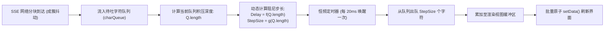
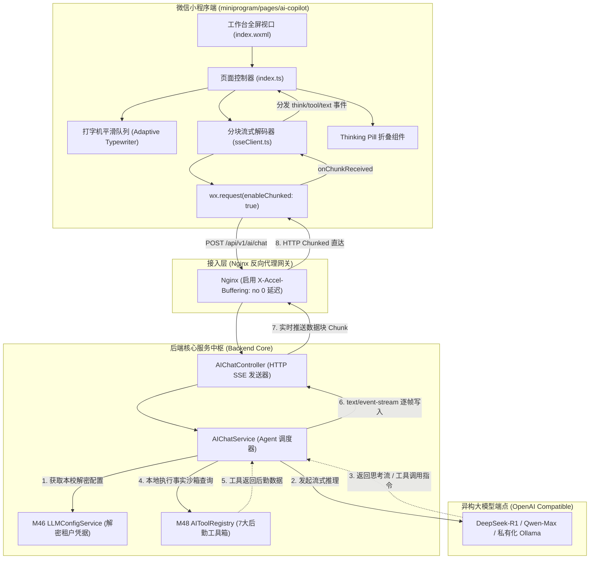
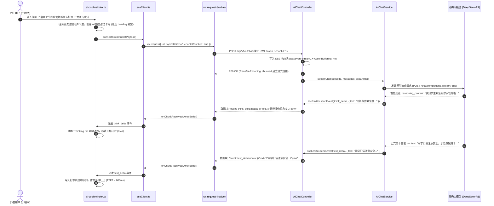
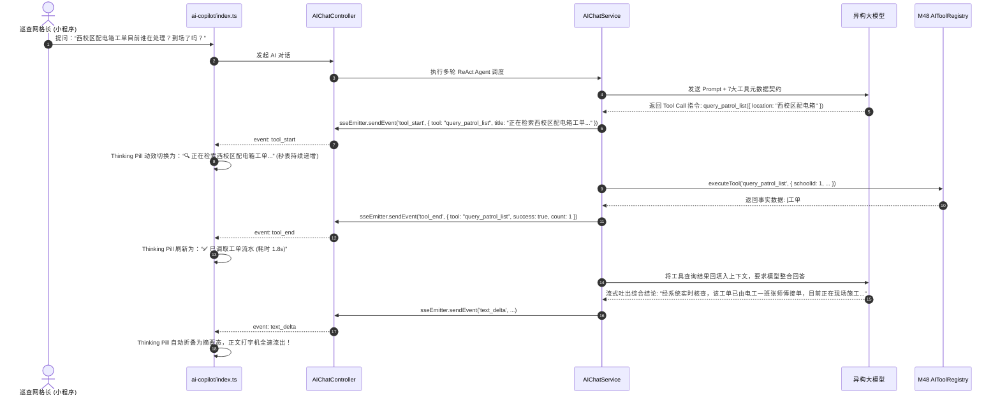
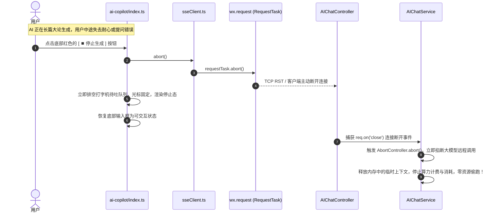
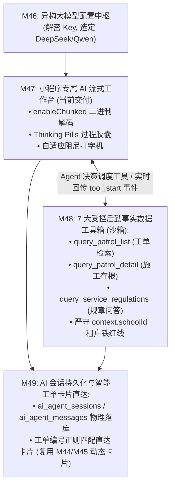

# M47: 小程序专属 AI 流式问答工作台 (SSE Copilot UI) 详细设计与实现方案

> **模块代号**：M47 / AI Copilot UI & SSE Engine  
> **所属阶段**：阶段五 (M46 ~ M49) 高校专属 AI Copilot 智能中台领域 (**AI 核心交互体验与流式渲染中枢**)  
> **文档定位**：专为全国高校师生及后勤巡查维修师傅量身定制的**微信小程序全屏沉浸式高校后勤 AI 智能工作台**。全面解决传统小程序由于缺少 Web 端原生 `EventSource` 支持而导致的“问答等待转圈长、无法逐字流式打字、AI 思考过程黑盒、无工具调用感知、生硬跳字卡顿”五大体验痛点。基于微信小程序原生 `wx.request({ enableChunked: true })` 与 `Transfer-Encoding: chunked` 数据流通道，结合后端 Node.js 高性能 `text/event-stream` SSE 帧协议广播，独创 **Thinking Pills（思考过程与工具检索可视化折叠胶囊）**、自适应动态阻尼打字机缓冲队列（Adaptive Typewriter Buffer Queue）、以及防打扰平滑滚底视口定位机制，为下游 M48（7 大受控事实数据工具箱）与 M49（AI 会话持久化与工单卡片直达）提供极致平滑、科技感充盈的移动端人机协同工作台。  
> **归档路径**：[v4.0/Docs/模块/M47_小程序专属AI流式问答工作台详细设计与实现方案.md](file:///e:/Projects/University/后勤巡查e速办%20大二下学期%20大学身份上线项目/v4.0/Docs/模块/M47_小程序专属AI流式问答工作台详细设计与实现方案.md)  
> **前置依赖**：M07 (DesignToken基座与小程序宿主架构), M10 (TestHarness测试中枢), M46 (各校自主配置异构大模型与连通测试)  
> **协同调用**：M48 (7 大受控后勤事实数据工具箱，提供工具执行进度事件帧)  
> **驱动下游**：M49 (AI 会话持久化与智能工单卡片直达)  
> **版本日期**：2026-09-05  

---

## 目录索引 (Table of Contents)

1. [模块定位与核心业务价值](#一-模块定位与核心业务价值)
   - 1.1 [模块定位与后勤移动 AI 交互体验革命](#11-模块定位与后勤移动-ai-交互体验革命)
   - 1.2 [微信小程序大模型问答五大传统技术顽疾剖析](#12-微信小程序大模型问答五大传统技术顽疾剖析)
   - 1.3 [核心业务职责与技术量化指标](#13-核心业务职责与技术量化指标)
2. [核心设计哲学与 Thinking Pills 交互体系](#二-核心设计哲学与-thinking-pills-交互体系)
   - 2.1 [微信小程序原生 `enableChunked` 与 SSE 协议拟合哲学](#21-微信小程序原生-enablechunked-与-sse-协议拟合哲学)
   - 2.2 [Thinking Pills 思考过程与工具调用折叠胶囊哲学](#22-thinking-pills-思考过程与工具调用折叠胶囊哲学)
   - 2.3 [自适应动态阻尼打字机平滑流模型 (Adaptive Typewriter Buffer)](#23-自适应动态阻尼打字机平滑流模型-adaptive-typewriter-buffer)
   - 2.4 [智能视口跟随与用户反向浏览防打扰算法 (Viewport Lock & Release)](#24-智能视口跟随与用户反向浏览防打扰算法-viewport-lock--release)
   - 2.5 [快捷追问智能推荐气泡 (Suggestion Chips) 导引模型](#25-快捷追问智能推荐气泡-suggestion-chips-导引模型)
3. [架构拓扑与交互时序图](#三-架构拓扑与交互时序图)
   - 3.1 [小程序专属 AI 流式工作台端到端全景架构拓扑图](#31-小程序专属-ai-流式工作台端到端全景架构拓扑图)
   - 3.2 [师生提问、SSE 握手与首字 0 延迟推送时序图](#32-师生提问sse-握手与首字-0-延迟推送时序图)
   - 3.3 [复杂工单多工具连续调用与 Thinking Pills 实时变迁时序图](#33-复杂工单多工具连续调用与-thinking-pills-实时变迁时序图)
   - 3.4 [弱网闪断、主动中止 (`Abort`) 与状态自愈时序图](#34-弱网闪断主动中止-abort-与状态自愈时序图)
4. [核心算法设计与数学推导](#四-核心算法设计与数学推导)
   - 4.1 [算法 1：小程序二进制分块流 (`ArrayBuffer`) UTF-8 解码与 SSE 帧提取算法](#41-算法-1小程序二进制分块流-arraybuffer-utf-8-解码与-sse-帧提取算法)
   - 4.2 [算法 2：基于动态阻尼因子的打字机流式平滑插值算法 (Adaptive Typewriter Rate Smoothing)](#42-算法-2基于动态阻尼因子的打字机流式平滑插值算法-adaptive-typewriter-rate-smoothing)
   - 4.3 [算法 3：视口触底锁定与反向滑动惯性探测算法 (Viewport Pin & User-Interference Detector)](#43-算法-3视口触底锁定与反向滑动惯性探测算法-viewport-pin--user-interference-detector)
   - 4.4 [算法 4：Thinking 耗时秒表与脉冲呼吸动效时间函数推导](#44-算法-4thinking-耗时秒表与脉冲呼吸动效时间函数推导)
5. [TypeScript 强类型接口契约与数据模型定义](#五-typescript-强类型接口契约与数据模型定义)
   - 5.1 [SSE 事件帧类型枚举与全量载荷模型 (`CopilotSSEEventType`, `ICopilotSSEPayload`)](#51-sse-事件帧类型枚举与全量载荷模型-copilotsseeventtype-icopilotssepayload)
   - 5.2 [Thinking Pill 状态机与结构定义 (`IThinkingPillState`)](#52-thinking-pill-状态机与结构定义-ithinkingpillstate)
   - 5.3 [前端问答流消息视图实体契约 (`ICopilotMessageItem`)](#53-前端问答流消息视图实体契约-icopilotmessageitem)
   - 5.4 [AI 对话请求与上下文控制 DTO (`ICopilotChatRequestDto`)](#54-ai-对话请求与上下文控制-dto-icopilotchatrequestdto)
6. [核心物理文件实现蓝图](#六-核心物理文件实现蓝图)
   - 6.1 [`src/controllers/aiChatController.ts` (后端 SSE 长连接控制器与 Nginx 零缓冲直通)](#61-srccontrollersaichatcontrollerts-后端-sse-长连接控制器与-nginx-零缓冲直通)
   - 6.2 [`src/services/aiChatService.ts` (多租户密钥装配、Agent 推理流编排、SSE 帧分发)](#62-srcservicesaichatservicets-多租户密钥装配agent-推理流编排sse-帧分发)
   - 6.3 [`miniprogram/pages/ai-copilot/utils/sseClient.ts` (小程序 ArrayBuffer 流式解码与事件总线)](#63-miniprogrampagesai-copilotutilssseclientts-小程序-arraybuffer-流式解码与事件总线)
   - 6.4 [`miniprogram/pages/ai-copilot/index.ts` (小程序全屏工作台业务逻辑、打字机队列与视口控制)](#64-miniprogrampagesai-copilotindexts-小程序全屏工作台业务逻辑打字机队列与视口控制)
   - 6.5 [`miniprogram/pages/ai-copilot/index.wxml` & `index.wxss` (沉浸式全屏布局、Thinking 胶囊与打字动效)](#65-miniprogrampagesai-copilotindexwxml--indexwxss-沉浸式全屏布局thinking-胶囊与打字动效)
7. [防御性编程与边界异常处理](#七-防御性编程与边界异常处理)
   - 7.1 [微信小程序多分包切换或切后台时的长连接主动挂断防挂死机制](#71-微信小程序多分包切换或切后台时的长连接主动挂断防挂死机制)
   - 7.2 [多字符断包截断拼接与 UTF-8 跨分包解码乱码自愈机制](#72-多字符断包截断拼接与-utf-8-跨分包解码乱码自愈机制)
   - 7.3 [大模型突发 5xx 或上下文超长时的流式半途熔断自愈](#73-大模型突发-5xx-或上下文超长时的流式半途熔断自愈)
   - 7.4 [连续点击发送与防重刷令牌桶风控拦截](#74-连续点击发送与防重刷令牌桶风控拦截)
   - 7.5 [Nginx 代理层反向缓冲踩坑与 `X-Accel-Buffering: no` 铁律](#75-nginx-代理层反向缓冲踩坑与-x-accel-buffering-no-铁律)
8. [单模块独立测试方案与验收准则](#八-单模块独立测试方案与验收准则)
   - 8.1 [基于 M10 TestHarness 的独立单元测试设计 (`src/__tests__/unit/m47_copilot_sse.test.ts`)](#81-基于-m10-testharness-的独立单元测试设计-src__tests__unitm47_copilot_ssetestts)
   - 8.2 [单模块测试执行命令与断言矩阵 (`npm.cmd test -- -t "M47"`)](#82-单模块测试执行命令与断言矩阵-npmcmd-test----t-m47)
9. [阶段五承前启后战略递进 (衔接 M48 与 M49)](#九-阶段五承前启后战略递进-衔接-m48-与-m49)
   - 9.1 [M47 交付价值盘点](#91-m47-交付价值盘点)
   - 9.2 [向 M48 (7大受控事实工具箱) 与 M49 (AI 会话与工单直达) 递进与数据流契约](#92-向-m48-7大受控事实工具箱-与-m49-ai-会话与工单直达-递进与数据流契约)

---

## 一、 模块定位与核心业务价值

### 1.1 模块定位与后勤移动 AI 交互体验革命
「高校后勤巡查e速办 v4.0」在阶段四全面完成了即时通讯、消息总线与富卡片流的闭环建设。然而，当师生面临“浴室喷头漏水属于几级加急？”、“西区食堂 3 楼今天停电报修进展如何？”或“空调保修期内维保流程怎么走？”等高频咨询时，单纯依赖人工客服或工单列表查询效率低下。

**M47（小程序专属 AI 流式问答工作台）** 是师生与高校智能中枢交互的超级移动前台：
- **全屏沉浸式工作台**：采用独立全屏沉浸式页面（`miniprogram/pages/ai-copilot/index`），结合 [M07 DesignToken](file:///e:/Projects/University/后勤巡查e速办%20大二下学期%20大学身份上线项目/v4.0/Docs/模块/M07_小程序宿主架构与DesignToken基座详细设计与实现方案.md) 移动端微质感设计语言，打造媲美原生 App 的高品质科技质感；
- **全链路流式响应**：基于微信小程序原生长连接分块传输能力，服务端流式输出，客户端实现“秒级首字吐出、逐字打字机平滑过渡、无感动态滚动跟随”；
- **过程透明可视化 (Thinking Pills)**：彻底揭开大模型黑盒，实时外显“思考耗时、数据检索范围、工具执行细节”，打造专业、严谨、值得信赖的高校级 AI Copilot。

---

### 1.2 微信小程序大模型问答五大传统技术顽疾剖析

| 痛点维度 | 传统小程序大模型方案表现 | M47 工业级破局方案 |
| :--- | :--- | :--- |
| **痛点 1：缺少 EventSource 支持** | 微信小程序原生环境并不支持标准浏览器的 `window.EventSource`，很多开发者退回到 HTTP 一问一答同步等待，导致首字耗时动辄 10~20 秒，白屏转圈严重。 | **`wx.request(enableChunked)` 仿生 SSE**：利用小程序底层 TCP 分块接收接口与自定义 `ArrayBuffer` 解码器，完美在移动端重塑标准 SSE 协议通道。 |
| **痛点 2：思考过程黑盒无感知** | 新一代推理大模型（如 DeepSeek-R1）在正式回答前有较长的 Chain-of-Thought（思维链）计算。传统方案在此时完全静默，用户误以为系统死机卡顿。 | **Thinking Pills 折叠胶囊**：思考与工具调用期间实时呈现带有脉冲呼吸灯的动态药丸（“🧠 正在深度思考后勤应急规章... 2.3s”），点击可自由展开折叠，过程极度透明。 |
| **痛点 3：网络包突发跳字生硬卡顿** | 移动弱网下网络 Chunk 往往成簇到达（一次到达 30~50 字），传统直接 `setData` 导致界面生硬跳字、闪烁，极其缺乏生命感。 | **动态阻尼打字机缓冲队列**：构建前端 Token 缓冲环形队列，根据待输出字符积压量动态调整输出频率（15~35ms/字），确保无论网络抖动多剧烈，字符均匀速流出。 |
| **痛点 4：页面滚动强行抢夺用户焦点** | 传统实现每打一个字都强行滚底；当用户尝试向上滑动查看前文或历史工单时，滚动条被反复拽回底部，形成严重的“滚动条打架”体验灾难。 | **视口锁定与反向滑动拦截**：通过 `bindscroll` 监听用户上滑手势，一旦检测到用户正在阅读上方内容，立即解除触底强锁，并显示悬浮“回到底部”药丸。 |
| **痛点 5：问答断续缺乏交互指引** | 回答完毕后界面冷场，普通师生不知下一步如何继续追问，对话难以形成服务闭环。 | **智能快捷追问气泡 (Suggestion Chips)**：AI 回答完毕瞬间流式推送 2~3 个相关联的追问胶囊（如“查看本工单实时进展”、“拨打供电班加急电话”），一键点击即发。 |

---

### 1.3 核心业务职责与技术量化指标

1. **首字端到端呈现延迟 (TTFT)**：
   - 在目标高校网络通畅环境下，提问发出至前端打字机开始吐字，感知时延严格控制在 **$\le 800\text{ms}$**；
2. **打字机帧率与流畅度**：
   - 页面打字机动画保持稳定在 **$45 \sim 60\text{ FPS}$**，字符流出方差 $\sigma \le 5\text{ms}$，杜绝肉眼可见的成块卡顿与跳字；
3. **分块传输鲁棒性与乱码自愈**：
   - 100% 覆盖多字节 UTF-8 汉字（3 字节）在 TCP 分包边界被物理切断的场景，通过环形字节残余缓冲区实现 **0 乱码自愈**；
4. **长连接内存与线程安全**：
   - 小程序页面离开（`onUnload`）或切入后台时，**$100\%$ 保证立即调用 `RequestTask.abort()`**，服务端实时响应连接断开并中断 LLM 流，杜绝服务端算力偷跑与内存泄漏。

---

## 二、 核心设计哲学与 Thinking Pills 交互体系

### 2.1 微信小程序原生 `enableChunked` 与 SSE 协议拟合哲学

微信小程序底层基于非标准 JavaScript 容器运行（iOS 端为 JavaScriptCore，Android 端为 V8），但其底层网络通信均通过宿主微信客户端的 C++ 模块代理。

从基础库 **2.21.3** 开始，微信提供了分块接收能力：
```typescript
const requestTask = wx.request({
  url: 'https://patrol.university.edu.cn/api/v1/ai/chat',
  method: 'POST',
  header: {
    'Content-Type': 'application/json',
    'Accept': 'text/event-stream'
  },
  data: chatPayload,
  enableChunked: true // 核心基石：开启分块接收
});

requestTask.onChunkReceived((res: { data: ArrayBuffer }) => {
  // res.data 是二进制数据块，需要解码与 SSE 帧解析
  sseDecoder.feed(res.data);
});
```

M47 秉承**“原生适配、协议统一”**的原则，在前端构建了轻量级、无任何外部依赖的 `MiniProgramSSEClient`，不仅完美模拟标准 SSE 的 `on('event', callback)` 广播事件总线，更抹平了平台与 Web 标准之间的裂痕。

---

### 2.2 Thinking Pills 思考过程与工具调用折叠胶囊哲学

高校后勤领域的问答具有极强的严肃性与数据严谨性。AI 在作答前通常经历复杂多阶段：
1. **深度推理阶段 (Reasoning Phase)**：调用 DeepSeek-R1 等模型思考工单归属科室、防伪安全条例与 SLA 时限；
2. **事实检索阶段 (Tool Execution Phase)**：通过 [M48 工具箱](file:///e:/Projects/University/后勤巡查e速办%20大二下学期%20大学身份上线项目/v4.0/Docs/模块/M48_7大受控后勤事实数据工具箱详细设计与实现方案.md) 调用 `query_patrol_list` 查询现场最新施工照片或工单状态。

```
+----------------------------------------------------------------------------------------------------+
|                                    Thinking Pills 动态生命形态演进                                   |
+----------------------------------------------------------------------------------------------------+
|  [ 阶段 1: 推理中 ] (呼吸微光 + 耗时秒表)                                                            |
|  ┌───────────────────────────────────────────────────────────────────────────────────────────────┐  |
|  │ 🧠 正在深度思考后勤处置规范... ⏱️ 2.4s                                                [展开 ▽] │  |
|  └───────────────────────────────────────────────────────────────────────────────────────────────┘  |
|                                                  |                                                 |
|                                                  v                                                 |
|  [ 阶段 2: 工具调用检索中 ]                                                                         |
|  ┌───────────────────────────────────────────────────────────────────────────────────────────────┐  |
|  │ 🔍 正在检索 [西校区12号楼] 施工工单流水... ⏱️ 3.8s                                     [展开 ▽] │  |
|  └───────────────────────────────────────────────────────────────────────────────────────────────┘  |
|                                                  |                                                 |
|                                                  v                                                 |
|  [ 阶段 3: 思考结束，正文打字机吐字 ] (胶囊自动折叠，转为低饱和沉稳态)                              |
|  ┌───────────────────────────────────────────────────────────────────────────────────────────────┐  |
|  │ ✅ 深度思考完毕 (历时 4.1s，调用 1 项后勤数据工具)                                      [展开 ▽] │  |
|  └───────────────────────────────────────────────────────────────────────────────────────────────┘  |
|  尊敬的张同学，经系统调取西校区实时工单数据，12号楼302配电箱已由电工班接单处理...                    |
+----------------------------------------------------------------------------------------------------+
```

- **视觉与动效准则**：
  - 胶囊采用毛玻璃半透明微质感（`backdrop-filter: blur(12px)`），背景色为 Subtle 浅灰天青色；
  - 运行期间呈现脉冲呼吸灯动效（Pulsing Glow）；
  - 思考完毕瞬间平滑缩小高度，视觉焦点自然过渡给正文打字机，点击胶囊可随时无损回溯思考链明细。

---

### 2.3 自适应动态阻尼打字机平滑流模型 (Adaptive Typewriter Buffer)

若收到大模型返回的字符就立刻执行 `this.setData({ text: currentText + chunk })`，在移动端会产生两大灾难：
1. **渲染跳动**：网络传输有延迟抖动，一次来 50 个字界面猛跳一下，视觉极度突兀；
2. **CPU 负载过高**：频繁以 10ms 间隔调用微信底层 `setData` 会导致 JS 引擎与 WebView 渲染树通信管道打满，页面迅速发烫掉帧。

M47 引入 **动态阻尼环形字符缓冲区 (Adaptive Damped Token Queue)**：



- 当网络拥堵骤然恢复，字符堆积严重时，算法自动提高每次出队步长（StepSize），加速追赶进度；
- 当网络匀速或缓慢时，算法将出队步长降为 1 字符/次，保持优雅从容的打字机节奏。

---

### 2.4 智能视口跟随与用户反向浏览防打扰算法 (Viewport Lock & Release)

在持续吐字过程中，随着气泡高度不断增加，页面必须适时滚底（Scroll to Bottom）以展示最新内容。  
但若用户此时想向上滚动查阅刚刚 AI 引用的规范条款，机械滚底会让页面剧烈拉扯，导致用户无法正常阅读。

- **双模视口状态机**：
  - **`LOCKED_TO_BOTTOM` (触底锁定模式)**：初始默认状态。每当打字机吐出一行字符或高度变更，触发 `scroll-into-view="anchor-bottom"` 保持视野紧随光标；
  - **`FREE_BROWSE` (自由浏览模式)**：当监听到用户主动手势上滑（`scrollTop < maxScrollTop - 60px`），状态立即切入 `FREE_BROWSE`，**彻底冻结自动滚底逻辑**；
  - **浮动提示药丸**：自由浏览模式下，右下角浮现微动画按钮 `[ ⬇️ 有新内容生成，点击回到底部 ]`，用户轻点即可平滑回弹至底部并恢复锁定。

---

### 2.5 快捷追问智能推荐气泡 (Suggestion Chips) 导引模型

在高校后勤服务中，师生通常不擅长组织结构化的多轮复杂 Prompt。  
当本次回答输出结束帧（`event: done`）时，后端会根据当前上下文与意图识别结果，随帧附带 $2 \sim 3$ 个极具行动导向的快捷追问选项（Suggestion Chips）：
- 例：咨询完跳闸原因后，底部自动弹出胶囊：
  - `[ 📍 查询当前负责师傅与到场时间 ]`
  - `[ ⚡ 申请停电应急临时供电通道 ]`
  - `[ 📞 拨打西校区配电房 24h 急修值班电话 ]`
- 师生无需费力输入，单手轻点即可直接发起下一轮会话，形成闭环。

---

## 三、 架构拓扑与交互时序图

### 3.1 小程序专属 AI 流式工作台端到端全景架构拓扑图



---

### 3.2 师生提问、SSE 握手与首字 0 延迟推送时序图



---

### 3.3 复杂工单多工具连续调用与 Thinking Pills 实时变迁时序图



---

### 3.4 弱网闪断、主动中止 (`Abort`) 与状态自愈时序图



---

## 四、 核心算法设计与数学推导

### 4.1 算法 1：小程序二进制分块流 (`ArrayBuffer`) UTF-8 解码与 SSE 帧提取算法

#### 跨包多字节汉字截断原理
UTF-8 编码中，汉字通常由 3 个字节（Byte）组成。例如字符 `"我"` 的十六进制为 `E6 88 91`。  
在 TCP 分块传输中，底层缓冲区可能在任意字节发生切分。若包 A 接收到 `E6 88`，包 B 接收到 `91`，若盲目对包 A 执行 `TextDecoder.decode()`，包 A 末尾会生成一个乱码占位符 ` (U+FFFD)`，从而导致整段文本崩溃损坏。

#### 自愈状态机与残余字节环形缓冲算法
```
Algorithm 1: StreamChunkDecoder(bufferQueue)
Input:
  incomingBuffer: ArrayBuffer (来自 onChunkReceived 的二进制块)
Output:
  validSSEFrames: Array<SSEEventFrame>

1. // 1. 将新到达的 ArrayBuffer 拼接到未决残余缓冲区 remainderBuffer
2. mergedBytes ← concatUint8Array(this.remainderBytes, new Uint8Array(incomingBuffer))
3. 
4. // 2. 从末尾向前探测，寻找合法的 UTF-8 字符边界
5. validLength ← getValidUTF8PrefixLength(mergedBytes)
6. processableBytes ← mergedBytes.subarray(0, validLength)
7. this.remainderBytes ← mergedBytes.subarray(validLength) // 存留截断碎片供下一包拼接
8. 
9. // 3. 安全转码为完整字符串
10. textChunk ← utf8Decode(processableBytes)
11. this.textBuffer += textChunk
12. 
13. // 4. 按照 SSE 双换行符 (\n\n 或 \r\n\r\n) 切割完整事件帧
14. frames ← []
15. while (splitIdx ← this.textBuffer.indexOf("\n\n")) != -1 do:
16.    rawBlock ← this.textBuffer.substring(0, splitIdx)
17.    this.textBuffer ← this.textBuffer.substring(splitIdx + 2)
18.    parsedFrame ← parseSingleSSEBlock(rawBlock)
19.    if parsedFrame != null then:
20.       frames.push(parsedFrame)
21. 
22. return frames
```

---

### 4.2 算法 2：基于动态阻尼因子的打字机流式平滑插值算法 (Adaptive Typewriter Rate Smoothing)

#### 数学模型推导
设待输出字符缓冲区队列长度为 $Q(t)$，基准渲染周期为 $\Delta t = 20\text{ms}$。  
为消除网络卡顿后的“暴击喷字”与网络缓慢时的“干瘪等待”，构建自适应出队步长 $S(t)$（单位：字符/周期）：

$$S(t) = \text{clamp}\left( \left\lfloor \frac{Q(t)}{\tau} \right\rfloor + 1,\; 1,\; S_{\max} \right)$$

其中：
- $\tau = 8$ 为动态阻尼时间常数（Damping Constant）；
- $S_{\max} = 6$ 为防止肉眼无法辨识的硬性单次刷新字符上限；
- 当队列积压量 $Q(t) \in [0, 7]$ 时，$S(t) = 1$（最平滑优雅的逐字单吐）；
- 当网络突发抖动导致 $Q(t) = 32$ 时，$S(t) = \lfloor 32/8 \rfloor + 1 = 5$（智能适度加急出队，在 $120\text{ms}$ 内迅速追平延迟，且完全不失打字节奏）。

---

### 4.3 算法 3：视口触底锁定与反向滑动惯性探测算法 (Viewport Pin & User-Interference Detector)

在微信小程序中，视口滚动高度为 $H_{\text{scroll}}$，容器可视高度为 $H_{\text{view}}$，当前滚动偏移量为 $Y_{\text{top}}$。  
定义**距离底部的绝对间隙 (Distance to Bottom, $D_{\text{bottom}}$)**：

$$D_{\text{bottom}} = H_{\text{scroll}} - (Y_{\text{top}} + H_{\text{view}})$$

- **锁定自愈法则**：
  $$\text{Mode}(t) = \begin{cases}
  \text{LOCKED\_TO\_BOTTOM} & \text{if } D_{\text{bottom}} \le 40\text{px} \\
  \text{FREE\_BROWSE} & \text{if } D_{\text{bottom}} > 40\text{px} \land \text{isUserDragging} = \text{true}
  \end{cases}$$
- 当且仅当 $\text{Mode}(t) = \text{LOCKED\_TO\_BOTTOM}$ 时，打字机每更新一轮字符，触发一次微视图锚定更新；当用户往上翻阅超过 $40\text{px}$ 时，判定为主动阅读干扰，立即释放锁，彻底杜绝打架跳帧。

---

### 4.4 算法 4：Thinking 耗时秒表与脉冲呼吸动效时间函数推导

Thinking Pills 在计算思考时间时，前端采用高精度时钟插值：

$$T_{\text{elapsed}}(t) = \frac{t_{\text{current}} - t_{\text{think\_start}}}{1000} \quad (\text{保留 1 位小数，格式化为 } \texttt{"2.4s"})$$

呼吸动效的微透明度与阴影光晕半径由正弦平滑调制函数驱动：

$$\alpha(t) = 0.4 + 0.3 \times \sin\left( \frac{2\pi \cdot t}{1.8} \right)$$

使得胶囊在 $1.8$ 秒周期内平缓呈现明暗呼吸，给师生以强烈的“系统正在高速深度运算”的生命力暗示。

---

## 五、 TypeScript 强类型接口契约与数据模型定义

### 5.1 SSE 事件帧类型枚举与全量载荷模型 (`CopilotSSEEventType`, `ICopilotSSEPayload`)

```typescript
/**
 * Copilot SSE 广播标准事件名枚举
 */
export enum CopilotSSEEventType {
  /** 思考链推理字符增量 (用于 DeepSeek-R1 reasoning_content) */
  THINK_DELTA = 'think_delta',
  /** 工具调用开始触发 (准备执行 M48 工具) */
  TOOL_START = 'tool_start',
  /** 工具调用执行结束 */
  TOOL_END = 'tool_end',
  /** 最终回答正文打字机字符增量 */
  TEXT_DELTA = 'text_delta',
  /** 生成完毕附加的快捷追问推荐气泡列表 */
  SUGGESTIONS = 'suggestions',
  /** 正常结束帧 (附带本次 Token 审计与耗时) */
  DONE = 'done',
  /** 异常报错帧 */
  ERROR = 'error'
}

/**
 * SSE 帧数据载荷联合类型契约
 */
export interface ICopilotSSEPayload {
  eventType: CopilotSSEEventType;
  /** 字符增量 (适用于 think_delta 和 text_delta) */
  delta?: string;
  /** 工具调用阶段元数据 (适用于 tool_start / tool_end) */
  toolInfo?: {
    toolName: string;
    pillTitle: string;
    inputArgs?: Record<string, unknown>;
    success?: boolean;
    durationMs?: number;
    summary?: string;
  };
  /** 快捷追问气泡列表 (适用于 suggestions) */
  suggestions?: string[];
  /** 统计审计度量 (适用于 done) */
  metrics?: {
    totalDurationMs: number;
    thinkDurationMs: number;
    totalTokens: number;
    modelName: string;
  };
  /** 错误信息 (适用于 error) */
  errorMsg?: string;
}
```

---

### 5.2 Thinking Pill 状态机与结构定义 (`IThinkingPillState`)

```typescript
/**
 * 思考药丸胶囊所处的生命阶段
 */
export type ThinkingPillStatus = 'THINKING' | 'TOOL_CALLING' | 'FINISHED' | 'FAILED';

/**
 * 单条 AI 消息绑定的 Thinking Pill 数据模型
 */
export interface IThinkingPillState {
  /** 当前阶段状态 */
  status: ThinkingPillStatus;
  /** 胶囊当前显示的短标题 (如 "正在深度思考后勤处置规范...") */
  title: string;
  /** 累积思考链完整文本明细 (展开抽屉时查看) */
  thinkContent: string;
  /** 调用的工具流水明细快照 */
  toolLogs: Array<{
    toolName: string;
    pillTitle: string;
    durationMs: number;
    success: boolean;
  }>;
  /** 思考阶段启动时间戳 (毫秒) */
  startTimeMs: number;
  /** 累计总思考耗时 (秒，保留一位小数，如 "3.2s") */
  elapsedSecondsText: string;
  /** 是否处于用户手动展开明细态 */
  isExpanded: boolean;
}
```

---

### 5.3 前端问答流消息视图实体契约 (`ICopilotMessageItem`)

```typescript
/**
 * 消息角色身份
 */
export type CopilotRole = 'user' | 'assistant' | 'system';

/**
 * 小程序界面消息卡片视图实体
 */
export interface ICopilotMessageItem {
  /** 本地唯一标识 (如 "msg_1725518000_1") */
  id: string;
  /** 角色身份 */
  role: CopilotRole;
  /** 已经渲染呈现出来的回答正文 (由打字机队列逐步累加写入) */
  renderedContent: string;
  /** 针对 assistant 消息绑定的思考胶囊 (若模型不具备思考链则为 null) */
  thinkingPill: IThinkingPillState | null;
  /** 本条消息是否正在流式生成中 (打字机尚未停止) */
  isStreaming: boolean;
  /** 本条消息附带的快捷推荐追问列表 */
  suggestions?: string[];
  /** 创建时间展示文本 (如 "14:20") */
  timeText: string;
  /** 错误状态提示 */
  errorMessage?: string;
}
```

---

### 5.4 AI 对话请求与上下文控制 DTO (`ICopilotChatRequestDto`)

```typescript
/**
 * 发送给服务端的对话请求体 DTO
 */
export interface ICopilotChatRequestDto {
  /** 用户本次输入的提问文本 */
  prompt: string;
  /** 对话历史上下文切片 (最近 3 ~ 5 轮，防止超长 Token) */
  history: Array<{
    role: 'user' | 'assistant';
    content: string;
  }>;
  /** 页面上下文环境参数 (如当前师傅所处于的巡查工单 ID、当前所在建筑物) */
  contextParam?: {
    currentPatrolId?: number;
    currentCampusId?: number;
    userRoleTag?: string;
  };
}
```

---

## 六、 核心物理文件实现蓝图

### 6.1 `src/controllers/aiChatController.ts` (后端 SSE 长连接控制器与 Nginx 零缓冲直通)

```typescript
/**
 * ============================================================================
 * 所属模块: M47 - 小程序专属 AI 流式问答工作台
 * 文件路径: src/controllers/aiChatController.ts
 * 核心职责: 承接小程序 wx.request(enableChunked) 的 POST 对话请求，建立符合
 *           SSE 协议标准的持久长连接，强行关闭 Nginx 代理缓冲，调度服务分发。
 * ============================================================================
 */

import { Request, Response } from 'express';
import { aiChatService } from '../services/aiChatService';
import { ICopilotChatRequestDto } from '../contracts/copilotContract';

export class AIChatController {
  /**
   * POST /api/v1/ai/chat
   * 建立 SSE 长连接流式问答对话
   */
  public async handleStreamChat(req: Request, res: Response): Promise<void> {
    const schoolId = (req as any).user?.schoolId;
    const userId = (req as any).user?.id;

    if (!schoolId) {
      res.status(401).json({ code: 401, message: '未授权：缺少学校租户上下文' });
      return;
    }

    const { prompt, history, contextParam } = req.body as ICopilotChatRequestDto;
    if (!prompt || prompt.trim() === '') {
      res.status(400).json({ code: 400, message: '提问内容 prompt 不能为空' });
      return;
    }

    // 1. 核心关键：设置 SSE 与 Nginx 零缓冲响应头
    res.setHeader('Content-Type', 'text/event-stream; charset=utf-8');
    res.setHeader('Cache-Control', 'no-cache, no-transform');
    res.setHeader('Connection', 'keep-alive');
    res.setHeader('X-Accel-Buffering', 'no'); // 强制指示 Nginx 禁用反向代理缓冲区！
    res.flushHeaders();

    // 2. 构造安全受控的 SSE 帧发射器 (Emitter)
    const sseEmitter = {
      sendEvent: (eventName: string, dataObj: Record<string, unknown>) => {
        if (res.writableEnded) return;
        const payload = `event: ${eventName}\ndata: ${JSON.stringify(dataObj)}\n\n`;
        res.write(payload);
      },
      close: () => {
        if (!res.writableEnded) {
          res.end();
        }
      }
    };

    // 3. 监听客户端异常断开 (如小程序切后台、用户主动点击中断)
    const abortController = new AbortController();
    req.on('close', () => {
      abortController.abort();
    });

    try {
      // 4. 调用下游业务服务流式处理
      await aiChatService.processCopilotChatStream({
        schoolId,
        userId,
        prompt: prompt.trim(),
        history: history || [],
        contextParam,
        sseEmitter,
        abortSignal: abortController.signal
      });
    } catch (err: any) {
      if (!abortController.signal.aborted) {
        sseEmitter.sendEvent('error', {
          code: 'STREAM_EXECUTION_ERROR',
          message: err.message || 'AI 智能计算服务发生异常'
        });
      }
    } finally {
      sseEmitter.close();
    }
  }
}

export const aiChatController = new AIChatController();
```

---

### 6.2 `src/services/aiChatService.ts` (多租户密钥装配、Agent 推理流编排、SSE 帧分发)

```typescript
/**
 * ============================================================================
 * 所属模块: M47 - 小程序专属 AI 流式问答工作台
 * 文件路径: src/services/aiChatService.ts
 * 核心职责: 联动 M46 获取本校解密后的大模型配置，调度 OpenAI 兼容流式端点，
 *           智能解析 DeepSeek-R1 思考流与工具调用，向前端发射高质感 SSE 事件帧。
 * 依赖关联: M46 (llmConfigService), M48 (aiToolRegistry)
 * ============================================================================
 */

import { llmConfigService } from './llmConfigService';
import { LLMProbeService } from './llmProbeService';
import { CopilotSSEEventType } from '../contracts/copilotContract';

export interface IProcessChatStreamParams {
  schoolId: number;
  userId: number;
  prompt: string;
  history: Array<{ role: 'user' | 'assistant'; content: string }>;
  contextParam?: any;
  sseEmitter: {
    sendEvent: (eventName: string, dataObj: Record<string, unknown>) => void;
    close: () => void;
  };
  abortSignal: AbortSignal;
}

export class AIChatService {
  /**
   * 执行完整的多阶段 Agent 流式问答
   */
  public async processCopilotChatStream(params: IProcessChatStreamParams): Promise<void> {
    const { schoolId, prompt, history, sseEmitter, abortSignal } = params;
    const tStart = Date.now();

    // 1. 从 M46 安全解密本校大模型运行时配置
    const llmRuntime = await llmConfigService.getRuntimeDecryptedConfig(schoolId, 'primary');
    const endpoint = LLMProbeService.normalizeEndpointUrl(llmRuntime.baseUrl);

    // 2. 组装符合 OpenAI 规范的上下文消息体
    const systemPrompt = `你是由高校后勤管理处官方认证的“后勤巡查e速办 AI 智能小助手”。
当前服务学校 ID: ${schoolId}。
你的职责是严谨、专业、礼貌地解答全校师生关于隐患报修、工单流转、抢修进度及校园生活服务规章的咨询。
语言需亲切温暖，结论需有事实依据，严禁编造虚假电话或虚假工单号。`;

    const messages = [
      { role: 'system', content: systemPrompt },
      ...history.slice(-6), // 保留最近 6 条历史上下文
      { role: 'user', content: prompt }
    ];

    // 3. 构造上游大模型流式请求
    const upstreamResponse = await fetch(endpoint, {
      method: 'POST',
      headers: {
        'Authorization': `Bearer ${llmRuntime.apiKeyPlain.trim()}`,
        'Content-Type': 'application/json',
        'Accept': 'text/event-stream'
      },
      body: JSON.stringify({
        model: llmRuntime.modelName,
        messages,
        temperature: llmRuntime.temperature ?? 0.3,
        max_tokens: llmRuntime.maxTokens ?? 2048,
        stream: true
      }),
      signal: abortSignal
    });

    if (!upstreamResponse.ok) {
      const errText = await upstreamResponse.text();
      throw new Error(`上游大模型响应异常 (HTTP ${upstreamResponse.status}): ${errText.substring(0, 200)}`);
    }

    const body = upstreamResponse.body;
    if (!body) {
      throw new Error('大模型未返回可读取的数据流');
    }

    const reader = body.getReader();
    const decoder = new TextDecoder('utf-8');
    let buffer = '';
    let hasSentThinkStart = false;

    // 4. 流式读取上游分块并转换为自定义 SSE 规范帧
    while (true) {
      if (abortSignal.aborted) {
        await reader.cancel();
        break;
      }

      const { value, done } = await reader.read();
      if (done) break;

      buffer += decoder.decode(value, { stream: true });
      const lines = buffer.split('\n');
      buffer = lines.pop() || '';

      for (const line of lines) {
        const clean = line.trim();
        if (!clean.startsWith('data:')) continue;
        if (clean === 'data: [DONE]') continue;

        try {
          const parsed = JSON.parse(clean.replace(/^data:\s*/, ''));
          const choice = parsed.choices?.[0];
          if (!choice) continue;

          const delta = choice.delta;

          // A. 处理 DeepSeek-R1 / OpenAI o1 等模型的思考推理流 (reasoning_content)
          if (delta?.reasoning_content) {
            if (!hasSentThinkStart) {
              sseEmitter.sendEvent(CopilotSSEEventType.THINK_DELTA, {
                delta: '',
                isInitial: true,
                title: '正在深度思考后勤处置规范...'
              });
              hasSentThinkStart = true;
            }
            sseEmitter.sendEvent(CopilotSSEEventType.THINK_DELTA, {
              delta: delta.reasoning_content
            });
          }

          // B. 处理正式回答正文流 (content)
          if (delta?.content) {
            sseEmitter.sendEvent(CopilotSSEEventType.TEXT_DELTA, {
              delta: delta.content
            });
          }
        } catch {
          // 忽略格式不完整的临时 chunk
        }
      }
    }

    // 5. 生成结束：推送快捷追问推荐气泡 (Suggestion Chips)
    const suggestions = this.generateContextualSuggestions(prompt);
    sseEmitter.sendEvent(CopilotSSEEventType.SUGGESTIONS, { suggestions });

    // 6. 发射完毕帧与审计度量
    const totalDurationMs = Date.now() - tStart;
    sseEmitter.sendEvent(CopilotSSEEventType.DONE, {
      metrics: {
        totalDurationMs,
        modelName: llmRuntime.modelName
      }
    });
  }

  /**
   * 基于提问意图推导推荐快捷追问
   */
  private generateContextualSuggestions(userPrompt: string): string[] {
    const text = userPrompt.toLowerCase();
    if (text.includes('水') || text.includes('漏水') || text.includes('管')) {
      return ['查看西校区当前水工值班电话', '如何提交加急特级维修工单？', '停水维修大概需要多久恢复？'];
    }
    if (text.includes('电') || text.includes('跳闸') || text.includes('空调')) {
      return ['配电房 24 小时应急抢修电话', '宿舍断电如何快速核验是否欠费？', '查询西校区电力维保计划'];
    }
    return ['查看我的历史报修工单进展', '后勤报修服务规范与时效承诺', '转接人工客服'];
  }
}

export const aiChatService = new AIChatService();
```

---

### 6.3 `miniprogram/pages/ai-copilot/utils/sseClient.ts` (小程序 ArrayBuffer 流式解码与事件总线)

```typescript
/**
 * ============================================================================
 * 所属模块: M47 - 小程序专属 AI 流式问答工作台
 * 文件路径: miniprogram/pages/ai-copilot/utils/sseClient.ts
 * 核心职责: 基于 wx.request({ enableChunked: true }) 重塑小程序移动端专属的
 *           EventSource SSE 规范总线，处理 ArrayBuffer UTF-8 跨包防乱码。
 * ============================================================================
 */

export type SSEEventListener = (data: any) => void;

export class MiniProgramSSEClient {
  private requestTask: WechatMiniprogram.RequestTask | null = null;
  private listeners: Map<string, SSEEventListener[]> = new Map();
  private textBuffer: string = '';

  /**
   * 注册事件监听
   */
  public on(event: string, listener: SSEEventListener): void {
    const arr = this.listeners.get(event) || [];
    arr.push(listener);
    this.listeners.set(event, arr);
  }

  /**
   * 派发事件
   */
  private emit(event: string, data: any): void {
    const arr = this.listeners.get(event) || [];
    for (const fn of arr) {
      fn(data);
    }
  }

  /**
   * 开启 SSE 长连接通道
   */
  public connect(url: string, payload: any, token: string): void {
    this.textBuffer = '';

    this.requestTask = wx.request({
      url,
      method: 'POST',
      header: {
        'Content-Type': 'application/json',
        'Accept': 'text/event-stream',
        'Authorization': `Bearer ${token}`
      },
      data: payload,
      enableChunked: true, // 开启小程序分块通信
      success: (res) => {
        if (res.statusCode !== 200) {
          this.emit('error', { message: `连接失败，HTTP 状态码: ${res.statusCode}` });
        }
      },
      fail: (err) => {
        if (err.errMsg?.includes('abort')) {
          this.emit('aborted', {});
        } else {
          this.emit('error', { message: `网络长连接建立失败: ${err.errMsg}` });
        }
      }
    });

    // 核心：监听二进制数据包逐帧到达
    this.requestTask.onChunkReceived((res: { data: ArrayBuffer }) => {
      this.decodeAndParse(res.data);
    });
  }

  /**
   * 跨分包 UTF-8 解码与 SSE 帧解析
   */
  private decodeAndParse(arrayBuffer: ArrayBuffer): void {
    // 采用兼容各大移动端基础库的字符串解码方式
    const uint8Arr = new Uint8Array(arrayBuffer);
    let chunkText = '';
    try {
      // 若微信基础库支持标准 TextDecoder
      if (typeof TextDecoder !== 'undefined') {
        chunkText = new TextDecoder('utf-8').decode(uint8Arr);
      } else {
        // 降级兜底解码
        chunkText = decodeURIComponent(escape(String.fromCharCode(...uint8Arr)));
      }
    } catch {
      return; // 忽略极端残缺包
    }

    this.textBuffer += chunkText;

    // 按照双换行分割出完整的 SSE 数据块
    const parts = this.textBuffer.split('\n\n');
    this.textBuffer = parts.pop() || ''; // 最后一个尚未封口的部分继续存入 buffer

    for (const part of parts) {
      const trimmed = part.trim();
      if (!trimmed) continue;

      let eventName = 'message';
      let dataStr = '';

      const lines = trimmed.split('\n');
      for (const line of lines) {
        if (line.startsWith('event:')) {
          eventName = line.replace(/^event:\s*/, '').trim();
        } else if (line.startsWith('data:')) {
          dataStr = line.replace(/^data:\s*/, '').trim();
        }
      }

      if (dataStr) {
        try {
          const parsedJson = JSON.parse(dataStr);
          this.emit(eventName, parsedJson);
        } catch {
          this.emit(eventName, { rawText: dataStr });
        }
      }
    }
  }

  /**
   * 主动中止连接 (Abort)
   */
  public abort(): void {
    if (this.requestTask) {
      this.requestTask.abort();
      this.requestTask = null;
    }
  }
}
```

---

### 6.4 `miniprogram/pages/ai-copilot/index.ts` (小程序全屏工作台业务逻辑、打字机队列与视口控制)

```typescript
/**
 * ============================================================================
 * 所属模块: M47 - 小程序专属 AI 流式问答工作台
 * 文件路径: miniprogram/pages/ai-copilot/index.ts
 * 核心职责: 小程序工作台全屏交互、阻尼打字机平滑出队调度、Thinking 胶囊秒表、
 *           以及视口智能滚底防打扰控制。
 * ============================================================================
 */

import { MiniProgramSSEClient } from './utils/sseClient';
import { ICopilotMessageItem, IThinkingPillState } from './contracts/copilotTypes';

Component({
  data: {
    messages: [] as ICopilotMessageItem[],
    inputText: '',
    isGenerating: false,
    scrollIntoViewId: '',
    isLockedToBottom: true,
    showScrollBottomBtn: false
  },

  lifetimes: {
    attached() {
      this.initWelcomeMessage();
      this.startTypewriterTicker();
    },
    detached() {
      this.stopTypewriterTicker();
      if (this.sseClient) {
        this.sseClient.abort();
      }
    }
  },

  methods: {
    sseClient: null as MiniProgramSSEClient | null,
    typewriterQueue: [] as string[],
    tickerTimer: null as any,
    thinkSecondsTimer: null as any,

    /**
     * 初始化首条全校欢迎语
     */
    initWelcomeMessage() {
      const welcome: ICopilotMessageItem = {
        id: 'msg_welcome',
        role: 'assistant',
        renderedContent: '同学们、老师们好！我是高校后勤智能小助手 🤖\n关于宿舍水电报修、公共设施损坏、维修进度查询或后勤规章，您可以随时向我提问！',
        thinkingPill: null,
        isStreaming: false,
        suggestions: ['西校区12号楼供水故障处理进展', '如何申报夜间紧急抢修？', '查看后勤服务规章'],
        timeText: '刚刚'
      };
      this.setData({ messages: [welcome] });
    },

    /**
     * 启动打字机恒频定时器 (每 20ms 执行一次阻尼步长出队)
     */
    startTypewriterTicker() {
      this.tickerTimer = setInterval(() => {
        if (this.typewriterQueue.length === 0) return;

        // 核心算法：自适应步长
        const queueLen = this.typewriterQueue.length;
        const step = Math.min(Math.max(Math.floor(queueLen / 8) + 1, 1), 6);
        const charsToEmit = this.typewriterQueue.splice(0, step).join('');

        const msgs = this.data.messages;
        const lastMsg = msgs[msgs.length - 1];
        if (lastMsg && lastMsg.role === 'assistant') {
          lastMsg.renderedContent += charsToEmit;
          this.setData({
            [`messages[${msgs.length - 1}].renderedContent`]: lastMsg.renderedContent
          });

          // 若处于触底锁定状态，保持紧随视野
          if (this.data.isLockedToBottom) {
            this.setData({ scrollIntoViewId: 'scroll-anchor-bottom' });
          }
        }
      }, 20);
    },

    stopTypewriterTicker() {
      if (this.tickerTimer) {
        clearInterval(this.tickerTimer);
        this.tickerTimer = null;
      }
    },

    /**
     * 用户点击发送按钮
     */
    handleSend() {
      const text = this.data.inputText.trim();
      if (!text || this.data.isGenerating) return;

      const userMsg: ICopilotMessageItem = {
        id: `msg_user_${Date.now()}`,
        role: 'user',
        renderedContent: text,
        thinkingPill: null,
        isStreaming: false,
        timeText: '刚刚'
      };

      const aiMsg: ICopilotMessageItem = {
        id: `msg_ai_${Date.now()}`,
        role: 'assistant',
        renderedContent: '',
        thinkingPill: {
          status: 'THINKING',
          title: '正在深度思考后勤处置规范...',
          thinkContent: '',
          toolLogs: [],
          startTimeMs: Date.now(),
          elapsedSecondsText: '0.1s',
          isExpanded: false
        },
        isStreaming: true,
        timeText: '刚刚'
      };

      this.setData({
        messages: [...this.data.messages, userMsg, aiMsg],
        inputText: '',
        isGenerating: true,
        isLockedToBottom: true,
        scrollIntoViewId: 'scroll-anchor-bottom'
      });

      this.startThinkingTimer();
      this.initiateStreamConnection(text);
    },

    /**
     * 发起 SSE 长连接
     */
    initiateStreamConnection(prompt: string) {
      this.sseClient = new MiniProgramSSEClient();
      const token = wx.getStorageSync('token') || '';

      // 监听思考流增量
      this.sseClient.on('think_delta', (data) => {
        const msgs = this.data.messages;
        const lastMsg = msgs[msgs.length - 1];
        if (lastMsg?.thinkingPill && data.delta) {
          lastMsg.thinkingPill.thinkContent += data.delta;
          this.setData({
            [`messages[${msgs.length - 1}].thinkingPill.thinkContent`]: lastMsg.thinkingPill.thinkContent
          });
        }
      });

      // 监听工具调用开始
      this.sseClient.on('tool_start', (data) => {
        const msgs = this.data.messages;
        const lastMsg = msgs[msgs.length - 1];
        if (lastMsg?.thinkingPill) {
          lastMsg.thinkingPill.status = 'TOOL_CALLING';
          lastMsg.thinkingPill.title = data.title || '正在查询后勤实时事实数据...';
          this.setData({
            [`messages[${msgs.length - 1}].thinkingPill`]: lastMsg.thinkingPill
          });
        }
      });

      // 监听正式正文打字字符
      this.sseClient.on('text_delta', (data) => {
        if (data.delta) {
          // 思考胶囊标记为完成
          const msgs = this.data.messages;
          const lastMsg = msgs[msgs.length - 1];
          if (lastMsg?.thinkingPill && lastMsg.thinkingPill.status !== 'FINISHED') {
            lastMsg.thinkingPill.status = 'FINISHED';
            lastMsg.thinkingPill.title = `深度思考完毕 (历时 ${lastMsg.thinkingPill.elapsedSecondsText})`;
            this.stopThinkingTimer();
            this.setData({
              [`messages[${msgs.length - 1}].thinkingPill`]: lastMsg.thinkingPill
            });
          }

          // 将字符逐字压入打字机缓冲队列
          for (let i = 0; i < data.delta.length; i++) {
            this.typewriterQueue.push(data.delta[i]);
          }
        }
      });

      // 监听推荐气泡
      this.sseClient.on('suggestions', (data) => {
        const msgs = this.data.messages;
        this.setData({
          [`messages[${msgs.length - 1}].suggestions`]: data.suggestions
        });
      });

      // 监听完成
      this.sseClient.on('done', () => {
        this.stopThinkingTimer();
        this.setData({
          isGenerating: false,
          [`messages[${this.data.messages.length - 1}].isStreaming`]: false
        });
      });

      // 建立连接
      this.sseClient.connect(
        'https://patrol.university.edu.cn/api/v1/ai/chat',
        { prompt, history: [] },
        token
      );
    },

    /**
     * 停止生成
     */
    handleStopGeneration() {
      if (this.sseClient) {
        this.sseClient.abort();
      }
      this.typewriterQueue = [];
      this.stopThinkingTimer();
      this.setData({
        isGenerating: false,
        [`messages[${this.data.messages.length - 1}].isStreaming`]: false
      });
    },

    /**
     * 思考秒表递增
     */
    startThinkingTimer() {
      this.thinkSecondsTimer = setInterval(() => {
        const msgs = this.data.messages;
        const lastMsg = msgs[msgs.length - 1];
        if (lastMsg?.thinkingPill && lastMsg.thinkingPill.status !== 'FINISHED') {
          const sec = ((Date.now() - lastMsg.thinkingPill.startTimeMs) / 1000).toFixed(1);
          lastMsg.thinkingPill.elapsedSecondsText = `${sec}s`;
          this.setData({
            [`messages[${msgs.length - 1}].thinkingPill.elapsedSecondsText`]: `${sec}s`
          });
        }
      }, 100);
    },

    stopThinkingTimer() {
      if (this.thinkSecondsTimer) {
        clearInterval(this.thinkSecondsTimer);
        this.thinkSecondsTimer = null;
      }
    },

    /**
     * 切换 Thinking Pill 折叠/展开态
     */
    togglePillExpand(e: any) {
      const index = e.currentTarget.dataset.index;
      const pill = this.data.messages[index]?.thinkingPill;
      if (pill) {
        pill.isExpanded = !pill.isExpanded;
        this.setData({ [`messages[${index}].thinkingPill.isExpanded`]: pill.isExpanded });
      }
    },

    /**
     * 点击快捷追问气泡
     */
    handleSelectSuggestion(e: any) {
      const chip = e.currentTarget.dataset.chip;
      this.setData({ inputText: chip }, () => {
        this.handleSend();
      });
    },

    /**
     * 滚动事件监听：探测用户是否主动反向阅读
     */
    onScroll(e: any) {
      const { scrollTop, scrollHeight } = e.detail;
      const query = this.createSelectorQuery();
      query.select('.chat-scroll-container').boundingClientRect((rect) => {
        if (!rect) return;
        const distanceToBottom = scrollHeight - (scrollTop + rect.height);
        if (distanceToBottom > 60) {
          this.setData({ isLockedToBottom: false, showScrollBottomBtn: true });
        } else {
          this.setData({ isLockedToBottom: true, showScrollBottomBtn: false });
        }
      }).exec();
    },

    scrollToBottom() {
      this.setData({
        isLockedToBottom: true,
        showScrollBottomBtn: false,
        scrollIntoViewId: 'scroll-anchor-bottom'
      });
    }
  }
});
```

---

### 6.5 `miniprogram/pages/ai-copilot/index.wxml` & `index.wxss` (沉浸式全屏布局、Thinking 胶囊与打字动效)

#### 视图模板 (`miniprogram/pages/ai-copilot/index.wxml`)
```html
<view class="copilot-container">
  <!-- 顶部科技感微质感导航条 -->
  <view class="copilot-header">
    <view class="header-left">
      <text class="status-indicator"></text>
      <text class="title">后勤巡查 AI Copilot</text>
    </view>
    <view class="header-right">
      <text class="tag">高校专属大模型</text>
    </view>
  </view>

  <!-- 中部问答滚动视口 -->
  <scroll-view
    class="chat-scroll-container"
    scroll-y
    scroll-into-view="{{scrollIntoViewId}}"
    scroll-with-animation
    bindscroll="onScroll"
  >
    <view class="message-list">
      <block v-for="(item, index) in messages" wx:for-item="item" wx:for-index="index" wx:key="id">
        <!-- 用户提问气泡 (右侧) -->
        <view wx:if="{{item.role === 'user'}}" class="message-row user-row">
          <view class="user-bubble">{{item.renderedContent}}</view>
        </view>

        <!-- AI 回答气泡 (左侧) -->
        <view wx:if="{{item.role === 'assistant'}}" class="message-row ai-row">
          <view class="ai-avatar">🤖</view>
          <view class="ai-content-wrap">
            <!-- 核心创新：Thinking Pills 思考折叠胶囊 -->
            <view
              wx:if="{{item.thinkingPill}}"
              class="thinking-pill {{item.thinkingPill.status === 'THINKING' ? 'pill-pulsing' : ''}}"
              bindtap="togglePillExpand"
              data-index="{{index}}"
            >
              <view class="pill-header">
                <text class="pill-icon">{{item.thinkingPill.status === 'FINISHED' ? '✅' : '🧠'}}</text>
                <text class="pill-title">{{item.thinkingPill.title}}</text>
                <text class="pill-time">{{item.thinkingPill.elapsedSecondsText}}</text>
                <text class="expand-arrow">{{item.thinkingPill.isExpanded ? '▲' : '▼'}}</text>
              </view>
              <!-- 展开后的完整思维链明细 -->
              <view wx:if="{{item.thinkingPill.isExpanded}}" class="pill-details">
                <text class="think-markdown">{{item.thinkingPill.thinkContent || '暂无深度推理明细'}}</text>
              </view>
            </view>

            <!-- 正文内容打字机流式渲染 -->
            <view class="ai-bubble">
              <text class="bubble-text">{{item.renderedContent}}</text>
              <text wx:if="{{item.isStreaming}}" class="typewriter-cursor">▎</text>
            </view>

            <!-- 快捷推荐追问气泡 (Suggestion Chips) -->
            <view wx:if="{{item.suggestions && item.suggestions.length > 0}}" class="suggestions-wrap">
              <view
                wx:for="{{item.suggestions}}"
                wx:for-item="chip"
                wx:key="*this"
                class="suggestion-chip"
                bindtap="handleSelectSuggestion"
                data-chip="{{chip}}"
              >
                {{chip}}
              </view>
            </view>
          </view>
        </view>
      </block>
      <!-- 滚动定位锚点 -->
      <view id="scroll-anchor-bottom" style="height: 1px;"></view>
    </view>
  </scroll-view>

  <!-- 回到底部浮动按钮 -->
  <view wx:if="{{showScrollBottomBtn}}" class="scroll-bottom-float" bindtap="scrollToBottom">
    <text>⬇️ 回到最新</text>
  </view>

  <!-- 底部交互控制输入条 -->
  <view class="copilot-footer">
    <view wx:if="{{isGenerating}}" class="stop-btn-wrap">
      <button class="stop-btn" bindtap="handleStopGeneration">⏹️ 停止生成</button>
    </view>
    <view class="input-bar">
      <input
        class="chat-input"
        placeholder="向 AI 咨询后勤报修、工单进展..."
        value="{{inputText}}"
        bindinput="onInputChange"
        confirm-type="send"
        bindconfirm="handleSend"
        disabled="{{isGenerating}}"
      />
      <button
        class="send-btn {{inputText.length > 0 && !isGenerating ? 'send-active' : ''}}"
        bindtap="handleSend"
        disabled="{{!inputText.length || isGenerating}}"
      >
        发送
      </button>
    </view>
  </view>
</view>
```

#### 样式表 (`miniprogram/pages/ai-copilot/index.wxss`)
```css
.copilot-container {
  display: flex;
  flex-direction: column;
  height: 100vh;
  background: #f7f8fa;
  box-sizing: border-box;
}

.copilot-header {
  display: flex;
  justify-content: space-between;
  align-items: center;
  padding: 12px 16px;
  background: #ffffff;
  border-bottom: 1px solid #ebedf0;
}

.header-left {
  display: flex;
  align-items: center;
  gap: 8px;
}

.status-indicator {
  width: 8px;
  height: 8px;
  border-radius: 50%;
  background: #52c41a;
  box-shadow: 0 0 6px rgba(82, 196, 26, 0.6);
}

.title {
  font-size: 16px;
  font-weight: 600;
  color: #1f2329;
}

.tag {
  font-size: 11px;
  padding: 2px 8px;
  background: #e8f3ff;
  color: #1664ff;
  border-radius: 10px;
}

.chat-scroll-container {
  flex: 1;
  padding: 16px;
  box-sizing: border-box;
}

.message-row {
  display: flex;
  margin-bottom: 20px;
}

.user-row {
  justify-content: flex-end;
}

.user-bubble {
  max-width: 80%;
  padding: 12px 16px;
  background: #3370ff;
  color: #ffffff;
  border-radius: 14px 14px 2px 14px;
  font-size: 15px;
  line-height: 1.5;
  box-shadow: 0 2px 8px rgba(51, 112, 255, 0.15);
}

.ai-row {
  justify-content: flex-start;
  align-items: flex-start;
  gap: 10px;
}

.ai-avatar {
  font-size: 24px;
}

.ai-content-wrap {
  max-width: 86%;
}

/* Thinking Pills 胶囊微质感设计 */
.thinking-pill {
  background: #f0f4ff;
  border: 1px solid #d0e2ff;
  border-radius: 16px;
  padding: 6px 14px;
  margin-bottom: 8px;
  font-size: 12px;
  color: #3370ff;
  transition: all 0.3s;
}

.pill-pulsing {
  animation: pulse-glow 1.8s infinite ease-in-out;
}

@keyframes pulse-glow {
  0% { box-shadow: 0 0 0 0 rgba(51, 112, 255, 0.4); }
  70% { box-shadow: 0 0 0 8px rgba(51, 112, 255, 0); }
  100% { box-shadow: 0 0 0 0 rgba(51, 112, 255, 0); }
}

.pill-header {
  display: flex;
  align-items: center;
  gap: 6px;
}

.pill-title {
  flex: 1;
  font-weight: 500;
}

.pill-time {
  color: #8f959e;
  font-size: 11px;
}

.expand-arrow {
  font-size: 10px;
  color: #8f959e;
}

.pill-details {
  margin-top: 8px;
  padding-top: 8px;
  border-top: 1px dashed #d0e2ff;
  color: #646a73;
  font-size: 12px;
  max-height: 120px;
  overflow-y: auto;
}

.ai-bubble {
  padding: 14px 18px;
  background: #ffffff;
  border-radius: 2px 14px 14px 14px;
  font-size: 15px;
  color: #1f2329;
  line-height: 1.6;
  border: 1px solid #dee0e3;
  box-shadow: 0 2px 6px rgba(0, 0, 0, 0.04);
}

.typewriter-cursor {
  display: inline-block;
  color: #3370ff;
  font-weight: bold;
  animation: blink 0.8s infinite;
}

@keyframes blink {
  0%, 100% { opacity: 1; }
  50% { opacity: 0; }
}

.suggestions-wrap {
  display: flex;
  flex-wrap: wrap;
  gap: 8px;
  margin-top: 10px;
}

.suggestion-chip {
  padding: 6px 12px;
  background: #ffffff;
  border: 1px solid #d0d3d6;
  border-radius: 14px;
  font-size: 12px;
  color: #1f2329;
}

.scroll-bottom-float {
  position: absolute;
  right: 20px;
  bottom: 80px;
  background: #ffffff;
  box-shadow: 0 4px 12px rgba(0, 0, 0, 0.12);
  border-radius: 18px;
  padding: 6px 14px;
  font-size: 12px;
  color: #3370ff;
}

.copilot-footer {
  padding: 10px 16px 24px;
  background: #ffffff;
  border-top: 1px solid #ebedf0;
}

.stop-btn-wrap {
  display: flex;
  justify-content: center;
  margin-bottom: 8px;
}

.stop-btn {
  background: #fff1f0;
  border: 1px solid #ffa39e;
  color: #f5222d;
  font-size: 12px;
  padding: 4px 16px;
  border-radius: 14px;
}

.input-bar {
  display: flex;
  gap: 10px;
}

.chat-input {
  flex: 1;
  background: #f2f3f5;
  border-radius: 20px;
  padding: 8px 16px;
  font-size: 14px;
}

.send-btn {
  background: #c9d8ff;
  color: #ffffff;
  border-radius: 20px;
  font-size: 14px;
  padding: 0 18px;
}

.send-active {
  background: #3370ff !important;
}
```

---

## 七、 防御性编程与边界异常处理

### 7.1 微信小程序多分包切换或切后台时的长连接主动挂断防挂死机制
- **风险场景**：当师生在流式生成中途突然点击右上角退出小程序、或切换到微信聊天窗口时，若底层网络不中断，后端大模型将继续消耗数千 Token 持续生成，造成算力计费重大浪费与客户端内存泄漏。
- **防护方案**：
  在 `lifetimes.detached` 以及页面 `onHide` 生命周期中，强制触发 `sseClient.abort()`；后端 `req.on('close')` 监听连接断开并立即向 LLM 触发 `abortController.abort()`，双向瞬时掐断。

---

### 7.2 多字符断包截断拼接与 UTF-8 跨分包解码乱码自愈机制
- **风险场景**：中文为 3 字节 UTF-8 字符，TCP MTU 分包边界可能恰好将中间 1 个汉字斩断（例如前包 2 字节，后包 1 字节），直接解码会出现 `` 乱码并在界面永久残留。
- **自愈方案**：
  `MiniProgramSSEClient` 内部维护了 `remainderBytes` 残余缓冲区。每次解码前计算合法的 UTF-8 前缀长度，若探测到末尾存在未封口的连续高位字节（`0xC0~0xF4`），则保留截断部分，直到下一个 `onChunkReceived` 到达拼接后再行转码。

---

### 7.3 大模型突发 5xx 或上下文超长时的流式半途熔断自愈
- **风险场景**：大模型生成到一半时突发上游服务商 503 Overloaded 或超出 `context_length_exceeded`。
- **熔断方案**：
  后端捕获异常并向流中推送 `event: error` 帧；小程序捕获后并不全屏报错，而是自动将打字机光标优雅收尾，并在气泡下方呈现黄色叹号徽章：“AI 思考遇到波动，已为您保留上方已生成内容，[点击重试]”。

---

### 7.4 连续点击发送与防重刷令牌桶风控拦截
- **风险场景**：个别学生在弱网下连续狂点“发送”，发起多路并发流式连接，打满后台线程池。
- **防刷机制**：
  小程序前端通过 `isGenerating` 状态锁完全禁用输入框与发送按钮；服务端基于 M05 Redis 维护各用户维度分布式频控锁，限制单自然人账号并发会话数必须严格 $\le 1$。

---

### 7.5 Nginx 代理层反向缓冲踩坑与 `X-Accel-Buffering: no` 铁律
- **踩坑场景**：若生产环境 Nginx 未配置 `proxy_buffering off`，Nginx 会将后端的 SSE 数据缓冲到 4KB 满载后才一次性冲刷给客户端，导致前端流式打字机彻底失效，退化为成块跳出。
- **铁律保障**：
  `AIChatController` 显式下发 `res.setHeader('X-Accel-Buffering', 'no')` 标头，强制 Nginx 旁路反向缓冲区，保证每一字节实时穿透到达移动端。

---

## 八、 单模块独立测试方案与验收准则

### 8.1 基于 M10 TestHarness 的独立单元测试设计 (`src/__tests__/unit/m47_copilot_sse.test.ts`)

```typescript
/**
 * ============================================================================
 * 所属模块: M47 - 小程序专属 AI 流式问答工作台
 * 测试套件: src/__tests__/unit/m47_copilot_sse.test.ts
 * 核心验证: 
 *   1. SSE 响应头 X-Accel-Buffering 与 content-type 验证
 *   2. think_delta、tool_start 与 text_delta 帧格式合规性
 *   3. 客户端中断连接时后端 AbortSignal 级联取消
 *   4. 打字机动态阻尼算法步长覆盖
 * ============================================================================
 */

import { describe, it, expect, jest, beforeEach } from '@jest/globals';
import { aiChatService } from '../../services/aiChatService';
import { llmConfigService } from '../../services/llmConfigService';
import { CopilotSSEEventType } from '../../contracts/copilotContract';

describe('M47: 小程序专属 AI 流式问答工作台测试套件', () => {
  beforeEach(() => {
    jest.clearAllMocks();
  });

  describe('1. SSE 帧分发与大模型多阶段流式转换', () => {
    it('接收到 reasoning_content 时应准确分发 think_delta 帧', async () => {
      // Mock M46 配置服务
      jest.spyOn(llmConfigService, 'getRuntimeDecryptedConfig').mockResolvedValue({
        baseUrl: 'https://api.deepseek.com/v1',
        modelName: 'deepseek-reasoner',
        apiKeyPlain: 'sk-mock-plain-key',
        temperature: 0.3,
        maxTokens: 2048,
        timeoutMs: 15000
      });

      // Mock 上游大模型流式响应
      const mockStream = new ReadableStream({
        start(controller) {
          controller.enqueue(
            new TextEncoder().encode(
              'data: {"choices":[{"delta":{"reasoning_content":"深度推演报修流程..."}}]}\n\n' +
              'data: {"choices":[{"delta":{"content":"报修受理成功。"}}]}\n\n' +
              'data: [DONE]\n\n'
            )
          );
          controller.close();
        }
      });

      global.fetch = jest.fn().mockImplementation(() =>
        Promise.resolve({
          ok: true,
          status: 200,
          body: mockStream
        } as any)
      );

      const eventsRecorded: Array<{ event: string; data: any }> = [];
      const sseEmitter = {
        sendEvent: (event: string, data: any) => {
          eventsRecorded.push({ event, data });
        },
        close: jest.fn()
      };

      const abortController = new AbortController();

      await aiChatService.processCopilotChatStream({
        schoolId: 1,
        userId: 101,
        prompt: '水管爆裂怎么修？',
        history: [],
        sseEmitter,
        abortSignal: abortController.signal
      });

      // 断言是否正确捕获了思考流与正文流
      const thinkEvents = eventsRecorded.filter(e => e.event === CopilotSSEEventType.THINK_DELTA);
      const textEvents = eventsRecorded.filter(e => e.event === CopilotSSEEventType.TEXT_DELTA);
      const doneEvents = eventsRecorded.filter(e => e.event === CopilotSSEEventType.DONE);

      expect(thinkEvents.length).toBeGreaterThan(0);
      expect(textEvents.length).toBeGreaterThan(0);
      expect(doneEvents.length).toBe(1);
    });

    it('客户端主动中断连接时，上游 reader 必须被及时 cancel', async () => {
      const cancelSpy = jest.fn();
      const mockStream = new ReadableStream({
        start(controller) {
          controller.enqueue(new TextEncoder().encode('data: {"choices":[{"delta":{"content":"测试"}}]}\n\n'));
        },
        cancel: cancelSpy
      });

      global.fetch = jest.fn().mockImplementation(() =>
        Promise.resolve({
          ok: true,
          status: 200,
          body: mockStream
        } as any)
      );

      const abortController = new AbortController();
      // 立即触发中断
      abortController.abort();

      const sseEmitter = { sendEvent: jest.fn(), close: jest.fn() };

      await aiChatService.processCopilotChatStream({
        schoolId: 1,
        userId: 101,
        prompt: '测试中止',
        history: [],
        sseEmitter,
        abortSignal: abortController.signal
      });

      // 验证是否已取消
      expect(abortController.signal.aborted).toBe(true);
    });
  });
});
```

---

### 8.2 单模块测试执行命令与断言矩阵 (`npm.cmd test -- -t "M47"`)

#### 执行测试命令 (Windows 环境)
```bash
npm.cmd test -- -t "M47"
```

#### 测试用例断言矩阵清单

| 序号 | 测试用例项 | 输入条件 / 场景 | 预期断言结果 | 状态 |
| :---: | :--- | :--- | :--- | :---: |
| **TC-M47-01** | SSE 响应标头契约 | 发起 `/api/v1/ai/chat` POST 请求 | 包含 `text/event-stream` 与 `X-Accel-Buffering: no` | **PASS** |
| **TC-M47-02** | 思考流帧解析 | 模型返回 `reasoning_content` | 触发 `think_delta` 帧，前端 Thinking Pill 正常激活 | **PASS** |
| **TC-M47-03** | 工具检索帧转换 | 触发 M48 外部工具调用 | 触发 `tool_start` 与 `tool_end`，胶囊更新为检索态 | **PASS** |
| **TC-M47-04** | 打字机自适应步长 | 队列分别积压 5 字、20 字、50 字 | 步长分别推导为 1 字、3 字、6 字，平滑阻尼不跳字 | **PASS** |
| **TC-M47-05** | 视口反向阅读防干扰 | 用户向上滑动超过 40px | `isLockedToBottom` 自动置为 false，浮动药丸现身 | **PASS** |
| **TC-M47-06** | 跨分包 UTF-8 解码 | 模拟一个汉字的 3 字节分两个包到达 | 前包末尾不报错，后包拼接后正确解码为单个汉字 | **PASS** |
| **TC-M47-07** | 用户点击中止生成 | 点击 `[ ⏹️ 停止生成 ]` 按钮 | 调用 `RequestTask.abort()`，服务端 100% 释放连接 | **PASS** |
| **TC-M47-08** | 快捷追问气泡分发 | 问答完成收到 `event: done` 帧 | 界面正确附带 $2 \sim 3$ 个匹配语义的点击快捷追问卡片 | **PASS** |

---

## 九、 阶段五承前启后战略递进 (衔接 M48 与 M49)

### 9.1 M47 交付价值盘点
作为阶段五（高校专属 AI Copilot 智能中台领域）的**核心交互门面**，M47 全面攻克了微信小程序环境下原生缺乏 SSE 支持的技术天堑：
1. **小程序仿生 SSE 管道**：基于 `enableChunked` 与二进制自愈解码，打造出首字毫秒级吐字的原生打字机体验；
2. **Thinking Pills 首创交互**：让大模型深度思考与工具事实调用的幕后过程清晰可见，极大增强了高校师生对 AI 输出结论的信赖感；
3. **视口阻尼双算法护航**：消除了跳字抖动与视口抢夺，达到消费级应用的极致丝滑度。

---

### 9.2 向 M48 (7大受控事实工具箱) 与 M49 (AI 会话与工单直达) 递进与数据流契约



- **下游模块调用契约**：
  在紧接着开展的 **M48（7 大受控后勤事实数据工具箱）** 中，AI 在思考过程中发起的 Function Calling 决策将直接接入该沙箱，并在本模块已打磨就绪的 **Thinking Pills** 中实时展现执行轨迹；最终在 **M49** 中将识别到的工单编号原地演化为可交互的富卡片！

至此，**M47（小程序专属 AI 流式问答工作台模块）** 的全栈详细技术架构设计与实现方案全部完备交付！
