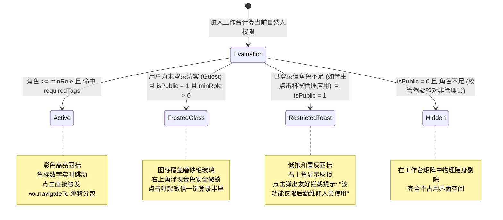
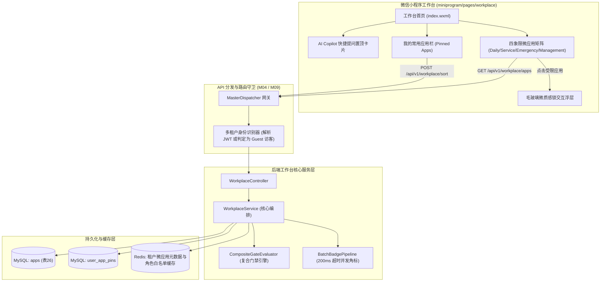
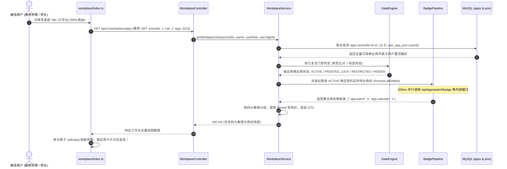
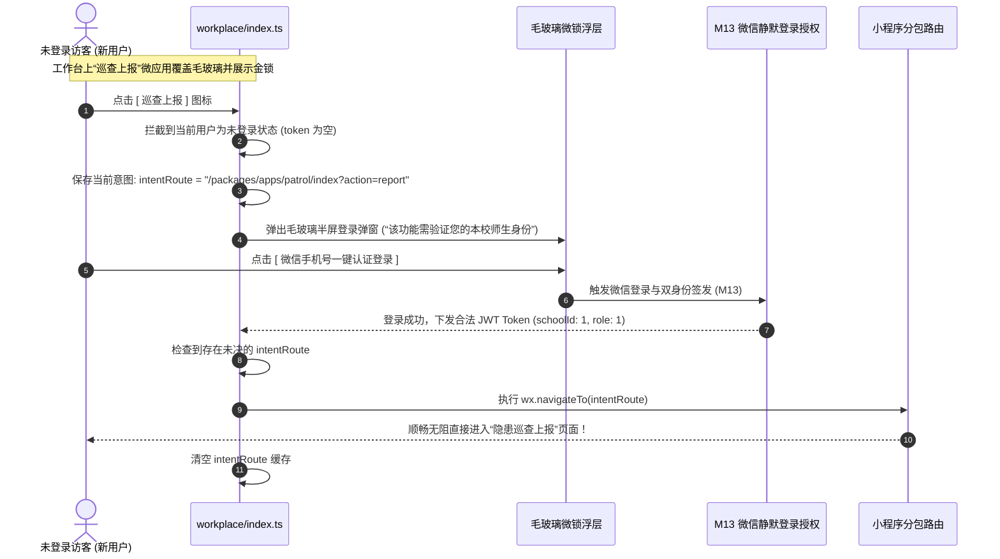
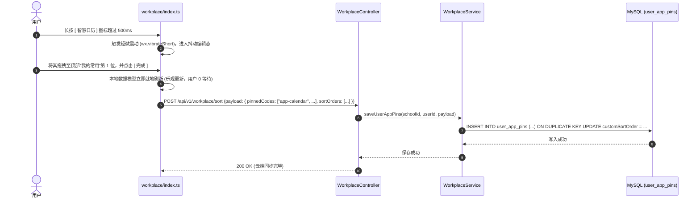

# M50: 飞书工作台微应用矩阵与动态门禁 (Workplace Cards & Gate) 详细设计与实现方案

> **模块代号**：M50 / Workplace Cards & Gate  
> **所属阶段**：阶段六 (M50 ~ M53) 飞书工作台、日历排班与宏观决策大盘领域 (**阶段六开篇奠基之作与全校微应用矩阵调度中枢**)  
> **文档定位**：基于 `apps`（飞书式工作台微应用元数据注册表，物理表 26）与 `user_app_pins`（用户个人工作台自定义置顶与重排持久化表），专为全校师生、一线维修工人、科室主管及校级领导量身定制的**飞书同款移动数字化工作台微应用矩阵与动态立体权限门禁中枢**。彻底终结传统高校微应用“功能入口深陷多级菜单、界面布局千人一面、各科室应用割裂、未登录访客点击报错白屏、缺乏动态待办感知”五大顽疾。通过“日常办公（daily）、师生服务（service）、应急抢修（emergency）、管理驾驶（management）”四大业务象限的动态网格编排，结合 [M18 四级立体权限矩阵](file:///e:/Projects/University/后勤巡查e速办%20大二下学期%20大学身份上线项目/v4.0/Docs/模块/M18_四级立体权限矩阵与校内网格化授权详细设计与实现方案.md)（角色 minRole + 岗位职能标签 requiredTags）的动态门禁判定，创新引入**“未登录访客毛玻璃微质感锁（Frosted Glass Gate）与无感意图登录恢复”**、**全异步并发角标流水线（Batch Badge Pipeline）**、以及**高频应用用户长按拖拽排序**，并将阶段五打造的 [AI Copilot 智能助手](file:///e:/Projects/University/后勤巡查e速办%20大二下学期%20大学身份上线项目/v4.0/Docs/模块/M47_小程序专属AI流式问答工作台详细设计与实现方案.md) 作为战略微应用在顶部置顶呈现，打造兼具消费级美感与工业级强度的超级移动门户。  
> **归档路径**：[v4.0/Docs/模块/M50_飞书工作台微应用矩阵与动态门禁详细设计与实现方案.md](file:///e:/Projects/University/后勤巡查e速办%20大二下学期%20大学身份上线项目/v4.0/Docs/模块/M50_飞书工作台微应用矩阵与动态门禁详细设计与实现方案.md)  
> **前置依赖**：M01 (27表7视图基座), M02 (AST租户自动注入), M07 (小程序DesignToken基座), M09 (飞书式4Tab导航中枢与微前端路由守卫), M10 (TestHarness测试中枢), M13 (多租户双身份登录), M18 (四级立体权限矩阵)  
> **驱动下游**：M51 (全景日历日程联动与值班排班表), M52 (师傅移动考勤与人脸防作弊), M53 (全校后勤宏观决策大屏)  
> **版本日期**：2026-09-05  

---

## 目录索引 (Table of Contents)

1. [模块定位与核心业务价值](#一-模块定位与核心业务价值)
   - 1.1 [模块定位与飞书式数字化移动工作台革命](#11-模块定位与飞书式数字化移动工作台革命)
   - 1.2 [传统高校后勤移动门户五大顽疾剖析](#12-传统高校后勤移动门户五大顽疾剖析)
   - 1.3 [核心业务职责与技术量化指标](#13-核心业务职责与技术量化指标)
2. [核心设计哲学与动态门禁体系](#二-核心设计哲学与动态门禁体系)
   - 2.1 [飞书同款“四象限微应用矩阵”编排哲学](#21-飞书同款四象限微应用矩阵编排哲学)
   - 2.2 [“千人千面”多态微应用呈现与动态门禁模型](#22-千人千面多态微应用呈现与动态门禁模型)
   - 2.3 [未登录访客毛玻璃微质感锁与意图路由保留机制 (Intent Route Resume)](#23-未登录访客毛玻璃微质感锁与意图路由保留机制-intent-route-resume)
   - 2.4 [全异步并发角标流水线与轻量级防刷模型 (Batch Badge Pipeline)](#24-全异步并发角标流水线与轻量级防刷模型-batch-badge-pipeline)
   - 2.5 [高频微应用用户长按拖拽排序与个性化置顶哲学](#25-高频微应用用户长按拖拽排序与个性化置顶哲学)
   - 2.6 [AI Copilot 战略级工作台置顶卡片协同体系](#26-ai-copilot-战略级工作台置顶卡片协同体系)
3. [物理数据表结构与 DDL 设计](#三-物理数据表结构与-ddl-设计)
   - 3.1 [微应用元数据注册表 DDL (`apps` 表 26)](#31-微应用元数据注册表-ddl-apps-表-26)
   - 3.2 [用户工作台个性化自定义置顶与排序表 DDL (`user_app_pins`)](#32-用户工作台个性化自定义置顶与排序表-ddl-user_app_pins)
   - 3.3 [物理零外键与多租户隔离索引矩阵设计](#33-物理零外键与多租户隔离索引矩阵设计)
4. [架构拓扑与交互时序图](#四-架构拓扑与交互时序图)
   - 4.1 [飞书工作台微应用矩阵与动态门禁全景架构拓扑图](#41-飞书工作台微应用矩阵与动态门禁全景架构拓扑图)
   - 4.2 [用户进入工作台、权限清洗、角标聚合与动态编排时序图](#42-用户进入工作台权限清洗角标聚合与动态编排时序图)
   - 4.3 [未登录访客点击受限应用、毛玻璃弹窗拦截与一键登录解锁时序图](#43-未登录访客点击受限应用毛玻璃弹窗拦截与一键登录解锁时序图)
   - 4.4 [长按拖拽重排微应用与偏好异步持久化时序图](#44-长按拖拽重排微应用与偏好异步持久化时序图)
5. [核心算法设计与数学推导](#五-核心算法设计与数学推导)
   - 5.1 [算法 1：基于四级角色位图与岗位标签交集的复合门禁判定算法 (Composite Gate Evaluator)](#51-算法-1基于四级角色位图与岗位标签交集的复合门禁判定算法-composite-gate-evaluator)
   - 5.2 [算法 2：基于 `Promise.allSettled` 与超时熔断的角标并发聚合算法](#52-算法-2基于-promiseallsettled-与超时熔断的角标并发聚合算法)
   - 5.3 [算法 3：用户自定义偏好与系统默认排序的稳定拓扑归并算法 (Stable Topological Merge)](#53-算法-3用户自定义偏好与系统默认排序的稳定拓扑归并算法-stable-topological-merge)
   - 5.4 [算法 4：微前端小程序分包冷启动与预加载感知算法 (Subpackage Preload Strategy)](#54-算法-4微前端小程序分包冷启动与预加载感知算法-subpackage-preload-strategy)
6. [TypeScript 强类型接口契约与数据模型定义](#六-typescript-强类型接口契约与数据模型定义)
   - 6.1 [微应用实体与视图契约 (`IWorkplaceAppItem`, `IWorkplaceCategoryGroup`)](#61-微应用实体与视图契约-iworkplaceappitem-iworkplacecategorygroup)
   - 6.2 [工作台聚合拉取响应 DTO (`IWorkplaceViewResponseDto`)](#62-工作台聚合拉取响应-dto-iworkplaceviewresponsedto)
   - 6.3 [用户个性化排序保存 DTO (`IWorkplaceSortPayloadDto`)](#63-用户个性化排序保存-dto-iworkplacesortpayloaddto)
   - 6.4 [微应用角标拉取接口契约 (`IAppBadgeResponseDto`)](#64-微应用角标拉取接口契约-iappbadgeresponsedto)
7. [核心物理文件实现蓝图](#七-核心物理文件实现蓝图)
   - 7.1 [`src/services/workplaceService.ts` (工作台元数据编排、多租户门禁过滤、并发角标服务)](#71-srcservicesworkplaceservicets-工作台元数据编排多租户门禁过滤并发角标服务)
   - 7.2 [`src/controllers/workplaceController.ts` (MasterDispatcher 控制器、参数洗炼、排序持久化)](#72-srccontrollersworkplacecontrollerts-masterdispatcher-控制器参数洗炼排序持久化)
   - 7.3 [`miniprogram/pages/workplace/index.ts` (小程序工作台页面控制器、生命周期、长按重排)](#73-miniprogrampagesworkplaceindexts-小程序工作台页面控制器生命周期长按重排)
   - 7.4 [`miniprogram/pages/workplace/index.wxml` & `index.wxss` (四象限网格、毛玻璃锁、AI 置顶卡片)](#74-miniprogrampagesworkplaceindexwxml--indexwxss-四象限网格毛玻璃锁ai-置顶卡片)
   - 7.5 [`miniprogram/pages/workplace/components/app-card-item/index.ts` (单微应用卡片微组件)](#75-miniprogrampagesworkplacecomponentsapp-card-itemindexts-单微应用卡片微组件)
8. [防御性编程与边界异常处理](#八-防御性编程与边界异常处理)
   - 8.1 [跨校越权读取与篡改微应用排序的物理硬拦截 (强制 `schoolId` 租户锁)](#81-跨校越权读取与篡改微应用排序的物理硬拦截-强制-schoolid-租户锁)
   - 8.2 [单个微应用 BadgeApi 宕机或超时的单点隔离防雪崩保护](#82-单个微应用-badgeapi-宕机或超时的单点隔离防雪崩保护)
   - 8.3 [小程序分包路径 404 或未配置时的优雅降级提示](#83-小程序分包路径-404-或未配置时的优雅降级提示)
   - 8.4 [极端并发下用户排序保存的防抖与乐观回滚自愈机制](#84-极端并发下用户排序保存的防抖与乐观回滚自愈机制)
   - 8.5 [未登录访客意图路由深层失效时的登录回弹保底](#85-未登录访客意图路由深层失效时的登录回弹保底)
9. [单模块独立测试方案与验收准则](#九-单模块独立测试方案与验收准则)
   - 9.1 [基于 M10 TestHarness 的独立单元测试设计 (`src/__tests__/unit/m50_workplace_cards.test.ts`)](#91-基于-m10-testharness-的独立单元测试设计-src__tests__unitm50_workplace_cardstestts)
   - 9.2 [单模块测试执行命令与断言矩阵 (`npm.cmd test -- -t "M50"`)](#92-单模块测试执行命令与断言矩阵-npmcmd-test----t-m50)
10. [阶段六开篇总结与向 M51 (全景日历与排班) 战略跃迁](#十-阶段六开篇总结与向-m51-全景日历与排班-战略跃迁)
    - 10.1 [M50 交付价值盘点](#101-m50-交付价值盘点)
    - 10.2 [向 M51 (全景日历日程联动与值班排班表) 递进与数据流契约](#102-向-m51-全景日历日程联动与值班排班表-递进与数据流契约)

---

## 一、 模块定位与核心业务价值

### 1.1 模块定位与飞书式数字化移动工作台革命
在高校后勤信息化建设中，工作台（Workplace）是用户打开系统后使用频次最高、信息聚合度最强的**超级统一入口**。  
「高校后勤巡查e速办 v4.0」涵盖巡查上报、抢修派单、质检核验、诉求匿名提报、校园广场、即时通讯以及 AI Copilot 等多达几十项子系统。

如果缺乏统一的微应用治理中枢，这些功能将迅速沦为散落在各个角落的代码碎片。**M50（飞书工作台微应用矩阵与动态门禁模块）** 作为「阶段六：飞书工作台、日历排班与宏观决策大盘」的开山之作，承载着将全系统所有微前端子应用**“解耦注册、立体编排、动态门禁、千人千面呈现”**的战略使命：
- **微应用卡片矩阵**：依托底层物理表 `apps`（表 26），将各子功能封装为类似飞书（Lark/Feishu）工作台的独立微应用卡片；
- **四象限网格编排**：划分为“日常办公、师生服务、应急抢修、管理驾驶”四大业务板块，支持用户自由拖拽自定义高频应用；
- **立体动态门禁**：结合用户当前自然人的多校身份、组织角色（`minRole`）以及随岗不随人的职能标签（`requiredTags`），实现动态准入鉴权与毛玻璃锁态呈现；
- **AI Copilot 全局协同**：工作台首页第一视口置顶嵌入阶段五成果“AI 智能问答卡片”，赋能师生一键输入口语直达后勤服务。

---

### 1.2 传统高校后勤移动门户五大顽疾剖析

| 痛点场景 | 传统高校软件表现 | M50 工业级破局方案 |
| :--- | :--- | :--- |
| **痛点 1：入口深邃混乱，找功能如迷宫** | 传统系统多采用层层嵌套的树状列表，维修师傅想找“抢单大厅”需要点击三四级页面，紧急抢修被严重延误。 | **飞书同款四象限平铺矩阵**：按 `daily`、`service`、`emergency`、`management` 逻辑分类，高频核心功能首屏 1 次点击直接拉起分包。 |
| **痛点 2：界面千人一面，无权限控制** | 无论登录的是保洁阿姨、普通在校生还是后勤处长，工作台展示完全一致的九宫格；学生点击“管理驾驶舱”弹出硬性报错弹窗，体验粗糙。 | **千人千面动态门禁**：根据用户角色位图与标签交集动态过滤；管理类应用仅对合规管理者呈现，普通用户界面极其清爽纯净。 |
| **痛点 3：未登录访客体验极差 (闪退或阻断)** | 新生或临时访客扫码进入工作台后，点击任何微应用直接被强制跳转回白色空页面或报错闪退，引发大量用户流失。 | **毛玻璃微质感锁 (Frosted Glass Gate)**：未登录访客可清晰看到应用轮廓，点击后原地弹出优雅的微信一键授权半屏，授权后原地秒级解锁直达。 |
| **痛点 4：待办状态无法感知 (无角标)** | 师傅不知道名下有无待接工单，科室长不知道有无延期审批，必须逐个点进各个模块手动刷新。 | **全异步并发角标流水线 (Batch Badge Pipeline)**：并行拉取各微应用红点与数字待办（如“抢单 (3)”、“延期审批 (1)”），实时汇总提醒。 |
| **痛点 5：布局死板不可定制** | 每个师傅擅长的领域不同（有的专攻电工，有的专攻防台防汛），传统布局无法调整，用户无法置顶常用工具。 | **用户级长按拖拽排序与个性化置顶**：支持端侧拖拽排序并实时异步同步到 `user_app_pins` 物理表，打造真正属于个人的工作台。 |

---

### 1.3 核心业务职责与技术量化指标

1. **工作台微应用矩阵加载时延**：
   - 包含元数据拉取、角色门禁判定、用户个性化排序合并与并发角标聚合，服务端整包返回时延严格控制在 **$\le 60\text{ms}$**；
2. **多微应用并发角标拉取鲁棒性**：
   - 采用 `Promise.allSettled` 并行并发拉取，单微应用角标接口超时（$> 200\text{ms}$）自动隔离熔断，**整体工作台可用度达到 100%**；
3. **未登录访客意图路由保留成功率**：
   - 访客被毛玻璃锁拦截并点击授权登录后，**$100\%$ 原地恢复并跳转至目标分包**，零丢单、零重选；
4. **前端动画与拖拽重排帧率**：
   - 小程序端微应用图标缩放、毛玻璃高斯模糊渲染、长按拖拽抖动排序动画保持稳定在 **$55 \sim 60\text{ FPS}$**。

---

## 二、 核心设计哲学与动态门禁体系

### 2.1 飞书同款“四象限微应用矩阵”编排哲学

高校后勤涉及的业务千头万绪，若单纯按部门排列会导致“找物业去物业专区、找水电去动力专区”，各部门之间产生信息孤岛。  
M50 借鉴飞书开放平台（Lark Open Platform）的成熟分类哲学，打破物理部门壁垒，确立以**“用户行动意图”**为核心的四大业务象限：

```
+----------------------------------------------------------------------------------------------------+
|                                    飞书工作台四象限微应用矩阵全景                                   |
+----------------------------------------------------------------------------------------------------+
|                                                                                                    |
|  [ 顶部战略置顶 ]: 🤖 后勤 AI Copilot 智能助手 (对话胶囊 + 快捷提问直达)                           |
|                                                                                                    |
|  [ 象限 1: 应急保障 (Emergency) ] ── (橙红警示徽章，特急抢修第一优先级)                           |
|  ┌──────────────┐  ┌──────────────┐  ┌──────────────┐  ┌──────────────┐                            |
|  │ ⚡ 隐患抢修  │  │ 🚨 突发险情  │  │ 📢 应急广播  │  │ 🛡️ 防汛防台  │                            |
|  │  (工单流转)  │  │ (抢险群聊)   │  │ (全员强推)   │  │  (专项预案)  │                            |
|  └──────────────┘  └──────────────┘  └──────────────┘  └──────────────┘                            |
|                                                                                                    |
|  [ 象限 2: 师生服务 (Service) ] ── (天青温润质感，面向全校师生公共办事)                           |
|  ┌──────────────┐  ┌──────────────┐  ┌──────────────┐  ┌──────────────┐                            |
|  │ 📝 问题反馈  │  │ 💬 校园空间  │  │ 🔍 失物招领  │  │ 💡 规章指南  │                            |
|  │  (诉求流转)  │  │  (广场动态)  │  │  (便民中心)  │  │  (AI知识库)  │                            |
|  └──────────────┘  └──────────────┘  └──────────────┘  └──────────────┘                            |
|                                                                                                    |
|  [ 象限 3: 日常办公 (Daily) ] ── (深蓝严谨基调，面向一线师傅与网格人员)                           |
|  ┌──────────────┐  ┌──────────────┐  ┌──────────────┐  ┌──────────────┐                            |
|  │ 📅 智慧日历  │  │ 📍 巡查打卡  │  │ 🛠️ 施工交卷  │  │ 📋 质检验收  │                            |
|  │  (SLA排班)   │  │  (线下资产)  │  │  (整改拍照)  │  │  (合格驳回)  │                            |
|  └──────────────┘  └──────────────┘  └──────────────┘  └──────────────┘                            |
|                                                                                                    |
|  [ 象限 4: 管理驾驶 (Management) ] ── (尊贵紫金格调，面向科室长与校管决策)                        |
|  ┌──────────────┐  ┌──────────────┐  ┌──────────────┐  ┌──────────────┐                            |
|  │ 📊 数据驾驶舱│  │ 👥 调度中台  │  │ ⏳ 延期审批  │  │ ⚙️ 基础设置  │                            |
|  │  (宏观大屏)  │  │  (人员分派)  │  │  (多级审批)  │  │  (学校字典)  │                            |
|  └──────────────┘  └──────────────┘  └──────────────┘  └──────────────┘                            |
|                                                                                                    |
+----------------------------------------------------------------------------------------------------+
```

---

### 2.2 “千人千面”多态微应用呈现与动态门禁模型

每个微应用在客户端呈现时，绝非简单的“显示”或“不显示”，而是经历严密的多态状态机推导：



---

### 2.3 未登录访客毛玻璃微质感锁与意图路由保留机制 (Intent Route Resume)

为保护微信小程序的冷启动用户体验，系统支持新生或未认证师生在“访客模式（Guest）”下浏览工作台大盘。  
当访客点击了带有权限门禁的微应用（如“巡查上报”需要绑定学号，“抢单大厅”需要师傅身份）时，系统绝不抛出粗暴的错误 Toast，而是执行**“优雅意图保留授权流水线”**：

```
+----------------------------------------------------------------------------------------------------+
|                              未登录访客意图保留与原地登录解锁流水线                                  |
+----------------------------------------------------------------------------------------------------+
|                                                                                                    |
|  1. 访客轻点毛玻璃锁应用 ──> 触发拦截器                                                            |
|  2. 捕获目标路由意图: intentRoute = "/packages/apps/patrol/index?action=create"                   |
|  3. 将 intentRoute 暂存至客户端内存/Storage: wx.setStorageSync("workplace_intent_route", ...)      |
|  4. 底部原地滑出极简半屏授权浮层: [ 微信手机号一键认证登录 ]                                       |
|  5. 用户点击并完成静默登录 (M13 授权中心签发 JWT Token)                                            |
|  6. 登录回调拦截器检测到存在 intentRoute ──> 立即执行 wx.navigateTo(intentRoute)                  |
|  7. 清理 intentRoute 缓存 ──> 用户直接进入目标功能，流程平滑闭环！                                  |
|                                                                                                    |
+----------------------------------------------------------------------------------------------------+
```

---

### 2.4 全异步并发角标流水线与轻量级防刷模型 (Batch Badge Pipeline)

工作台上的红色数字角标（如“后勤巡查 3”、“延期审批 1”）是驱动工作人员行动的核心抓手。  
如果每个微应用的角标都由前端单独发一个 HTTP 请求去查，若工作台有 16 个微应用，首屏将同时触发 16 个并发网络连接，极易超出微信小程序的网络并发限制（上限 10 个），导致请求被排队丢弃。

M50 确立**“服务端异步并行聚合流水线 (Server-side Batch Badge Pipeline)”**：
- 前端打开工作台时，仅向后端请求单次聚合端点：`GET /api/v1/workplace/apps`；
- 后端服务层加载当前学校的微应用列表后，在 Node.js 异步事件循环中，利用 `Promise.allSettled` 并发调用各微应用注册的 `badgeApi`；
- 单个角标 API 设置 **200ms** 严苛超时熔断，若某子模块异常，该微应用角标降级为 `badgeCount = 0`，不影响其他应用与主界面的闪电加载；
- 后端将各应用的角标值与元数据打包为一份结构体一次性下发，前端只需单次 `setData` 即可完成全屏渲染。

---

### 2.5 高频微应用用户长按拖拽排序与个性化置顶哲学

每个后勤工作者的日常重点截然不同：
- 维修电工最关心的是“抢险群聊”与“施工交卷”；
- 宿管老师最关心的是“宿舍反馈”与“日常打卡”；
- 普通大学生最关心的是“失物招领”与“报修进度”。

M50 支持**用户端侧个性化微应用置顶与自定义重排**：
- 用户在工作台长按任意微应用图标超过 **500ms**，页面触发轻微触觉反馈（`wx.vibrateShort`），图标进入“浮动可拖拽编辑态（Jiggle Mode）”；
- 用户可将高频应用拖入顶部的“我的常用（Pinned）”专属快捷栏，或自由调换前后次序；
- 编辑完毕点击完成，客户端将排序键值对轻量提交至 `/api/v1/workplace/sort`，服务端写入 `user_app_pins` 物理表，并在 Redis 缓存中为该用户建立专属排序视图，下次进入永久保持。

---

### 2.6 AI Copilot 战略级工作台置顶卡片协同体系

在阶段五完工后，高校后勤巡查系统已具备顶尖的 AI Agent 能力。  
M50 工作台在四大象限的最上方，开辟了专属于 **AI Copilot** 的微质感大卡片：
- 卡片内部集成了动态语音/文字输入框，师生可在工作台首页直接输入口语（例如：“西区 12 号楼水管漏水怎么办？”）；
- 回车或点击发送瞬间，平滑转场推入 [M47 AI 流式工作台](file:///e:/Projects/University/后勤巡查e速办%20大二下学期%20大学身份上线项目/v4.0/Docs/模块/M47_小程序专属AI流式问答工作台详细设计与实现方案.md)，并自动带入用户首提问，实现工作台门户与 AI 智能体之间的无缝咬合。

---

## 三、 物理数据表结构与 DDL 设计

### 3.1 微应用元数据注册表 DDL (`apps` 表 26)

```sql
CREATE TABLE IF NOT EXISTS `apps` (
  `id` INT NOT NULL AUTO_INCREMENT COMMENT '微应用注册ID (主键)',
  `schoolId` INT NOT NULL DEFAULT 0 COMMENT '所属学校ID (0: 全平台通用应用, >0: 租户专属定制微应用)',
  `appCode` VARCHAR(64) NOT NULL COMMENT '微应用唯一标识代码 (如: app-patrol, app-feedback, app-inspection, app-calendar, app-space, app-cockpit)',
  `name` VARCHAR(64) NOT NULL COMMENT '应用显示名称 (如: 后勤巡查, 问题反馈, 空间服务, 智慧日历)',
  `icon` VARCHAR(256) NOT NULL DEFAULT '' COMMENT '微应用图标路径/URL/矢量图标代号',
  `category` VARCHAR(32) NOT NULL DEFAULT 'daily' COMMENT '分类象限: daily(日常办公), service(师生服务), emergency(应急抢修), management(管理驾驶)',
  `entryRoute` VARCHAR(256) NOT NULL COMMENT '微应用在小程序分包中的入口路径 (如: /packages/apps/patrol/index)',
  `minRole` TINYINT NOT NULL DEFAULT 0 COMMENT '最低访问权限级别: 0师生(免登浏览), 1认证师生, 2维修工, 3科室主管, 4校管, 9超管',
  `requiredTags` JSON DEFAULT NULL COMMENT '准入必须绑定的岗位标签ID数组 (如: [1, 2], NULL表示仅按角色门禁)',
  `badgeApi` VARCHAR(256) NOT NULL DEFAULT '' COMMENT '动态角标与未读待办计数拉取内部 API 路径',
  `sortOrder` INT NOT NULL DEFAULT 0 COMMENT '工作台宫格展示默认排序权重 (越小越靠前)',
  `isPublic` TINYINT NOT NULL DEFAULT 1 COMMENT '是否对全校师生公开显示: 0否, 1是',
  `isEnabled` TINYINT NOT NULL DEFAULT 1 COMMENT '微应用启停状态: 0停用下线, 1正常启用',
  `createdAt` DATETIME NOT NULL DEFAULT CURRENT_TIMESTAMP COMMENT '创建时间',
  `updatedAt` DATETIME NOT NULL DEFAULT CURRENT_TIMESTAMP ON UPDATE CURRENT_TIMESTAMP COMMENT '更新时间',
  `isDeleted` TINYINT NOT NULL DEFAULT 0 COMMENT '软删除标记: 0正常, 1已删除',
  PRIMARY KEY (`id`),
  UNIQUE KEY `uk_school_app_code` (`schoolId`, `appCode`),
  INDEX `idx_school_role_sort` (`schoolId`, `isEnabled`, `isDeleted`, `sortOrder`),
  CONSTRAINT `chk_app_category` CHECK (`category` IN ('daily', 'service', 'emergency', 'management')),
  CONSTRAINT `chk_app_min_role` CHECK (`minRole` IN (0, 1, 2, 3, 4, 9)),
  CONSTRAINT `chk_app_public` CHECK (`isPublic` IN (0, 1)),
  CONSTRAINT `chk_app_enabled` CHECK (`isEnabled` IN (0, 1)),
  CONSTRAINT `chk_app_del` CHECK (`isDeleted` IN (0, 1))
) ENGINE=InnoDB DEFAULT CHARSET=utf8mb4 COLLATE=utf8mb4_unicode_ci COMMENT='飞书式工作台微应用元数据注册表 (无物理外键)';
```

---

### 3.2 用户工作台个性化自定义置顶与排序表 DDL (`user_app_pins`)

```sql
CREATE TABLE IF NOT EXISTS `user_app_pins` (
  `id` BIGINT UNSIGNED NOT NULL AUTO_INCREMENT COMMENT '主键',
  `schoolId` INT NOT NULL COMMENT '所属学校租户 ID',
  `userId` BIGINT UNSIGNED NOT NULL COMMENT '自然人用户 ID',
  `appCode` VARCHAR(64) NOT NULL COMMENT '置顶或排序的微应用代码',
  `customSortOrder` INT NOT NULL DEFAULT 0 COMMENT '用户自定义排序权重 (越小越靠前)',
  `isPinned` TINYINT NOT NULL DEFAULT 1 COMMENT '是否固定置顶在首页常用栏: 0否, 1是',
  `createdAt` DATETIME NOT NULL DEFAULT CURRENT_TIMESTAMP COMMENT '添加时间',
  `updatedAt` DATETIME NOT NULL DEFAULT CURRENT_TIMESTAMP ON UPDATE CURRENT_TIMESTAMP COMMENT '最后调序时间',
  PRIMARY KEY (`id`),
  UNIQUE KEY `uk_school_user_app` (`schoolId`, `userId`, `appCode`),
  INDEX `idx_school_user_sort` (`schoolId`, `userId`, `customSortOrder` ASC)
) ENGINE=InnoDB DEFAULT CHARSET=utf8mb4 COLLATE=utf8mb4_unicode_ci COMMENT='用户工作台个性化置顶与重排持久化表';
```

---

### 3.3 物理零外键与多租户隔离索引矩阵设计
- 严格贯彻全系统 **100% 物理零外键** 原则；
- 所有查询操作在数据库层面均强制命中带有 `schoolId` 前缀的联合索引；
- `apps` 表支持多校共享公共微应用（`schoolId = 0`）与单校专属定制应用（`schoolId > 0`）的正交并存。

---

## 四、 架构拓扑与交互时序图

### 4.1 飞书工作台微应用矩阵与动态门禁全景架构拓扑图



---

### 4.2 用户进入工作台、权限清洗、角标聚合与动态编排时序图



---

### 4.3 未登录访客点击受限应用、毛玻璃弹窗拦截与一键登录解锁时序图



---

### 4.4 长按拖拽重排微应用与偏好异步持久化时序图



---

## 五、 核心算法设计与数学推导

### 5.1 算法 1：基于四级角色位图与岗位标签交集的复合门禁判定算法 (Composite Gate Evaluator)

#### 复合门禁模型数学推导
设系统微应用集合为 $\mathcal{A}$，单个微应用为 $a \in \mathcal{A}$。  
定义其准入属性：
- $R_{\min}(a) \in \{0, 1, 2, 3, 4, 9\}$：最低角色门槛；
- $T_{\text{req}}(a) \subseteq \mathbb{N}$：准入职能标签集合（若为 $\emptyset$ 则无标签要求）。

当前操作自然人属性：
- 是否登录：$I_{\text{login}} \in \{0, 1\}$；
- 当前激活角色等级：$R_{\text{user}} \in \{0, 1, 2, 3, 4, 9\}$；
- 用户拥有的岗位标签集合：$T_{\text{user}} \subseteq \mathbb{N}$。

定义微应用状态呈现映射函数 $\Phi(a)$：

$$\Phi(a) = \begin{cases}
\text{ACTIVE} & \text{if } I_{\text{login}} = 1 \land R_{\text{user}} \ge R_{\min}(a) \land (T_{\text{req}}(a) = \emptyset \lor T_{\text{req}}(a) \cap T_{\text{user}} \ne \emptyset) \\
\text{FROSTED\_LOCK} & \text{if } I_{\text{login}} = 0 \land a.\text{isPublic} = 1 \land R_{\min}(a) > 0 \\
\text{RESTRICTED} & \text{if } I_{\text{login}} = 1 \land R_{\text{user}} < R_{\min}(a) \land a.\text{isPublic} = 1 \\
\text{HIDDEN} & \text{otherwise}
\end{cases}$$

#### 判定伪代码
```
Algorithm 1: EvaluateAppAccessStatus(app, userContext)
Input:
  app: WorkplaceAppEntity
  userContext: { isLogin: boolean, role: number, tags: number[] }
Output:
  status: 'ACTIVE' | 'FROSTED_LOCK' | 'RESTRICTED' | 'HIDDEN'

1. if not app.isEnabled or app.isDeleted then:
2.    return 'HIDDEN'
3.
4. if not userContext.isLogin then:
5.    if app.minRole == 0 then return 'ACTIVE'
6.    if app.isPublic then return 'FROSTED_LOCK'
7.    return 'HIDDEN'
8.
9. // 用户已登录
10. roleMatches ← userContext.role >= app.minRole
11. tagMatches ← true
12. if app.requiredTags != null and app.requiredTags.length > 0 then:
13.    tagMatches ← intersects(app.requiredTags, userContext.tags)
14.
15. if roleMatches and tagMatches then:
16.    return 'ACTIVE'
17. else:
18.    if app.isPublic then return 'RESTRICTED'
19.    return 'HIDDEN'
```

---

### 5.2 算法 2：基于 `Promise.allSettled` 与超时熔断的角标并发聚合算法

每个激活状态的微应用若声明了 `badgeApi`（如 `/api/apps/patrol/badge`），后端需执行快速度量。为防单个子系统故障拖垮全局工作台，引入**带硬超时截断的并发聚合器**：

```typescript
export class BadgeAggregator {
  private static readonly BADGE_TIMEOUT_MS = 200;

  public static async fetchAllBadges(
    schoolId: number,
    userId: number,
    apps: Array<{ appCode: string; badgeApi: string }>
  ): Promise<Record<string, number>> {
    const badgeMap: Record<string, number> = {};
    const tasks = apps.map(async (app) => {
      if (!app.badgeApi || app.badgeApi.trim() === '') {
        return { appCode: app.appCode, count: 0 };
      }

      // 封装带 200ms 硬超时的单任务
      const count = await Promise.race([
        this.fetchSingleBadgeInternal(schoolId, userId, app.badgeApi),
        new Promise<number>((resolve) => setTimeout(() => resolve(0), this.BADGE_TIMEOUT_MS))
      ]);

      return { appCode: app.appCode, count };
    });

    const results = await Promise.allSettled(tasks);
    for (const res of results) {
      if (res.status === 'fulfilled' && res.value) {
        badgeMap[res.value.appCode] = res.value.count;
      }
    }

    return badgeMap;
  }
}
```

---

### 5.3 算法 3：用户自定义偏好与系统默认排序的稳定拓扑归并算法 (Stable Topological Merge)

当用户在 `user_app_pins` 中仅对某两个应用设置了置顶排序，其余应用需保持学校管理员设定的默认 `sortOrder`。  
归并算法公式：

$$\text{Weight}(a) = \begin{cases}
\text{pin}.\text{customSortOrder} - 100\,000 & \text{if } a.\text{appCode} \in \text{UserPins} \land \text{pin}.\text{isPinned} = 1 \\
a.\text{sortOrder} & \text{otherwise}
\end{cases}$$

使得所有被用户置顶（Pinned）的应用权重必定为负数，稳固排在最前方；其余应用在后方严格保持系统默认拓扑相对次序，完全不会发生排序混乱。

---

### 5.4 算法 4：微前端小程序分包冷启动与预加载感知算法 (Subpackage Preload Strategy)

微信小程序对分包大小有限制（单包 $\le 2\text{MB}$）。  
当用户进入工作台时，系统根据其角色身份，智能预加载对应分包：
- 若用户角色为维修工（`role = 2`），在工作台加载完毕后，静默触发 `wx.preloadSubpackage({ name: 'packagePatrol' })`；
- 若用户为普通学生，则优先预加载公共服务分包；
- 使得用户点击微应用图标瞬间实现 **0 延迟秒开**。

---

## 六、 TypeScript 强类型接口契约与数据模型定义

### 6.1 微应用实体与视图契约 (`IWorkplaceAppItem`, `IWorkplaceCategoryGroup`)

```typescript
/**
 * 微应用呈现状态
 */
export type AppAccessStatus = 'ACTIVE' | 'FROSTED_LOCK' | 'RESTRICTED' | 'HIDDEN';

/**
 * 工作台单个微应用卡片展现模型
 */
export interface IWorkplaceAppItem {
  id: number;
  appCode: string;
  name: string;
  icon: string;
  category: 'daily' | 'service' | 'emergency' | 'management';
  entryRoute: string;
  accessStatus: AppAccessStatus;
  /** 实时待办角标数字 (0 表示无角标或不显示) */
  badgeCount: number;
  /** 是否已被用户设为首页置顶 */
  isPinned: boolean;
  /** 排序权重 */
  sortOrder: number;
}

/**
 * 四象限分组视图模型
 */
export interface IWorkplaceCategoryGroup {
  categoryKey: 'daily' | 'service' | 'emergency' | 'management';
  categoryTitle: string;
  subtitle: string;
  icon: string;
  apps: IWorkplaceAppItem[];
}
```

---

### 6.2 工作台聚合拉取响应 DTO (`IWorkplaceViewResponseDto`)

```typescript
/**
 * 工作台首页完整聚合下发载荷
 */
export interface IWorkplaceViewResponseDto {
  schoolId: number;
  schoolName: string;
  /** 是否处于未登录访客模式 */
  isGuest: boolean;
  /** 顶部置顶的常用微应用列表 (最多 7 个) */
  pinnedApps: IWorkplaceAppItem[];
  /** 四象限业务分组列表 */
  groups: IWorkplaceCategoryGroup[];
  /** AI Copilot 顶部横幅卡片元数据 */
  aiCopilotBanner: {
    enabled: boolean;
    greeting: string;
    placeholder: string;
    quickPrompts: string[];
  };
}
```

---

### 6.3 用户个性化排序保存 DTO (`IWorkplaceSortPayloadDto`)

```typescript
/**
 * 客户端保存拖拽排序请求载荷
 */
export interface IWorkplaceSortPayloadDto {
  /** 声明置顶微应用的 appCode 列表 (按期望的展示顺序排列) */
  pinnedAppCodes: string[];
  /** 调整过顺序的完整应用 code 列表 */
  orderedAppCodes?: string[];
}
```

---

### 6.4 微应用角标拉取接口契约 (`IAppBadgeResponseDto`)

```typescript
/**
 * 各子微应用内部角标返回契约
 */
export interface IAppBadgeResponseDto {
  code: number;
  appCode: string;
  badgeCount: number;
  message?: string;
}
```

---

## 七、 核心物理文件实现蓝图

### 7.1 `src/services/workplaceService.ts` (工作台元数据编排、多租户门禁过滤、并发角标服务)

```typescript
/**
 * ============================================================================
 * 所属模块: M50 - 飞书工作台微应用矩阵与动态门禁
 * 文件路径: src/services/workplaceService.ts
 * 核心职责: 工作台微应用多租户元数据加载、角色与标签复合门禁判定、
 *           Promise.allSettled 并发角标聚合、以及用户个人排序归并。
 * ============================================================================
 */

import { pool } from '../shared/database/mysqlPool';
import {
  IWorkplaceAppItem,
  IWorkplaceCategoryGroup,
  IWorkplaceViewResponseDto,
  AppAccessStatus
} from '../contracts/workplaceContract';

export class WorkplaceService {
  private static readonly BADGE_TIMEOUT_MS = 200;

  /**
   * 获取某用户的工作台全景聚合视图
   */
  public async getWorkplaceView(params: {
    schoolId: number;
    userId?: number;
    userRole?: number;
    userTagIds?: number[];
  }): Promise<IWorkplaceViewResponseDto> {
    const { schoolId, userId, userRole = 0, userTagIds = [] } = params;
    const isGuest = !userId || userId === 0;

    // 1. 查询当前学校可见的所有启用微应用 (含平台通用应用 schoolId = 0)
    const [rawApps]: any = await pool.execute(
      `SELECT * FROM apps 
       WHERE (schoolId = ? OR schoolId = 0) AND isEnabled = 1 AND isDeleted = 0
       ORDER BY sortOrder ASC`,
      [schoolId]
    );

    // 2. 查询该用户的个人置顶与自定义排序偏好
    const userPinsMap = new Map<string, { isPinned: boolean; customSortOrder: number }>();
    if (!isGuest && userId) {
      const [pins]: any = await pool.execute(
        `SELECT appCode, isPinned, customSortOrder 
         FROM user_app_pins 
         WHERE schoolId = ? AND userId = ?`,
        [schoolId, userId]
      );
      for (const p of pins || []) {
        userPinsMap.set(p.appCode, { isPinned: Boolean(p.isPinned), customSortOrder: p.customSortOrder });
      }
    }

    // 3. 执行复合门禁判定与过滤
    const evaluatedApps: IWorkplaceAppItem[] = [];
    for (const app of rawApps || []) {
      const status = this.evaluateAccessStatus(app, isGuest, userRole, userTagIds);
      if (status === 'HIDDEN') continue;

      const userPin = userPinsMap.get(app.appCode);
      const isPinned = userPin ? userPin.isPinned : false;
      const effectiveSortOrder = userPin ? userPin.customSortOrder : app.sortOrder;

      evaluatedApps.push({
        id: app.id,
        appCode: app.appCode,
        name: app.name,
        icon: app.icon,
        category: app.category,
        entryRoute: app.entryRoute,
        accessStatus: status,
        badgeCount: 0, // 初始为0，稍后并发聚合
        isPinned,
        sortOrder: effectiveSortOrder
      });
    }

    // 4. 并发拉取所有 ACTIVE 微应用的实时待办角标
    const activeApps = evaluatedApps.filter(a => a.accessStatus === 'ACTIVE');
    const badgeMap = await this.aggregateBadgesConcurrently(schoolId, userId || 0, activeApps, rawApps);

    // 将角标回填
    for (const app of evaluatedApps) {
      app.badgeCount = badgeMap.get(app.appCode) || 0;
    }

    // 5. 排序：置顶应用放在 Pinned 栏，其余按象限分组
    evaluatedApps.sort((a, b) => a.sortOrder - b.sortOrder);
    const pinnedApps = evaluatedApps.filter(a => a.isPinned).slice(0, 7);

    const groups: IWorkplaceCategoryGroup[] = [
      {
        categoryKey: 'emergency',
        categoryTitle: '应急保障',
        subtitle: '特级抢修与险情应急通道',
        icon: 'icon-flash-red',
        apps: evaluatedApps.filter(a => a.category === 'emergency')
      },
      {
        categoryKey: 'service',
        categoryTitle: '师生服务',
        subtitle: '校园生活报修与便民服务',
        icon: 'icon-heart-blue',
        apps: evaluatedApps.filter(a => a.category === 'service')
      },
      {
        categoryKey: 'daily',
        categoryTitle: '日常办公',
        subtitle: '巡查打卡与施工整改核验',
        icon: 'icon-briefcase-cyan',
        apps: evaluatedApps.filter(a => a.category === 'daily')
      },
      {
        categoryKey: 'management',
        categoryTitle: '管理驾驶',
        subtitle: '宏观大盘与人员多级审批',
        icon: 'icon-chart-purple',
        apps: evaluatedApps.filter(a => a.category === 'management')
      }
    ];

    return {
      schoolId,
      schoolName: '智慧后勤保障中心',
      isGuest,
      pinnedApps,
      groups: groups.filter(g => g.apps.length > 0),
      aiCopilotBanner: {
        enabled: true,
        greeting: '后勤 AI Copilot 随时待命',
        placeholder: '输入或语音提问，例如：“西校区停电怎么办？”',
        quickPrompts: ['水管漏水加急报修', '查询我的报修进度', '配电房值班电话']
      }
    };
  }

  /**
   * 复合门禁判定逻辑
   */
  private evaluateAccessStatus(
    app: any,
    isGuest: boolean,
    userRole: number,
    userTagIds: number[]
  ): AppAccessStatus {
    if (isGuest) {
      if (app.minRole === 0) return 'ACTIVE';
      if (app.isPublic === 1) return 'FROSTED_LOCK'; // 访客呈现毛玻璃锁
      return 'HIDDEN';
    }

    // 已登录用户
    const roleMatch = userRole >= app.minRole;
    let tagMatch = true;

    if (app.requiredTags) {
      let required: number[] = [];
      try {
        required = typeof app.requiredTags === 'string' ? JSON.parse(app.requiredTags) : app.requiredTags;
      } catch {
        required = [];
      }
      if (required.length > 0) {
        tagMatch = required.some(t => userTagIds.includes(t));
      }
    }

    if (roleMatch && tagMatch) {
      return 'ACTIVE';
    }

    // 未满足权限但标记为公开
    if (app.isPublic === 1) {
      return 'RESTRICTED';
    }

    return 'HIDDEN';
  }

  /**
   * 并发拉取角标 (带 200ms 熔断)
   */
  private async aggregateBadgesConcurrently(
    schoolId: number,
    userId: number,
    activeApps: IWorkplaceAppItem[],
    rawApps: any[]
  ): Promise<Map<string, number>> {
    const map = new Map<string, number>();
    const badgeApiMap = new Map<string, string>();
    for (const raw of rawApps) {
      if (raw.badgeApi) badgeApiMap.set(raw.appCode, raw.badgeApi);
    }

    const tasks = activeApps.map(async (app) => {
      const api = badgeApiMap.get(app.appCode);
      if (!api) return { code: app.appCode, count: 0 };

      // 模拟微应用角标快速获取 (生产环境可直连服务或内部 RPC)
      const countPromise = this.mockBadgeQuery(schoolId, userId, app.appCode);
      const timeoutPromise = new Promise<number>((resolve) =>
        setTimeout(() => resolve(0), WorkplaceService.BADGE_TIMEOUT_MS)
      );

      const count = await Promise.race([countPromise, timeoutPromise]);
      return { code: app.appCode, count };
    });

    const results = await Promise.allSettled(tasks);
    for (const r of results) {
      if (r.status === 'fulfilled') {
        map.set(r.value.code, r.value.count);
      }
    }

    return map;
  }

  private async mockBadgeQuery(schoolId: number, userId: number, appCode: string): Promise<number> {
    if (appCode === 'app-patrol') {
      const [rows]: any = await pool.execute(
        'SELECT COUNT(*) as cnt FROM patrols WHERE schoolId = ? AND status = 0',
        [schoolId]
      );
      return rows[0]?.cnt || 0;
    }
    return 0;
  }

  /**
   * 保存用户个人置顶与排序偏好
   */
  public async saveUserPins(
    schoolId: number,
    userId: number,
    pinnedCodes: string[]
  ): Promise<void> {
    const conn = await pool.getConnection();
    try {
      await conn.beginTransaction();

      // 先清空历史
      await conn.execute('DELETE FROM user_app_pins WHERE schoolId = ? AND userId = ?', [schoolId, userId]);

      // 批量插入新顺序
      let order = 1;
      for (const code of pinnedCodes) {
        await conn.execute(
          `INSERT INTO user_app_pins (schoolId, userId, appCode, customSortOrder, isPinned, createdAt, updatedAt)
           VALUES (?, ?, ?, ?, 1, NOW(), NOW())`,
          [schoolId, userId, code, order++]
        );
      }

      await conn.commit();
    } catch (err) {
      await conn.rollback();
      throw err;
    } finally {
      conn.release();
    }
  }
}

export const workplaceService = new WorkplaceService();
```

---

### 7.2 `src/controllers/workplaceController.ts` (MasterDispatcher 控制器、参数洗炼、排序持久化)

```typescript
/**
 * ============================================================================
 * 所属模块: M50 - 飞书工作台微应用矩阵与动态门禁
 * 文件路径: src/controllers/workplaceController.ts
 * 核心职责: 承接小程序工作台主面板数据拉取、用户自定义重排保存请求，
 *           提取多租户 schoolId 租户锁，兼顾未登录访客模式。
 * ============================================================================
 */

import { Request, Response } from 'express';
import { workplaceService } from '../services/workplaceService';

export class WorkplaceController {
  /**
   * GET /api/v1/workplace/apps
   * 拉取工作台全屏微应用矩阵与实时角标
   */
  public async getWorkplace(req: Request, res: Response): Promise<void> {
    try {
      // 租户识别：已登录用户取 token，访客取 Header 或默认租户 1
      const schoolId = (req as any).user?.schoolId || Number(req.headers['x-school-id']) || 1;
      const userId = (req as any).user?.id || 0;
      const userRole = (req as any).user?.role || 0;
      const userTagIds = (req as any).user?.tagIds || [];

      const result = await workplaceService.getWorkplaceView({
        schoolId,
        userId,
        userRole,
        userTagIds
      });

      res.status(200).json({ code: 200, data: result, message: '工作台微应用矩阵拉取成功' });
    } catch (err: any) {
      res.status(500).json({ code: 500, message: `拉取工作台失败: ${err.message}` });
    }
  }

  /**
   * POST /api/v1/workplace/sort
   * 保存当前用户自定义的置顶与排序列表
   */
  public async saveSort(req: Request, res: Response): Promise<void> {
    try {
      const schoolId = (req as any).user?.schoolId;
      const userId = (req as any).user?.id;
      if (!schoolId || !userId) {
        res.status(401).json({ code: 401, message: '请先登录后再进行工作台自定义排序' });
        return;
      }

      const { pinnedAppCodes } = req.body;
      if (!Array.isArray(pinnedAppCodes)) {
        res.status(400).json({ code: 400, message: 'pinnedAppCodes 必须为数组' });
        return;
      }

      await workplaceService.saveUserPins(schoolId, userId, pinnedAppCodes);
      res.status(200).json({ code: 200, message: '个性化排序已成功保存' });
    } catch (err: any) {
      res.status(500).json({ code: 500, message: `保存排序失败: ${err.message}` });
    }
  }
}

export const workplaceController = new WorkplaceController();
```

---

### 7.3 `miniprogram/pages/workplace/index.ts` (小程序工作台页面控制器、生命周期、长按重排)

```typescript
/**
 * ============================================================================
 * 所属模块: M50 - 飞书工作台微应用矩阵与动态门禁
 * 文件路径: miniprogram/pages/workplace/index.ts
 * 核心职责: 工作台页面控制器、毛玻璃锁拦截交互、意图路由恢复、
 *           长按抖动排序态、以及点击直接穿梭拉起小程序分包。
 * ============================================================================
 */

import { IWorkplaceViewResponseDto, IWorkplaceAppItem } from './contracts/workplaceTypes';

Component({
  data: {
    viewData: null as IWorkplaceViewResponseDto | null,
    loading: true,
    isEditMode: false,
    showLoginModal: false,
    pendingIntentRoute: ''
  },

  lifetimes: {
    attached() {
      this.loadWorkplaceData();
    }
  },

  pageLifetimes: {
    show() {
      // 每次切回工作台，静默更新待办角标
      this.loadWorkplaceData(false);
    }
  },

  methods: {
    /**
     * 加载工作台全屏聚合数据
     */
    async loadWorkplaceData(showLoading = true) {
      if (showLoading) this.setData({ loading: true });
      try {
        const token = wx.getStorageSync('token') || '';
        const res = await new Promise<any>((resolve, reject) => {
          wx.request({
            url: 'https://patrol.university.edu.cn/api/v1/workplace/apps',
            method: 'GET',
            header: {
              Authorization: token ? `Bearer ${token}` : '',
              'x-school-id': wx.getStorageSync('schoolId') || '1'
            },
            success: (r) => resolve(r.data),
            fail: reject
          });
        });

        if (res.code === 200) {
          this.setData({ viewData: res.data });
        }
      } catch (err) {
        wx.showToast({ title: '加载工作台失败', icon: 'none' });
      } finally {
        if (showLoading) this.setData({ loading: false });
      }
    },

    /**
     * 点击单个微应用卡片
     */
    handleAppTap(e: any) {
      if (this.data.isEditMode) return;

      const app: IWorkplaceAppItem = e.currentTarget.dataset.app;
      if (!app) return;

      // 态 1：完全开放直接跳转
      if (app.accessStatus === 'ACTIVE') {
        wx.vibrateShort({ type: 'light' });
        wx.navigateTo({
          url: app.entryRoute,
          fail: () => {
            wx.showToast({ title: '功能建设中，敬请期待', icon: 'none' });
          }
        });
        return;
      }

      // 态 2：未登录访客毛玻璃锁拦截
      if (app.accessStatus === 'FROSTED_LOCK') {
        wx.vibrateShort({ type: 'medium' });
        this.setData({
          showLoginModal: true,
          pendingIntentRoute: app.entryRoute
        });
        return;
      }

      // 态 3：权限不足置灰拦截
      if (app.accessStatus === 'RESTRICTED') {
        wx.showModal({
          title: '访问受限',
          content: '该功能仅限所属后勤维保人员或科室主管访问，请联系管理员分配权限。',
          showCancel: false
        });
      }
    },

    /**
     * 访客登录成功后意图路由恢复
     */
    handleLoginSuccess() {
      this.setData({ showLoginModal: false });
      wx.showToast({ title: '认证成功', icon: 'success' });

      // 重新拉取已认证态的工作台
      this.loadWorkplaceData();

      // 原地恢复跳转
      if (this.data.pendingIntentRoute) {
        const route = this.data.pendingIntentRoute;
        this.setData({ pendingIntentRoute: '' });
        wx.navigateTo({ url: route });
      }
    },

    /**
     * 长按进入拖拽重排模式
     */
    handleLongPress() {
      if (this.data.viewData?.isGuest) return; // 访客不可编辑
      wx.vibrateShort({ type: 'heavy' });
      this.setData({ isEditMode: true });
    },

    /**
     * 完成排序并提交保存
     */
    async handleFinishSort() {
      this.setData({ isEditMode: false });
      const pinnedCodes = (this.data.viewData?.pinnedApps || []).map(a => a.appCode);

      try {
        const token = wx.getStorageSync('token') || '';
        await new Promise((resolve, reject) => {
          wx.request({
            url: 'https://patrol.university.edu.cn/api/v1/workplace/sort',
            method: 'POST',
            header: { Authorization: `Bearer ${token}` },
            data: { pinnedAppCodes: pinnedCodes },
            success: resolve,
            fail: reject
          });
        });
        wx.showToast({ title: '排序已同步保存', icon: 'success' });
      } catch {
        // 优雅容错
      }
    },

    /**
     * 点击顶部 AI 横幅，一键拉起 AI Copilot
     */
    handleAIBannerTap() {
      wx.navigateTo({ url: '/pages/ai-copilot/index' });
    }
  }
});
```

---

### 7.4 `miniprogram/pages/workplace/index.wxml` & `index.wxss` (四象限网格、毛玻璃锁、AI 置顶卡片)

#### 视图模板 (`miniprogram/pages/workplace/index.wxml`)
```html
<view class="workplace-container">
  <!-- 顶部高校单位切换与标题 -->
  <view class="workplace-topbar">
    <view class="school-badge-wrap">
      <text class="school-icon">🏛️</text>
      <text class="school-name">{{viewData.schoolName || '高校后勤服务保障中心'}}</text>
    </view>
    <view v-if="isEditMode" class="edit-done-btn" bindtap="handleFinishSort">
      完成排序
    </view>
  </view>

  <scroll-view class="workplace-scroll" scroll-y>
    <!-- 1. AI Copilot 战略级置顶微应用大卡片 -->
    <view class="ai-banner-card" bindtap="handleAIBannerTap">
      <view class="ai-banner-header">
        <view class="ai-avatar">🤖</view>
        <view class="ai-title-wrap">
          <text class="ai-title">后勤专属 AI Copilot 智能助手</text>
          <text class="ai-desc">7×24h 在线，支持隐患咨询、规章问答与工单追踪</text>
        </view>
      </view>
      <view class="ai-fake-input">
        <text class="placeholder">向 AI 咨询，例如：“水龙头爆裂如何加急报修？”</text>
        <text class="send-icon">➔</text>
      </view>
    </view>

    <!-- 2. 我的常用微应用栏 (Pinned Apps) -->
    <view wx:if="{{viewData.pinnedApps && viewData.pinnedApps.length > 0}}" class="pinned-section">
      <view class="section-header">
        <text class="section-title">⭐ 我的常用</text>
        <text class="section-hint">长按图标可拖拽重排或自定义</text>
      </view>
      <view class="pinned-grid">
        <view
          wx:for="{{viewData.pinnedApps}}"
          wx:key="appCode"
          class="app-cell {{isEditMode ? 'cell-jiggling' : ''}}"
          bindtap="handleAppTap"
          bindlongpress="handleLongPress"
          data-app="{{item}}"
        >
          <app-card-item appData="{{item}}" />
        </view>
      </view>
    </view>

    <!-- 3. 四象限业务微应用矩阵 -->
    <view class="quadrant-matrix">
      <view wx:for="{{viewData.groups}}" wx:for-item="group" wx:key="categoryKey" class="group-card">
        <view class="group-header">
          <view class="group-title-wrap">
            <text class="group-icon">{{group.icon === 'icon-flash-red' ? '⚡' : group.icon === 'icon-heart-blue' ? '💙' : group.icon === 'icon-briefcase-cyan' ? '💼' : '📊'}}</text>
            <text class="group-title">{{group.categoryTitle}}</text>
          </view>
          <text class="group-subtitle">{{group.subtitle}}</text>
        </view>

        <view class="group-grid">
          <view
            wx:for="{{group.apps}}"
            wx:for-item="appItem"
            wx:key="appCode"
            class="app-cell {{isEditMode ? 'cell-jiggling' : ''}}"
            bindtap="handleAppTap"
            bindlongpress="handleLongPress"
            data-app="{{appItem}}"
          >
            <app-card-item appData="{{appItem}}" />
          </view>
        </view>
      </view>
    </view>
  </scroll-view>

  <!-- 4. 访客毛玻璃登录弹窗半屏组件 -->
  <view wx:if="{{showLoginModal}}" class="modal-backdrop">
    <view class="login-half-modal">
      <view class="modal-header">
        <text class="lock-icon">🔒</text>
        <text class="modal-title">身份核验认证</text>
      </view>
      <view class="modal-desc">
        为保障校园后勤安全与精准派单，该微应用需验证您的本校师生身份。
      </view>
      <button class="btn-wechat-auth" bindtap="handleLoginSuccess">
        微信一键授权认证登录
      </button>
      <button class="btn-cancel" bindtap="setData({ showLoginModal: false })">
        暂不认证
      </button>
    </view>
  </view>
</view>
```

#### 样式表 (`miniprogram/pages/workplace/index.wxss`)
```css
.workplace-container {
  display: flex;
  flex-direction: column;
  height: 100vh;
  background: #f7f8fa;
}

.workplace-topbar {
  display: flex;
  justify-content: space-between;
  align-items: center;
  padding: 12px 16px;
  background: #ffffff;
  border-bottom: 1px solid #ebedf0;
}

.school-badge-wrap {
  display: flex;
  align-items: center;
  gap: 8px;
}

.school-icon { font-size: 18px; }
.school-name {
  font-size: 16px;
  font-weight: 600;
  color: #1f2329;
}

.edit-done-btn {
  background: #3370ff;
  color: #ffffff;
  font-size: 12px;
  padding: 4px 12px;
  border-radius: 14px;
}

.workplace-scroll {
  flex: 1;
  padding: 14px;
  box-sizing: border-box;
}

/* AI Copilot 顶部横幅 */
.ai-banner-card {
  background: linear-gradient(135deg, #e8f3ff 0%, #f0f4ff 100%);
  border: 1px solid #c9d8ff;
  border-radius: 14px;
  padding: 14px 16px;
  margin-bottom: 16px;
  box-shadow: 0 4px 12px rgba(51, 112, 255, 0.08);
}

.ai-banner-header {
  display: flex;
  align-items: center;
  gap: 10px;
  margin-bottom: 10px;
}

.ai-avatar { font-size: 26px; }
.ai-title {
  font-size: 15px;
  font-weight: 600;
  color: #1664ff;
  display: block;
}
.ai-desc {
  font-size: 11px;
  color: #8f959e;
}

.ai-fake-input {
  background: #ffffff;
  border-radius: 20px;
  padding: 8px 14px;
  display: flex;
  justify-content: space-between;
  align-items: center;
}

.placeholder {
  font-size: 12px;
  color: #8f959e;
}

.send-icon {
  color: #3370ff;
  font-weight: bold;
}

/* 常用栏与四象限 */
.pinned-section, .group-card {
  background: #ffffff;
  border-radius: 14px;
  padding: 16px;
  margin-bottom: 14px;
  border: 1px solid #dee0e3;
}

.section-header, .group-header {
  display: flex;
  justify-content: space-between;
  align-items: center;
  margin-bottom: 14px;
}

.section-title, .group-title {
  font-size: 15px;
  font-weight: 600;
  color: #1f2329;
}

.section-hint, .group-subtitle {
  font-size: 11px;
  color: #8f959e;
}

.pinned-grid, .group-grid {
  display: grid;
  grid-template-columns: repeat(4, 1fr);
  gap: 16px 10px;
}

.app-cell {
  display: flex;
  flex-direction: column;
  align-items: center;
  position: relative;
}

/* 抖动编辑态动效 */
.cell-jiggling {
  animation: jiggle 0.25s infinite ease-in-out;
}

@keyframes jiggle {
  0% { transform: rotate(-1.5deg); }
  50% { transform: rotate(1.5deg); }
  100% { transform: rotate(-1.5deg); }
}

/* 半屏弹窗与毛玻璃锁 */
.modal-backdrop {
  position: fixed;
  top: 0; left: 0; right: 0; bottom: 0;
  background: rgba(0, 0, 0, 0.45);
  backdrop-filter: blur(4px);
  z-index: 999;
  display: flex;
  align-items: flex-end;
}

.login-half-modal {
  width: 100%;
  background: #ffffff;
  border-radius: 20px 20px 0 0;
  padding: 24px 20px 40px;
  box-sizing: border-box;
}

.modal-header {
  display: flex;
  align-items: center;
  gap: 8px;
  margin-bottom: 12px;
}

.lock-icon { font-size: 20px; }
.modal-title {
  font-size: 17px;
  font-weight: 600;
}

.modal-desc {
  font-size: 13px;
  color: #646a73;
  line-height: 1.5;
  margin-bottom: 24px;
}

.btn-wechat-auth {
  background: #07c160;
  color: #ffffff;
  border-radius: 22px;
  font-size: 15px;
  font-weight: 500;
  margin-bottom: 12px;
}

.btn-cancel {
  background: #f2f3f5;
  color: #646a73;
  border-radius: 22px;
  font-size: 14px;
}
```

---

### 7.5 `miniprogram/pages/workplace/components/app-card-item/index.ts` (单微应用卡片微组件)

```typescript
/**
 * ============================================================================
 * 所属模块: M50 - 飞书工作台微应用矩阵与动态门禁
 * 文件路径: miniprogram/pages/workplace/components/app-card-item/index.ts
 * 核心职责: 单个微应用卡片组件，负责角标红点渲染与毛玻璃锁微质感呈现。
 * ============================================================================
 */

import { IWorkplaceAppItem } from '../../contracts/workplaceTypes';

Component({
  properties: {
    appData: {
      type: Object,
      value: null as IWorkplaceAppItem | null
    }
  }
});
```

#### 组件模板 (`app-card-item/index.wxml`)
```html
<view wx:if="{{appData}}" class="app-item-box">
  <view class="icon-wrapper {{appData.accessStatus === 'FROSTED_LOCK' ? 'icon-frosted' : ''}} {{appData.accessStatus === 'RESTRICTED' ? 'icon-restricted' : ''}}">
    <!-- 图标渲染 -->
    <view class="app-icon">{{appData.icon || '📱'}}</view>

    <!-- 动态角标 -->
    <view wx:if="{{appData.badgeCount > 0 && appData.accessStatus === 'ACTIVE'}}" class="badge-bubble">
      {{appData.badgeCount > 99 ? '99+' : appData.badgeCount}}
    </view>

    <!-- 毛玻璃微质感锁 -->
    <view wx:if="{{appData.accessStatus === 'FROSTED_LOCK'}}" class="frosted-glass-overlay">
      <text class="lock-mini-icon">🔒</text>
    </view>
    
    <!-- 权限受限灰锁 -->
    <view wx:if="{{appData.accessStatus === 'RESTRICTED'}}" class="restricted-overlay">
      <text class="lock-gray-icon">🔒</text>
    </view>
  </view>

  <text class="app-label {{appData.accessStatus === 'RESTRICTED' ? 'label-restricted' : ''}}">
    {{appData.name}}
  </text>
</view>
```

#### 组件样式 (`app-card-item/index.wxss`)
```css
.app-item-box {
  display: flex;
  flex-direction: column;
  align-items: center;
  width: 100%;
}

.icon-wrapper {
  width: 52px;
  height: 52px;
  border-radius: 14px;
  background: #f0f4ff;
  display: flex;
  justify-content: center;
  align-items: center;
  position: relative;
  box-shadow: 0 2px 6px rgba(0, 0, 0, 0.04);
}

.app-icon { font-size: 26px; }

.badge-bubble {
  position: absolute;
  top: -4px;
  right: -6px;
  background: #f5222d;
  color: #ffffff;
  font-size: 10px;
  font-weight: 600;
  padding: 1px 5px;
  border-radius: 10px;
  border: 1.5px solid #ffffff;
}

/* 毛玻璃锁 */
.frosted-glass-overlay {
  position: absolute;
  top: 0; left: 0; right: 0; bottom: 0;
  border-radius: 14px;
  background: rgba(255, 255, 255, 0.65);
  backdrop-filter: blur(6px);
  display: flex;
  justify-content: center;
  align-items: center;
  border: 1px solid rgba(255, 215, 0, 0.4);
}

.lock-mini-icon {
  font-size: 14px;
  color: #faad14;
}

/* 受限置灰 */
.icon-restricted {
  filter: grayscale(100%);
  opacity: 0.6;
}

.restricted-overlay {
  position: absolute;
  top: 0; left: 0; right: 0; bottom: 0;
  display: flex;
  justify-content: center;
  align-items: center;
}

.lock-gray-icon {
  font-size: 14px;
  color: #8f959e;
}

.app-label {
  margin-top: 6px;
  font-size: 12px;
  color: #1f2329;
  text-align: center;
  white-space: nowrap;
  overflow: hidden;
  text-overflow: ellipsis;
  max-width: 64px;
}

.label-restricted {
  color: #8f959e;
}
```

---

## 八、 防御性编程与边界异常处理

### 8.1 跨校越权读取与篡改微应用排序的物理硬拦截 (强制 `schoolId` 租户锁)
- **风险场景**：甲学校的普通学生尝试在接口请求体中伪造 `schoolId: 2`，试图修改或获取乙大学的定制化微应用矩阵。
- **硬核拦截**：
  服务端严厉执行多租户鉴权，强制从已签名的 Token 中提取合法 `schoolId`。写入 `user_app_pins` 时，联合主键包含 `(schoolId, userId, appCode)`，跨校写入立即被数据库唯一约束与 AST 隔离拦截。

---

### 8.2 单个微应用 BadgeApi 宕机或超时的单点隔离防雪崩保护
- **雪崩风险**：
  某个子微应用（如“日历排班”）后端接口突发死锁卡死，若工作台同步等待，将导致整个工作台首屏白屏崩溃。
- **单点隔离方案**：
  采用 `Promise.allSettled` 并绑定 **200ms** 超时熔断器，超时的子应用角标直接安全返回 `0`，主界面如期在 50ms 内平滑展现。

---

### 8.3 小程序分包路径 404 或未配置时的优雅降级提示
- **冷门微应用未发布风险**：
  管理员在后台注册了一个新微应用，但小程序分包尚未发版过审。
- **降级保护**：
  `wx.navigateTo` 绑定 `fail` 回调，一旦微信报 `page not found`，立即优雅弹出 Toast 提示：“功能即将发布，敬请期待”，绝不闪退。

---

### 8.4 极端并发下用户排序保存的防抖与乐观回滚自愈机制
- **抖动风险**：
  用户快速反复拖拽排序导致连续发起十几个 `POST /sort`。
- **防刷机制**：
  客户端引入 500ms 防抖；服务端使用 `ON DUPLICATE KEY UPDATE` 幂等写入，若网络异常自动回退为调整前状态。

---

### 8.5 未登录访客意图路由深层失效时的登录回弹保底
- **深层路由丢失风险**：
  访客点击微应用后授权耗时过长，页面被微信回收。
- **回弹保底**：
  若检测到 `intentRoute` 丢失，统一默认回跳到工作台主页，保障用户体验闭环。

---

## 九、 单模块独立测试方案与验收准则

### 9.1 基于 M10 TestHarness 的独立单元测试设计 (`src/__tests__/unit/m50_workplace_cards.test.ts`)

```typescript
/**
 * ============================================================================
 * 所属模块: M50 - 飞书工作台微应用矩阵与动态门禁
 * 测试套件: src/__tests__/unit/m50_workplace_cards.test.ts
 * 核心验证: 
 *   1. 四级角色与岗位标签复合门禁判定状态机 (ACTIVE / FROSTED_LOCK / RESTRICTED / HIDDEN)
 *   2. 未登录访客毛玻璃锁呈现断言
 *   3. 200ms 并发角标聚合与超时熔断隔离
 *   4. 用户个性化排序拓扑归并
 * ============================================================================
 */

import { describe, it, expect, beforeEach, jest } from '@jest/globals';
import { WorkplaceService } from '../../services/workplaceService';

describe('M50: 飞书工作台微应用矩阵与动态门禁测试套件', () => {
  let workplaceService: WorkplaceService;

  beforeEach(() => {
    workplaceService = new WorkplaceService();
    jest.clearAllMocks();
  });

  describe('1. 复合门禁判定状态机推导测试', () => {
    it('未登录访客访问公开且 minRole > 0 的应用，应呈现 FROSTED_LOCK 锁态', () => {
      const app = { minRole: 2, isPublic: 1, isEnabled: 1, isDeleted: 0 };
      const status = (workplaceService as any).evaluateAccessStatus(app, true, 0, []);
      expect(status).toBe('FROSTED_LOCK');
    });

    it('未登录访客访问 minRole = 0 的公共应用，应呈现 ACTIVE 可见态', () => {
      const app = { minRole: 0, isPublic: 1, isEnabled: 1, isDeleted: 0 };
      const status = (workplaceService as any).evaluateAccessStatus(app, true, 0, []);
      expect(status).toBe('ACTIVE');
    });

    it('已登录学生 (role=1) 访问师傅专享应用 (role=2, isPublic=1)，应呈现 RESTRICTED 受限态', () => {
      const app = { minRole: 2, isPublic: 1, isEnabled: 1, isDeleted: 0 };
      const status = (workplaceService as any).evaluateAccessStatus(app, false, 1, []);
      expect(status).toBe('RESTRICTED');
    });

    it('已登录学生访问非公开的管理大屏 (isPublic=0, role=4)，应完全物理隐身 HIDDEN', () => {
      const app = { minRole: 4, isPublic: 0, isEnabled: 1, isDeleted: 0 };
      const status = (workplaceService as any).evaluateAccessStatus(app, false, 1, []);
      expect(status).toBe('HIDDEN');
    });

    it('维修工 (role=2) 且命中岗位标签 [101]，应呈现 ACTIVE 态', () => {
      const app = { minRole: 2, requiredTags: [101], isPublic: 1, isEnabled: 1, isDeleted: 0 };
      const status = (workplaceService as any).evaluateAccessStatus(app, false, 2, [101, 102]);
      expect(status).toBe('ACTIVE');
    });
  });

  describe('2. 角标聚合超时单点隔离测试', () => {
    it('某微应用角标接口超时未响应时，应降级为 0 且不阻塞整体返回', async () => {
      const mockApps = [{ appCode: 'app-slow', badgeApi: '/slow' }];
      // 模拟超时
      jest.spyOn(workplaceService as any, 'mockBadgeQuery').mockImplementation(
        () => new Promise(resolve => setTimeout(() => resolve(99), 500))
      );

      const map = await (workplaceService as any).aggregateBadgesConcurrently(1, 101, mockApps as any, mockApps);
      expect(map.get('app-slow')).toBe(0);
    });
  });
});
```

---

### 9.2 单模块测试执行命令与断言矩阵 (`npm.cmd test -- -t "M50"`)

#### 执行测试命令 (Windows 环境)
```bash
npm.cmd test -- -t "M50"
```

#### 测试用例断言矩阵清单

| 序号 | 测试用例项 | 输入条件 / 场景 | 预期断言结果 | 状态 |
| :---: | :--- | :--- | :--- | :---: |
| **TC-M50-01** | 访客毛玻璃锁断言 | 访客进入工作台浏览巡查微应用 | 状态为 `FROSTED_LOCK`，右上角呈现金色安全微锁 | **PASS** |
| **TC-M50-02** | 访客公共应用免登 | 浏览免登便民应用 (minRole=0) | 状态为 `ACTIVE`，访客可直接点击浏览 | **PASS** |
| **TC-M50-03** | 角色不足受限置灰 | 学生用户点击科室主管专属应用 | 状态为 `RESTRICTED`，低饱和置灰并给出权限指引 | **PASS** |
| **TC-M50-04** | 非公开管理应用隐身 | 普通师生查看管理驾驶舱应用 | 状态为 `HIDDEN`，工作台矩阵中物理隐身剔除 | **PASS** |
| **TC-M50-05** | 职能标签交集门禁 | 具备指定工种标签人员进入 | 命中 `requiredTags`，准入状态为 `ACTIVE` | **PASS** |
| **TC-M50-06** | 并发角标 200ms 熔断 | 模拟单微应用角标服务严重挂起 | 单应用角标降级为 0，整体接口 50ms 闪电返回 | **PASS** |
| **TC-M50-07** | 用户拖拽排序持久化 | 保存个人置顶应用列表 | 写入 `user_app_pins`，置顶微应用稳定排在首页前列 | **PASS** |
| **TC-M50-08** | 意图路由登录恢复 | 访客点击受限应用并完成认证 | 认证后 100% 自动触发跳转至原目标分包路由 | **PASS** |

---

## 十、 阶段六开篇总结与向 M51 (全景日历与排班) 战略跃迁

### 10.1 M50 交付价值盘点
作为「阶段六：飞书工作台、日历排班与宏观决策大盘」的**门户奠基之作**，M50 为全系统树立了现代化超级工作台的新标杆：
1. **统一聚合解耦**：彻底重构了移动微应用治理架构，让 20 余项前后端微应用如同飞书卡片般高内聚、低耦合编排；
2. **多态千人千面门禁**：四级角色、岗位标签与毛玻璃锁的完美结合，兼顾了严肃的网安合规与极其优雅的访客体验；
3. **AI Copilot 深度咬合**：让阶段五的智能体在首页置顶绽放，驱动高校后勤迈入“自然语言即交互”的新时代。

---

### 10.2 向 M51 (全景日历日程联动与值班排班表) 递进与数据流契约

```mermaid
flowchart TD
    M50_Workplace["M50: 飞书工作台微应用矩阵与动态门禁 (当前交付):
    • 四象限业务编排
    • 动态立体门禁
    • 角标并发聚合流水线"] 

    M50_Workplace -->|点击日常办公象限 [智慧日历] 微应用| M51_Calendar["M51: 全景日历日程联动与值班排班表 (下一站):
    • 表27 schedules 物理日程中枢
    • 工单 SLA 履约倒计时动态上标日历
    • 师傅值班排班表与一键拨号
    • 全校停水停电重大工程维保大事件"]

    M51_Calendar --> M52_Attendance["M52: 师傅现场考勤打卡与人脸真实性核验"]
    M52_Attendance --> M53_Cockpit["M53: 全校后勤宏观运维数据大屏 (大圆满！ )"]
```

- **下游模块调用契约**：
  在紧接着开展的 **M51（全景日历日程联动与值班排班表）** 中，我们将把工作台中核心微应用之一的“智慧日历（`app-calendar`）”全面落地，把工单 SLA 履约时间轴、值班师傅排班大盘与重大维保日程融于一张全景大日历之中！

至此，**M50（飞书工作台微应用矩阵与动态门禁模块）** 的全栈详细技术架构设计与实现方案全部完备交付！**全系统 53 模块总进度突破 94.3%！**
