# 高校后勤巡查e速办 v4.0 全景系统重构与现代化设计方案

> **项目名称**：高校后勤巡查e速办 (QuickPatrol) v4.0  
> **文档性质**：多租户 SaaS 架构演进、全景技术重构方案与产品体验升级蓝图  
> **核心架构演进**：全表学校ID (`schoolId`) 多租户数据隔离 + 微信原生全 TypeScript + 高并发 Express 5 微服务骨架 + Saga 逆序补偿 + 行级锁  
> **面向对象**：全栈研发人员、后端架构师、移动端开发工程师、UI/UX 设计师  
> **文档位置**：[v4.0/Docs/高校后勤巡查e速办v4.0全景系统重构与设计方案.md](file:///e:/Projects/University/后勤巡查e速办%20大二下学期%20大学身份上线项目/v4.0/Docs/高校后勤巡查e速办v4.0全景系统重构与设计方案.md)  
> **最近更新日期**：2026-09-05  

---

## 目录索引 (Table of Contents)

1. [重构愿景与核心设计哲学](#一-重构愿景与核心设计哲学)
   - 1.1 [从“体制内管理工具”到“现代化校园科技产品”的蜕变](#11-从体制内管理工具到现代化校园科技产品的蜕变)
   - 1.2 [设计美学理念：硅谷极简风 + 年轻化活力 + 玻璃拟态卡片流](#12-设计美学理念硅谷极简风-年轻化活力-玻璃拟态卡片流)
   - 1.3 [技术栈规范：全栈严格 TypeScript + 高并发微服务骨架](#13-技术栈规范全栈严格-typescript-高并发微服务骨架)
2. [重大核心升级：多租户 SaaS 架构与全表学校ID (`schoolId`) 深度设计](#二-重大核心升级多租户-saas-架构与全表学校id-schoolid-深度设计)
   - 2.1 [为什么旧版数据库与后端必须推倒重写？(单校绑定 vs 多校部署)](#21-为什么旧版数据库与后端必须推倒重写单校绑定-vs-多校部署)
   - 2.2 [概念清晰界定：学校 ID (`schoolId`) vs 校区 ID (`campusId`) 两级拓扑](#22-概念清晰界定学校-id-schoolid-vs-校区-id-campusid-两级拓扑)
   - 2.3 [学校付费 SaaS 级别、配额模式与到期自动拦截机制 (TenantPlanInterceptor 与 Redis 计数器)](#23-学校付费-saas-级别-plan-level配额模式-plan-type-与到期自动拦截机制)
   - 2.4 [权限体系深度革新：从单校扁平角色到四级立体多租户权限矩阵](#24-权限体系深度革新从单校扁平角色到四级立体多租户权限矩阵)
   - 2.5 [数据库工程设计哲学：物理零外键 (Zero Foreign Keys) + 数据库原生约束 (DB-Level Constraints)](#25-数据库工程设计哲学物理零外键-zero-foreign-keys-数据库原生约束-db-level-constraints)
   - 2.6 [全系统 27 张物理表多租户数据字典与复合索引重构规范 (逐表逐列强类型详析)](#26-全系统-27-张物理表多租户数据字典与复合索引重构规范)
   - 2.7 [全系统 7 大全景业务聚合视图设计 (View 定义与业务场景详析)](#27-全系统-7-大全景业务聚合视图设计-view-定义与业务场景详析)
   - 2.8 [颠覆性工单协同通信：后勤人员专属类 QQ 现代化即时聊天系统 (汲取 city_system 架构精髓，4大阶段时序)](#28-颠覆性工单协同通信后勤人员专属类-qq-现代化即时聊天系统-汲取-city_system-架构精髓)
   - 2.9 [双轨合一公开透明机制：未登录访客公开浏览与评论 (防刷频风控与内容安全)](#29-双轨合一公开透明机制未登录访客公开浏览与评论)
   - 2.10 [底层 AST 语法树自动租户拦截与 Redis 多租户命名空间隔离 (TenantASTInterceptor 源码规范)](#210-底层-ast-语法树自动租户拦截与-redis-多租户命名空间隔离)
   - 2.11 [小程序端多校动态识别、扫码解析与学校自由切换体验](#211-小程序端多校动态识别扫码解析与学校自由切换体验)
   - 2.12 [多租户自适应 OpenAI 大模型接入与专属高校后勤 AI Agent (智能助手 Copilot) 体系 (7 大工具源码与 SSE 协议)](#212-多租户自适应-openai-大模型接入与专属高校后勤-ai-agent智能后勤助手体系)
   - 2.13 [递点（类飞书）组织中台、标签权限解耦与高可靠即时通讯中台架构 (组织树、随岗不随人、Flow Lock 熔断、1s 闪断缓冲队列与双向 WS-RPC)](#213-递点类飞书组织中台标签权限解耦与高可靠即时通讯中台架构)
   - 2.14 [核心设计构想与顶层设计哲学 16 条全景对照矩阵 (永久归档溯源)](#214-核心设计构想与顶层设计哲学-16-条全景对照矩阵-永久归档溯源)
3. [飞书式移动工作台架构：四栏导航、多单位抽屉与双轨公开空间](#三-飞书式移动工作台架构四栏导航多单位抽屉与双轨公开空间)
   - 3.1 [飞书式整体 UI 架构：标准四栏 TabBar 拓扑模型 (首页消息、工作台、日程、AI)](#31-飞书式整体-ui-架构标准四栏-tabbar-拓扑模型-首页消息工作台日程ai)
   - 3.2 [左上角头像弹出侧边抽屉 (Drawer)：同手机号绑定 × 本机登录历史存根 (双重准入与过期状态无感唤醒)](#32-左上角头像弹出侧边抽屉-drawer同手机号绑定-本机登录历史存根-双重准入与过期状态无感唤醒)
   - 3.3 [工作台动态权限门禁与未登录免密唤醒](#33-工作台动态权限门禁与未登录免密唤醒)
   - 3.4 [“校园后勤空间 (Campus Space)”作为全校开放微应用的深度融合](#34-校园后勤空间-campus-space作为全校开放微应用的深度融合)
4. [小程序微前端与微应用矩阵体系 (Micro-App Architecture)](#四-小程序微前端与微应用矩阵体系-micro-app-architecture)
   - 4.1 [小程序端工程分包解耦规划与微应用架构规范 (`packages/apps/` 与 `AppManifest`)](#41-小程序端工程分包解耦规划与微应用架构规范-packagesapps-与-appmanifest)
   - 4.2 [核心业务解耦：原聊大后勤“巡查”与“反馈”独立为两个专门微应用](#42-核心业务解耦原聊大后勤巡查与反馈独立为两个专门微应用)
   - 4.3 [飞书式工作台 (Workplace) 交互设计与卡片矩阵](#43-飞书式工作台-workplace-交互设计与卡片矩阵)
   - 4.4 [日历日程系统 (Calendar) 交互与数据联动](#44-日历日程系统-calendar-交互与数据联动)
   - 4.5 [首页全能消息中心、微应用专属服务会话与全量富交互卡片流规范](#45-首页全能消息中心微应用专属服务会话与全量富交互卡片流规范)
   - 4.6 [极致细节打磨：边边角角的无死角交互体验](#46-极致细节打磨边边角角的无死角交互体验)
5. [新版后端 (Backend) 领域微服务架构与高并发底层引擎](#五-新版后端-backend-领域微服务架构与高并发底层引擎)
   - 5.1 [充分释放底层微服务框架的并发潜能 (MasterDispatcher 与 AST)](#51-充分释放底层微服务框架的并发潜能)
   - 5.2 [完整工程项目结构规划 (TypeScript / ESM / 微应用后端架构)](#52-完整工程项目结构规划-typescript-esm-微应用后端架构)
   - 5.3 [领域微服务模块划分与职责契约 (DDD 与 Apps 子应用目录)](#53-领域微服务模块划分与职责契约-ddd-与-apps-子应用目录)
   - 5.4 [统一消息中枢 (NotificationHub) 与用户在线感知防骚扰穿透引擎 (PresenceEngine)](#54-统一消息中枢-notificationhub-与用户在线感知防骚扰穿透引擎-presenceengine)
   - 5.5 [零脏数据防线：Saga 逆序撤回栈与行级锁在业务中的全面落地](#55-零脏数据防线saga-逆序撤回栈与行级锁在业务中的全面落地)
   - 5.6 [四进程集群环境与 Redis WebSocket 跨节点广播总线](#56-四进程集群环境与-redis-websocket-跨节点广播总线)
   - 5.7 [阿里云 OSS 多租户目录隔离与直传防盗链](#57-阿里云-oss-多租户目录隔离与直传防盗链)
   - 5.8 [终端彩色结构化日志体系 (LocalTerminalLogger)](#58-终端彩色结构化日志体系-localterminallogger)
6. [前后端接口契约与多租户 API 全景规划](#六-前后端接口契约与多租户-api-全景规划)
   - 6.1 [核心 TypeScript DTO 契约定义](#61-核心-typescript-dto-契约定义)
   - 6.2 [全系统 45+ 核心 API 路由与多租户契约清单](#62-全系统-45-核心-api-路由与多租户契约清单)
   - 6.3 [核心业务交互领域端点深度剖析](#63-核心业务交互领域端点深度剖析)
7. [系统体验与功能颠覆升级：30+ 项前沿创新想法](#七-系统体验与功能颠覆升级30-项前沿创新想法)
8. [演进路线图：模块化、渐进式重构落地计划](#八-演进路线图模块化渐进式重构落地计划)

---

## 一、 重构愿景与核心设计哲学

### 1.1 从“体制内管理工具”到“现代化校园科技产品”的蜕变

高校后勤维保系统以往给师生留下的刻板印象是：表单冗长晦涩、交互生硬停滞、进度黑盒不公开、视觉风格老旧严肃。  
**「高校后勤巡查e速办 v4.0」的核心重构使命，是打破体制内外的信息壁垒与审美鸿沟**：

```
       [ 传统旧式体制内系统 ]                                  [ v4.0 现代化校园科技系统 ]
┌─────────────────────────────────────┐               ┌─────────────────────────────────────┐
│ • 信息黑盒：非内部人员无法知晓进度  │               │ • 全校公开：后勤空间广场，透明可查 │
│ • 动态配置：万能页面堆砌，体验粗糙  │  ─────────>   │ • 专事专页：每个业务场景专属极致UI │
│ • 单体架构：裸写 SQL，高并发易死锁  │               │ • 企业级内核：AST+Saga补偿+行级锁   │
│ • 单校绑定：无法向其他高校推广部署  │               │ • 多租户 SaaS：全表 schoolId 隔离   │
│ • 刻板视觉：灰白表格，缺乏年轻活力  │               │ • 科技美学：毛玻璃拟态、微动效卡片 │
└─────────────────────────────────────┘               └─────────────────────────────────────┘
```

本系统将以国内一流科技公司（如字节跳动、腾讯、苹果设计规范）的严苛产品标准进行打造，既满足高校后勤内部工单流转严密的权责闭环，又兼具面向当代大学生的开放、透明、活泼与参与感。

---

### 1.2 设计美学理念：硅谷极简风 + 年轻化活力 + 玻璃拟态卡片流

1. **色彩系统 (Color System)**：
   - **品牌主色 (Brand Primary)**：采用灵动而充满现代科技感的高级科技蓝（HSL `215, 100%, 50%`，`#0066FF`）搭配极光青（`#00D2B4`），传递专业、敏捷与高效；同时支持各高校根据专属校徽色进行动态主题变量覆盖；
   - **状态语义色 (Semantic Palette)**：
     - `待处理`：深邃科技蓝 (`#0078D7`)，附带轻微外发光；
     - `延期中`：警示极光紫 (`#8A2BE2`)，温和而不刺眼；
     - `满意度调查`：生机翡翠绿 (`#00C853`)，代表完工与生机；
     - `已完成`：低饱和石墨灰 (`#78909C`)，安静归档；
     - `已驳回/紧急`：日落暖橙/珊瑚红 (`#FF5252`)，强抓视觉焦点；
2. **材质与光影 (Glassmorphism & Depth)**：
   - 摒弃大面积刺眼的纯白底色，采用柔和浅灰底色（`#F8FAFC`）；
   - 卡片普遍采用多层次浅阴影（`box-shadow: 0 8px 30px rgba(0,0,0,0.04)`）与半透明毛玻璃拟态（`backdrop-filter: blur(20px)`）；
   - 微交互动效：轻量点击缩放反馈（`active: scale(0.98)`）、页面转场平滑推入、卡片异步加载渐现（Fade-in 200ms）。

---

### 1.3 技术栈规范：全栈严格 TypeScript + 高并发微服务骨架

- **小程序前端**：全面采用 **TypeScript (Strict Mode)**，微信原生架构 + **`glass-easel` 高性能双线程组件引擎**，所有模型、事件、DTO 拥有 100% 强类型保护；
- **后端微服务**：继承 RuruChat 高性能底层，采用 **Node.js 20+ / Express 5 / TypeScript**，统一请求调度器（`MasterDispatcher`）、动态 SQL AST 解析引擎、Redis MGET 极速缓存、MySQL 8.x 连接池、Saga 逆序事务撤回栈与跨节点 WebSocket 广播总线；
- **前后端契约**：统一采用标准 RESTful + Result 单子响应协议，杜绝任何未定义的 `any` 类型。

---

## 二、 重大核心升级：多租户 SaaS 架构与全表学校ID (`schoolId`) 深度设计

### 2.1 为什么旧版数据库与后端必须推倒重写？(单校绑定 vs 多校部署)

在深度审查旧版业务代码 `xc_backend` 与旧版数据库 DDL `结构.sql` 后，可以清晰看到原系统的致命缺陷：

> **旧版系统完全是基于单一学校（聊城大学）的硬编码设计，全系统 19 张物理表没有任何一张包含学校标识字段，所有业务逻辑默认全库只服务单一高校。**

| 维度 | 旧版单体设计 (`xc_backend` / 旧 `结构.sql`) | 新版多租户设计 (`v4.0` / 全新设计方案) |
| :--- | :--- | :--- |
| **部署模式** | 仅支持为每个学校单独复制一套独立服务器和独立数据库，维护成本随高校增加呈指数级爆炸。 | **真正的云原生多租户 SaaS 架构**：一套服务、一套集群数据库，轻松支撑 100+ 所高校同时在线。 |
| **数据隔离** | 数据表仅有 `campusId`（校区），无学校隔离维度。若多校混跑将发生不可逆转的跨校数据泄露与越权。 | **全系统物理表强制包含 `schoolId`**，底层 AST 树自动注入租户条件，形成行级安全强隔离。 |
| **配置与字典** | 全校唯一的 `settings`，无法让不同学校自定义各自的报修加急时限、首页 Banner、微信模板 ID。 | **按学校深度隔离的租户字典**，支持每所高校独立配置个性化参数、校徽、专属公告与时效规则。 |
| **代码可复用性** | 代码中充斥着单校特定 ID 硬编码，根本无法继续使用。 | **业务层彻底解耦，基于抽象的 Tenant 上下文编程**，旧版后端必须全盘重构为多租户契约。 |

---

### 2.2 概念清晰界定：学校 ID (`schoolId`) vs 校区 ID (`campusId`) 两级拓扑

必须从物理与业务概念上严格区分学校与校区：

```
                    【学校 School / Tenant】(最高层级多租户实体, 如: 聊城大学 schoolId=1)
                                      │
         ┌────────────────────────────┴────────────────────────────┐
         ▼                                                         ▼
【校区 Campus 1】(东校区 campusId=101)                   【校区 Campus 2】(西校区 campusId=102)
         │                                                         │
   ┌─────┴─────┐                                             ┌─────┴─────┐
   ▼           ▼                                             ▼           ▼
【1号实验楼】 【笃行宿舍区】                                  【逸夫图书馆】 【南苑食堂】
```

1. **学校 (`schools`)**：
   - 独立法人高校实体，拥有独立的组织代码、全称、中英文域名、专属 Logo、管理员账号集与系统配置字典；
   - **`schoolId` 是全系统的第一隔离主键 (Primary Tenant Partition Key)**。
2. **校区 (`campuses`)**：
   - 归属于某一所具体学校的地理分布校区（例如聊大东校区、西校区）；
   - **关系约束**：`campuses.schoolId = schools.id`。同一所学校可下辖 1 到 N 个校区，不同学校之间的校区 ID 完全隔离互不相干。

---

### 2.3 学校付费 SaaS 级别 (Plan Level)、配额模式 (Plan Type) 与到期自动拦截机制

为了支撑未来面向全国高校（如聊大、示范大学等）的商业化运营与规模化租赁部署，系统在学校主表（`schools`）中植入了完整的**多租户计费与配额控制中枢**：

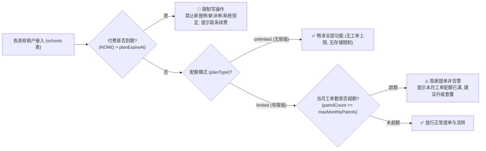

#### 1. 三级付费版本与配额模式定义
- **0 - 免费体验版 (`planLevel = 0`, `planType = 'limited'`)**：
  - 适用于高校免费试用，月工单配额默认 100 单，附件存储容量上限 1GB；
  - 超出配额后，师生端提示“当前学校本月试用配额已满”，但历史工单查看与处理不受影响。
- **1 - 基础专业版 (`planLevel = 1`, `planType = 'limited'`)**：
  - 适用于中小型高校或特定单校区部署，月工单配额 500~2000 单，专属存储 5GB；
  - 支持完整的工单状态机、Saga 撤销、微信通知与数据大屏。
- **2 - 旗舰尊享版 (`planLevel = 2`, `planType = 'unlimited'`)**：
  - 适用于重点大学（如聊城大学标杆版），月工单配额无限（`maxMonthlyPatrols = -1`），存储配额无限（`storageQuotaMb = -1`）；
  - 全量解锁多校区统一指挥中台、类 QQ 专业协同聊天室与多节点集群高并发保障。

#### 2. 服务到期自动拦截与平滑保护策略
- 数据库字段 `planExpireAt DATETIME NOT NULL` 精确记录服务到期时间；
- **到期判定逻辑**：`TenantContext` 在网关层拦截写请求，若 `planExpireAt < NOW()`，系统自动将学校状态置为临界警示态，只允许管理员登录续费或导出历史数据，禁止新提工单；
- **大屏实时感知**：视图 `v_tenant_overview` 实时输出 `expireStatus`（服务中/已过期），平台超管可一键为指定大学顺延服务期。

---

### 2.4 权限体系深度革新：从单校扁平角色到四级立体多租户权限矩阵

为了适应多高校规模化部署与复杂的校内层级分工，v4.0 将原有扁平的单校身份彻底重构为**四级立体权限矩阵体系**：

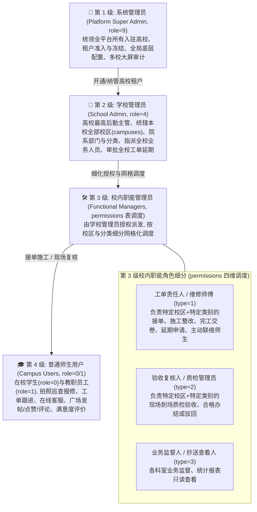

| 权限层级 | 角色代码与标识 | 所属范围 | 核心业务职权范围 |
| :--- | :--- | :--- | :--- |
| **第 1 级：系统管理员** | `role = 9` (Platform Super Admin) | **全平台全局** (`schoolId = 0`) | 开通/暂停/注销高校租户，配置全平台 OSS、微信服务商参数，调整各校付费级别与到期时间，查看跨校横向能效对比大屏。 |
| **第 2 级：学校管理员** | `role = 4` (School Admin) | **本校全域** (`schoolId = 本校`) | 校级后勤最高管理者：划分与增删本校物理校区（`campuses`）、设置报修分类与考核时限、指派本校各类负责人权限、线上审批工单延期申请。 |
| **第 3 级：校内职能角色** | `permissions.type IN (1, 2, 3)` | **特定校区 × 特定分类** | **① 责任处理人 (`type=1`)**：接单、主动发起类QQ聊天沟通、上传施工后照片、提交整改、申请延期；<br/>**② 验收复核人 (`type=2`)**：到场核验施工质量、判定合格办结或驳回重新施工；<br/>**③ 业务监督人 (`type=3`)**：查阅对应领域的运营统计明细。 |
| **第 4 级：普通师生用户** | `role = 0` (学生) / `role = 1` (教职工) | **本校普通师生** | 校园隐患现场拍照定位提报、查看工单流转进度、等待责任人联系后双向协同、校园公开广场发帖互动、完工满意度星级打分。 |

---

### 2.5 数据库工程设计哲学：物理零外键 (Zero Foreign Keys) + 数据库原生约束 (DB-Level Constraints)

在底层持久化设计上，系统恪守互联网高可用与旧版成熟架构的优良传统：

> [!IMPORTANT]
> **设计准则一：坚决不建物理外键 (No Physical Foreign Keys)，最多仅保留主键 (PRIMARY KEY)**  
> 1. **消除物理外键性能损耗**：严禁在 MySQL 8.x 中使用 `FOREIGN KEY ... REFERENCES` 约束。在高并发多校报修与并发状态流转时，物理外键会产生严重的表级/行级级联锁锁定、降低插入更新吞吐，甚至引发不可预测的死锁。  
> 2. **轻量自由与逻辑解耦**：所有数据表最多仅保留自增主键 `PRIMARY KEY (id)`，表与表之间完全通过逻辑字段（如 `schoolId`, `campusId`, `patrolId`, `userId`）进行关联，与旧版架构哲学完全一脉相承。
>
> **设计准则二：数据的完整性与合法性主要通过数据库级原生约束 (DB-Level Constraints) 深度实现**  
> 不用物理外键绝不意味着放任脏数据！系统充分利用 MySQL 8.x 的原生约束能力，在数据库层面建立严密的数据防线：  
> - **非空与默认值强约束 (`NOT NULL` + 精准 `DEFAULT`)**：所有核心业务字段一律声明 `NOT NULL`，杜绝 `NULL` 带来的三值逻辑运算与索引失效陷阱；  
> - **防重防并发联合唯一约束 (`UNIQUE KEY`)**：  
>   - 用户唯一性：`UNIQUE KEY (schoolId, openId)` 保证各高校内微信账号严格唯一；  
>   - 点赞防重刷：`UNIQUE KEY (schoolId, postId, userId)` 保证师生不能重复点赞；  
>   - 评价防重复：`UNIQUE KEY (schoolId, patrolId)` 保证一单仅能由提报人打分一次；  
>   - 配置防冲突：`UNIQUE KEY (schoolId, key)` 保证各校配置项互不覆盖；  
> - **MySQL 8.x 原生检查约束 (`CHECK Constraints`)**：利用数据库原生 `CHECK` 语法严格限定数据范围：  
>   - 状态机范围：`CHECK (status BETWEEN 0 AND 5)` 杜绝非法工单状态写入；  
>   - 角色枚举：`CHECK (role IN (0, 1, 2, 3, 4, 9))` 严格限制用户角色取值；  
>   - 评价打分：`CHECK (score BETWEEN 1 AND 5)` 确保打分只能是 1 到 5 星；  
>   - 权限类型：`CHECK (type IN (1, 2, 3))` 确保派单类型绝对合法；  
>   - 聊天类型：`CHECK (type IN (0, 1, 2, 3))` 卡死消息类型（文本/图片/卡片/系统）。

---

### 2.6 全系统 27 张物理表多租户数据字典与复合索引重构规范

> [!TIP]
> **全量生产级多租户 DDL 脚本已正式落成 (100% 物理零外键 + 原生 CHECK 约束)**：  
> 完整 27 张物理表、7 大全景视图、多租户复合索引及初始化种子数据定义，请直接查阅：  
> - 📄 [高校后勤巡查e速办v4.0多租户数据库结构设计.sql](file:///e:/Projects/University/后勤巡查e速办%20大二下学期%20大学身份上线项目/v4.0/Docs/数据库/高校后勤巡查e速办v4.0多租户数据库结构设计.sql)  
> - 📖 [数据库架构演进与多租户设计说明文档 (README.md)](file:///e:/Projects/University/后勤巡查e速办%20大二下学期%20大学身份上线项目/v4.0/Docs/数据库/README.md)

系统在原有旧版单校结构的基础上全面革新，正式引入核心租户主表 `schools`，**全量 27 张物理表物理零外键，全量嵌入 `schoolId INT NOT NULL`**，并在底层建立 `(schoolId, ...)` 复合索引：

```mermaid
erDiagram
    schools ||--o{ campuses : "包含 (逻辑关联 1:N)"
    schools ||--o{ categories : "定义隐患分类 (逻辑关联 1:N)"
    schools ||--o{ departments : "建立树状部门架构 (逻辑关联 1:N)"
    departments ||--o{ departments : "父子部门向下继承辐射"
    schools ||--o{ school_settings : "独立配置与AI大模型参数 (逻辑关联 1:N)"
    schools ||--o{ patrol_qrcode_points : "线下巡查二维码 (逻辑关联 1:N)"
    schools ||--o{ users : "注册师生与各级管理员 (逻辑关联 1:N)"
    schools ||--o{ tags : "设立职能岗位标签 (逻辑关联 1:N)"
    tags ||--o{ tag_members : "成员动态绑定标签 (权限随岗不随人)"
    users ||--o{ tag_members : "成员获得岗位标签"
    schools ||--o{ patrols : "产生巡查工单 (逻辑关联 1:N)"
    schools ||--o{ chat_rooms : "多场景即时通讯会话室 (工单/单聊/群聊)"
    chat_rooms ||--o{ chat_messages : "会话消息流 (支持撤回与引用)"
    chat_rooms ||--o{ chat_group_members : "群聊成员关系档案"
    schools ||--o{ feedbacks : "师生评价意见 (逻辑关联 1:1)"
    schools ||--o{ messages : "站内通知与离线穿透记录 (逻辑关联 1:N)"
    schools ||--o{ posts : "校园公开广场 (逻辑关联 1:N)"
    schools ||--o{ ai_agent_sessions : "AI助手会话 (逻辑关联 1:N)"
    schools ||--o{ apps : "工作台微应用注册中枢 (逻辑关联 1:N)"
    schools ||--o{ schedules : "全景日历日程与SLA排班 (逻辑关联 1:N)"
    users ||--o{ schedules : "指派/跟进日程 (逻辑关联 1:N)"
    
    patrols ||--o{ patrols_handle : "施工完工 (逻辑关联 1:N)"
    patrols ||--o{ patrols_review : "验收复核 (逻辑关联 1:N)"
    patrols ||--o{ feedbacks : "服务评价 (逻辑关联 1:1)"
    patrols ||--o{ patrol_delay_records : "延期申请记录 (逻辑关联 1:N)"
    posts ||--o{ post_comments : "广场评论 (逻辑关联 1:N)"
    posts ||--o{ post_likes : "点赞记录 (逻辑关联 1:N)"
    ai_agent_sessions ||--o{ ai_agent_messages : "对话与工具调用 (逻辑关联 1:N)"
```

#### 27 张数据表多租户字段定义与约束索引矩阵

| 序号 | 表名 (`Table Name`) | 核心主键与逻辑字段 | 数据库级原生约束 (`DB Constraints`) | 复合索引设计 (`Composite Indexes`) | 业务职责与多租户特性 |
| :---: | :--- | :--- | :--- | :--- | :--- |
| 1 | `schools` **[核心主表]** | `id (PK)`, `code`, `name`, `planLevel`, `planType`, `maxMonthlyPatrols`, `planExpireAt` | `CHECK (status IN (-1, 0, 1))`, `CHECK (planLevel IN (0, 1, 2))` | `UNIQUE KEY (code)`, `INDEX (planExpireAt, status)` | **多租户高校核心主表**：系统管理员开通，记录付费版本、配额上限与到期时间。 |
| 2 | `campuses` | `id (PK)`, `schoolId`, `name` | `CHECK (isDeleted IN (0, 1))` | `INDEX (schoolId, isDeleted)` | 各大学下辖物理校区字典，严格归属对应 `schoolId`。 |
| 3 | `departments` | `id (PK)`, `schoolId`, `parentId`, `path`, `name`, `leaderId` | `CHECK (isDeleted IN (0, 1))` | `INDEX (schoolId, parentId, isDeleted)`, `INDEX (schoolId, path)` | **树状职能部门表 (类飞书组织树)**：支持无限级树拓扑、路径检索与权限向下继承。 |
| 4 | `categories` | `id (PK)`, `schoolId`, `name` | `CHECK (defaultDays > 0)` | `INDEX (schoolId, isDeleted)` | 各大学个性化故障报修门类（水电、暖通、土建、消防等）。 |
| 5 | `users` | `id (PK)`, `schoolId`, `openId`, `role` | `CHECK (role IN (0, 1, 2, 3, 4, 9))` | `UNIQUE KEY (schoolId, openId)`, `INDEX (schoolId, role)` | 师生与各级管理员主表，支持系统管理员(9)与学校管理员(4)。 |
| 6 | `permissions` | `id (PK)`, `schoolId`, `userId`, `tagId` | `CHECK (type IN (1, 2, 3))` | `INDEX (schoolId, userId)`, `INDEX (schoolId, tagId)`, `INDEX (schoolId, campusId, categoryId, type)` | **四维派单调度表**：支持按人员或按**职能标签 (tagId)** 调度，实现权限随岗不随人。 |
| 7 | `patrols` | `id (PK)`, `schoolId`, `campusId` | `CHECK (status BETWEEN 0 AND 5)`, `CHECK (priorityLevel IN (0, 1, 2))` | `INDEX (schoolId, status, createdAt)`, `INDEX (schoolId, campusId, categoryId)` | **巡查工单主表**：记录所有报修，数据按学校绝对隔离，JSON 存现场图。 |
| 8 | `patrols_handle` | `id (PK)`, `schoolId`, `patrolId` | `NOT NULL`, `DEFAULT 0.00` | `INDEX (schoolId, patrolId)` | 责任人施工整改完工凭证表（带所属学校标识）。 |
| 9 | `patrols_review` | `id (PK)`, `schoolId`, `patrolId` | `CHECK (isPassed IN (0, 1))` | `INDEX (schoolId, patrolId)` | 复核审核记录表：记录核验合格或驳回重修。 |
| 10 | `feedbacks` | `id (PK)`, `schoolId`, `patrolId` | `CHECK (score BETWEEN 1 AND 5)`, `CHECK (isAutoPassed IN (0, 1))` | `UNIQUE KEY (schoolId, patrolId)` | 师生满意度星级打分表，一单仅能打分一次。 |
| 11 | `patrol_delay_records` | `id (PK)`, `schoolId`, `patrolId` | `CHECK (status IN (0, 1, 2))`, `CHECK (delayHours > 0)` | `INDEX (schoolId, patrolId)` | 告别旧版硬编码 delay1~3，支持多次申请与校管线上审批。 |
| 12 | `chat_rooms` | `id (PK)`, `schoolId`, `roomType`, `patrolId`, `initiatedByHandler`, `isPinned` | `CHECK (roomType IN ('patrol', 'direct', 'group'))`, `CHECK (isClosed IN (0, 1))` | `UNIQUE KEY (schoolId, patrolId)`, `INDEX (schoolId, roomType, isClosed)` | **企业级多场景 IM 会话室表**：工单协同房(主动激活)、点对点单聊、科室/抢险群聊。 |
| 13 | `chat_messages` | `id (PK)`, `schoolId`, `chatRoomId`, `answerMessageId`, `isWithDraw`, `type` | `CHECK (type IN (0, 1, 2, 3))`, `CHECK (isWithDraw IN (0, 1))` | `INDEX (schoolId, chatRoomId, id)` | **多场景聊天流水表**：支持文本/图片、2分钟撤回与引用回复。 |
| 14 | `messages` | `id (PK)`, `schoolId`, `receiverId`, `appId`, `title`, `content`, `cardPayloadJson`, `linkUrl`, `priority`, `externalPushStatus` | `CHECK (isRead IN (0, 1))`, `CHECK (priority IN ('normal', 'urgent'))`, `CHECK (externalPushStatus IN ('none', 'pending', 'sent_wx', 'sent_sms', 'failed'))` | `INDEX (schoolId, receiverId, isRead)`, `INDEX (schoolId, appId, createdAt)` | **统一消息中枢流表**：聚合各微应用待办通知与**富交互结构化卡片载荷 (`cardPayloadJson`)**，支撑专属头像名称服务会话与全卡片流原地演变。 |
| 15 | `posts` | `id (PK)`, `schoolId`, `creatorId` | `CHECK (status IN (-1, 0, 1))`, `CHECK (isTop IN (0, 1))` | `INDEX (schoolId, status, isDeleted, isTop, createdAt)` | 校园公开广场动态瀑布流，双轨合一未登录公开展示。 |
| 16 | `post_comments` | `id (PK)`, `schoolId`, `postId`, `userId`, `guestNick` | `CHECK (isDeleted IN (0, 1))` | `INDEX (schoolId, postId, isDeleted, createdAt)` | 广场动态师生留言与楼中楼评论，支持访客公开评论。 |
| 17 | `post_likes` | `id (PK)`, `schoolId`, `postId` | `NOT NULL` | `UNIQUE KEY (schoolId, postId, userId)` | 广场动态点赞记录，唯一键防重复点赞。 |
| 18 | `school_settings` | `id (PK)`, `schoolId`, `key` | `CHECK (isEncrypted IN (0, 1))` | `UNIQUE KEY (schoolId, key)` | **各大学专属系统配置与 OpenAI 大模型参数表** (API Key, URL, Model, Prompt等)。 |
| 19 | `operation_logs` | `id (PK)`, `schoolId`, `userId` | `NOT NULL` | `INDEX (schoolId, module, createdAt)` | 关键操作审计与追踪日志表。 |
| 20 | `patrol_qrcode_points` | `id (PK)`, `schoolId`, `campusId`| `CHECK (isDeleted IN (0, 1))` | `UNIQUE KEY (schoolId, code)` | 线下固定资产二维码点位打卡定位表。 |
| 21 | `ai_agent_sessions` | `id (PK)`, `schoolId`, `userId` | `CHECK (isDeleted IN (0, 1))` | `INDEX (schoolId, userId, isDeleted, updatedAt)` | **高校专属 AI 智能助手多轮问答会话表**。 |
| 22 | `ai_agent_messages` | `id (PK)`, `schoolId`, `sessionId` | `CHECK (role IN ('user', 'assistant', 'tool', 'system'))` | `INDEX (schoolId, sessionId, id)` | **AI 对话消息流水与 Tool-Calling 工具调用审计表** (记录查询工具名与参数)。 |
| 23 | `tags` **[全新表]** | `id (PK)`, `schoolId`, `name`, `color`, `desc` | `CHECK (isDeleted IN (0, 1))` | `UNIQUE KEY (schoolId, name)` | **组织职能岗位标签表 (权限随岗不随人)**：定义岗位元数据与 Metro UI 色彩。 |
| 24 | `tag_members` **[全新表]** | `id (PK)`, `schoolId`, `tagId`, `userId` | `NOT NULL` | `UNIQUE KEY (schoolId, tagId, userId)`, `INDEX (schoolId, userId)` | **标签成员映射表**：人员轮岗只需在此表转移标签，业务工单无缝平移。 |
| 25 | `chat_group_members` **[全新表]** | `id (PK)`, `schoolId`, `chatRoomId`, `userId`, `role` | `CHECK (role IN (0, 1, 2))` | `UNIQUE KEY (schoolId, chatRoomId, userId)`, `INDEX (schoolId, userId)` | **群聊成员关系表 (类飞书群聊)**：维护科室工作群与突发抢险群成员身份。 |
| 26 | `apps` **[全新表]** | `id (PK)`, `schoolId`, `appCode`, `name`, `category`, `entryRoute`, `minRole` | `CHECK (category IN ('daily', 'service', 'emergency', 'management'))`, `CHECK (minRole IN (0, 1, 2, 3, 4, 9))` | `UNIQUE KEY (schoolId, appCode)`, `INDEX (schoolId, isEnabled, isDeleted, sortOrder)` | **飞书式工作台微应用元数据注册表**：子应用解耦注册、权限门禁与动态角标。 |
| 27 | `schedules` **[全新表]** | `id (PK)`, `schoolId`, `userId`, `title`, `type`, `startTime`, `endTime`, `priority`, `status` | `CHECK (type IN ('custom', 'sla_deadline', 'duty', 'maintenance'))`, `CHECK (status IN (0, 1, 2))` | `INDEX (schoolId, userId, startTime, endTime)`, `INDEX (schoolId, relatedAppCode, relatedEntityId)` | **全景日历日程与排班事件表**：工单 SLA 倒计时、值班表一键呼叫与设备维保。 |

---

### 2.7 全系统 7 大全景业务聚合视图设计 (View 定义与业务场景详析)

为了保证微信小程序端在海量并发访问时能够毫秒级拉取复杂报表和大盘，新版数据库在底层预先物化了 **7 大全景聚合业务视图**。应用层与 AI Agent 直接查询视图，彻底消除了客户端频繁发起的 5~6 张物理表跨表 JOIN 开销：

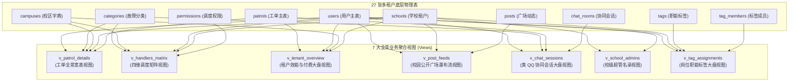

#### 7 大全景视图结构与业务职责详析

| 序号 | 视图名称 (`View Name`) | 核心联结物理表 | 关键聚合指标 / 暴露字段 | 核心应用场景与性能收益 |
| :---: | :--- | :--- | :--- | :--- |
| **1** | **`v_patrol_details`**<br/>(工单全景宽表) | `patrols`, `schools`, `campuses`, `categories`, `users (creator)`, `users (handler)` | `patrolId`, `schoolName`, `campusName`, `categoryName`, `creatorRealName`, `creatorPhone`, `handlerRealName`, `handlerPhone`, `status`, `deadline`, `location1`, `location2` | **小程序工单详情页秒开**：直接单表 SELECT 获取全部内联名称与联系方式，完全避免多次网络往返与前端拼装。 |
| **2** | **`v_handlers_matrix`**<br/>(四维调度矩阵) | `permissions`, `schools`, `users`, `campuses`, `categories` | `permissionId`, `schoolName`, `userName`, `userPhone`, `campusName`, `categoryName`, `type`, `roleDesc` (责任人/验收人/监督人) | **智能派单引擎与权限大盘**：工单创建时毫秒级匹配负责该校区、该门类的责任师傅，驱动派单自动广播。 |
| **3** | **`v_tenant_overview`**<br/>(租户大屏与SaaS看板) | `schools`, `campuses`, `users`, `patrols` | `schoolCode`, `planLevel`, `planType`, `maxMonthlyPatrols`, `planExpireAt`, `expireStatus`, `totalPatrols`, `resolvedPatrols`, `pendingPatrols`, `completionRatePercent` | **高校后勤能效指挥大屏**：实时统计全校完工率、累计工单量与 SaaS 付费有效期状态，供校管决策。 |
| **4** | **`v_post_feeds`**<br/>(广场公开信息流) | `posts`, `schools`, `users` | `postId`, `schoolName`, `creatorNickName`, `avatarUrl`, `patrolId`, `title`, `content`, `imagesJson`, `likeCount`, `commentCount`, `viewCount`, `isTop` | **未登录公开广场首屏渲染**：按 `schoolCode` 极速加载公开整改风采，图文并茂，零登录鉴权门槛。 |
| **5** | **`v_chat_sessions`**<br/>(类 QQ 会话大盘) | `chat_rooms`, `patrols`, `categories`, `users (creator)`, `users (handler)` | `chatRoomId`, `orderNo`, `patrolTitle`, `categoryName`, `creatorNickName`, `creatorAvatarUrl`, `handlerRealName`, `isPinned`, `handlerUnreadCount`, `lastMessage`, `lastMessageAt` | **后勤师傅移动工作台会话列表**：聚合工单状态与即时消息未读数，支持置顶排序，高仿 QQ 会话体验。 |
| **6** | **`v_school_admins`**<br/>(校级超管名录) | `users`, `schools` | `userId`, `schoolName`, `schoolCode`, `adminName`, `adminPhone`, `jobNo`, `email`, `userStatus`, `lastLoginAt` | **平台运维总控台**：系统超级管理员快速排查指定高校的对接负责人与近期登录活跃度。 |
| **7** | **`v_tag_assignments`**<br/>(岗位标签全景大盘) | `tag_members`, `tags`, `schools`, `users` | `assignmentId`, `tagName`, `tagColor`, `tagDesc`, `userName`, `userPhone`, `jobNo`, `userStatus`, `assignedAt` | **“权限随岗不随人”可视化调度工作台**：清晰呈现全校职能标签、代表色标及当前在岗值班师傅名册。 |

---

### 2.8 颠覆性工单协同通信：后勤人员专属类 QQ 现代化即时聊天系统 (汲取 city_system 架构精髓)

参考 `e:\Projects\Personal\city_system` 中成熟强大的即时通讯机制，新版在微信小程序端为后勤账号打造了高度拟真、性能强劲的**类 QQ / 微信企业级协同沟通中台**：

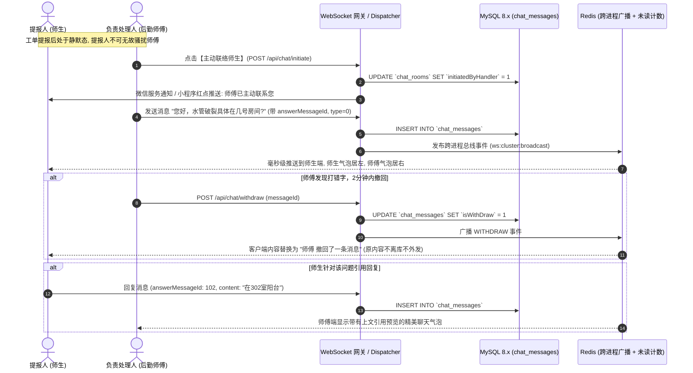

#### 核心功能与交互规范清单：
1. **责任人主动发起机制 (`initiatedByHandler`)**：
   - 维持严谨的工单流程边界：师生提单后，聊天通道处于“等待接单中”状态，师生端不能主动发起无休止的聊天轰炸；
   - **由承接该工单的责任人（或学校管理员）主动点击“联系提报人”**后，聊天室正式激活。师傅可在出发前主动核实故障具体点位、备品备件规格，极大提升入场维修成功率。
2. **类 QQ 专业消息中台交互**：
   - **会话列表页**：直观展示提报人头像、工单编号（如 `[#LCU-001 水电暖]`）、工单当前状态角标、最新聊天摘要、最后活跃时间与未读红点；支持后勤师傅置顶紧急报修会话 (`isPinned = 1`)；
   - **双向独立气泡渲染**：自己发送的消息居右科技蓝卡片展示，对方消息居左白色卡片展示，工单流转节点（派单、整改完成、验收通过）居中灰色药丸卡片展示；
3. **消息撤回机制 (`isWithDraw`)**：
   - 发送后 2 分钟以内允许撤回；撤回后数据库保留记录标记 `isWithDraw = 1`，接口输出时屏蔽文本内容，客户端呈现“对方撤回了一条消息”；
4. **消息引用与精准答复 (`answerMessageId`)**：
   - 支持长按某条消息点击“引用”，在输入框上方展开引用摘要；若被引用的原消息被撤回，引用框自动提示“引用的消息已被撤回”；
5. **实时盯着聊天界面时的已读瞬间消除**：
   - 用户只要打开并停留在该聊天窗口，WebSocket 自动向后端发送阅读确认，服务端毫秒级将对应未读数清零并同步更新 Redis，杜绝虚假红点残留；
6. **触顶向上滚动无缝加载更早历史 (防跳动滚动锚定)**：
   - 首次进入自动滑到底部最新消息；上滑触顶时通过 WebSocket 分页拉取更早的 20 条消息，拉取后精准保持当前视口位置不动，杜绝闪烁和滚顶问题。

---

### 2.9 双轨合一公开透明机制：未登录访客公开浏览与评论

为打破体制内传统后勤封闭刻板的形象，系统创新性地确立了**双轨合一机制**：
1. **公开轨（未登录透明监督）**：
   - 任何访客打开小程序，无需繁琐登录绑定学号，即可直达**校园公开广场**；
   - 公开浏览全校后勤人员公示的故障前后对比图、整改时效风采与日常巡查播报；
   - **支持访客快捷评论**：访客只需一键微信授权临时昵称与头像即可对公开动态发表热心评论与点赞互动（数据存入 `post_comments.guestNick`），形成全校共建共治的阳光后勤风貌；
   - **严格安全边界**：未登录用户绝对无法查看任何工单内部协同聊天室、无法查看后勤人员电话隐私，杜绝越权隐患。
2. **管控轨（登录后内部业务闭环）**：
   - 师生一键通过学号/工号或微信绑定进入内部轨道，享有精准工单提报、进度追踪、客服对话与评价特权；
   - 后勤人员登录后直接解锁移动工作台与类 QQ 协同聊天中台，全权承办工单。

---

### 2.10 底层 AST 语法树自动租户拦截与 Redis 多租户命名空间隔离

为了从根本上避免开发人员在编写业务逻辑时因疏漏 `WHERE schoolId = ?` 导致跨校数据污染，新版后端将在框架底层实施**全自动租户透明拦截**：

#### 1. AST 编译器全局自动追加租户条件 (`TenantASTInterceptor`)
与内置软删除 `isDeleted = 0` 的机制完全一致，AST 编译引擎在解析所有 SELECT、UPDATE、DELETE 语法树时：
```typescript
// 伪代码演示：底层 AST 自动装配租户过滤
if (context.currentSchoolId) {
    whereNode.and({
        column: 'schoolId',
        operator: '=',
        value: context.currentSchoolId
    });
}
```
凡是登录态或带有租户上下文的请求，底层生成的最终 SQL 会自动追加：
`WHERE ... AND schoolId = ? AND isDeleted = 0`，开发者无需手工重复拼装，从底层彻底根除跨租户越权漏洞。

#### 2. Redis 缓存的多租户分片命名空间
所有 Redis 缓存键强制添加学校前缀，杜绝键名冲突：
- 全局字典：`tenant:{schoolId}:settings:{key}`
- 工单缓存：`tenant:{schoolId}:patrol:{patrolId}`
- 派单权限：`tenant:{schoolId}:permissions:{userId}`
- 师傅待办：`tenant:{schoolId}:tasks:master:{userId}`

---

### 2.11 小程序端多校动态识别、扫码解析与学校自由切换体验

在微信小程序前端，多租户带来全新的交互模式：

1. **线下扫码跨校自适应 (Smart QR Routing)**：
   师生在不同大学校园内扫描线下二维码时，二维码不仅包含点位信息，首部带有学校特征编码（例如 `https://qp.edu.cn/s/lcu/qr/1024`）。小程序识别后自动切换为“聊城大学”上下文，动态拉取该校专属校徽、校区与分类；
2. **多校切换中心 (`SchoolSelector`)**：
   在个人中心或首次进入小程序时，师生可自由选择或搜索所在大学。选定后，前端将 `schoolId` 与 `schoolName` 缓存至持久化 Storage，后续所有 API 请求在 Header 中自动携带 `X-School-Id: 1`；
3. **高校专属视觉定制 (White-label Theming)**：
   后端在返回学校信息时携带 `primaryColor` 与 `logoUrl`，小程序核心组件动态适配该高校的专属代表色，给师生极强的校园归属感。

---

### 2.12 多租户自适应 OpenAI 大模型接入与专属高校后勤 AI Agent（智能后勤助手）体系

为了让高校后勤管理具备前沿的具身智能化交互能力，新版系统在多租户底层深度集成了**自适应大语言模型（LLM）驱动的 AI Agent 架构**：

```mermaid
flowchart TD
    subgraph AdminConfig["学校管理员 (School Admin) 专属配置中心"]
        SettingTable["学校配置表: school_settings"]
        SettingTable --> K1["ai_api_key (API 密钥, AES-256密文保护)"]
        SettingTable --> K2["ai_base_url (模型接口端点, 如官方或高校内网)"]
        SettingTable --> K3["ai_model (模型标识, 如 gpt-4o / deepseek-chat)"]
        SettingTable --> K4["ai_system_prompt (校本化定制系统人设 Prompt)"]
    end

    subgraph UserInterface["微信小程序 - 登录用户专属 AI 工作台"]
        UserUI["pages/ai-copilot/index<br/>沉浸式流式对话界面 (SSE 打字机动画)"]
        PromptChips["快捷提问气泡: '东校区这周有哪些漏水报修?' / '我的工单目前进展'"]
    end

    subgraph AgentCore["Backend - AI Agent 推理与执行引擎 (ReAct 范式)"]
        DynamicClient["OpenAI 动态客户端工厂<br/>(按当前用户的 schoolId 动态加载该校 API Key/Url/Model)"]
        FunctionCallEngine["Tool / Function Calling 智能派发引擎"]
        SafetyGuard["🛡️ 多租户安全沙箱 (强行注入 context.schoolId 隔离条件)"]
    end

    subgraph SchoolDataTools["AI Agent 7 大专业后勤数据工具箱 (Tools)"]
        T1["📊 query_patrol_stats: 查询学校宏观报修工单大盘统计"]
        T2["🔍 query_patrol_list: 按校区/分类/关键词检索工单明细与进度"]
        T3["📋 query_patrol_detail: 查看具体工单流转节点与整改照片详情"]
        T4["👤 query_my_patrols: 查询当前登录用户本人的提单或待办进展"]
        T5["🏢 query_campus_and_departments: 查询各校区科室架构与值班电话"]
        T6["📰 query_post_feeds: 检索校园公开广场热点关注与师生动态"]
        T7["📜 query_service_regulations: 查询本校后勤服务承诺与办结时限考核标准"]
    end

    AdminConfig --> DynamicClient
    UserUI -->|发送自然语言提问| AgentCore
    AgentCore --> DynamicClient
    DynamicClient --> FunctionCallEngine
    FunctionCallEngine --> SafetyGuard
    SafetyGuard --> SchoolDataTools
    SchoolDataTools -->|返回结构化事实数据快照| FunctionCallEngine
    FunctionCallEngine -->|流式整合事实生成回答 (附带工单卡片)| UserUI
```

#### 1. 各高校独立设置 OpenAI API 凭证与学校配置表 (`school_settings`)
- **异构大模型完全兼容**：各大高校采购的技术栈不同，聊城大学可能对接公有云商用大模型，而清华、北大可能接入校园算力集群私有化部署的开源大模型。系统通过 `school_settings` 支持各高校管理员自主填报：
  - `ai_api_key`：模型密钥，在数据库中采用 AES-256-GCM 算法加密存储，仅在内存运行时解密；
  - `ai_base_url`：请求基地址，兼容标准 OpenAI 协议（如 `https://api.openai.com/v1` 或 `http://llm.school.edu.cn/v1`）；
  - `ai_model`：模型名称，支持自由填报任意兼容模型（如 `gpt-4o`、`gpt-4o-mini`、`deepseek-chat`、`qwen-max`）；
  - `ai_temperature`：默认 0.3，降低幻觉率，确保后勤数据事实回答的严谨性；
  - `ai_system_prompt`：校本化人设 Prompt，融入该高校校训、后勤处办学特色与答复规范。

#### 2. 登录用户专属 AI 工作台界面 (`pages/ai-copilot/index`)
- **权限边界**：仅限登录系统的在校师生、职工及各级管理员可用；未登录访客不可使用，杜绝匿名刷消耗 Token。
- **震撼视觉交互 (Glassmorphism & Micro-animations)**：
  - **流式打字机动画**：基于 HTTP SSE (Server-Sent Events) 实现逐字实时吐词与呼吸光标效果；
  - **工具调用过程透明化**：当模型决定调用工具检索数据时，界面实时展现优雅的动态药丸状态标签（如“🔍 正在检索聊城大学西校区水电保修记录...”，“✅ 检索完成，找到 3 条匹配工单”）；
  - **智能工单卡片直达**：AI 回答中若提及具体工单（如 `#LCU-202609-102`），以高亮可交互药丸渲染，师生点击卡片一键平滑跳转至工单详情页。

#### 3. 安全受控的 7 大后勤业务数据工具集源码规范 (TypeScript / Tools Definition)
所有 Agent 工具在后端 `aiToolRegistry.ts` 中强类型落地，执行逻辑强制提取 `context.schoolId`：
```typescript
export interface AiToolContext {
  schoolId: number;
  userId: number;
  role: number;
}

export const aiTools: Record<string, (args: any, ctx: AiToolContext) => Promise<any>> = {
  // 1. 查询宏观工单大盘统计
  query_patrol_stats: async (args, ctx) => {
    return await statisticsService.getOverviewStats(ctx.schoolId, args.campusId, args.timeRange);
  },
  // 2. 检索巡查工单列表
  query_patrol_list: async (args, ctx) => {
    return await patrolService.searchPatrols(ctx.schoolId, {
      campusId: args.campusId,
      categoryId: args.categoryId,
      status: args.status,
      keyword: args.keyword,
      limit: Math.min(args.limit || 5, 10) // 限制条数保护上下文窗口
    });
  },
  // 3. 查看具体工单流转与照片详情
  query_patrol_detail: async (args, ctx) => {
    return await patrolService.getPatrolDetail(ctx.schoolId, args.patrolId);
  },
  // 4. 查询当前用户本人的工单进度 (自动注入当前 userId)
  query_my_patrols: async (args, ctx) => {
    return await patrolService.getMyPatrols(ctx.schoolId, ctx.userId);
  },
  // 5. 查询校区与科室对外联系电话
  query_campus_and_departments: async (args, ctx) => {
    return await schoolService.getCampusAndDepts(ctx.schoolId, args.keyword);
  },
  // 6. 检索校园广场热点关注
  query_post_feeds: async (args, ctx) => {
    return await postService.getPublicFeeds(ctx.schoolId, args.keyword);
  },
  // 7. 查询后勤服务承诺时效标准
  query_service_regulations: async (args, ctx) => {
    return await schoolService.getRegulations(ctx.schoolId, args.categoryName);
  }
};
```

#### 4. SSE (Server-Sent Events) 流式通讯协议帧定义
```
event: status
data: {"stage":"calling_tool","toolName":"query_patrol_list","desc":"正在检索聊大东校区水管报修记录..."}

event: tool_result
data: {"toolName":"query_patrol_list","matchCount":2,"summary":"找到2条处理中的水管报修工单"}

event: token
data: {"delta":"根据后勤实时数据，聊城大学东校区目前有 **2项** 正在紧急抢修的水管漏水工单：\n\n"}

event: card
data: {"type":"patrol_card","orderNo":"LCU-202609-088","title":"东校区实验楼1楼男厕水管破裂","status":1,"handler":"张师傅 (13806351234)"}

event: done
data: {"sessionId":5,"totalTokens":642,"latencyMs":1120}
```

---

### 2.13 递点（类飞书）组织中台、标签权限解耦与高可靠即时通讯中台架构

为将高校复杂的科室层级、人员轮岗调休以及突发应急防汛抢险场景治理提升至国际科技大厂标准，系统深度融合了“递点”类飞书系统的核心精髓，构筑了高内聚、业务零中断的组织与通信底座：

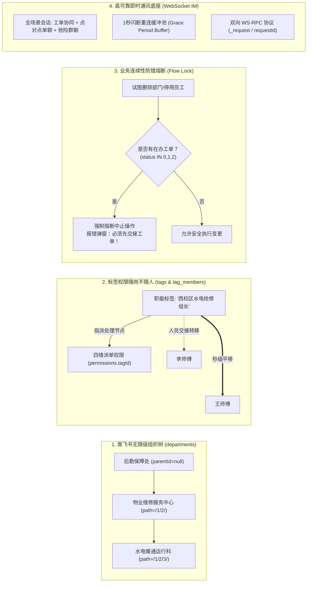

#### 1. 类飞书树状部门架构与路径检索机制 (`departments`)
- **无限级树拓扑**：摒弃原有的一维扁平列表，`departments` 表支持 `parentId` 递归关联与 `path` 编码（如 `/1/2/3/`）。顶级部门（如后勤保障处）的 `parentId` 为 `NULL`，其下可无限级衍生二级中心、三级科室、四级班组；
- **权限向下继承辐射**：父级部门管理员默认对该节点下的所有子部门及其在编员工拥有行政调度权限；
- **双向递归检索**：
  - 向上路径检索（Breadcrumbs）：给定任意班组 ID，毫秒级向上递归返回完整行政链条，如 `后勤处 > 物业中心 > 水电科`；
  - 向下子树检索（Subtree）：支持按指定深度（`depth`）展开部门树状 JSON，用于移动端通讯录折叠展示。

#### 2. 职能岗位标签与“权限随岗不随人”解耦体系 (`tags` & `tag_members`)
- **根治高校人事流动痛点**：传统工单派发将责任人硬编码为具体员工 UID，一旦维修师傅调休、离职或退休，管理员需逐一修改未结工单的责任人，极易遗漏引发严重业务断流；
- **标签解耦方案**：
  - 管理员在后台创建抽象职能标签（`tags`），如【西校区水电抢修组长】、【宿管科质检验收员】、【恶劣天气防汛联络人】，并配备 Windows Metro UI 经典色彩标识；
  - 巡查工单派发规则（`permissions` 表）直接绑定 `tagId`；
  - 当人员发生流动变动时，管理员仅需在 `tag_members` 表中执行一行记录的转移（将标签由李师傅转移给王师傅）；
  - **秒级即时生效**：系统底层工单派单网关、待办任务统计与微信模板消息下发目标瞬间无缝平移至王师傅，**全校数百张正在流转中的工单与历史数据无需做任何批量修改**，彻底消除运维负担。

#### 3. 业务流程锁定防中断熔断机制 (Flow Lock Safety)
- 为杜绝“部门或人员已被删除，但名下报修单还在流转导致死单”的致命工程隐患，系统在底层 AST 与 API 拦截器中全面植入 Flow Lock 安全前置校验：
  - 当管理员在后台点击【删除部门】或【停用员工】时，系统自动拦截并执行高精度探测：
    ```sql
    SELECT COUNT(1) FROM patrols 
    WHERE schoolId = :schoolId 
      AND (currentHandlerId = :userId OR currentReviewerId = :userId)
      AND status IN (0, 1, 2);
    ```
  - **熔断判定**：若该部门或成员名下存在未办结工单（状态 0待处理、1处理中、2待复核），系统立即**熔断该删除/停用事务**，强力阻断操作，并明确报错提示：**“【XXX 部门/人员】名下仍有正在负责的工单，请先在标签中心完成交接方可执行！”**

#### 4. 全场景企业级即时通讯体系 (工单协同 + 单聊 + 抢险群聊)
系统突破原有单一 1v1 工单房的局限，将 `chat_rooms` 升级为全场景企业级协同中枢：
- **场景 A：工单协同房 (`roomType = 'patrol'`)**：
  - 维持核心的**责任人主动握手激活机制 (`initiatedByHandler`)**，师生提单后房间静默，必须由维修师傅主动点击【联络师生】开启，防止无序骚扰；
  - 深度集成 2 分钟撤回 (`isWithDraw`)、引用回复 (`answerMessageId`) 与工单进度动态卡片；
- **场景 B：点对点单聊 (`roomType = 'direct'`)**：
  - 师生可与片区宿管老师、后勤值班人员发起点对点直连即时咨询；
- **场景 C：科室工作与应急突击群聊 (`roomType = 'group'`)**：
  - 引入 `chat_group_members` 表，支持创建“后勤保障工作群”、“西校区防汛抢险应急指挥群”等多人群聊，支持群主委派、消息已读游标与全员重要通知置顶。

#### 5. 高可靠底层通讯协议：1秒网络闪断重连缓冲队列与双向 WS-RPC
- **1 秒网络闪断重连缓冲队列 (Grace Period Buffer)**：
  - 针对校园地下强电井、地下泵房、电梯弱网以及微信切后台、熄屏导致的 1~2 秒短暂闪断，服务端在客户端断开时**绝不立即判定离线并销毁连接，而是将其置为等待重连状态并保留 1 秒宽限期**；
  - 宽限期内，服务端为该客户端开辟内存待发队列，发给他的消息全部压入队列缓存；
  - 客户端 1 秒内重连成功后，服务端自动复用原上下文，并**瞬间冲刷队列全量补发**，彻底攻克弱网丢消息难题；
- **基于 WebSocket 的双向 RPC 请求协议 (`_request` / `requestId`)**：
  - 在单向 WS 通信之上封装带 `requestId` 的双向调用协议，支持类似 HTTP 的同步等待调用；
  - 配备客户端 3 秒超时熔断与服务端处理器 2 秒执行超时保护，确保高并发加急派单与抢单状态确认的原子级强一致性。

#### 6. 多维靶向触达通知矩阵
- 消息通知中心升级为四维立体路由引擎，支持统一通过系统站内信、微信订阅服务通知、手机短信下发：
  $$\text{Target} \in \{\text{整个学校 (school)}, \text{指定部门树 (department)}, \text{职能标签全体人员 (tag)}, \text{单个师生员工 (user)}\}$$
- 例如遇突发暴雨，后勤处长在后台选择【防汛应急直通车】标签，一键将加急抢险指令全渠道并发触达所有应急小组成员。

---

### 2.14 核心设计构想与顶层设计哲学 16 条全景对照矩阵 (永久归档溯源)

系统将立项交流以来所有深层次设计决策、商业思考与技术取舍，凝练为以下 **16 项顶层产品哲学对照矩阵**，作为系统架构的最高指导纲领：

| 序号 | 核心设计构想 / 业务诉求 | 传统体制内系统弊端 | v4.0 颠覆性创新与架构决策 | 对应底层物理表 / 核心代码模块 |
| :---: | :--- | :--- | :--- | :--- |
| **1** | **面向全国高校多租户规模化部署** | 单校硬编码，跨校部署需反复复制代码和建库，维护成本爆炸 | 全系统 27 张物理表强制嵌入 `schoolId INT NOT NULL`，建立学校-校区两级拓扑，底层 AST 树自动注入租户条件 | `schools` 表及全库 27 张物理表、`TenantASTInterceptor` |
| **2** | **100% 物理零外键与原生强约束** | 物理外键引发跨表级联锁，高并发报修易死锁拖垮数据库 | 坚决不使用任何 `FOREIGN KEY`，全表仅保留主键；利用 MySQL 8.x 原生 `NOT NULL`、`UNIQUE KEY` 与 `CHECK` 规则卡死非法数据 | 全库 27 张物理表（含 `CHECK (status BETWEEN 0 AND 5)` 等规则） |
| **3** | **商业化 SaaS 闭环与到期拦截** | 缺乏计费与到期控制，无法支持对外商业输出与租赁 | `schools` 表内置付费级别（0免费/1专业/2旗舰）、配额模式（limited/unlimited）、月工单上限与到期时间，中间件到期阻断写请求 | `schools` 表、`TenantPlanInterceptor`、Redis 月度配额原子计数器 |
| **4** | **四级立体权限矩阵与网格调度** | 角色扁平混乱，缺乏高校校级最高管理者维度 | 系统超级管理员 (`role=9`) ➔ 学校管理员 (`role=4`) ➔ 校内网格调度角色 (`permissions.type=1/2/3`) ➔ 普通师生 (`role=0/1`) | `users.role`、`permissions` 表、`v_handlers_matrix` 视图 |
| **5** | **后勤专属类 QQ 即时协同通讯中台** | 缺乏沟通渠道或师生无序拨打电话骚扰一线工人 | 汲取 `city_system` 精髓：责任人主动握手激活 (`initiatedByHandler`)、2分钟撤回 (`isWithDraw`)、引用回复 (`answerMessageId`)、盯盘已读消除 | `chat_rooms`、`chat_messages`、`v_chat_sessions` 视图 |
| **6** | **双轨合一校园公开广场与访客互动** | 信息黑盒，报修后师生失联；访客无法查看整改成果 | 开放校园公开广场，支持未登录访客公开浏览整改对比卡片与发表公开评论 (`guestNick`/`guestAvatar`)，配备 IP 令牌桶防刷风控 | `posts`、`post_comments`、`post_likes`、`v_post_feeds` 视图 |
| **7** | **各校自主配置 OpenAI 大模型与独立设置表** | 各校技术栈不一，无法统一写死模型密钥与接口地址 | 新建 `school_settings` 表，Key 字段采用 AES-256-GCM 密文存储，支持各校自主录入 APIKey/BaseUrl/Model/Prompt 并提供连通性测试 | `school_settings` 表、`OpenAiClientFactory` |
| **8** | **专属 AI Copilot 与 7 大受控业务工具** | 传统客服为生硬关键词匹配，无法解答校本化实时数据 | 小程序专属沉浸式 AI 工作台，SSE 流式逐字吐词，装备 7 大带 `context.schoolId` 安全沙箱的后勤事实数据检索工具（工单统计/明细/科室电话等） | `pages/ai-copilot/index`、`ai_agent_sessions`、`aiToolRegistry.ts` |
| **9** | **全栈严格 TypeScript 与专事专页高精度体验** | 一个万能通用表单通过配置动态生成所有界面，交互卡顿生硬 | 全栈严格 TypeScript 强类型，告别配置生成界面，针对隐患上报、师傅交卷、质检验收、AI对话等 10 大场景打造高内聚专属独立页面与组件矩阵 | `miniprogram/pages/*`、`Backend/src/*`、Saga 逆序撤回栈 |
| **10**| **工程工具箱职责边界清晰收敛** | 命令行脚本跨界扫描小程序目录，意外删除编译产物 | 自动化脚本总控台（`v4.0/Tools`）**仅专职管理 Backend 依赖与 100% 自动化测试**，微信小程序依赖完全由微信开发者工具独立管理 | `v4.0/Tools/TOOL_INITIALIZE_PROJECT.js` 等运维工具群 |
| **11**| **递点类飞书组织树与岗位标签调度中台** | 行政科室扁平割裂，人员轮岗交接需逐一修改未办结工单 | `departments` 树状物化路径（`parentId`+`path`）；`tags` 与 `tag_members` 承载“**权限随岗不随人**”，轮岗换岗一键转移标签，工单派单秒级平移 | `departments`、`tags`、`tag_members`、`v_tag_assignments` 视图 |
| **12**| **业务连续性防错熔断机制 (Flow Lock)** | 人员离职或部门撤销后，名下在办工单沦为无人跟进的死单 | 删除部门或停用员工时，Flow Lock 探针强制排查名下在办工单，发现未办结单据直接熔断报错，强制先完成交接，根绝死单 | `flowLockInterceptor.ts`、`BusinessLockException` |
| **13**| **高可靠即时通讯底座与双向 WS-RPC** | 水泵房弱网环境或切后台导致闪断踢线丢消息 | **1 秒网络闪断缓冲队列 (Grace Period Buffer)** 自动保序补发；**双向 WS-RPC** 提供加急抢单与验收签收的强一致性确认 | `connectionBuffer.ts`、`wsRpcEngine.ts`、`redisWsBridge.ts` |
| **14**| **飞书式四栏工作台与双重准入单位抽屉** | 跨设备账号泄露、单位列表杂乱堆砌、过期直接报错踢出 | 仿飞书四栏底导（消息/工作台/日历/AI），微应用解耦分包；左侧抽屉严格限定为【同手机号绑定 且 当前设备曾登录过（含已过期）】，有效卡片秒切、过期卡片原地免密续期 | `apps` 表、`schedules` 表、`packages/apps/*`、`TenantDrawerDTO` |
| **15**| **统一消息中枢与在线感知防骚扰智能穿透** | 微信模板消息泛滥打扰在线用户，或离线重要工单无法触达 | 子应用统一投递事件至 4.0 消息中枢。在线时仅 WS 原地刷新不发外部骚扰；离线超 180s 未读智能降级至微信服务通知与短信，配防刷盾 | `messages` 表、`NotificationHub`、`PresenceEngine`、`fallbackChannel` |
| **16**| **微应用专属服务会话与全量富交互卡片流** | 子应用通知散乱穿插或仅有冷冰冰纯文本，重复发通知导致刷屏 | 微应用通知在首页按 `appId` 聚合成专属头像与名称的服务会话；点击进入后 100% 结构化富交互卡片流展示（卡片头、键值表单、图片画廊、交互动作条），支持卡片原地状态演进（接单后原地变为处理中，杜绝刷屏） | `pages/messages/app-feed/index`、`messages.cardPayloadJson`、`NotificationHub`、`AppNotificationCardDTO` |

---

---

## 三、 飞书式移动工作台架构：四栏导航、多单位抽屉与双轨公开空间

### 3.1 飞书式整体 UI 架构：标准四栏 TabBar 拓扑模型 (首页消息、工作台、日程、AI)

为彻底打破传统高校系统“树状菜单层层点击、多功能混乱堆砌、缺乏统一消息流”的沉重感，高校后勤巡查e速办 v4.0 全面引入**硅谷/飞书式的顶级企业级协同骨架**。小程序底部常驻标准 **4-Tab 导航体系**：

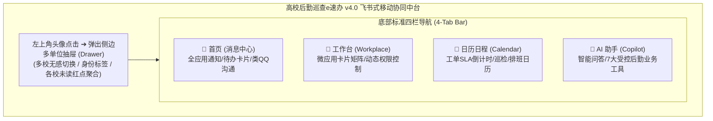

#### 底部四大核心 TabBar 职能与交互定位：
1. **💬 Tab 1: 首页（消息中心 - `pages/messages/index`）**：
   - **全应用消息流中枢**：
     - **微应用专属服务会话 (App Bot Session)**：各子微应用（如【隐患巡查应用】、【师生诉求应用】、【巡更打卡应用】）向用户派发的通知，均**聚拢呈现在带有该微应用自身专属头像与名称的独立会话入口中**；点击进入后，界面内**全量消息均以结构化富交互卡片（Card Stream）形式呈现**，支持原地接单与状态演进，严禁冰冷纯文本；
     - **类 QQ 工单即时协同会话**：提报师生与维保师傅、科室班组群聊的 1v1 聊天会话，支持引用回复、2分钟撤回与已读消除；
   - **防骚扰与效率第一**：采用会话卡片流展示，支持向左滑动标为已读、置顶会话（`isPinned`）与滑动删除；顶部提供分类过滤胶囊（`全部`、`未读`、`待办工单`、`群聊`）；
2. **💼 Tab 2: 工作台（Workplace - `pages/workplace/index`）**：
   - **微应用 (Micro-App) 卡片矩阵**：将所有后勤巡查、报修、反馈、维保、巡更、大盘、设置等功能，**全部解耦为独立的“微应用”陈列于此**；
   - **动态权限与登录态门禁**：根据当前用户的登录状态与四级权限矩阵，动态渲染不同卡片。无权进入的应用展示微质感锁定角标并引导授权登录，具备权限的应用一键直达，告别冗长的二级子页面；
3. **📅 Tab 3: 日历日程（Calendar - `pages/calendar/index`）**：
   - **全景后勤维保日历**：月视图、周视图与日清单平滑联动；
   - 自动拉取个人在办工单的 **SLA 截止期限倒计时**（黄色预警、红色超时）、师傅轮岗值班排班表、全校重大公共维保里程碑（如开学水箱清洗、供暖打压测试）；
4. **🤖 Tab 4: AI 助手（Copilot - `pages/ai-copilot/index`）**：
   - **独立全屏高校后勤大模型工作台**：免去层层入口寻找，直接与高校专属后勤 AI 对话；基于 SSE 流式吐词，装备 7 大安全受控后勤业务工具，直接生成可交互点击的工单直达卡片。

---

### 3.2 左上角头像弹出侧边抽屉 (Drawer)：同手机号绑定 × 本机登录历史存根 (双重准入与过期状态无感唤醒)

传统高校软件往往存在两大极端弊端：要么“单校写死”，切换学校必须退出登录、清除缓存再重新扫码，体验极其割裂；要么“粗暴拉取”，直接将云端该账号关联的所有几十所历史测试学校全部一股脑倾倒在菜单中，不仅泄露多设备隐私，更造成杂乱冗余的无效选项。

高校后勤巡查e速办 v4.0 深度汲取飞书多企业切换架构精髓，在顶部全局自定义导航栏（`qp-navbar`）左上角常驻当前用户头像，并确立了业界领先的**「同手机号绑定 × 本机登录历史存根 (Dual-Key Device Segregation)」**黄金准则：

> [!IMPORTANT]
> **左侧抽屉大学菜单展示的核心门禁红线 (三大铁律)**：  
> 抽屉列表中展示的高校单位账号，**必须同时满足以下条件**：
> 1. **当前手机号绑定一致性 (`boundPhone === currentUserPhone`)**：展示的大学账号所属的绑定手机号，必须与当前正在登录或认证的主手机号完全一致，彻底杜绝不同手机号码间的账号混淆与数据串扰；
> 2. **当前设备历史登录存根 (`hasLoggedInOnThisDevice === true`)**：该大学账号**必须曾经在当前这台物理手机设备上成功登录过**（本地安全存储 `wx.getStorageSync('xcesb_device_accounts')` 存在存根记录）。即使云端该手机号还挂靠了其他高校，只要在本台手机设备上从未登录过，抽屉菜单一律不予上榜；
> 3. **无论登录有没有过期均优雅常驻 (`Tolerate Expiration`)**：如果该大学账号曾经在本机登录过，**无论当前其 Token 是处于有效活跃期、已自然过期、还是被服务端重置踢下线，该大学均永久保留在抽屉列表中**，并带有清晰的状态标识与优雅的原地免密续期通道！

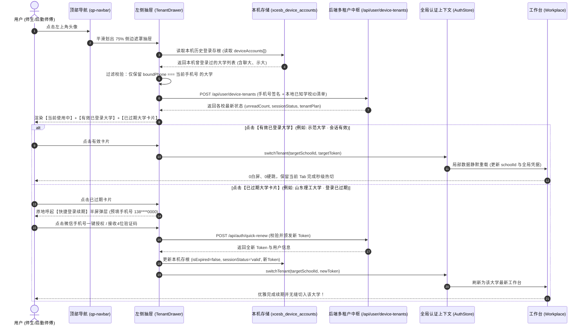

#### 1. 账号卡片的三大运行状态与视觉交互设计
抽屉中的每个大学卡片呈现出三种精细化微质感状态：

| 账号状态 | 视觉标识与微质感表现 | 核心数据展现 | 点击触发的交互流 |
| :--- | :--- | :--- | :--- |
| **① 当前使用中<br/>(Current Active)** | • 极光蓝外发光边框 (`box-shadow: 0 0 12px rgba(0,102,255,0.25)`)<br/>• 右上角标有 `当前单位` 科技蓝胶囊徽标 | • 校徽图标 + 学校全称（如“聊城大学 · 西校区”）<br/>• 所在校区与身份（如“水电暖抢修组长 · 工号 2024018”）<br/>• 本校实时待办未读红点数字 | 提示“当前正在使用该单位”，自动收起左侧抽屉。 |
| **② 有效会话已登录<br/>(Valid Session)** | • 纯净毛玻璃浅底卡片<br/>• 右上角展示常驻微绿点 (`#00C853`) 或 `有效会话` 标识 | • 校徽图标 + 目标高校全称（如“示范重点大学”）<br/>• 该校具体学工号与岗位标签（如“保卫处巡更专员”）<br/>• **该大学名下的待办未读红点数字**（如 `[3]`） | **0 校验秒级无感热切**：无需再次输入验证码，立即更新全局 `schoolId` 与该校租户 JWT Token，工作台局部刷新，保留当前 Tab 视口。 |
| **③ 登录已过期 / 待续期<br/>(Session Expired)** | • 低饱和度石墨灰卡片 + 微质感黄色/浅橙胶囊徽标<br/>• 标有 `登录已过期 · 点击续期` 或 `待重新授权` | • 校徽（略微降饱和 80%）+ 学校全称<br/>• 用户真实姓名与脱敏手机号（`138****0000`）<br/>• **跨校离线未读待办红点依然实时感知**（如 `[1]`） | **原地半屏快捷续期**：**绝不直接弹报错拦截！** 原地呼起半屏弹层，预填手机号，点击微信一键手机号授权或 4 位短信验证码，瞬间颁发新 Token 并直接切入该大学工作台！ |

#### 2. 飞书式多单位抽屉 ASCII UI 布局设计规范

```
┌──────────────────────────────────────────────┐
│ [× 关闭]            我的单位切换             [⚙ 管理]│
├──────────────────────────────────────────────┤
│ 👤 当前微信手机号：138 **** 0000 (已实名认证)   │
│                                              │
│ ── 当前使用中 ────────────────────────────── │
│ ┌──────────────────────────────────────────┐ │
│ │ 🏛️ [校徽] 聊城大学 (西校区)  [ 当前单位 ] │ │
│ │ 姓名：张三 (工号: 2024018)               │ │
│ │ 身份：水电暖抢修组长 · 在岗值班           │ │
│ └──────────────────────────────────────────┘ │
│                                              │
│ ── 本机曾登录的历史单位 (同手机号) ───────── │
│ ┌──────────────────────────────────────────┐ │
│ │ 🏛️ [校徽] 示范重点大学 (海滨校区) [🟢已登录]│ │
│ │ 身份：保卫处巡更专员                      │ │
│ │ 未读待办：🔴 3 条新工单派单通知           │ │
│ └──────────────────────────────────────────┘ │
│ ┌──────────────────────────────────────────┐ │
│ │ 🏛️ [校徽] 山东理工大学 (南校区) [🟡已过期]│ │
│ │ 身份：机电学院兼职指导老师                │ │
│ │ 状态：凭据已超30天 ⚠️ [点击一键免密续期] │ │
│ │ 未读待办：🔴 1 条满意度调查待处理         │ │
│ └──────────────────────────────────────────┘ │
│                                              │
│ ── 其他操作 ──────────────────────────────── │
│  [➕ 在本机登录新单位 (扫码/搜校绑定)]       │
│  [ℹ️ 关于高校后勤巡查e速办 v4.0]             │
└──────────────────────────────────────────────┘
```

#### 3. 本地设备登录存根契约规范 (`DeviceAccountStore`)

微信小程序端在本地持久化维护账号存根字典：
```typescript
/** 本机已登录大学历史存根数据模型 */
export interface DeviceAccountRecord {
  schoolId: number;
  schoolName: string;
  schoolCode: string;
  logoUrl: string;
  boundPhone: string;          // 绑定的主手机号 (用于严格过滤同手机号账号)
  userId: number;
  realName: string;
  role: number;
  roleName: string;
  campusName: string;
  token: string;              // 租户 JWT Token
  tokenExpireAt: string;      // Token 预定过期绝对时间
  isExpired: boolean;         // 是否已过期 (本地时间推算或服务端确认)
  sessionStatus: 'active' | 'valid' | 'expired'; // 会话状态
  lastLoginAt: string;        // 在本台设备上的最后活跃时间
}
```

- **写入时机 (Device Registration)**：用户在任何学校通过微信手机号授权或短信验证码成功登录进入系统时，自动调用 `DeviceAccountStore.save(record)`，将该学校账号写入本机 `xcesb_device_accounts`；
- **登出策略 (Gentle Sign-out)**：用户在当前学校点击“退出登录”，系统仅将该学校存根标记为 `isExpired = true` 与 `sessionStatus = 'expired'`，**保留该大学卡片在抽屉中**，以便下次一键免密重登；
- **清理与移除时机 (Local Device Removal)**：在抽屉右上角点击【管理】，用户可勾选并选择“从本机设备移除”，此时才物理删除该校的本地设备存根（仅删除本机快捷入口，不影响云端真实档案）。

---

### 3.3 工作台动态权限门禁与未登录免密唤醒

“工作台”是整个后勤巡查e速办 v4.0 的业务指挥中枢。为保障系统“对外公开透明，对内严密合规”，工作台针对**不同登录态与四级角色权限**实施高精度的动态门禁策略：

| 访问者状态 / 角色 | 工作台可见微应用卡片清单 | 卡片交互体验与安全门禁 |
| :--- | :--- | :--- |
| **未登录访客 / 免密师生** | 🌐 校园公开空间、📖 报修与服务指南、💡 常见故障排查常识、📞 后勤24小时应急热线 | 开放类卡片可免密直接进入浏览；对“隐患巡查”、“诉求建议”等需授权应用呈现优雅的**微质感锁定徽标**，点击即刻呼起底部微信一键登录半屏弹窗。 |
| **在校普通师生 (`role: 0/1`)** | 🔍 隐患巡查应用 (`app-patrol`)、📢 师生诉求应用 (`app-feedback`)、📋 我的报修历史、💬 与师傅在线沟通 | 完整开放提报、进度跟踪、满意度打分评价、与现场处理师傅 1v1 聊天等权益；自动隐藏“师傅接单”、“施工交卷”等运维运维卡片。 |
| **现场维保师傅 (`type: 1`)** | 🛠️ 师傅现场工作台 (`app-master-desk`)、待办工单池、延期交卷申请、工单协同聊天室、物资备件申领 | 突出待抢修倒计时与加急催办工单；支持现场拍摄施工后整改实证照交卷；支持主动发起与师生沟通。 |
| **复核质检员 (`type: 2`)** | ⚖️ 质检复核工作台、现场验收打分、不合格打回整改、完工实证抽检 | 专职到场核验施工质量，评定合格办结或驳回重修。 |
| **科室主管 / 管理员 (`role: 3/4`)**| 🏢 飞书组织通讯录 (`app-org-center`)、🏷️ 岗位标签调度中心、📊 宏观效能驾驶舱、⚙️ 学校参数与大模型配置 | 具备全校微应用总揽权限，支持人员批量调度、标签一键平移、OpenAI 凭据维护与 Excel 数据导出。 |

---

### 3.4 “校园后勤空间 (Campus Space)”作为全校开放微应用的深度融合

原旧版“后勤一码通”与“校园广场”在 v4.0 中被优雅收拢并升级为工作台中的核心公共微应用——**「校园后勤空间 (Campus Space / `app-campus-space`)」**：
1. **工作台常驻开放入口**：任何师生无需登录，在工作台首屏即可点击进入校园后勤空间；
2. **双轨合一公开透明机制**：
   - 广场瀑布流公开全校已整改的优秀报修案例，展示维修前破损与维修后整洁对比；
   - 支持师生与免密访客发表正向鼓励评论（`guestNick`/`guestAvatar`），打破后勤暗箱操作认知；
3. **首页消息流官方公告联动**：校园后勤空间发布的重大停水停电、维保进度白皮书，自动作为高优先级系统通知同步写入 4.0 首页消息列表，全校师生第一时间获知。


---

## 四、 小程序微前端与微应用矩阵体系 (Micro-App Architecture)

### 4.1 小程序端工程分包解耦规划与微应用架构规范 (`packages/apps/` 与 `AppManifest`)

新版小程序源码位于 [v4.0/WeChatMiniProgram](file:///e:/Projects/University/后勤巡查e速办%20大二下学期%20大学身份上线项目/v4.0/WeChatMiniProgram)。为了支撑未来几十个高校后勤子业务模块能够由不同开发者**像飞书子应用一样独立开发、独立分包、热插拔注册与敏捷维护**，整体前端架构彻底重构为“**主包宿主平台 (Shell) + 独立微应用分包 (Micro-Apps)**”模型：

```
WeChatMiniProgram/miniprogram/
├── api/                                # 跨应用公共 API 契约库 (HTTP / WS-RPC)
│   ├── school.ts                       # 学校租户与多单位切换契约
│   ├── auth.ts                         # 统一多租户认证鉴权契约
│   ├── workplace.ts                    # 工作台微应用注册与权限契约
│   ├── calendar.ts                     # 日历日程与排班事件契约
│   └── notification.ts                 # 统一消息总线与未读红点契约
│
├── components/                         # 全局公共核心基础组件
│   ├── qp-navbar/                      # 沉浸式顶部导航栏 (含左上角单位头像触发器)
│   ├── qp-tenant-drawer/               # 飞书同款左侧多单位切换抽屉 (多校红点)
│   ├── qp-tabbar/                      # 飞书式底部四栏导航条 (消息/工作台/日程/AI)
│   ├── qp-badge/                       # 灵动微动效角标与状态胶囊
│   ├── qp-skeleton/                    # 1:1 响应式微光骨架屏
│   └── qp-empty/                       # 手绘插画缺省占位与重试组件
│
├── pages/                              # 主包常驻核心四栏底座页面 (宿主平台)
│   ├── messages/                       # Tab 1: 首页全应用消息中枢 (聚合待办/类QQ沟通)
│   │   ├── index.ts / index.wxml / index.wxss
│   │   └── app-feed/                   # 🌟 微应用专属卡片消息流页面 (微应用头像与名称/全量富交互卡片流)
│   │       ├── index.ts / index.wxml / index.wxss
│   ├── workplace/                      # Tab 2: 飞书式工作台 (微应用卡片矩阵与门禁)
│   │   ├── index.ts / index.wxml / index.wxss
│   ├── calendar/                       # Tab 3: 全景日历日程 (工单SLA/排班/维保节点)
│   │   ├── index.ts / index.wxml / index.wxss
│   └── ai-copilot/                     # Tab 4: 专属高校后勤 AI Copilot 智能工作台
│       ├── index.ts / index.wxml / index.wxss
│
├── packages/apps/                      # 🌟 核心业务独立微应用分包矩阵 (Micro-Apps)
│   ├── app-patrol/                     # 🔍 隐患巡查微应用 (原聊大巡查独立化)
│   │   ├── pages/create/               # 巡查隐患上报专用页 (地图选点/水印相机)
│   │   ├── pages/detail/               # 巡查工单全生命周期流转与对比轴
│   │   ├── pages/history/              # 巡查在办与历史归档台账
│   │   └── manifest.json               # 微应用元数据清单与权限声明
│   │
│   ├── app-feedback/                   # 📢 师生诉求微应用 (原聊大反馈独立化)
│   │   ├── pages/create/               # 师生诉求建言与匿名隐私投递页
│   │   ├── pages/detail/               # 诉求官方答复、满意度评价打分
│   │   ├── pages/my-feeds/             # 我的诉求建议归档跟踪
│   │   └── manifest.json
│   │
│   ├── app-master-desk/                # 🛠️ 师傅抢修工作台微应用
│   │   ├── pages/task-pool/            # 抢修派单大厅与紧急催办看板
│   │   ├── pages/handle/               # 现场施工交卷与耗材备件登记
│   │   ├── pages/delay-apply/          # 规范延期申请与校管线上审批
│   │   └── manifest.json
│   │
│   ├── app-inspection/                 # 📍 电子巡更打卡微应用
│   │   ├── pages/scan-point/           # 线下固定二维码点位扫码打卡
│   │   ├── pages/route-plan/           # 当日安全巡检路线导航与覆盖率
│   │   └── manifest.json
│   │
│   ├── app-campus-space/               # 🌐 校园公开空间微应用 (双轨合一广场)
│   │   ├── pages/feed-stream/          # 校园整改前后对比动态瀑布流
│   │   ├── pages/notice-board/         # 后勤重大停水停电/维保进度白皮书
│   │   └── manifest.json
│   │
│   ├── app-org-center/                 # 🏢 飞书组织中台微应用
│   │   ├── pages/org-tree/             # 无限级部门树与动态面包屑通讯录
│   │   ├── pages/tag-management/       # 岗位标签调度与一键无缝交接 (随岗不随人)
│   │   └── manifest.json
│   │
│   └── app-cockpit/                    # 📊 宏观数据驾驶舱微应用 (科室主管/校领导)
│       ├── pages/overview/             # ECharts 全校故障分布、办结率大屏
│       ├── pages/export/               # 内嵌高德定位二维码的 Excel 导出
│       └── manifest.json
│
├── store/                              # 全局响应式状态机 (多租户身份 / 未读通知 / WS连接)
├── utils/                              # 工具箱 (网络闪断重连 / OSS签名直传 / 震动反馈)
├── app.json                            # 宿主路由与分包预加载规则配置
├── app.ts                              # 小程序全局生命周期中枢
└── app.wxss                            # 飞书企业级 Design Token 样式系统
```

#### 统一微应用元数据契约 (`AppManifest`)
每个微应用必须内嵌一个标准的元数据描述文件，用于被宿主工作台动态探测与编排：
```typescript
export interface AppManifest {
  appId: string;            // 唯一标识: 'app-patrol', 'app-feedback', 'app-master-desk' 等
  name: string;             // 应用名称: "隐患巡查", "师生诉求"
  icon: string;             // 矢量图标 (SVG / WebP)
  category: 'report' | 'maintenance' | 'governance' | 'admin'; // 分组分类
  requiredRoles: number[];  // 准入角色: 0学生, 1教职工, 2师傅, 3主管, 4校管, 9超管
  badgeCount?: number;      // 动态待办红点角标数量
  entryPath: string;        // 分包页面入口路径
  description: string;      // 一句话功能定位
  isPublic: boolean;        // 是否允许未登录免密体验 (如校园公开空间)
}
```

---

### 4.2 核心业务解耦：原聊大后勤“巡查”与“反馈”独立为两个专门微应用

在原旧版聊大后勤系统中，“巡查”与“反馈”曾勉强挤在一个表单与后台中，造成概念深度混乱（例如把水管爆裂的工程抢修与食堂饭菜偏咸的建言诉求混为一谈）。在 v4.0 中，**彻底将两项功能解耦为两个完全独立的微应用**：

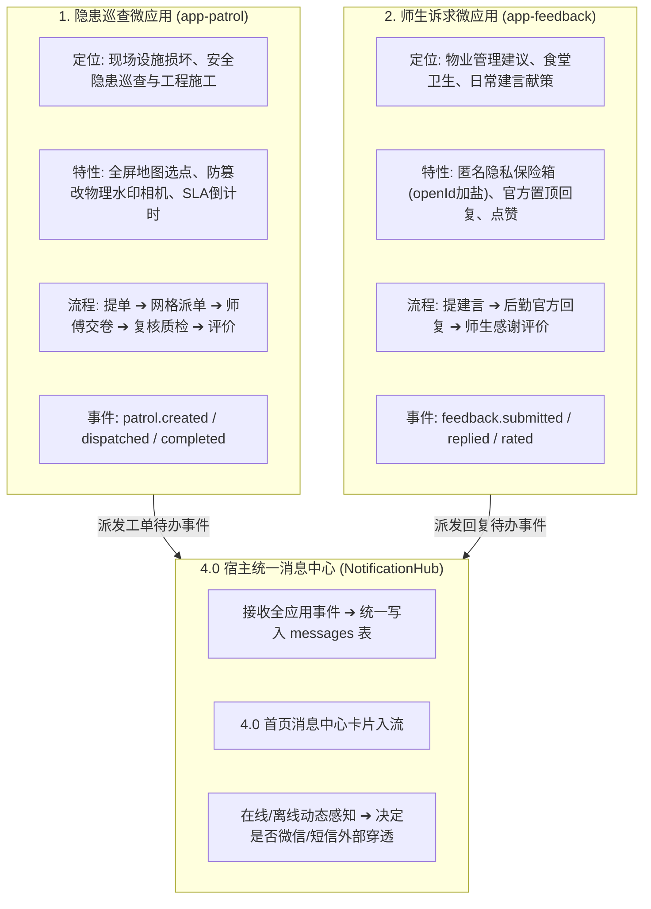

#### 1. 隐患巡查微应用 (`app-patrol`) 核心特性
- **定位**：面向工程维保与安全隐患，具有强时效、强现场实证、强流转闭环属性；
- **核心功能栈**：
  - **地图沉浸式选点**：指针自动附着校内建筑 POI，支持经纬度毫秒级解算；
  - **防篡改硬件水印相机**：拍摄时硬件底层叠加校区、楼栋、不可篡改时间戳水印；
  - **智能责任科室推荐**：根据报修门类自动建议第一责任人与职能标签；
  - **动态 SLA 倒计时**：清晰显示承诺办结时限（黄色预警、红色超时）；
  - **多级复核质检**：师傅交卷后，必须经过验收员实地核验合格方可办结。

#### 2. 师生诉求微应用 (`app-feedback`) 核心特性
- **定位**：面向校园治理建言献策与后勤服务综合评价，强调师生参与感、沟通温度与官方正向引导；
- **核心功能栈**：
  - **绝对匿名隐私保险箱**：对反映宿管、食堂卫生的敏感诉求，支持“绝对匿名模式”，系统对提报人 openId 实施强单向散列加盐，杜绝管理人员获知真实身份；
  - **官方正式答复流**：后勤管理处或对应科室可在后台直接公开回复师生，答复内容支持富文本与整改承诺；
  - **师生感谢与好评勋章**：师生可向答复老师赠送“校园啄木鸟”感谢卡与满意度打分；
  - **诉求热榜**：支持将高频共性诉求一键推送到校园公开空间，避免重复建言。

#### 3. 业务微应用与宿主消息中枢的解耦规范
- 微应用内部**严禁擅自调用任何第三方短信或微信模板消息接口**；
- 微应用的所有流转节点，统一包装为标准的 `AppNotificationEvent`，投递至宿主 `NotificationHub`；
- 由宿主中枢统一决定是进行“应用内消息流静默刷新”还是“离线智能微信/短信外部穿透唤醒”。

---

### 4.3 飞书式工作台 (Workplace) 交互设计与卡片矩阵

> **核心页面路径**：`pages/workplace/index`

工作台作为 Tab 2，是全校师生与后勤员工日常操作的综合看板：

```
┌────────────────────────────────────────────────────────┐
│  [聊城大学 · 西校区]   🔍 搜索应用或服务...        [🔔 2]│
├────────────────────────────────────────────────────────┤
│  ⚡ 我的常用 (支持长按拖拽自定义排序)                    │
│  [ 🔍 隐患巡查 ]  [ 📢 师生建言 ]  [ 🛠️ 师傅工作台 ] [ 🤖 AI助手 ]│
├────────────────────────────────────────────────────────┤
│  【报修与维保专区】                                     │
│  ┌──────────────────┐  ┌──────────────────┐            │
│  │ 🔍 隐患巡查       │  │ 🛠️ 师傅现场工作台 │            │
│  │ 设施故障·极速排查 │  │ 接单抢修·交卷销项 │            │
│  └──────────────────┘  └──────────────────┘            │
│  ┌──────────────────┐  ┌──────────────────┐            │
│  │ 📍 电子巡更打卡   │  │ ⏳ 延期申请审批   │            │
│  │ 定位扫码·防作弊   │  │ 规范工期·线上审核 │            │
│  └──────────────────┘  └──────────────────┘            │
├────────────────────────────────────────────────────────┤
│  【校园服务与共治】                                     │
│  ┌──────────────────┐  ┌──────────────────┐            │
│  │ 📢 师生诉求建议   │  │ 🌐 校园公开空间   │            │
│  │ 建言献策·官方答复 │  │ 透明维保·前后对比 │            │
│  └──────────────────┘  └──────────────────┘            │
├────────────────────────────────────────────────────────┤
│  【组织与管理中枢】 (仅管理员可见)                     │
│  ┌──────────────────┐  ┌──────────────────┐            │
│  │ 🏢 飞书组织通讯录 │  │ 🏷️ 岗位标签调度   │            │
│  │ 无限部门·职能找人 │  │ 随岗不随人·秒交接 │            │
│  └──────────────────┘  └──────────────────┘            │
│  ┌──────────────────┐  ┌──────────────────┐            │
│  │ 📊 宏观数据驾驶舱 │  │ ⚙️ 大模型与设置   │            │
│  │ 效能分析·Excel导出│  │ OpenAI凭证·规则表 │            │
│  └──────────────────┘  └──────────────────┘            │
└────────────────────────────────────────────────────────┘
```

#### 工作台动态门禁与微质感锁体验：
1. **未登录访客模式**：
   - 开放应用（“校园公开空间”、“报修使用指南”、“后勤服务热线”）可免密点击直接进入；
   - 需身份认证的应用卡片（“隐患巡查”、“师生诉求”）表面呈现**毛玻璃半透明微质感小锁**；
   - 访客轻点卡片，系统优雅滑出底部微信一键授权半屏弹窗，授权成功后原地解锁卡片并平滑载入微应用，无需繁琐重定向；
2. **多角色自适应呈现**：
   - 普通师生只展示提报、诉求与公开空间；
   - 维保师傅登录后，工作台自动置顶浮现“接单大厅”与“待我施工”专属卡片，并带有未办结工单角标；
   - 管理员登录后，解锁“组织通讯录”、“标签调度”与“数据驾驶舱”。

---

### 4.4 日历日程系统 (Calendar) 交互与数据联动

> **核心页面路径**：`pages/calendar/index`

Tab 3 的日历日程系统彻底解决了高校维保“师傅容易遗忘临期工单、后勤处重大施工缺乏统一公示”的痛点：

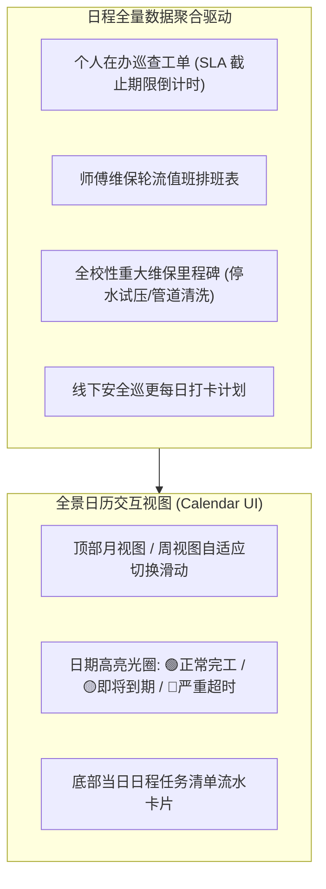

#### 日程系统核心功能细节：
1. **三维视图无缝滑动**：
   - 支持单指上下滑动在“月全景视图”与“单周紧凑视图”之间平滑形变，手指左右划动顺滑切换月份；
2. **工单 SLA 履约倒计时动态标签**：
   - 日历中的工单日程卡片带有智能状态光晕：
     - 剩余时间 > 24小时：绿色标签展示预计截止时间；
     - 剩余时间 2~24小时：黄色警示标签展示倒计时（如“剩 3 小时截止”）；
     - 发生超时：红色呼吸光圈并标出“已超时 1.5 天”，提醒主管介入；
3. **值班表一键拨号与协同**：
   - 师生或宿管查看当日值班师傅，点击师傅姓名直接一键拨号或唤起 1v1 在线会话；
4. **重大维保节点日程提醒**：
   - 后勤处发布的重大工程（如“9月10日 东校区供暖系统打压注水”），支持在日历中点击“添加到手机系统日历/订阅提醒”，防止停水停电影响师生科研生活。

---

### 4.5 首页全能消息中心、微应用专属服务会话与全量富交互卡片流规范

> **核心页面路径**：`pages/messages/index` (消息会话大盘) & `pages/messages/app-feed/index` (微应用专属卡片流)

作为进入小程序的第一主屏（Tab 1），首页定位为**极致高效的全应用消息汇聚中枢与协同大盘**。  
在 v4.0 的顶层产品架构中，彻底打破了传统体制内系统“通知与聊天混乱穿插、纯文本冰冷无操作、重复派发消息疯狂刷屏”的粗糙体验，确立了**「微应用服务聚合会话 (App Bot Session) + 专属全量富交互卡片流 (Rich Interactive Card Stream)」**的现代化标准规范。

---

#### 4.5.1 首页全能消息中心会话大盘拓扑与 ASCII UI 原型 (`pages/messages/index`)

首页消息大盘采用**双轨清晰分流**机制：
1. **微应用专属服务号会话 (App Service Session)**：
   - 各独立微应用（如 `app-patrol` 隐患巡查、`app-feedback` 师生诉求、`app-inspection` 巡更打卡）产生的所有待办、提醒与流转事件，**严禁散落为杂乱零碎的孤立条目，而是严格按应用维度聚拢出现在该微应用自身专属头像与官方名称的会话条目中**；
   - **会话条目视觉呈现**：微应用定制高清矢量图标（如巡查的科技蓝扳手盾牌、反馈的暖橙小喇叭、巡更的翡翠绿雷达）+ 微应用官方全称（如“后勤巡查应用 / 巡查助手”）+ 最新一条卡片消息的类型与内容摘要（如 `[待接单] 1号教学楼暖气管道破裂抢修`）+ 最新时间戳 + 本应用在当前大学租户下的未读待办红点；
   - **点击交互**：轻点该会话条目，平滑推入**该微应用专属的卡片流消息界面 (`pages/messages/app-feed/index?appId=app-patrol`)**。
2. **类 QQ 1v1 工单协同与科室应急群聊会话 (Chat Room Session)**：
   - 展示提报人或师傅的自然人微信头像、绑定工单号、最新聊天气泡摘要与未读红点，点击进入专属即时聊天室 (`packages/apps/app-chat/pages/room/index`)；
3. **系统重要公告与置顶广播 (System Broadcast)**：
   - 学校后勤处发布的重大停水停电、维保进度白皮书，作为高优先级置顶通知。

```
┌────────────────────────────────────────────────────────┐
│ [🏛️ 聊城大学 · 西校区]   消息中心              [✓ 全部已读] │
├────────────────────────────────────────────────────────┤
│ 🔍 搜索消息、工单或联系人...                           │
├────────────────────────────────────────────────────────┤
│ [全部 (14)]  [待办工单 (3)]  [协同聊天 (9)]  [系统通知 (2)]   │
├────────────────────────────────────────────────────────┤
│ ── 🌟 微应用专属服务聚合会话 (点击进入专属卡片流) ──── │
│ ┌────────────────────────────────────────────────────┐ │
│ │ 🛠️ [巡查图标] 后勤巡查应用 / 巡查助手        14:32 │ │
│ │ [待接单] #LCU-0905-012 教学楼暖气管道漏水抢修 🔴 2 │ │
│ └────────────────────────────────────────────────────┘ │
│ ┌────────────────────────────────────────────────────┐ │
│ │ 📢 [建言图标] 师生诉求建议助手              昨天 │ │
│ │ [已答复] 后勤处已就“西区三餐开水房水温”作出整改答复  │ │
│ └────────────────────────────────────────────────────┘ │
│ ┌────────────────────────────────────────────────────┐ │
│ │ 📍 [巡更图标] 线下安全巡更打卡              09-03 │ │
│ │ [提醒] 您今日在东校区配电房尚有 2 个点位未扫码打卡  │ │
│ └────────────────────────────────────────────────────┘ │
│                                                        │
│ ── 💬 类 QQ 1v1 工单即时协同聊天 ──────────────────── │
│ ┌────────────────────────────────────────────────────┐ │
│ │ 👤 [师傅头像] 王师傅 (水电抢修组长)          14:28 │ │
│ │ [#LCU-0905-012] "您好，我已带工具出发，在302室吗?"   │ │
│ └────────────────────────────────────────────────────┘ │
│ ┌────────────────────────────────────────────────────┐ │
│ │ 👥 [群聊头像] 西校区防汛应急突发抢险群      11:05 │ │
│ │ 李科长: "各班组请注意，下午有暴雨预警，做好沙袋排查"  │ │
│ └────────────────────────────────────────────────────┘ │
└────────────────────────────────────────────────────────┘
```

- **向左滑动快捷操作 (Swipe Actions)**：单条会话向左滑动展开三个微动效操作胶囊：【📌 置顶】、【✔️ 标为已读】、【🗑️ 删除会话】；
- **分类筛选快速胶囊**：顶部横向滚动药丸支持快速切至 `全部 (14)`、`待办工单 (3)`、`协同聊天 (9)`、`系统通知 (2)`。

---

#### 4.5.2 微应用专属卡片消息流界面 (`pages/messages/app-feed/index`) 规范

当用户点击首页消息列表中的微应用服务会话条目（例如点击“后勤巡查应用 / 巡查助手”）时，小程序进入该微应用**专属、独立、沉浸式的卡片消息流界面**：

##### 1. 顶部专属品牌导航栏 (App Dedicated Header Bar)
- **微应用品牌呈现**：展示该微应用的专属官方高清头像与全称（如 `[🛠️ 巡查图标] 后勤巡查应用`），副标题标注所属高校租户（如 `聊城大学 · 专属服务通知`）；
- **右上角快捷功能胶囊**：
  - `[主页 ➔]`：一键直达该微应用在工作台的独立分包首页（如直接切入 `packages/apps/app-patrol/pages/history/index`）；
  - `[🔔 提醒]`：进入消息提醒频次设置与微信服务通知订阅管理。

##### 2. 100% 全量富交互卡片流准则 (Rich Interactive Card Stream)
> [!IMPORTANT]
> **全量卡片化铁律 (100% Rich Card Paradigm)**：  
> 该界面内的**每一条消息必须且只能以高质感的富交互卡片形式呈现**，坚决严禁输出任何生硬纯文本或普通聊天气泡！每张卡片必须具备结构化键值对、状态指示徽章、高清现场实证图与直接可操作的交互按钮。

每张微应用卡片由标准化的 4 大功能区块构成：
1. **卡片头 (Card Header)**：
   - **事件类型标签 (Event Badge)**：高对比度色标，如 `【工单指派通知】`、`【SLA到期预警】`、`【质检不合格驳回】`、`【官方整改答复】`；
   - **业务状态胶囊 (Status Capsule)**：
     - `待接单 / 待处理`：深邃科技蓝 (`#0066FF`)；
     - `处理中 / 施工中`：极光青 (`#00D2B4`)；
     - `临期预警 / 即将超时`：警示极光紫 (`#8A2BE2`) 伴呼吸微光；
     - `紧急抢修`：日落珊瑚红 (`#FF5252`) 伴微震感知；
     - `已办结 / 验收通过`：翡翠生机绿 (`#00C853`)；
   - **时间戳 (Time Capsule)**：右上角展示消息送达时间（如 `今天 14:32`）。
2. **卡片体 (Card Body)**：
   - **核心键值对表单 (Key-Value Form Grid)**：
     - **工单/事件编号**：如 `#LCU-2026-0905-0012`（等宽字体渲染）；
     - **报修校区与点位**：如 `西校区 · 1号教学实验楼 302 电气控制室`；
     - **故障隐患门类**：如 `水暖与动力类 · 高压管道严重跑水`；
     - **紧急程度与时限**：如 `⚡ 极高加急 (要求 30 分钟内入场响应)`；
     - **履约倒计时**：如 `⏳ 履约倒计时: 01小时45分截止`；
     - **提报人与联系方式**：展示提报师生姓名及联络信息；
   - **现场实证照片缩略图横滑栏 (Photo Strip)**：
     - 1~3 张现场实拍照，圆角微质感阴影；点击任意一张即刻呼起微信原生全屏画廊大图预览 (`wx.previewImage`)，支持双指缩放查看故障细节；
   - **问题详情或官方回复文本**：折叠/展开呈现师生提报原话或后勤处答复意见。
3. **卡片底部交互操作条 (Action Row / Footer)**：
   - 动态装配 1~3 个原生可交互按钮：
     - **Primary Action (主操作高亮按钮)**：高饱和科技蓝渐变背景，直击核心痛点，如 `[ 立即接单 ]`、`[ 现场交卷 / 上传完工照 ]`、`[ 查看答复 ]`；
     - **Secondary Action (次级操作按钮)**：半透明浅灰微边框，如 `[ 查看工单详情 ]`、`[ 申请工期延期 ]`；
     - **Link / Call Action (协同联动动作)**：带图标文字链接，如 `[ 📞 一键拨号提报人 ]`、`[ 💬 发起即时聊天 ]`。

```
┌────────────────────────────────────────────────────────┐
│ [← 返回]        🛠️ 后勤巡查应用 · 聊城大学      [主页 ➔] │
├────────────────────────────────────────────────────────┤
│                        今天 14:32                      │
│ ┌────────────────────────────────────────────────────┐ │
│ │ 【工单指派通知】              [ 待接单 ] ⚡极高加急 │ │
│ ├────────────────────────────────────────────────────┤ │
│ │ 工单编号: #LCU-2026-0905-0012                      │ │
│ │ 隐患点位: 西校区 · 1号实验楼 302水暖井室           │ │
│ │ 故障类别: 水暖动力类 · 主供水阀门严重爆裂跑水       │ │
│ │ 提报师生: 李同学 (139****1234) · 14:25 提报        │ │
│ │ 履约时限: ⏳ 要求 30 分钟内到场处置 (剩 23 分钟)    │ │
│ │                                                    │ │
│ │ 现场实证: [ 🖼️ 爆裂阀门图 ] [ 🖼️ 室内积水图 ]       │ │
│ │           (点击图片全屏画廊查看高画质原图)         │ │
│ ├────────────────────────────────────────────────────┤ │
│ │ [ 📞 电话联系提报人 ]                               │ │
│ │ [ 查看工单全貌 ]         [ ⚡ 立即接单抢修 (主按钮)] │ │
│ └────────────────────────────────────────────────────┘ │
│                                                        │
│                        今天 11:15                      │
│ ┌────────────────────────────────────────────────────┐ │
│ │ 【SLA 临期催办预警】        [ 🟡即将超时 ] 剩余 2h   │ │
│ ├────────────────────────────────────────────────────┤ │
│ │ 工单编号: #LCU-2026-0904-0087                      │ │
│ │ 隐患点位: 东校区 · 第2学生公寓 5楼走廊照明故障     │ │
│ │ 当前状态: 您于昨日接单，当前距完工截止还剩 1.8 小时 │ │
│ ├────────────────────────────────────────────────────┤ │
│ │ [ 申请延期 ]             [ 🛠️ 施工完成·交卷拍照 ]    │ │
│ └────────────────────────────────────────────────────┘ │
└────────────────────────────────────────────────────────┘
```

---

#### 4.5.3 卡片原地状态动态演进机制 (In-Place Mutation & State Machine)

传统高校维保系统最严重的体验痛点是：**“师傅点击接单后，系统为了通知又给消息列表塞进一条‘您已接单’，导致消息列表疯狂刷屏爆满；更严重的是，历史卡片上的‘立即接单’按钮依然孤零零亮着，师傅误点或他人点击时引发死锁报错”**。

高校后勤巡查e速办 v4.0 独创了**卡片原地状态动态演化机制 (In-Place Card State Mutation)**：

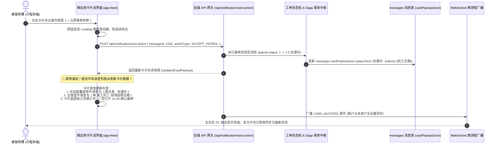

- **数据一致性保证**：卡片上每一次点击操作，均通过轻量端点 `/api/notification/card-action` 完成原子业务验证。服务端直接回写 `messages.cardPayloadJson` 的当前状态快照，前端收到成功响应后**原地热重绘该卡片**；
- **告别刷屏噪音**：全流程所有状态跃迁（待接单 ➔ 处理中 ➔ 待复核 ➔ 已办结）均在**同一张业务卡片本体上原地变形沉淀**，整个微应用消息界面清爽、聚焦、极具科技质感。

---

#### 4.5.4 消息防骚扰与离线智能穿透的无缝闭环

卡片消息流与宿主平台的 `NotificationHub` 与 `PresenceEngine` 深度联动：
1. **用户在线时 (In-App)**：
   - 小程序前台活跃时，WebSocket 毫秒级下发 `NEW_CARD_MESSAGE`；
   - 首页消息列表的对应微应用条目红点 +1，若用户正停留在该微应用的 `app-feed` 界面，卡片带有柔和弹性入场动效直接置顶插入，系统轻微微震，**坚决不触发外部短信与微信服务通知骚扰**；
2. **用户离线时 (Offline / 切后台超3分钟)**：
   - 进入 180 秒 Cooldown 防抖缓冲；若用户超时未读，穿透引擎提取卡片中的关键字段（工单号、故障点位、隐患门类、时限）格式化为微信模板消息，推送至用户的微信服务通知；
   - 用户在微信聊天列表点击服务通知卡片，**微信小程序直接唤醒并以精准深层链接直接推入该微应用的专属卡片详情 (`pages/messages/app-feed/index?appId=app-patrol&focusMessageId=1042`)**，直达业务现场，实现全链路零摩擦闭环！

---

### 4.6 极致细节打磨：边边角角的无死角交互体验

1. **全链路骨架屏 (Skeleton Screens)**：
   - 工作台卡片、消息列表、日历日程与工单详情，在异步数据请求与网络拉取阶段，采用 1:1 对应的微光呼吸骨架屏占位，彻底杜绝全局 Loading 转圈带来的卡顿感；
2. **防误触与可撤销机制 (Undo Mechanism)**：
   - 删除工单、移除用户等破坏性操作，在点击确认后，底部弹出持续 4 秒的悬浮胶囊 Toast（“已删除 1 项工单，[点击撤销]”），用户可随时一键反悔；
3. **微信原生微触觉反馈 (Haptic Feedback)**：
   - 在点赞、Tab 切换、扫码成功、长按多选、滑动操作展开时，智能触发原生微震动（`wx.vibrateShort({ type: 'light' })`），带来如原生 App 般的扎实质感；
4. **离线草稿自动暂存**：
   - 巡查拍照或编辑诉求时，客户端每隔 3 秒自动落盘至本地 Storage，即使手机低电量自动关机或误切出微信，再次打开时弹出“检测到未提交草稿，已为您自动恢复”；
5. **手绘矢量缺省页**：
   - 为“无消息”、“无待办”、“无网络断网”、“搜索无结果”等边缘状态量身定制手绘插画，并附带一键重试与诊断按钮。


---

## 五、 新版后端 (Backend) 领域微服务架构与高并发底层引擎

### 5.1 充分释放底层微服务框架的并发潜能

新版后端完全基于当前已完成迁移与单测验证的现代化骨架构建：

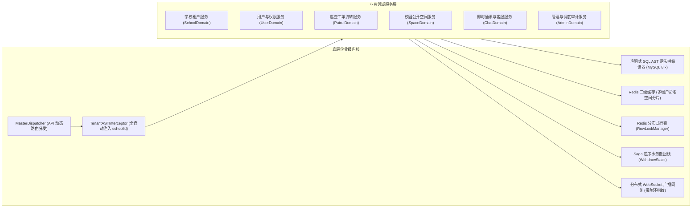

- **路由正规化与 0 毫秒预检**：所有客户端 API 统一通过 `MasterDispatcher` 调度，自动过滤多余斜杠，OPTIONS 跨域预检就地毫秒级拦截返回；
- **二段式查询极速响应**：列表查询先抽取主键 ID 向量，通过 Redis `MGET` 批量拉取已有缓存，未命中部分通过 `WHERE id IN (?) AND schoolId = ?` 批量回源 MySQL 并回填 Redis，QPS 提升 10 倍以上。

---

### 5.2 完整工程项目结构规划 (TypeScript / ESM / 微应用后端架构)

新版后端完全基于现代化严格强类型 TypeScript 与 ESM 架构构建，支持子功能像微应用一样独立模块化开发，工程结构高度模块化、高内聚低耦合：

```
v4.0/Backend/
├── package.json                   # ESM + TypeScript + 生产依赖 (mysql2, ioredis, ws, etc.)
├── tsconfig.json                  # 严格类型检查配置 (strict: true, noImplicitAny: true)
├── generate_envs.js               # 自动生成 4 个节点环境变量配置文件
├── start_all_backends.js          # 彩色终端一键并行拉起 4 个 Backend 进程
├── 1.env, 2.env, 3.env, 4.env     # 各节点运行时环境变量 (PORT=8001~8004, WS_PORT=9001~9004)
│
├── src/
│   ├── index.ts                   # 进程启动入口 (自检、AST预编译、HTTP/WS 启动)
│   │
│   ├── config/                    # 全局基础配置与环境加载
│   │   └── index.ts
│   │
│   ├── shared/                    # 现代化分布式多租户核心 SDK (BackendShared 内核)
│   │   ├── flow/                  # StandardResult (统一接口输出格式)
│   │   ├── tenant/                # 多租户上下文解析器 (TenantContext, TenantInjector)
│   │   ├── db/                    # MySQL 8.x 连接池与单句执行驱动 (mysql2/promise)
│   │   ├── cache/                 # Redis 多租户命名空间 KV 缓存操作
│   │   ├── lock/                  # 多租户 Redis 分布式排他行锁与重入管理器 (RowLockManager)
│   │   ├── sql/                   # MySQL 专用 SQL AST 语法树 DSL、参数化与执行器
│   │   │   ├── type.ts
│   │   │   ├── ast/ (declare, validator, parameterizer, tenantInjector)
│   │   │   ├── builders/ (select, insert, update, delete)
│   │   │   └── astRunner.ts       # 二段式读、租户约束自动注入、Undo 闭包回滚
│   │   ├── log/                   # LocalTerminalLogger 多进程/多租户彩色终端日志
│   │   └── crypto/                # JWT 租户签名验证、微信登录解密算法
│   │
│   ├── dispatcher/                # 请求网关层
│   │   ├── apiScanner.ts          # 物理文件目录路由自动扫描器
│   │   ├── masterDispatcher.ts    # 租户解析、动态路由前缀通配、Saga 撤回栈调度
│   │   └── flowLockInterceptor.ts # 业务连续性防错熔断中间件 (防止在办工单主体被删除)
│   │
│   ├── hub/                       # 🌟 宿主统一协同与消息中枢
│   │   ├── notificationHub.ts     # 统一消息分发总线 (接收子应用事件、落盘入流)
│   │   ├── presenceEngine.ts      # 用户在线状态感知引擎 (WS心跳、离线防抖探测)
│   │   └── fallbackChannel.ts     # 智能外部穿透渠道 (微信模板消息 ➔ 降级短信网关)
│   │
│   ├── ws/                        # 多租户 WebSocket 实时通信层
│   │   ├── wsGateway.ts           # 小程序长连接接入网关 (/api/ws)
│   │   ├── redisWsBridge.ts       # 基于 Redis Pub/Sub 的跨进程多租户广播总线
│   │   ├── connectionBuffer.ts    # 1秒网络闪断重连缓冲池 (Grace Period Buffer)
│   │   ├── wsRpcEngine.ts         # 双向 WS-RPC 强一致性同步调用引擎
│   │   └── chatRoomHandler.ts     # 工单协同/单聊/群聊管理
│   │
│   ├── apps/                      # 🌟 核心子应用微服务模块目录 (Micro-App Backend Domains)
│   │   ├── patrol/                # 🔍 隐患巡查应用微服务 (工单流转、地图解算、水印、Saga)
│   │   │   ├── patrolService.ts
│   │   │   ├── patrolController.ts
│   │   │   └── patrolEvents.ts    # 抛出 patrol.* 事件至 NotificationHub
│   │   ├── feedback/              # 📢 师生诉求应用微服务 (建言献策、匿名加盐散列、官方回复)
│   │   │   ├── feedbackService.ts
│   │   │   ├── feedbackController.ts
│   │   │   └── feedbackEvents.ts
│   │   ├── inspection/            # 📍 电子巡更打卡应用微服务 (点位防作弊、路线覆盖率)
│   │   ├── calendar/              # 📅 日历日程微服务 (工单SLA倒计时、排班计算、重大节点)
│   │   ├── space/                 # 🌐 校园公开空间微服务 (双轨广场瀑布流、免密评论、点赞)
│   │   ├── org/                   # 🏢 飞书组织中台微服务 (无限级部门树、岗位标签、FlowLock)
│   │   └── cockpit/               # 📊 宏观数据驾驶舱微服务 (全校大盘、ECharts能效、Excel导出)
│   │
│   ├── services/                  # 支撑领域服务层
│   │   ├── schoolService.ts       # 学校租户信息与多单位管理
│   │   ├── planQuotaService.ts    # SaaS 付费级别核算、月度工单配额与到期拦截中枢
│   │   ├── userService.ts         # 用户体系、微信登录、多租户四维权限矩阵
│   │   ├── chatService.ts         # 类 QQ 即时通讯服务 (工单房/单聊/群聊/撤回/引用/已读)
│   │   ├── aiAgentService.ts      # 高校专属 OpenAI 大模型客户端与 Agent 推理中枢
│   │   ├── aiToolRegistry.ts      # 7 大带租户隔离的后勤业务事实数据检索工具集
│   │   └── ossService.ts          # 阿里云 OSS 多租户目录上传与防盗链直签
│   │
│   └── api/                       # 遵循物理文件树约定的 REST 接口契约层
│       ├── school/                # /api/school/* (info, list, config, plan, settings)
│       ├── user/                  # /api/user/* (login, profile, list, update, switch-role)
│       ├── workplace/             # /api/workplace/* (apps, manifests, sort)
│       ├── calendar/              # /api/calendar/* (events, schedules, duty)
│       ├── notification/          # /api/notification/* (list, read, clear)
│       ├── patrol/                # /api/patrol/* (create, handle, review, list, detail, delay)
│       ├── chat/                  # /api/chat/* (initiate, send, withdraw, read, pin, sessions, messages, groups)
│       ├── department/            # /api/department/* (tree, list, create, update, delete[FlowLock])
│       ├── tag/                   # /api/tag/* (list, create, update, transfer, members)
│       ├── ai/                    # /api/ai/* (chat, sessions, messages, prompt)
│       ├── post/                  # /api/post/* (list, create, comment, like)
│       ├── feedback/              # /api/feedback/* (add, list)
│       ├── admin/                 # /api/admin/* (permissions, userStatus, auditLogs)
│       ├── statistics/            # /api/statistics/* (overview, dailyReport, rank)
│       └── file/                  # /api/file/* (upload, download)
```

---

### 5.3 领域微服务模块划分与职责契约 (DDD 与 Apps 子应用目录)

系统将核心业务逻辑彻底沉淀进独立的 **`src/apps/`** 目录，各子应用具备高内聚低耦合的独立生命周期，像微服务插件一样插拔：

1. **`src/apps/patrol/` (隐患巡查与工程报修子应用)**：
   - 负责全校安全隐患与硬件破损工单的全生命周期状态机推进；
   - 绑定 InnoDB 排他行锁与分布式 Saga 事务补偿；
   - 派单成功或状态流转时，统一向 `NotificationHub` 发射 `patrol.dispatched` 等事件；
2. **`src/apps/feedback/` (师生建言献策与诉求子应用)**：
   - 负责物业服务、食堂保洁、宿舍管理的诉求建言收集与流转；
   - 支撑敏感问题的强单向加盐散列匿名机制；
   - 科室答复后向 `NotificationHub` 发射 `feedback.replied` 事件；
3. **`src/apps/calendar/` (日历日程与排班子应用)**：
   - 动态汇聚在办工单的 SLA 履约截止倒计时；
   - 计算各校区维保师傅值班排班表与重大全校维保日程；
4. **`src/apps/inspection/` (电子巡更打卡子应用)**：
   - 负责线下固定资产二维码扫码验签与防作弊定位打卡。

---

### 5.4 统一消息中枢 (NotificationHub) 与用户在线感知防骚扰穿透引擎 (PresenceEngine)

传统系统随意调用外部短信或微信模板消息，极易发生“师生正在看着小程序，手机突然狂震收到短信/微信服务通知”的严重扰民事故，不仅耗费巨额短信资费，还面临微信模板消息被拉黑封禁的风险。

高校后勤巡查e速办 v4.0 打造了**“统一消息总线 + 用户在线状态感知 + 智能离线穿透”**的两级分流调度中枢：

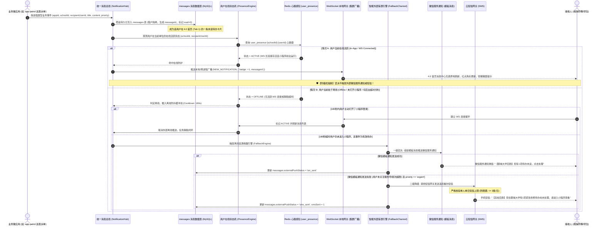

#### 统一消息中枢的核心技术防线：
1. **子应用零外部依赖**：
   - 任何微应用（`app-patrol`、`app-feedback`、`app-inspection` 等）内部严禁直接调用短信或微信 API；
   - 所有业务节点（如“师傅被指派”、“师生建议获答复”、“工单质检被驳回”）统一发射规范的 `AppNotificationEvent` 给 `NotificationHub`；
2. **两级消息物理存储与入流**：
   - 所有事件无论用户是否在线，第一步必须持久化落盘到 `messages` 租户表中；
   - 保证用户任何时候打开 4.0 微信小程序，首页（Tab 1）消息中心都能完整呈现历史未读待办；
3. **Redis 在线感知引擎 (`PresenceEngine`)**：
   - 当小程序建立 WebSocket 连接时，写入 Redis 键 `user_presence:{schoolId}:{userId}` 并设置 60 秒 TTL；
   - 小程序前台每 25 秒上报心跳 Ping 自动续期，切后台或退出时发送 `leave` 指令主动注销；
   - 若探测到用户在线，**坚决杜绝一切外部短信与微信模板骚扰**；
4. **离线防抖缓冲池 (180s Cooldown)**：
   - 刚刚派单的前 3 分钟内先进入缓冲队列，防止派单员刚刚在系统点派单、接单师傅恰好正准备进系统就被外部短信猛烈轰炸；
5. **双阶穿透与资费防刷盾**：
   - 优先通过微信模板消息零成本触达；
   - 仅在模板发送失败且工单标记为紧急/即将超时时，才平滑降级调用云短信，并在 Redis 中记录 `sms_daily_count:{schoolId}:{userId}`，单人单日上限强制卡死为 3 条，彻底封死后勤短信资费失控的漏洞；
6. **微应用专属卡片消息管道 (Card Message Pipeline)**：
   - 任何微应用（`app-patrol`, `app-feedback` 等）严禁输出散碎纯文本，统一通过 `CardBuilder` 组装结构化 `AppNotificationCardDTO`，入库至 `messages.cardPayloadJson`；
   - 消息聚合引擎 `/api/notification/sessions` 按照 `appId` 分组聚合，关联 `apps` 表输出应用官方高清头像与全称，作为首页服务会话入口；
   - 微应用专属端点 `/api/notification/app-feed` 提供带租户隔离的 100% 全量卡片流分页拉取；
7. **卡片原地状态机演进引擎 (Card Action Engine - `/api/notification/card-action`)**：
   - 响应卡片上的原生交互按钮点击（如“立即接单抢修”），后端统一解包并交由领域微服务执行行级锁事务状态流转；
   - 状态流转成功后，原子改写 `messages.cardPayloadJson` 快照（状态胶囊演进为“处理中”，主按钮演进为“现场完工交卷”，附加时间存根），并广播 `CARD_MUTATED`；
   - 前端卡片原地形变刷新，杜绝了传统系统发新消息刷屏的弊端。

---

### 5.5 零脏数据防线：Saga 逆序撤回栈与行级锁在业务中的全面落地

以最为核心复杂的**「整改施工交卷 (`handlePatrol`)」**业务场景为例，新版架构的执行流程具备绝对的事务强一致性与多租户安全：

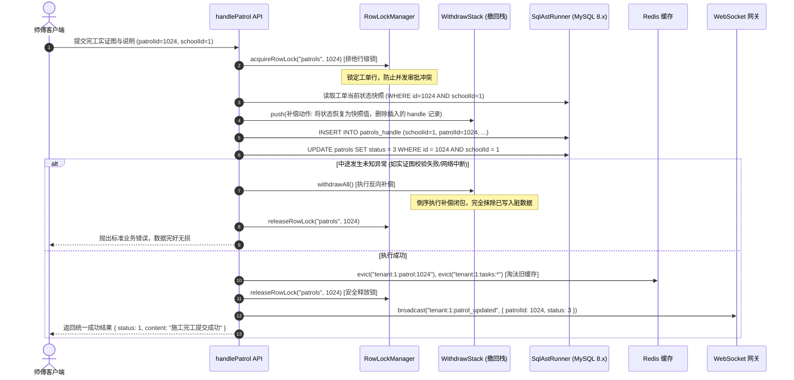

---

### 5.6 四进程集群环境与 Redis WebSocket 跨节点广播总线

在生产部署中，后端采用四进程并行集群模型，通过 Redis Pub/Sub 实现无锁分布式长连接同步：
- **进程拓扑**：单机拉起 4 个 Backend 独立微服务进程（分别绑定 HTTP 8001~8004，WS 9001~9004），前端通过 Nginx 轮询负载均衡；
- **防环跨进程广播 (`redisWsBridge.ts`)**：
  - 师傅在节点 1 提交完工，节点 1 向 Redis 频道 `ws:cluster:broadcast` 广播事件并打上该节点的全局唯一指纹 `originNodeId`；
  - 节点 2、3、4 监听到广播后，核验指纹非自身发出，向各自维护的 WebSocket 本地客户端推送消息；
  - 节点 1 接收到自身发出的广播时自动忽略，彻底杜绝广播环路与消息风暴。

---

### 5.7 阿里云 OSS 多租户目录隔离与直传防盗链

所有巡查实证照片、施工前后高清对比图与会话附件均采用**租户物理路径隔离策略**：
- **目录隔离规范**：`oss://bucket-quickpatrol/school_{schoolId}/patrol_{patrolId}/{uuid}.jpg`；
- **前端直传直签**：客户端通过 `GET /api/file/sign` 获取 60 秒有效期的 Policy 与 Signature，直传 OSS，减轻后端网络带宽压力；
- **敏感照片防盗链**：涉及寝室隐私与敏感资产的图片，系统生成带 300 秒有效期的私有签名临时 URL 渲染，杜绝链接外泄。

---

### 5.8 终端彩色结构化日志体系 (LocalTerminalLogger)

系统内置高吞吐本地终端彩色日志器，按租户、模块、进程 ID 分级渲染：
- `[INFO] [NODE-1] [Tenant:1] [PatrolService] Order #LCU-001 state changed: 1 -> 3` (亮绿)；
- `[WARN] [NODE-3] [Tenant:2] [PlanQuota] School quota reaching 90% threshold` (亮黄)；
- `[ERROR] [NODE-2] [Tenant:1] [FlowLock] Circuit breaker tripped: cannot delete dept with active tasks` (亮红)；
毫秒级异步无锁写入，兼顾极致排障效率与零 CPU 阻塞。

---

## 六、 前后端接口契约与多租户 API 全景规划

所有 API 均遵循统一的多租户请求契约规范：
- **请求头**：
  - `Authorization: Bearer <JWT_TOKEN>` (Token 内部 Payload 包含 `schoolId`, `userId`, `role`)；
  - `X-School-Id: <schoolId>` (由小程序客户端显式携带，作为租户路由标识)；
  - `X-Origin-Device: MiniProgram`；
- **响应体**：`{ status: 1, content: T, message?: string }` 或 `{ status: -1, content: null, message: "错误原因" }`。

### 6.1 核心 TypeScript DTO 契约定义

```typescript
/** 1. 巡查工单完整结构契约 (多租户强类型) */
export interface PatrolDetailDTO {
  id: number;
  schoolId: number;       // 所属大学租户 ID
  schoolName: string;     // 所属大学全称
  userId: number;
  campusId: number;
  campusName: string;
  categoryId: number;
  categoryName: string;
  status: 0 | 1 | 2 | 3 | 4 | 5; // 0草稿, 1待处理, 2延期, 3满意度调查, 4完成, 5驳回拒绝
  statusText: string;
  statusColor: string;
  description: string;
  locationName: string;
  locationAddress: string;
  latitude?: number;
  longitude?: number;
  images: string[];
  createdAt: string;
  endTime: string;
  isOverdue: boolean;
  overdueText: string;
  
  // 延期链表
  delays: {
    index: number;
    delayTime: string;
    delayUserId: number;
    delayUserName: string;
  }[];
  
  // 施工完工留痕
  handleRecord?: {
    id: number;
    masterId: number;
    masterName: string;
    masterPhone: string;
    images: string[];
    description: string;
    handledAt: string;
  };
  
  // 评价信息
  feedback?: {
    rating: 1 | 2 | 3 | 4 | 5;
    comment: string;
    ratedAt: string;
  };

  // 动态操作权限矩阵 (供前端直接渲染按钮栏)
  permissions: {
    canHandle: boolean;   // 是否可施工完工
    canDelay: boolean;    // 是否可申请延期
    canReview: boolean;   // 是否可质检驳回
    canFeedback: boolean; // 是否可评价打分
    canPriority: boolean; // 是否可加急催办
    canDelete: boolean;   // 是否可物理删除
  };
}

/** 2. 飞书式多级部门树节点契约 (无限级组织架构) */
export interface DepartmentNodeDTO {
  id: number;
  schoolId: number;
  name: string;
  parentId: number | null;
  path: string;           // 路径物化，形如 "/1/3/7/"
  leaderId: number | null;
  leaderName?: string;
  leaderAvatar?: string;
  memberCount: number;    // 直属在职人数
  activePatrolCount: number; // 部门在办未结工单数 (供 Flow Lock 校验展示)
  children?: DepartmentNodeDTO[];
}

/** 3. 岗位职能标签与人员绑定契约 (随岗不随人) */
export interface TagAssignmentDTO {
  id: number;
  schoolId: number;
  name: string;           // 标签名称，如 "高压电工特勤"
  color: string;          // Windows Metro 颜色标识 (如 "#0078D7")
  departmentId: number;
  departmentName: string;
  description: string;
  activePatrolCount: number; // 当前挂载在途未办结工单数
  members: {
    userId: number;
    userName: string;
    avatarUrl: string;
    phone: string;
    role: number;
    assignedAt: string;
  }[];
}

/** 4. 多场景会话室全景契约 (支持工单直连、1v1私聊、科室/突发应急群聊) */
export interface ChatRoomDetailDTO {
  id: number;
  schoolId: number;
  patrolId: number | null;
  roomType: 'patrol' | 'direct' | 'group';
  title: string;
  initiatorUserId: number;
  initiatedByHandler: boolean;
  status: 0 | 1;          // 0开启, 1已归档/解散
  pinnedMessageId?: number | null;
  pinnedMessageContent?: string | null;
  members: {
    userId: number;
    userName: string;
    avatarUrl: string;
    memberRole: 0 | 1 | 2; // 0普通, 1管理员, 2群主
    lastReadMessageId: number;
  }[];
  unreadCount: number;
  latestMessage?: {
    id: number;
    senderId: number;
    senderName: string;
    messageType: 'text' | 'image' | 'card' | 'system';
    content: string;
    createdAt: string;
  };
}

/** 5. 聊天消息传输契约 (支持类 QQ 撤回、引用回复与工单实证直转) */
export interface ChatMessageDTO {
  id: number;
  chatRoomId: number;
  schoolId: number;
  senderId: number;
  senderName: string;
  senderAvatar: string;
  messageType: 'text' | 'image' | 'card' | 'system';
  content: string;
  answerMessageId?: number | null; // 引用回复的消息 ID
  answerMessagePreview?: string | null; // 引用的源消息摘要快照
  status: 0 | 1; // 0正常, 1已撤回 (2分钟内允许撤回)
  isWithdrawn: boolean;
  canWithdraw: boolean; // 前端计算：发信人且距发送未超 120 秒
  createdAt: string;
}

/** 6. 学校 SaaS 付费级别与用量配额契约 */
export interface SchoolPlanDTO {
  schoolId: number;
  schoolCode: string;
  schoolName: string;
  logoUrl: string;
  planLevel: 'free' | 'standard' | 'enterprise'; // 付费级别
  planLevelText: string;
  planType: 'monthly' | 'unlimited';            // 限额模式
  expireDate: string;                           // 到期截止时间 (YYYY-MM-DD)
  isExpired: boolean;                           // 是否已逾期
  daysRemaining: number;                        // 剩余有效天数
  monthlyLimit: number;                         // 每月配额上限 (0为无限)
  monthlyUsed: number;                          // 本月已消耗工单数
  monthlyRemaining: number;                     // 本月剩余可用配额
  allowNewPatrols: boolean;                     // 当前是否允许提报新工单
}

/** 7. 学校自定义参数与大模型凭证契约 */
export interface SchoolSettingDTO {
  schoolId: number;
  settings: Record<string, string>; // 动态键值对字典
  llmConfig: {
    aiModel: string;
    aiBaseUrl: string;
    isApiKeyConfigured: boolean;   // API Key 是否已配置 (密文脱敏保护，不回传原文)
    aiTemperature: number;
    aiSystemPrompt: string;
  };
}

/** 8. AI Agent 会话与受控工具执行记录契约 */
export interface AiAgentSessionDTO {
  sessionId: number;
  schoolId: number;
  userId: number;
  title: string;
  messageCount: number;
  totalTokensUsed: number;
  createdAt: string;
  updatedAt: string;
  recentMessages?: {
    id: number;
    role: 'user' | 'assistant' | 'tool';
    content: string;
    toolCalls?: {
      toolName: string;
      arguments: any;
      resultSummary?: string;
    }[];
    createdAt: string;
  }[];
}

/** 9. 校园公开空间双轨动态与互动契约 */
export interface PostFeedDTO {
  id: number;
  schoolId: number;
  title: string;
  content: string;
  images: string[];
  viewCount: number;
  likeCount: number;
  commentCount: number;
  isLikedByMe: boolean;
  isOfficialNotice: boolean; // 是否官方通知公告
  isPatrolBroadcast: boolean; // 是否报修完工荣誉展示
  patrolId?: number | null;
  authorName: string;
  authorAvatar: string;
  createdAt: string;
  comments?: PostCommentDTO[];
}

export interface PostCommentDTO {
  id: number;
  postId: number;
  userId?: number | null;
  authorName: string;
  authorAvatar: string;
  isVisitor: boolean; // 是否访客免登录评论
  content: string;
  createdAt: string;
}

/** 10. 用户双身份与四维权限矩阵契约 */
export interface UserIdentityDTO {
  userId: number;
  schoolId: number;
  schoolName: string;
  openId: string;
  name: string;
  phone: string;
  avatarUrl: string;
  currentRole: number; // 0学生, 1教职工, 2师傅, 3科室主管, 4校管, 9超管
  roleText: string;
  activeType: 1 | 2;   // 1普通师生提报身份, 2后勤运维处理身份
  availableIdentities: {
    type: 1 | 2;
    typeName: string;
    desc: string;
  }[];
  handlerPermissions?: {
    canHandle: boolean;
    canReview: boolean;
    canDelay: boolean;
    authorizedCampusIds: number[];
    authorizedCategoryIds: number[];
    assignedTagIds: number[];
  };
}

/** 11. 工作台微应用元数据契约 (飞书式 Micro-App) */
export interface AppManifestDTO {
  appId: string;            // 'app-patrol' | 'app-feedback' | 'app-master-desk' | 'app-inspection' | 'app-campus-space' | 'app-org-center' | 'app-cockpit'
  name: string;             // 微应用名称: "隐患巡查", "师生诉求"
  icon: string;             // 矢量图标路径 (SVG / WebP)
  category: 'report' | 'maintenance' | 'governance' | 'admin';
  requiredRoles: number[];  // 准入权限角色 [0, 1, 2, 3, 4, 9]
  badgeCount: number;       // 动态待办红点数量
  entryPath: string;        // 小程序分包跳转路径
  description: string;      // 功能描述
  isPublic: boolean;        // 是否免密开放访客
  isLocked: boolean;        // 当前用户是否受限锁定 (未登录或无权)
  isCustomFavorite: boolean;// 是否被用户置顶加入“我的常用”
}

/** 12. 全景日历日程与排班事件契约 */
export interface ScheduleEventDTO {
  id: number;
  schoolId: number;
  eventType: 'patrol_sla' | 'duty_shift' | 'major_maintenance' | 'inspection_task';
  title: string;
  description?: string;
  targetDate: string;       // YYYY-MM-DD
  startTime: string;        // HH:mm
  endTime: string;          // HH:mm
  status: 'normal' | 'warning' | 'overdue' | 'completed';
  urgencyLevel: 0 | 1 | 2;  // 0普通, 1黄色预警, 2红色紧急
  remainingHours?: number;  // 工单履约剩余倒计时 (小时)
  dutyMasterName?: string;  // 当日值班责任师傅
  dutyMasterPhone?: string; // 值班师傅电话
  relatedPatrolId?: number; // 关联巡查工单 ID
}

/** 13. 统一消息中枢待办与外部穿透事件契约 */
export interface AppNotificationEventDTO {
  id: number;
  messageId: number;
  schoolId: number;
  schoolName: string;
  appId: string;            // 来源应用: 'app-patrol', 'app-feedback' 等
  appName: string;          // 来源应用名称
  senderId: number;
  senderName: string;
  title: string;
  content: string;
  linkUrl: string;          // 小程序内部跳路由
  priority: 'low' | 'normal' | 'urgent';
  isRead: boolean;
  externalPushStatus: 'none' | 'wx_sent' | 'sms_sent' | 'failed';
  createdAt: string;
}

/** 14. 侧边抽屉多单位切换契约 (同手机号绑定 × 本机登录历史存根) */
export interface DeviceTenantAccountDTO {
  schoolId: number;
  schoolCode: string;
  schoolName: string;
  schoolLogo: string;
  boundPhone: string;          // 绑定的主手机号 (用于严格同手机号比对)
  userId: number;
  realName: string;
  userRole: number;
  userRoleText: string;
  campusName: string;
  sessionStatus: 'active' | 'valid' | 'expired'; // active:当前使用中, valid:本机会话有效, expired:登录已过期需续期
  tokenExpireAt: string;       // Token 预定过期绝对时间
  lastLoginAt: string;         // 本机最后活跃时间戳
  unreadCount: number;         // 该高校名下待办未读红点数字 (即使过期依然能实时感知)
  isCurrent: boolean;          // 是否当前正在生效
}

export interface TenantDrawerDTO {
  currentSchoolId: number;
  currentSchoolName: string;
  currentSchoolLogo: string;
  currentUserPhone: string;    // 当前主认证手机号 (严格以此手机号过滤名下单位)
  deviceAccounts: DeviceTenantAccountDTO[]; // 严格限定：同手机号 且 在当前物理设备曾登录过 (含已过期) 的高校账号
}

/** 15. 微应用专属富交互卡片流契约 (100% Rich Interactive Cards) */
export interface CardField {
  label: string;             // 字段名 (如 "工单编号", "隐患点位", "故障类别", "履约倒计时")
  value: string;             // 字段值
  isHighlight?: boolean;     // 是否高亮着色 (如黄色/红色预警)
  highlightColor?: string;   // 自定义色标 (如 "#FF5252")
}

export interface CardAction {
  id: string;                // 动作唯一标识 (如 "accept_patrol", "view_detail", "call_phone", "complete_work")
  label: string;             // 按钮展示文本 (如 "⚡ 立即接单抢修", "查看工单全貌", "📞 电话联系")
  actionType: 'inline_api' | 'navigate' | 'phone_call' | 'preview_images'; // 交互类型: 原地流转 | 分包跳转 | 系统拨号 | 画廊全屏大图
  isPrimary?: boolean;       // 是否为主高亮按钮 (科技蓝背景)
  disabled?: boolean;        // 是否置灰禁用 (防重复点击)
  endpoint?: string;         // inline_api 后端处理端点
  routePath?: string;        // navigate 目标小程序微应用分包页面
  payload?: Record<string, any>; // 动作携带参数 (如 { patrolId: 1042, action: 'accept' })
}

export interface AppNotificationCardDTO {
  cardId: number;            // 消息主键 ID (对应 messages.id)
  schoolId: number;          // 所属高校租户 ID
  appId: string;             // 来源微应用标识 (如 'app-patrol', 'app-feedback', 'app-inspection')
  appName: string;           // 来源微应用名称 (如 "后勤巡查应用 / 巡查助手")
  appIcon: string;           // 微应用专属高清矢量图标 (SVG / WebP)
  
  // 卡片头部
  header: {
    badgeText: string;       // 事件分类徽章 (如 "【工单指派通知】", "【SLA到期预警】")
    statusText: string;      // 业务状态胶囊 (如 "待接单", "处理中", "已超时", "已办结")
    statusColor: string;     // 状态色标 (如 "#0066FF", "#00D2B4", "#8A2BE2", "#00C853")
    timestampText: string;   // 友好时间戳 (如 "今天 14:32")
    urgencyLevel: 'normal' | 'warning' | 'urgent'; // 紧迫度
  };

  // 卡片主体
  body: {
    title: string;           // 卡片核心摘要标题
    fields: CardField[];     // 结构化键值对列表
    images?: string[];       // 现场取证高清图片缩略图 (点击原生画廊大图预览)
    summaryText?: string;    // 详细文字补充说明或官方答复内容
  };

  // 卡片底部交互动作条
  actions: CardAction[];     // 1~3 个动态操作按钮

  // 卡片原地状态机存根 (In-Place Mutation Log)
  mutationHistory?: {
    actionTaken: string;     // 已执行的操作 (如 "已接单")
    operatorName: string;    // 经办人姓名
    operatedAt: string;      // 经办时间戳
    hintText: string;        // 原地呈现的存根文本 (如 "✓ 您已于 14:35 确认接单")
  };

  isRead: boolean;           // 是否已读
  createdAt: string;         // 创建时间
}

/** 16. 首页微应用聚合服务会话条目契约 (Tab 1 Session Item) */
export interface AppSessionDTO {
  sessionId: string;         // 会话唯一ID (如 "app:app-patrol")
  appId: string;             // 微应用ID ('app-patrol', 'app-feedback', 'app-inspection' 等)
  appName: string;           // 微应用官方专属名称 ("后勤巡查应用 / 巡查助手")
  appIcon: string;           // 微应用官方专属高清图标
  appCategory: string;       // 类别
  lastMessageSnippet: string;// 最新一条卡片摘要 (如 "[待接单] #LCU-012 教学楼水管跑水抢修")
  lastMessageAt: string;     // 最新消息时间戳
  unreadCount: number;       // 当前微应用未读待办红点数量
  isPinned: boolean;         // 是否置顶
}

/** 17. 微应用专属卡片流分页响应契约 (`/api/notification/app-feed`) */
export interface AppCardFeedResponseDTO {
  appId: string;
  appName: string;
  appIcon: string;
  schoolName: string;
  totalCards: number;
  unreadCount: number;
  cards: AppNotificationCardDTO[]; // 100% 富交互卡片列表
  hasMore: boolean;
}

/** 18. 卡片原地操作请求与响应契约 (`/api/notification/card-action`) */
export interface CardActionRequestDTO {
  messageId: number;
  appId: string;
  actionId: string;
  actionType: string;
  payload?: Record<string, any>;
}

export interface CardActionResponseDTO {
  messageId: number;
  success: boolean;
  updatedCard: AppNotificationCardDTO; // 原地更新后的最新卡片快照
  toastMessage?: string;
}
```

---

### 6.2 全系统 45+ 核心 API 路由与多租户契约清单

系统所有请求严格受控于多租户网关与 JWT 校验拦截器，全系统 45+ 核心业务端点规范矩阵如下：

| 请求路径 (`Path`) | Method | 权限门禁 (`Role/Auth`) | 核心参数与功能描述 | 架构安全与底层机制 |
| :--- | :---: | :--- | :--- | :--- |
| **`/api/school/info`** | `GET` | 公开免登录 | `schoolCode` ➔ 获取学校全称、校徽、网格字典及开放状态 | 走 Redis 10分钟租户级强缓存，冷数据免查库 |
| **`/api/school/plan`** | `GET` | 校管(`role=4`) / 超管(`role=9`) | 获取本校付费级别 (`planLevel`)、配额模式 (`planType`)、已用配额与到期时间 | 实时计算剩余天数与剩余额度 |
| **`/api/school/plan/renew`** | `POST` | 超级管理员(`role=9`) | 调整指定学校的付费级别、配额上限或续费到期时间戳 | 超管专属审计日志归档，更新后自动清除租户配额缓存 |
| **`/api/school/settings`** | `GET` | 学校管理员(`role=4`) | 获取本校动态参数字典及大模型配置（敏感 Key 密文脱敏返回） | 租户动态配置，按 `schoolId` 隔离提取 |
| **`/api/school/settings`** | `POST` | 学校管理员(`role=4`) | 批量保存本校参数（支持更新 OpenAI Key/URL/Model/Prompt） | AES-256-GCM 密文存储，内存凭证热生效 |
| **`/api/school/settings/test-llm`**| `POST`| 学校管理员(`role=4`) | 测试当前配置的异构大模型端点连通性与可用性 | 5秒超时健康探测，返回往返延迟与首字测试响应 |
| **`/api/user/wx-login`** | `POST` | 公开免登录 | `code, schoolCode, userInfo` ➔ 微信授权登录绑定指定学校 | 租户感知，联合唯一键 `(schoolId, openId)` 验签签发 JWT |
| **`/api/user/profile`** | `GET` | 已登录用户 | 获取当前登录用户的多身份列表、当前所处身份及四维权限矩阵 | 整合 `v_handlers_matrix` 视图秒级返回 |
| **`/api/user/profile/update`**| `POST` | 已登录用户 | 更新姓名、联系手机号、个性头像（支持脱敏校验） | 手机号全局格式校验，同步更新缓存 |
| **`/api/user/switch-role`** | `POST` | 具有处理资质的复合用户 | 显式切换激活态身份 (`activeType: 1` 师生 ⇄ `2` 后勤处理人) | 刷新 Session 状态，前端平滑无感局部切换 TabBar |
| **`/api/user/device-tenants`**| `POST`| 已登录用户 | **本机抽屉多单位核验与红点聚合**：客户端上传当前手机号与本地已知学校列表 (`deviceSchoolIds[]`)，校验并返回名下各校最新会话有效状态 (`active`/`valid`/`expired`) 与未读红点数 | 严格遵循“同手机号绑定 + 本机登录存根”，支持过期态跨校未读感知 |
| **`/api/auth/quick-renew`** | `POST` | 公开 / 快速续期 | **已过期单位原地快捷免密续期**：`schoolId, phone, wxPhoneCode / smsCode` ➔ 校验同手机号后原地快速换发新 Token 完成续期 | 原地半屏呼起，免硬跳转直接切入目标大学工作台 |
| **`/api/user/tenants/switch`**| `POST`| 已登录用户 | **一键无感穿梭切换单位**：`targetSchoolId` ➔ 刷新签发目标学校租户 JWT | 重新绑定 WS 广播租户通道，0 白屏刷新工作台 |
| **`/api/user/batch-update`**| `POST` | 学校管理员(`role=4`) | 移动端多选批量更新用户所属科室部门、批量启停用、重置密码 | 批量事务提交，联动 WebSocket 下线被停用账号 |
| **`/api/workplace/apps`** | `GET` | **支持免密访客** / 已登录 | **飞书工作台微应用矩阵**：拉取当前学校所有子应用清单与门禁状态 | 自动根据用户角色与登录态标注 `isLocked` 与未读角标 |
| **`/api/workplace/sort`** | `POST` | 已登录用户 | 保存用户个性化工作台常用应用排序与“我的常用”置顶列表 | 用户偏好持久化至本地与服务端，毫秒级生效 |
| **`/api/calendar/events`** | `GET` | 已登录用户 | `month` ➔ 获取当前月份工单 SLA 履约倒计时、排班日历与维保大件 | 聚合个人待办与全校重大工程，返回光圈状态 |
| **`/api/calendar/duty`** | `GET` | 已登录用户 | `date` ➔ 获取当日各校区各职能标签值班师傅信息与一键拨号 | 方便师生及管理人员紧急值班快速协同 |
| **`/api/notification/sessions`** | `GET` | 已登录用户 | **4.0 首页全能消息大盘会话流**：聚合拉取包含各微应用专属服务会话（专属头像、微应用官方全称、最新卡片摘要、未读红点数）与类 QQ 聊天会话 | 关联 `apps` 表，支持会话置顶与分类过滤 (`all`, `tasks`, `chat`, `system`) |
| **`/api/notification/app-feed`** | `GET` | 已登录用户 | **微应用专属卡片消息流**：`appId, page, pageSize` ➔ 拉取指定微应用专属页面内的 100% 全量富交互卡片流 | 包含每张卡片 Header/Body/Actions，支持游标分页与未读状态 |
| **`/api/notification/card-action`**| `POST`| 具有对应权限用户 | **卡片原地交互与状态机演化**：`messageId, appId, actionId` ➔ 响应卡片内部操作按钮（如立即接单），原子执行业务状态流转，回写并返回原地演变后的最新卡片快照 | 避免重复派发新卡片垃圾消息，支持 WebSocket 全端同步 `CARD_MUTATED` |
| **`/api/notification/read`** | `POST` | 已登录用户 | `messageId` ➔ 将指定微应用待办通知标记为已读 | 更新数据库并原子同步清空首页红点未读数字 |
| **`/api/notification/clear-all`**|`POST`| 已登录用户 | 一键消除当前学校全部非紧急消息的未读红点 | 批量将当前用户当前租户的所有待办标为已读 |
| **`/api/patrol/create`** | `POST` | 普通师生(`role=0/1`) | 提交巡查报修（包含校区、分类、隐患描述、照片列表、坐标） | **SaaS 商业守门拦截器**：前置校验学校到期与月配额上限 |
| **`/api/patrol/list`** | `GET` | 已登录用户 | 多维度检索工单列表（支持按 `status`, `campusId`, `categoryId`, 关键词） | 动态 AST 注入 `schoolId`，支持分页游标拉取 |
| **`/api/patrol/detail`** | `GET` | 已登录用户 | 获取工单全景详情（包含流转履历、延期记录、施工证明、评价） | 整合 `v_patrol_details`，并附带动态权限矩阵按钮清单 |
| **`/api/patrol/handle`** | `POST` | 责任处理人(`type=1`) | 上传整改后照片、施工耗材说明，完工提交交卷 (`status: 1->3`) | **InnoDB 行级排他锁 + Saga 补偿事务**，防重复交卷 |
| **`/api/patrol/delay`** | `POST` | 责任处理人(`type=1`) | 申请工单延期，提交延期截止时间戳与延期原因 (`status: 1->2`) | 状态机硬核校验，记录写入不可篡改延期履历子表 |
| **`/api/patrol/review`** | `POST` | 验收复核人(`type=2`) | 到场实地复核：评定验收合格办结 (`3->4`) 或质检不合格驳回 (`3->5`) | 状态流转原子落盘，触发微信订阅消息与服务号模板推送 |
| **`/api/patrol/feedback`** | `POST` | 工单发起人(`userId`) | 完工后师生打分评价 (1~5星) 与感谢留言 | 联合唯一索引 `(schoolId, patrolId)` 杜绝并发刷好评 |
| **`/api/patrol/delete`** | `POST` | 学校管理员(`role=4`) | 物理彻底删除废弃工单与关联留痕记录 | 软硬双删受控，操作纳入管理员高危审计日志 |
| **`/api/patrol/export`** | `GET` | 学校管理员(`role=4`) | 导出本校报修全景台账为 Excel 表格 | **内置高德地图现场定位二维码直连嵌入**，方便审计 |
| **`/api/chat/initiate`** | `POST` | 责任处理人 / 学校管理员 | **类 QQ 聊天主动唤醒**：`patrolId`，责任人主动联系提报师生 | 解除静默锁定，建立专属双向通道并推送微信服务卡片 |
| **`/api/chat/sessions`** | `GET` | 责任处理人 / 管理员 | **后勤类 QQ 会话大盘**：拉取会话列表（置顶优先、未读红点排序） | 整合 `v_chat_sessions` 视图，毫秒级盯盘交互 |
| **`/api/chat/messages`** | `GET` | 会话参与双方 | `chatRoomId, beforeId, limit` ➔ 触顶倒序历史消息漫游 | 支持游标分页，结合本地 LocalStorage 离线消息比对 |
| **`/api/chat/send`** | `POST` | 会话参与双方 (需已激活) | 发送消息（支持文字、图片、引用回复、工单快照卡片） | 经过安全合规敏感词过滤，推入 Redis 跨节点 Pub/Sub |
| **`/api/chat/withdraw`**| `POST` | 消息发信人 / 管理员 | **类 QQ 2分钟撤回机制**：超过 120 秒拒绝撤回，撤回后推送占位符 | 原子更新状态为 1，向会话全员广播 `message_withdrawn` |
| **`/api/chat/read`** | `POST` | 会话参与双方 | 进入聊天室窗口，原子重置本会话未读计数器 | 批量更新 `chat_room_members.last_read_message_id` |
| **`/api/chat/pin`** | `POST` | 责任处理人 / 管理员 | `chatRoomId, isPinned` ➔ 后勤人员专属置顶会话切换 | 用户个人偏好持久化，毫秒级热生效 |
| **`/api/chat/groups`** | `GET` | 已登录用户 | 获取当前用户加入的科室协同与突发险情应急救援群聊列表 | 多场景区分：工单临时群、科室班组群、防汛应急大群 |
| **`/api/chat/group/create`**| `POST` | 后勤科室长 / 管理员 | 创建跨部门突发险情处置应急群聊（指定群名、群主与初始成员） | 批量建立成员关联，即时推送群建立通知 |
| **`/api/chat/group/members`**| `POST` | 群主 / 群管理员 | 邀请新成员加入、踢出成员或转让群主权限 | 严格群角色阶梯鉴权校验，成员变更全群广播 |
| **`/api/department/tree`** | `GET` | 已登录用户 | 获取本校完整飞书式无限级组织架构树（含物化路径与在办工单数） | 递归组装树形结构，前端即收即用零二次计算 |
| **`/api/department/create`**| `POST` | 学校管理员(`role=4`) | 创建组织节点（指定名称、负责人、父级部门 ID，自动生成 `path`） | 深度支持无限嵌套与权限向下辐射继承 |
| **`/api/department/update`**| `POST` | 学校管理员(`role=4`) | 更新部门名称、负责人、排序权重或在组织树中整体平移挂载 | 物化路径动态批量重算更新 |
| **`/api/department/delete`**| `POST` | 学校管理员(`role=4`) | 删除部门节点（**强制 Flow Lock 熔断探针**：存在在途工单时强行阻断） | 彻底消灭责任真空与死工单隐患 |
| **`/api/tag/list`** | `GET` | 后勤人员 / 管理员 | 获取全校岗位职能标签库列表（含 Windows Metro 色标与当前持有人） | 整合 `v_tag_assignments`，支持标签检索 |
| **`/api/tag/create`** | `POST` | 学校管理员(`role=4`) | 新增或编辑岗位标签名称、Hex 颜色标识、挂载科室与描述 | 租户唯一校验，构建随岗不随人的职能基座 |
| **`/api/tag/transfer`** | `POST` | 学校管理员(`role=4`) | **人员轮岗一键无缝交接**：将岗位标签由师傅 A 移交至师傅 B | 工单责任流转秒级平移，历史工单责任链条完整保留 |
| **`/api/tag/delete`** | `POST` | 学校管理员(`role=4`) | 注销岗位职能标签（**前置 Flow Lock 熔断探针**：在途工单未解绑前阻断） | 确保业务连续性防线不被破坏 |
| **`/api/ai/chat`** | `POST` | 已登录用户 | **专属 AI Copilot 智能问答**：SSE 长连接流式输出，支持 7 大工具自动执行 | 动态提取本校配置，受控工具安全沙箱沙化执行 |
| **`/api/ai/sessions`** | `GET` | 已登录用户 | 获取当前用户在当前学校的 AI 历史会话列表（分页漫游） | 隔离各校会话历史，按更新时间倒序呈现 |
| **`/api/ai/messages`** | `GET` | 已登录用户 | `sessionId` ➔ 拉取某次会话的全部问答气泡、工具执行快照与消耗 | 审计留痕追溯，支持长连接中断后状态断点恢复 |
| **`/api/post/list`** | `GET` | **公开免登录** | `schoolCode, page, pageSize` ➔ 校园广场双轨公开瀑布流 | 支持全校免密浏览，红花荣誉榜与官方通知置顶展示 |
| **`/api/post/create`** | `POST` | 学校管理员(`role=4`) | 发布后勤空间官方通告、维保进度白皮书或温馨提示（支持图文） | 自动生成广场动态，并可选择同步微信模板全员推送 |
| **`/api/post/comment`** | `POST` | **支持访客免登录** / 已登录 | 广场动态发表公开互动评论（支持免密访客填写昵称参与治理） | 文本内容安全合规机审，杜绝恶意广告违规内容 |
| **`/api/post/like`** | `POST` | 已登录用户 | 广场动态点赞/取消点赞 | 联合唯一索引 `(schoolId, postId, userId)` 防止并发重复点赞 |
| **`/api/statistics/overview`**| `GET`| 学校管理员(`role=4`) | 获取本校宏观综合大盘：今日提报量、累计办结率、平均工时、满意度 | 走 `v_tenant_overview` 视图与分钟级聚合缓存 |
| **`/api/statistics/heatmap`** | `GET`| 学校管理员(`role=4`) | 获取校园设施老化与故障频发区空间热力图坐标数据 | 辅助生成“全校老化设施提前大修建议书” |
| **`/api/statistics/master-ranking`**| `GET`| 师生 / 师傅 / 管理员 | 查看当月保洁、水电师傅“劳动者光荣墙”好评榜与响应速度榜 | 树立一线劳动模范典型，激发师傅服务热情 |
| **`/api/upload/oss-signature`**| `POST`| 已登录用户 | 申请阿里云 OSS 直传 Policy 临时凭证（限定前缀 `schools/{schoolId}/...`） | 客户端直传不占后端网关带宽，目录完全隔离 |

---

### 6.3 核心业务交互领域端点深度剖析

#### 1. 商业化 SaaS 配额与守门拦截 (`/api/patrol/create`)
当师生在微信小程序端提报报修时，后端 `PatrolService` 会触发**两层强校验**：
```typescript
// 1. 到期拦截探针
const school = await schoolService.getSchoolById(schoolId);
if (new Date(school.expireDate).getTime() < Date.now()) {
  throw new BusinessError(403, "抱歉，您所在高校的服务授权已到期，请联系后勤管理处续期！");
}

// 2. 月度限额守门
if (school.planType === 'monthly') {
  const currentMonthUsed = await quotaService.getCurrentMonthCount(schoolId);
  if (currentMonthUsed >= school.monthlyLimit) {
    throw new BusinessError(429, `本月提报量已达上限 (${school.monthlyLimit}单)，已触发配额熔断，请联系管理员升级套餐！`);
  }
}
```

#### 2. 工单施工完工与 Saga 撤回栈 (`/api/patrol/handle`)
责任师傅完工交卷时，系统不仅落盘完工记录，同时在分布式事务管理器中预置**逆序补偿指令**：
- **正向操作**：更新 `patrols.status = 3`，插入 `patrols_handle`，自增师傅已办结计数，触发微信订阅消息推送；
- **异常捕获**：若推送或下游写库失败，按 `RollbackStack` 逆序执行补偿，将状态复原为 `status = 1`，彻底根除脏数据状态死锁。

#### 3. 飞书组织树 Flow Lock 熔断拦截机制 (`/api/department/delete` & `/api/tag/delete`)
当管理员在手机端或后台尝试注销部门或岗位标签时，底层触发探针检索在办工单：
```typescript
const activeTasks = await patrolRepository.count({
  where: { schoolId, tagId: targetTagId, status: In([1, 2, 3]) }
});
if (activeTasks > 0) {
  throw new BusinessError(409, `【业务连续性保护】该岗位标签名下尚有 ${activeTasks} 项在办工单，严禁注销！请先使用 [一键交接] 将工单转移至其他岗位！`);
}
```

#### 4. AI Copilot 智能问答 SSE 长连接架构 (`/api/ai/chat`)
前端以 HTTP POST 发起请求，后端设置响应头 `Content-Type: text/event-stream; charset=utf-8`，以标准 SSE 协议保持长连接：
- 后端动态提取该高校 `school_settings` 中配置的异构大模型端点与加密 Key；
- 模型发起 Function Call 时，后端在沙箱环境中以 `schoolId` 隔离执行并即时反馈工具结果；
- 最终结果以 Token 增量流式吐给客户端，并在检测到具体工单编号时，携带结构化 `patrol_card` 卡片事件供小程序原地渲染。

#### 5. 消息防骚扰与离线智能穿透判定实现 (`/api/notification/*`)
- **在线状态感知判定**：接收到微应用事件后，`presenceEngine.isUserOnline(schoolId, userId)` 探测客户端心跳。若当前处于活跃态，直接经由 `redisWsBridge` 广播推送进入前端消息列表，**绝对不触发外部通道**；
- **离线防抖与两级穿透**：若用户处于离线态，推入 3 分钟延迟队列。若超时仍未读，优先下发微信模板消息；若模板消息受频次限制失败且工单属于红色紧急状态，平滑降级调用云短信，并严格检查单人单日不超过 3 条短信，全面兼顾时效与资费风控。

#### 6. 微应用专属会话聚合与卡片原地状态演化实现 (`/api/notification/sessions` & `/api/notification/card-action`)
- **首页会话聚合大盘 (`/api/notification/sessions`)**：
  - 后端执行 SQL 聚合查询，按 `appId` 对微应用通知分组，并逻辑 LEFT JOIN `apps` 表拉取微应用的官方最新图标与全称；
  - 动态计算各微应用名下未读记录数 (`SUM(CASE WHEN isRead = 0 THEN 1 ELSE 0 END)`)，提取最新一条卡片的摘要标题，按最新时间倒序输出；
  - 同时联合 `chat_rooms` 表输出类 QQ 1v1 工单协同会话，实现“微应用服务号卡片流会话”与“即时聊天会话”的高效并存分流。
- **卡片原地交互与状态机流转 (`/api/notification/card-action`)**：
  - 当师傅在卡片内点击 `[ ⚡ 立即接单抢修 ]` 时，前端发起原子交互：
  ```typescript
  // 1. 获取消息与卡片快照
  const message = await messageRepo.findOne({ where: { id: messageId, schoolId } });
  const cardPayload: AppNotificationCardDTO = JSON.parse(message.cardPayloadJson);

  // 2. 路由至业务微应用执行状态流转 (以 app-patrol 为例)
  if (actionId === 'accept_patrol') {
    await patrolService.acceptOrder(schoolId, message.patrolId, currentUserId);
    
    // 3. 原地演化卡片载荷快照 (In-Place Mutation)
    cardPayload.header.statusText = '处理中';
    cardPayload.header.statusColor = '#00D2B4'; // 极光青
    cardPayload.actions = [
      { id: 'complete_work', label: '🛠️ 施工完工·现场拍照交卷', actionType: 'navigate', isPrimary: true, routePath: '/packages/apps/app-patrol/pages/handle/index' },
      { id: 'view_detail', label: '查看工单全貌', actionType: 'navigate', routePath: '/packages/apps/app-patrol/pages/detail/index' }
    ];
    cardPayload.mutationHistory = {
      actionTaken: '已接单',
      operatorName: currentUser.realName,
      operatedAt: new Date().toISOString(),
      hintText: `✓ 您已于 ${dayjs().format('HH:mm')} 确认接单`
    };

    // 4. 原地回写数据库并触发跨进程多端广播
    await messageRepo.update(messageId, { cardPayloadJson: JSON.stringify(cardPayload) });
    await redisWsBridge.broadcast(`tenant:${schoolId}:user:${currentUserId}`, {
      type: 'CARD_MUTATED',
      messageId,
      updatedCard: cardPayload
    });
  }
  ```
  - 前端收到响应后原地局部重绘该卡片，彻底消灭派发新消息刷屏的弊端。

---

## 七、 系统体验与功能颠覆升级：30+ 项前沿创新想法

为了让高校后勤巡查e速办 v4.0 真正成为全国大学数字化治理的标杆，结合师生与运维核心痛点，规划以下 **30 项前沿创新设计**：

### 🌟 视觉与交互体验革新 (UX/UI Innovations)
1. **维修前后智能滑块对比视差 (Before & After Slider)**：在公开广场与工单详情中，支持单手左右划动手势，平滑切换查看故障前破损与维修后整洁对比，直观展现后勤劳动成果；
2. **沉浸式地图巡查探索模式 (Interactive Campus Heatmap)**：在首页支持切换“地图模式”，以校园手绘底图将各校区隐患点标记为动态呼吸光圈，红/黄/绿分别代表紧急、待处理与已完工；
3. **触觉反馈与微交互动效体系 (Haptic Engine)**：点赞、接单、提交、切换身份时触发原生轻微震动反馈，关键操作有专属成功粒子动效，提升工具质感；
4. **离线弱网草稿箱与自动故障续传 (Offline Resilient Draft)**：在地下室、管道井等无信号区域巡查拍照，表单与图片暂存在客户端 LocalDB，一旦检测到网络恢复自动后台静默同步；
5. **暗黑模式与节能巡查皮肤 (True Dark Mode)**：支持夜间巡视专用深色模式，适配 OLED 屏幕低功耗显示，保护夜班维保师傅视力；

### ⚡ 智能效率与自动化派单 (Smart Operations & AI)
6. **隐患图像智能快速标签预判 (Smart Image Tagging)**：师生拍照上传水龙头漏水或电线脱落时，前端轻量端侧模型自动建议所属门类（“水电”或“照明”），减少人工选错；
7. **同类隐患合并与聚合合并上报 (Duplicate Report Dedup)**：若某处路灯损坏已被上报，其他同学在相同地理范围（50米内）扫码上报相同门类时，系统主动提醒：“已有同学于10分钟前上报该故障，您可点击[关注进度]或[补充实证]”，避免工单碎片化轰炸；
8. **网格化智能就近派单算法 (Proximity-based Task Dispatch)**：根据师傅历史接单速度与当前所处校区网格，智能加权派发最合适的第一责任人，缩短施工响应半径；
9. **SLA 超时熔断与智能多级预警 (Escalation Matrix)**：工单距离承诺截止时间剩余 20% 时触发师傅微信温和提醒；一旦超时立即向班组长升级告警；超时超过 24 小时自动上报后勤处主管领导；
10. **每日巡查路线轨迹记录与电子巡更打卡 (Patrol Route Tracker)**：针对负责安全巡检的专门师傅，支持按预设路线扫码打卡点位，系统自动生成当日巡检覆盖率报表；

### 🤝 全民共治与透明校园治理 (Campus Governance & Transparency)
11. **免密公开后勤广场与 QQ 空间式互动 (Campus Wall)**：面向全校师生完全开放的后勤新鲜事墙，打破“报修即失联”的黑盒感，让全校见证校园环境的每日改善；
12. **匿名善意诉求隐私保险箱 (Confidential Whistleblowing)**：对于反映宿舍管理、食堂食品卫生等敏感诉求，支持“绝对匿名模式”，系统对提报人 openId 实施强单向散列加盐，杜绝任何管理人员获知真实身份，消除师生顾虑；
13. **师生“校园啄木鸟”勋章荣誉积分体系 (Campus Guardian Badges)**：累计排查排除重大安全隐患、积极参与满意度评价的师生，获得电子荣誉勋章，可在年底兑换后勤文创或食堂专属优惠券；
14. **师傅好评榜与劳动者光荣墙 (Master Honor Board)**：按月聚合展示好评率最高、响应最迅速的保洁、水电师傅照片与事迹，让一线劳动者的辛苦付出获得全校师生的尊重与掌声；
15. **后勤大宗维保进度实时白皮书 (Maintenance Progress Tracker)**：对全校性暑期宿舍翻新、主干道水管改造等重大工程，设立独立里程碑进度看板，按周更新施工照片与预计通行时间；

### 🔒 移动管理中台与严密安全防护 (Admin & Security)
16. **长按批量用户调度控制台 (Multi-select Batch Actions)**：管理员手机端原生支持长按拖拽多选，批量一键修改所属院系、批量停用账号、批量重置初始密码；
17. **三维权限矩阵可视化一键开关 (Visual Permission Grid)**：管理端采用棋盘式交互，横轴为门类、纵轴为校区，轻点格子即可委派或收回权限，告别繁琐下拉列表；
18. **破坏性操作二次确认与 5 秒撤销反悔 (Undo Toast)**：删除工单、注销用户等操作，提供 5 秒内的无感一键撤销机制，防范误操作造成的灾难；
19. **现场隐患不可篡改时间戳水印相机 (Tamper-proof Timestamp Camera)**：巡查拍摄时，前端相机硬件级叠加不可篡改的校区、经纬度、北京时间与工单编号物理水印，保障审计真实性；
20. **敏感信息自动脱敏 (Privacy Masking)**：列表中的师生手机号与宿舍门牌号自动实施中间脱敏（如 `138****1234`），仅具备处理权限的对接师傅在点击拨号时解密；

### 📢 消息推送与全渠道即时触达 (Omni-channel Notification)
21. **微信小程序订阅消息智能组合授权 (One-tap Subscribe)**：利用微信一次性授权机制，在提交工单时智能打包“派单通知”、“完工通知”、“评价催办”三合一授权，提升订阅到达率；
22. **工单流转微信服务号模板消息穿透 (Service Account Push)**：结合学校官方后勤服务号，为后勤处领导与班组长提供长效无需授权的模板消息强提醒；
23. **1v1 聊天室内置工单/诉求智能卡片锚定 (Interactive In-chat Cards)**：聊天中一键发送“工单卡片”，双方实时在气泡中看到工单当前状态变化，点击卡片直接原地展开详情；
24. **短信用量智能流控与防刷盾 (SMS Budget Guard)**：对于催办短信与验证码发送，设置基于 IP、设备指纹与当日上限的多重防刷策略，保护后勤短信资费；

### 📊 数据洞察与决策分析 (Data Intelligence)
25. **全校设施老化与故障频发区热力预测 (Predictive Maintenance)**：根据历史巡查数据聚合，自动标出某楼栋水管每月报修超过 5 次，向管理处自动生成“建议全面检修建议书”；
26. **高德地图定位二维码免跳直接嵌入 Excel 导出**：管理员在后台导出台账时，Excel 中每个工单直接内嵌高德地图导航二维码图片，审计人员手机一扫直接现场复验；

### 🏢 递点类飞书组织中台与高可靠协同 (Feishu-like Org & Resilient IM)
27. **随岗不随人的标签网格派单与秒级平滑交接 (Role-over-Person Dynamic Dispatch)**：工单与责任网格直接挂接岗位职能标签，人员轮岗或离职时只需在 `tag_members` 变更映射，全校在途待办与派单逻辑 0 代码修改、秒级无感平移；
28. **业务连续性防中断 Flow Lock 熔断拦截锁 (Flow Lock Continuity Guard)**：在删除部门、停用师傅或注销职能标签时，底层主动探测其挂载的在途未结工单，存在在途工单时强制熔断阻断并报警，彻底根除死工单与责任真空；
29. **突发险情多场景高可靠群聊与 1 秒闪断缓冲 (Incident Chat & 1s Grace Buffer)**：支持工单临时群、科室班组群与跨部门联勤突击群；网络瞬断 1 秒内消息进入 Grace Buffer 自动保序，彻底消除弱网发包重试造成的重复消息；
30. **双向 WS-RPC 强回执与免跳转工单实证直转 (WS-RPC & Direct Evidence Converter)**：WebSocket 支持毫秒级 Request-Response RPC 交互模型（3 秒超时熔断）；群内收发的现场照片支持长按一键“转为工单整改证据”，免去重复保存上传流程；

### 🚀 飞书式微应用中台与智能消息穿透 (Feishu Workspace & Smart Notification)
31. **飞书同款左侧抽屉多单位无感穿梭与跨校红点聚合 (Tenant Drawer & Cross-Tenant Indicator)**：点击左上角头像滑出沉浸式抽屉，全景呈现当前微信号在全国多所高校所持角色与各自的待办未读数字，秒级无白屏热重载切换；
32. **核心业务子功能解耦微应用独立矩阵 (Decoupled Micro-App Platform)**：将原旧版系统的巡查与反馈彻底独立为 `app-patrol` 与 `app-feedback`，搭配师傅现场、巡更打卡、组织中台等微应用，工作台支持拖拽自定义排序与四级权限动态门禁过滤；
33. **在线状态实时感知与智能离线穿透防骚扰引擎 (Presence-aware Smart Fallback Engine)**：实时感知用户是否正在使用微信小程序。若在线仅经由 WebSocket 刷新 4.0 首页消息中心，绝不打扰用户；若离线超时未读，智能优先触发微信服务通知，必要时平滑降级调用云短信；
34. **全景日历日程系统与工单 SLA 履约动态倒计时 (Integrated Schedule & SLA Countdown Calendar)**：月视图与周视图平滑缩放，工单临期以黄色/红色呼吸光圈预警，值班排班表一键拨号，重大全校性维保日程一键订阅；
35. **师生建言绝对匿名隐私保险箱与官方正向公开答复机制 (Confidential Feedback Vault & Official Reply Stream)**：敏感诉求采用 OpenID 加盐单向哈希强脱敏，后勤管理处人员无法获知真实身份，官方答复流公开展示并支持师生赠送感谢卡，共筑有温度的校园治理。

---

## 八、 演进路线图：模块化、渐进式重构落地计划

为确保系统重构既不影响线上已有生产运行，又能高质量平滑迭代，采取**“模块化切分、逐一实现、单测护航、分步联调”**的演进路径：

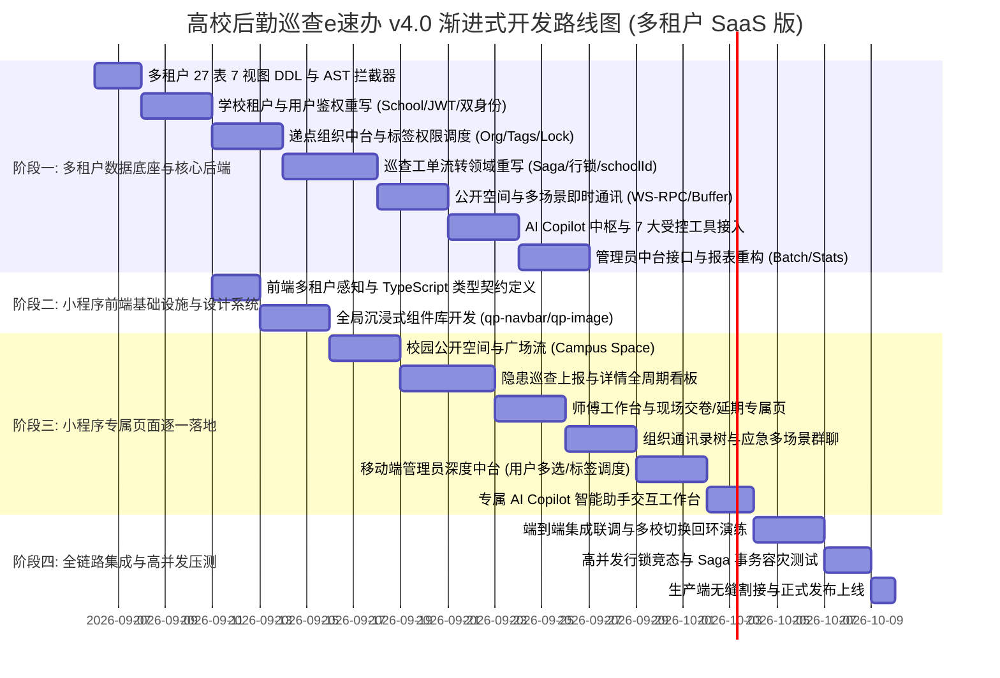

### 实施承诺与准则
1. **绝不搞一次性全量冒险重写**：每一次开发聚焦单一模块（例如“首先建立多租户数据库与打通用户认证中心”）；
2. **前后端接口严格契约先行**：每次开发新页面前，必须先在 `api/` 目录下确立带 `schoolId` 的 TypeScript DTO 契约；
3. **单元测试与类型检查 100% 覆盖**：代码入库前必须跑通 `npm test` 与 `tsc --noEmit`，确保 0 错误、0 警告；
4. **边边角角无死角自测**：每个页面均经过断网、弱网、空数据、长文本溢出、高分辨率屏幕的严格适配校验。
