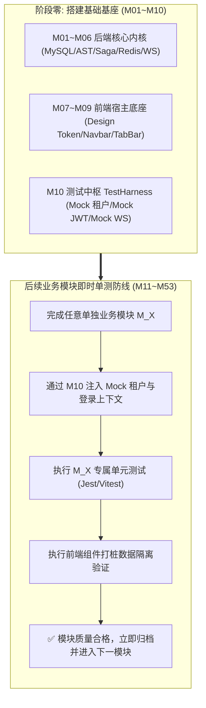
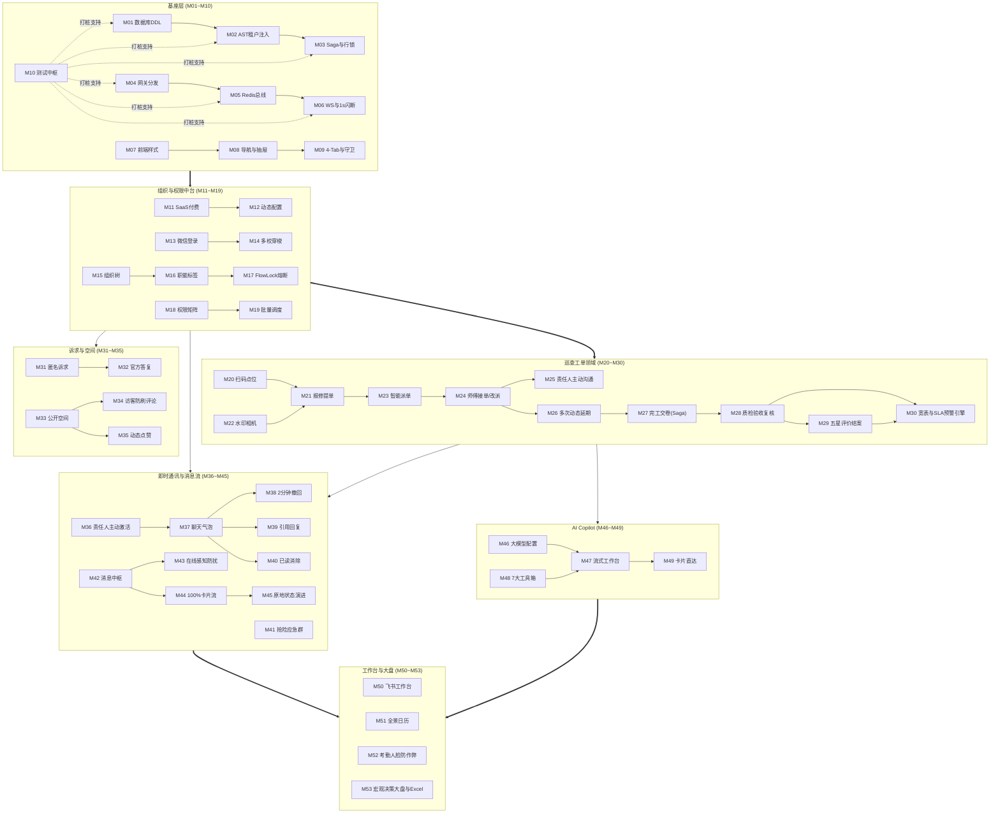

# 高校后勤巡查e速办 v4.0 全系统严谨模块化拆分与详细设计规划方案

> **项目代号**：高校后勤巡查e速办 (QuickPatrol) v4.0  
> **文档定位**：全系统全生命周期工程级模块化拆分、详细算法逻辑运算设计与渐进式测试纲领  
> **适用范围**：作为后续系统为每一个子模块单独生成 53 份专项技术实现与测试验收文档的唯一顶级架构准则  
> **归档路径**：[v4.0/Docs/高校后勤巡查e速办v4.0全系统严谨模块化拆分与详细设计规划.md](file:///e:/Projects/University/后勤巡查e速办%20大二下学期%20大学身份上线项目/v4.0/Docs/高校后勤巡查e速办v4.0全系统严谨模块化拆分与详细设计规划.md)  
> **版本日期**：2026-09-05 (优化增强版)  

---

## 目录索引 (Table of Contents)

1. [模块化拆分总体设计哲学与测试驱动准则](#一-模块化拆分总体设计哲学与测试驱动准则)
   - 1.1 [模块极细粒度拆分原则 (53 个强内聚微模块)](#11-模块极细粒度拆分原则-53-个强内聚微模块)
   - 1.2 [前后端高对称契约匹配准则](#12-前后端高对称契约匹配准则)
   - 1.3 [渐进式即时可测试性防线 (基座先行，单模块即时测试)](#13-渐进式即时可测试性防线-基座先行单模块即时测试)
   - 1.4 [算法数学严谨性与防御性边界准则](#14-算法数学严谨性与防御性边界准则)
   - 1.5 [“巡查”与“反馈”的双轨本质区别与数据边界](#15-巡查与反馈的双轨本质区别与数据边界)
   - 1.6 [全系统 53 微模块全景速查与即时测试清单总览表](#16-全系统-53-微模块全景速查与即时测试清单总览表)
2. [阶段零：前后端底层基座与多租户测试中枢 (M01 ~ M10)](#二-阶段零前后端底层基座与多租户测试中枢-m01--m10)
3. [阶段一：租户、组织中台与用户权限领域 (M11 ~ M19)](#三-阶段一租户组织中台与用户权限领域-m11--m19)
4. [阶段二：巡查工单闭环全生命周期领域 (M20 ~ M30)](#四-阶段二巡查工单闭环全生命周期领域-m20--m30)
5. [阶段三：师生诉求、校园公开空间与协同治理领域 (M31 ~ M35)](#五-阶段三师生诉求校园公开空间与协同治理领域-m31--m35)
6. [阶段四：类 QQ 企业级即时通讯与消息中枢领域 (M36 ~ M45)](#六-阶段四类-qq-企业级即时通讯与消息中枢领域-m36--m45)
7. [阶段五：高校专属 AI Copilot 智能中台领域 (M46 ~ M49)](#七-阶段五高校专属-ai-copilot-智能中台领域-m46--m49)
8. [阶段六：飞书工作台、日历排班与宏观决策大盘 (M50 ~ M53)](#八-阶段六飞书工作台日历排班与宏观决策大盘-m50--m53)
9. [跨模块拓扑关联、依赖矩阵与数据流向总图](#九-跨模块拓扑关联依赖矩阵与数据流向总图)
10. [模块测试中枢 (Test Harness) 与打桩验收规范](#十-模块测试中枢-test-harness-与打桩验收规范)

---

## 一、 模块化拆分总体设计哲学与测试驱动准则

### 1.1 模块极细粒度拆分原则 (53 个强内聚微模块)
为保障「高校后勤巡查e速办 v4.0」在后续研发、自动化测试以及多校交付中具备极高的解耦度与独立扩展性，本规划坚决反对“粗放的大单体划分”，确立**“单一职责、强内聚、接口显式化、状态自闭环”**的极细粒度拆分哲学：
- 系统全量自底向上划分为 **6 大推进阶段、共计 53 个核心微模块**；
- 每一个微模块均定义了独立的数据输入、状态机运算、底层算法、并发防线、前后端物理文件映射以及输出事件；
- 本文档的每一个模块规划，粒度深度契合后续针对每一个模块单独生成独立技术方案文档的诉求。

### 1.2 前后端高对称契约匹配准则
每一个微模块在设计上保证**前端交互组件与后端微服务能力的 1:1 对称**：
- **后端定位**：明确到 `src/apps/{domain}/` 或 `src/shared/{infra}/` 下的 Controller、Service、DAO 及底层 AST/Saga 补偿逻辑；
- **前端定位**：明确到微信小程序 `miniprogram/packages/apps/{app-name}/`、`components/` 或 `store/` 下的独立分包页面、自定义组件、生命周期钩子与请求 API；
- **传输协议**：统一采用 TypeScript 严格强类型声明的 DTO 与 Result 单子容器，杜绝任何弱类型 `any` 渗透。

### 1.3 渐进式即时可测试性防线 (基座先行，单模块即时测试)
传统开发流程常陷入“所有功能全部写完才能联调，一旦报错整盘崩溃”的灾难泥潭。本规划确立了硬核的**渐进式即时可测试性体系**：



- **阶段零（M01~M10）基座完工标志**：物理数据库建立、动态 SQL 租户拦截生效、Saga 回滚栈就绪、WS 1秒闪断缓冲可用、小程序通用组件就绪，以及测试桩点中枢 `TestHarness` 运转正常；
- **单模块即时可测试性**：从阶段一（M11）开始，**任何一个模块编写完成，都可以直接挂载在阶段零的基座与测试中枢上独立运行单元测试与前后端打桩联调**，完全不依赖后续尚未开发的业务模块！

### 1.4 算法数学严谨性与防御性边界准则
全系统所有涉及数值运算、坐标几何与倒计时的逻辑，必须具备数学级防御性边界：
1. **坐标与距离计算防 NaN**：在反余弦/反正弦运算中，必须使用 $\text{clamp}(v, -1.0, 1.0)$ 拦截浮点数精度超界，防止计算出 `NaN` 导致距离校验崩溃；
2. **时效百分比除以零防护**：在 SLA 履约进度计算中，必须对总时长 $(\text{deadline} - \text{createdAt})$ 进行非零断言，若小于等于 0 强制兜底为最小有效间隔（如 1 秒），严禁除以零；
3. **高并发扣减防负数穿透**：所有配额与库存计数器必须采用原子 CAS 或 Lua 脚本检查，严禁出现负数并发穿透；
4. **单向不可逆密码学散列**：所有涉及师生隐私和匿名治理的数据，采用带盐值 HMAC-SHA256，密钥动态派生且不落明文日志。

### 1.5 “巡查”与“反馈”的双轨本质区别与数据边界
为确保全系统业务语义清晰，彻底厘清两套业务体系：
- **巡查 (Patrol / `app-patrol`)**：**工程硬故障排查修缮**。具有明确物理位置、设备分类、6阶段状态机跃迁（待处理、施工中、待复核、已办结、已评价、驳回返工）、硬件级防篡改水印照片取证、SLA 到期倒计时、责任师傅与复核质检员协同双闭环。完工后通过 `feedbacks` 表对师傅态度和工程质量打分。
- **反馈 (Feedback / `app-feedback`)**：**校园软性治理诉求与建言献策**。覆盖后勤服务作风、食堂卫生菜品、规章制度建议、失物寻物等非工程维修场景。采用 M31 绝对匿名加盐散列保险箱保护提报人隐私，直接流转至相关科室进行 M32 官方富文本正式答复，支持全校公开点赞互动。

---

### 1.6 全系统 53 微模块全景速查与即时测试清单总览表

| 编号 | 模块名称 (中/英) | 涉及核心表/视图 | 核心算法 / 运算逻辑 | 依赖前置 | 单模块独立测试命令 |
| :--- | :--- | :--- | :--- | :--- | :--- |
| **M01** | 27表7视图 DDL 引擎与回滚基座 | 27物理表 + 7大视图 | 拓扑建表、物理零外键校验、原生 CHECK 约束探针 | 无 (基石) | `npm test -- -t "M01"` |
| **M02** | MySQL AST 编译器与租户自动注入器 | 全表通用 AST 引擎 | 动态追加 `(schoolId = ?) AND (isDeleted = 0)` | M01 | `npm test -- -t "M02"` |
| **M03** | Saga 事务撤回栈与行级排他锁并发引擎 | 全表事务保护 | 逆序补偿闭包出栈、Redis 幂等行锁超时自愈 | M01, M02 | `npm test -- -t "M03"` |
| **M04** | MasterDispatcher 动态路由与预检引擎 | 路由网关 | URL 正规化管道、跨域 OPTIONS 0ms 短路响应 | 无 | `npm test -- -t "M04"` |
| **M05** | Redis 多租户缓存与分布式广播总线 | Redis 命名空间 | 租户前缀哈希、集群广播防自环指纹过滤 | 无 | `npm test -- -t "M05"` |
| **M06** | 高可靠 WebSocket 网关与 1秒闪断缓冲 | WS 会话管理器 | 1000ms 断线缓冲队列冲刷、双向 WS-RPC 强回执 | M05 | `npm test -- -t "M06"` |
| **M07** | 小程序宿主架构与 Design Token 基座 | 前端公共样式 | HSL 极光主题色映射、骨架屏微光呼吸计算 | 无 | 小程序单元测试 M07 |
| **M08** | 顶部沉浸式导航与多单位切换抽屉 | 本机设备存储 | 本机存根过滤算法、三态卡片渲染状态机 | M07 | 小程序单元测试 M08 |
| **M09** | 飞书式 4-Tab 导航中枢与微前端路由守卫 | 前端路由守卫 | 访客动态门禁拦截、半屏一键登录放行调度 | M07, M08 | 小程序单元测试 M09 |
| **M10** | 模块测试中枢 TestHarness 与 Mock 桩点 | `testHarness.ts` | 虚拟租户上下文注入、JWT 自动签发、AST 探针 | M01~M06 | `npm test -- -t "M10"` |
| **M11** | 学校租户准入、SaaS 级别与配额拦截 | `schools` | 到期时间判断、月工单配额 Redis 原子累加熔断 | M02, M05 | `npm test -- -t "M11"` |
| **M12** | 学校个性化设置字典与敏感配置加密 | `school_settings` | AES-256-GCM 加解密、敏感 Key 前后掩码脱敏 | M02, M05 | `npm test -- -t "M12"` |
| **M13** | 微信静默授权登录与多租户双身份签发 | `users` | 微信 code2Session、租户防串号建档、双身份 JWT | M01, M02 | `npm test -- -t "M13"` |
| **M14** | 自然人多身份独立存储与多校会话穿梭 | `users` | 跨校绑定反查、未读红点聚合、0 白屏热切 | M08, M13 | `npm test -- -t "M14"` |
| **M15** | 类飞书无限级树状部门与物化路径 | `departments` | 物化路径 `/1/3/7/` 生成、向上向下毫秒级检索 | M01, M02 | `npm test -- -t "M15"` |
| **M16** | 岗位职能标签中台与“随岗不随人”调度 | `tags`, `tag_members` | 标签转移零数据改动、待办动态聚合无写放大 | M15 | `npm test -- -t "M16"` |
| **M17** | Flow Lock 业务连续性防错熔断 | `patrols` | 在办工单探针判定、删除部门与停用人员强拦截 | M01, M15, M16 | `npm test -- -t "M17"` |
| **M18** | 四级立体权限矩阵与校内网格化授权 | `permissions` | 四维交叉棋盘匹配、0 通配符泛化、跨校阻断 | M13, M16 | `npm test -- -t "M18"` |
| **M19** | 移动端用户批量调度与运维审计日志 | `users`, `operation_logs` | 长按手势多选、批量事务更新、审计快照落盘 | M03, M18 | `npm test -- -t "M19"` |
| **M20** | 线下固定资产二维码与防作弊打卡 | `patrol_qrcode_points` | HMAC 签名防伪、Haversine 距离防 NaN 几何运算 | M01, M02 | `npm test -- -t "M20"` |
| **M21** | 隐患巡查上报与全屏地图选点 | `patrols` | 经纬度逆地址反查、本地草稿防丢失自动保存 | M11, M20 | `npm test -- -t "M21"` |
| **M22** | 防篡改硬件级水印相机与 OSS 租户直传 | 前端 Canvas / OSS | 离线水印像素合成、租户隔离 Policy 临时签名 | M12 | `npm test -- -t "M22"` |
| **M23** | 智能网格派单与职能标签广播匹配 | `permissions`, `tags` | 故障分类+校区交叉匹配、多节点 WS 广播推送 | M16, M18 | `npm test -- -t "M23"` |
| **M24** | 师傅现场抢修工作台与接单协同状态机 | `patrols`, `operation_logs` | 行级排他锁、接单状态跃迁、协同改派/转派流转 | M03, M23 | `npm test -- -t "M24"` |
| **M25** | 责任人主动发起聊天与师生多媒体会话 | `chat_rooms`, `chat_messages` | 责任人主动单向门禁、双向气泡、120s软撤回、引用回复 | M06, M24 | `npm test -- -t "M25"` |
| **M26** | 多次动态延期申请与多级审批流 | `patrol_delay_records` | 审批链表追加、截止时间顺延原子计算与 SLA 联动 | M24, M25 | `npm test -- -t "M26"` |
| **M27** | 施工整改现场交卷与 Saga 逆序补偿 | `patrols_handle`, `patrols` | 完工证据快照入库、Saga 逆序补偿栈回滚自愈 | M03, M22, M24 | `npm test -- -t "M27"` |
| **M28** | 质检复核到场核验与合格/驳回状态机 | `patrols_review`, `patrols` | 质检权限校验、合格办结/驳回返工状态机跃迁 | M27 | `npm test -- -t "M28"` |
| **M29** | 满意度五星评价与超时自动好评结案 | `feedbacks`, `patrols` | 唯一索引防并发刷评、72小时超时扫描自动好评 | M28 | `npm test -- -t "M29"` |
| **M30** | 巡查工单综合大宽表视图与全景详情对比轴 | `v_patrol_details` | 视图 0 连表开销秒开、内置 SLA 倒计时光晕引擎、动态权限掩码、废单审批 | M20~M29 | `npm test -- -t "M30"` |
| **M31** | 师生诉求与绝对匿名加盐散列保险箱 | 前端反馈 / 服务端 | 匿名单向不可逆加盐散列、真实 UID 物理抹零 | M01, M13 | `npm test -- -t "M31"` |
| **M32** | 诉求责任科室流转与官方正式答复流 | 诉求数据表 / 答复流 | 科室认领派发、官方富文本答复、校园啄木鸟勋章 | M31, M42 | `npm test -- -t "M32"` |
| **M33** | 双轨合一校园公开空间与免密瀑布流 | `posts`, `v_post_feeds` | 0 鉴权免密公开读、置顶与时间复合多级排序 | M01 | `npm test -- -t "M33"` |
| **M34** | 广场动态访客免密评论与令牌桶防刷 | `post_comments` | 临时访客凭据构建、Redis 令牌桶频控漏斗 | M33 | `npm test -- -t "M34"` |
| **M35** | 广场动态点赞互动与官方公告置顶 | `post_likes`, `posts` | 联合唯一键幂等点赞、官方公告权重覆盖提升 | M33 | `npm test -- -t "M35"` |
| **M36** | 工单房责任人主动握手激活机制 | `chat_rooms` | 师傅主动激活单向门禁、师生端静默防骚扰拦截 | M06, M24 | `npm test -- -t "M36"` |
| **M37** | 类 QQ 聊天气泡渲染与多媒体扩展条 | `chat_messages` | 双向气泡排版、媒体面板直发、工单事件药丸 | M36 | `npm test -- -t "M37"` |
| **M38** | 类 QQ 2分钟消息撤回与审计存根 | `chat_messages` | 120 秒时限校验、文本离库屏蔽但留底审计存根 | M37 | `npm test -- -t "M38"` |
| **M39** | 聊天消息长按引用回复与源消息联动 | `chat_messages` | 上文快照关联、原消息撤回自动优雅降级提示 | M37, M38 | `npm test -- -t "M39"` |
| **M40** | 视口停留已读瞬间消除与工单置顶排序大盘 | `v_chat_sessions` | 视口停留 WS 读回执、置顶与最后活跃复合排序 | M06 | `npm test -- -t "M40"` |
| **M41** | 科室工作群与突发险情应急抢险群聊 | `chat_group_members` | 群成员角色阶梯、全员置顶公告、已读游标同步 | M06, M15 | `npm test -- -t "M41"` |
| **M42** | 统一消息中枢 (`NotificationHub`) 总线 | `messages` | 强类型事件总线接入、结构化富卡片落盘 | M01 | `npm test -- -t "M42"` |
| **M43** | 用户在线状态感知防骚扰穿透引擎 | Redis 在线心跳 | 活跃在线阻断外部推送、180s防抖离线短信降级 | M05, M06, M42 | `npm test -- -t "M43"` |
| **M44** | 微应用专属服务会话与 100% 富卡片流 | `messages` | 结构化卡片流渲染、状态胶囊、原生全屏预览 | M42 | `npm test -- -t "M44"` |
| **M45** | 卡片原地状态动态演进引擎 | `messages.cardPayloadJson` | 按钮点击原地原子流转、卡片快照平滑重绘防刷屏 | M24, M44 | `npm test -- -t "M45"` |
| **M46** | 各校自主配置异构大模型与连通测试 | `school_settings` | OpenAI 协议端点适配、5秒超时握手与首字延迟 | M12 | `npm test -- -t "M46"` |
| **M47** | 小程序专属 AI 流式问答工作台 (SSE) | 前端 AI 界面 / SSE | HTTP 长连接流式打字机、Thinking 药丸折叠 | M07, M46 | `npm test -- -t "M47"` |
| **M48** | 7 大受控后勤事实数据工具箱 (沙箱) | `aiToolRegistry.ts` | 7 大强类型 Function Calling、当前租户强制绑定 | M02, M21 | `npm test -- -t "M48"` |
| **M49** | AI 会话持久化与智能工单卡片直达 | `ai_agent_sessions` | 对话上下文与 Token 审计、单号正则匹配直达卡片 | M30, M47 | `npm test -- -t "M49"` |
| **M50** | 飞书工作台微应用矩阵与动态门禁 | `apps` | 分组宫格编排、未登录访客毛玻璃锁、角标拉取 | M09 | `npm test -- -t "M50"` |
| **M51** | 全景日历日程联动与值班排班表 | `schedules` | 月/周无缝滑动、SLA 倒计时光晕、值班一键拨号 | M16, M30 | `npm test -- -t "M51"` |
| **M52** | 师傅现场考勤打卡与人脸识别真实性核验 | `attendances`, `schedules` | 百度/腾讯活体人脸识别、GPS 防作弊打卡、在岗热力散点 | M13, M20 | `npm test -- -t "M52"` |
| **M53** | 全校后勤宏观运维决策大盘与内嵌地图 Excel 导出 | `v_tenant_overview` | 2.5D KDE空间热力图、CFHI设施健康度、3秒差分推送、高德二维码Excel | M01~M52 | `npm test -- -t "M53"` |

---

## 二、 阶段零：前后端底层基座与多租户测试中枢 (M01 ~ M10)

### M01: 27表7视图 DDL 引擎与回滚基座 (DB Substrate Engine)
- **定位**：系统物理持久化生命周期引擎，负责建表、建视图、基线数据填充与迁移校验。
- **物理映射**：
  - 后端：`src/shared/db/ddlRunner.ts`, `src/shared/db/connectionPool.ts`, `src/shared/db/migrationRegistry.ts`
  - SQL 资源：`Docs/数据库/高校后勤巡查e速办v4.0多租户数据库结构设计.sql`
- **逻辑运算与算法**：
  1. 解析 SQL 脚本，按拓扑依赖排序：基础配置/租户表 (`schools`) ➔ 组织树 (`departments`) ➔ 用户权限 (`users`, `permissions`) ➔ 工单业务表 (`patrols` 等) ➔ 7 大视图 (`v_*`)；
  2. 校验 100% 物理零外键：遍历语法树，检测若含有 `FOREIGN KEY` 关键字立即终止执行并报错；
  3. 执行原生 CHECK 约束有效性探针：模拟插入非法值（如 `status = 9`、`role = 88`），验证 MySQL 引擎是否强制抛出 `Check constraint 'chk_*' is violated`。
- **输入/输出**：输入 SQL 脚本字符串，输出建表报告 `{ tablesCreated: 27, viewsCreated: 7, latencyMs: number }`。
- **单模块测试方案**：编写 `src/__tests__/unit/m01_ddl_runner.test.ts`。在测试前拉起临时 MySQL 8.x 实例，执行初始化，断言 27 表 7 视图 100% 建立成功，非法写入被数据库级拒绝。执行命令：`npm test -- -t "M01"`。

---

### M02: MySQL AST 编译器与租户自动注入器 (Tenant AST Interceptor)
- **定位**：数据安全防穿透底座，将上层业务语义动态编译为防注入的 MySQL 8.x 参数化 SQL，并透明强行注入租户过滤条件。
- **物理映射**：
  - 后端：`src/shared/sql/ast/tenantInjector.ts`, `src/shared/sql/builders/SelectBuilder.ts`, `UpdateBuilder.ts`, `InsertBuilder.ts`, `DeleteBuilder.ts`
- **逻辑运算与算法**：
  1. 编译拦截算法：无论上层开发者是否传入 `schoolId`，编译 AST WHERE 树时，强制追加右操作数：
     $$\text{WhereNode}_{\text{final}} = \text{WhereNode}_{\text{raw}} \cap (\text{schoolId} = \text{context.schoolId}) \cap (\text{isDeleted} = 0)$$
  2. 方言转换：参数化占位符严格解析为 MySQL `?`，字段名与保留关键字（如 `order`, `status`, `read`）强制包裹反引号（`` `key` ``）。
- **输入/输出**：输入 AST 树定义 + `TenantContext`，输出 `{ sql: string, values: any[] }`。
- **单模块测试方案**：编写 `src/__tests__/unit/m02_tenant_injector.test.ts`。传入不同复杂度的嵌套查询与连表查询 AST，断言编译出的最终 SQL 100% 带有 `` `schoolId` = ? `` 且参数列表严格对齐。执行命令：`npm test -- -t "M02"`。

---

### M03: Saga 事务撤回栈与行级排他锁并发引擎 (Saga & RowLock Engine)
- **定位**：保证高并发场景下核心数据变更的原子性、无脏读以及异常反向补偿自愈。
- **物理映射**：
  - 后端：`src/shared/sql/WithdrawStack.ts`, `src/shared/lock/RowLockManager.ts`, `src/shared/sql/astRunner.ts`
- **逻辑运算与算法**：
  1. 行级排他锁幂等释放状态机：
     - `acquireRowLock(table, id)`：向 Redis 申请排他行锁，写入线程唯一锁标识，设置 10 秒超时；本地维护 `acquiredLocks: Set<string>`；
     - `releaseRowLock(table, id)`：校验当前上下文是否持有该锁，若已释放直接安全返回，彻底杜绝重复调用 `unlock()` 引发死锁；
  2. 逆序撤回闭包运算：
     - 执行正向写操作前，先读取数据快照（Snapshot）；
     - 快照为空（INSERT 动作）时，生成精确物理/逻辑删除反向闭包；
     - 快照非空（UPDATE 动作）时，生成还原旧字段快照的反向闭包；
     - 遇到异常调用 `withdrawAll()`，按 LIFO 倒序逐一执行反向闭包，彻底抹平脏数据。
- **输入/输出**：输入事务执行块，输出执行成功结果或异常补偿完成状态。
- **单模块测试方案**：编写 `src/__tests__/unit/m03_saga_lock.test.ts`。在执行到第三个 SQL 操作时人为抛出 Runtime 错误，断言前两步修改的数据库记录 100% 被反向闭包恢复原状。执行命令：`npm test -- -t "M03"`。

---

### M04: MasterDispatcher 动态路由分发与 CORS 预检引擎 (Gateway Engine)
- **定位**：请求接入中枢，负责物理 API 目录自动装配、URL 正规化与跨域 OPTIONS 预检短路。
- **物理映射**：
  - 后端：`src/dispatcher/MasterDispatcher.ts`, `src/dispatcher/apiScanner.ts`, `src/dispatcher/corsInterceptor.ts`
- **逻辑运算与算法**：
  1. URL 正规化管道算法：
     - 剥离请求 URL 末尾斜杠（如 `/api/patrol/list/` ➔ `/api/patrol/list`）；
     - 统一转换为规范小写路径并解析路径参数；
  2. 0 毫秒 OPTIONS 预检短路：
     - 若 `req.method === 'OPTIONS'`，立即写入 CORS 头并响应 HTTP 204，耗时 0ms，杜绝路由分发与鉴权消耗。
- **输入/输出**：输入原生 Express Request，输出分发至特定 API 控制器或 0ms 预检响应。
- **单模块测试方案**：编写 `src/__tests__/unit/m04_master_dispatcher.test.ts`。发起带斜杠、跨域 OPTIONS、大写混杂等 10 种边界 HTTP 请求，断言全部精准调度。执行命令：`npm test -- -t "M04"`。

---

### M05: Redis 多租户命名空间缓存与分布式广播总线 (Cache & Cluster Bus)
- **定位**：二级极速缓存驱动与基于 Redis Pub/Sub 的跨微服务实例集群通信。
- **物理映射**：
  - 后端：`src/shared/cache/redisClient.ts`, `src/ws/redisWsBridge.ts`, `src/shared/cache/tenantCacheKey.ts`
- **逻辑运算与算法**：
  1. 租户键名哈希隔离算法：
     $$\text{Key}_{\text{final}} = \text{"tenant:"} + \text{schoolId} + \text{":"} + \text{module} + \text{":"} + \text{subKey}$$
  2. 防环广播指纹过滤算法：
     - 消息发送方节点注入全局唯一 UUID `originNodeId`；
     - 订阅监听回调：比对 `message.originNodeId === currentNodeId`，若相等则跳过（Skip Local Echo），阻断广播自环风暴。
- **输入/输出**：输入分布式广播事件，输出多节点精准无环投递。
- **单模块测试方案**：编写 `src/__tests__/unit/m05_redis_bus.test.ts`。在单测中启动两个独立的虚拟集群节点，节点 A 广播事件，断言节点 B 收到，节点 A 自身阻断重复接收。执行命令：`npm test -- -t "M05"`。

---

### M06: 高可靠 WebSocket 网关与 1秒闪断缓冲队列 (WS & Grace Buffer)
- **定位**：小程序长连接网关，实现二阶段握手、弱网 1 秒容错与双向 WS-RPC。
- **物理映射**：
  - 后端：`src/ws/wsGateway.ts`, `src/ws/connectionBuffer.ts`, `src/ws/wsRpcEngine.ts`
  - 前端：`miniprogram/utils/wsClient.ts`
- **逻辑运算与算法**：
  1. 1 秒网络闪断缓冲队列状态机：
     - 物理网络断开 ➔ 标记连接为 `WAITING_RECONNECT` ➔ 开启 1000ms 宽限计时器 ➔ 下发消息推入内存 `GraceBuffer`；
     - 1000ms 内重连握手成功 ➔ 复用旧上下文 ➔ 瞬间冲刷补发缓冲池数据（Flush Buffer）；
     - 超过 1000ms 未重连 ➔ 真正销毁 Session，标记离线。
  2. 双向 WS-RPC 强回执：
     - 发送协议包格式：`{ key: '_request', value: { key: 'realAction', payload: any, requestId: UUID } }`；
     - 挂起本地 Promise，超时 3000ms 强制触发熔断拒绝。
- **输入/输出**：双端双向实时数据包帧收发。
- **单模块测试方案**：编写 `src/__tests__/unit/m06_ws_gateway.test.ts`。建立连接并发消息，人为断开连接 500ms 后重连，验证缓冲池内消息 100% 自动冲刷送达。执行命令：`npm test -- -t "M06"`。

---

### M07: 小程序宿主工程架构与 Design Token 样式基座 (Frontend Token Substrate)
- **定位**：小程序移动端技术底座，规范全栈 TypeScript 配置、全局视觉变量与基础交互组件。
- **物理映射**：
  - 前端：`miniprogram/app.ts`, `miniprogram/app.wxss`, `miniprogram/components/qp-skeleton/`, `miniprogram/components/qp-empty/`, `miniprogram/components/qp-badge/`
- **设计细节与算法**：
  1. 注入 HSL 科技蓝与极光青 Design Token 根变量，支持动态换肤覆盖；
  2. 实现 1:1 结构微光呼吸骨架屏 `qp-skeleton`，根据传入的 `layout="card|detail|list"` 渲染原生毛玻璃呼吸动画；
  3. 实现全局空状态缺省组件 `qp-empty`，支持手绘插画与一键重试网络。
- **单模块测试方案**：在微信开发者工具导入，静态构建 `miniprogram_npm`，页面引入骨架屏与变量，验证渲染 0 报错。

---

### M08: 顶部沉浸式导航与左侧多单位切换抽屉 (Navbar & Tenant Drawer)
- **定位**：全局顶部导航控制器与飞书同款左侧侧边抽屉，实现“同手机号绑定 × 本机历史存根”双重门禁。
- **物理映射**：
  - 前端：`miniprogram/components/qp-navbar/`, `miniprogram/components/qp-tenant-drawer/`
  - 前端存储：`miniprogram/utils/deviceAccountStore.ts`
- **逻辑运算与算法**：
  1. 本机存根过滤算法：
     $$\text{AccountList} = \text{deviceAccounts}.\text{filter}(acc \Rightarrow acc.\text{boundPhone} === \text{currentUserPhone})$$
  2. 三态卡片渲染逻辑：
     - 状态 1 (`Current Active`)：极光蓝外发光边框，显示“当前单位”；
     - 状态 2 (`Valid Session`)：绿色常驻呼吸灯，点击触发 0 白屏局部热重载；
     - 状态 3 (`Expired`)：石墨灰卡片，保留未读红点感知，点击原地呼起半屏免密快捷续期。
- **单模块测试方案**：在组件单元测试中构造 3 所大学的模拟存根，验证只有相同手机号账号被展示，点击过期卡片成功唤起续期弹层。

---

### M09: 飞书式 4-Tab 导航中枢与微前端路由守卫 (TabBar & Router Guard)
- **定位**：常驻底部 4 栏导航，管理全应用路由拦截与登录权限门禁。
- **物理映射**：
  - 前端：`miniprogram/components/qp-tabbar/`, `miniprogram/store/authStore.ts`, `miniprogram/utils/routerGuard.ts`
- **逻辑运算与算法**：
  1. 4-Tab 路由拓扑：`pages/messages/index` (消息)、`pages/workplace/index` (工作台)、`pages/calendar/index` (日历)、`pages/ai-copilot/index` (AI)；
  2. 动态门禁算法：当未登录访客点击工作台内的受限微应用入口时，拦截页面跳转，原地呼起微信一键登录半屏弹窗，授权成功后放行直达目标微应用。
- **单模块测试方案**：通过微信模拟器测试 4 个 Tab 切换平滑性，断言未登录状态下访问受限微应用被拦截并弹窗。

---

### M10: 模块化单元测试与 Mock 桩点测试中枢 (Test Harness Substrate)
- **定位**：全系统渐进式独立测试的核心引擎，为后续 43 个业务模块提供通用的测试环境、Mock 桩点与断言工具。
- **物理映射**：
  - 工具/后端：`src/__tests__/testHarness.ts`, `Tools/TOOL_RUN_ALL_TESTS.js`
- **设计细节与算法**：
  1. 提供 `createMockTenantContext(schoolId, userId, role)` 快捷方法，模拟任意高校管理员或师傅；
  2. 提供 `generateMockToken(payload)` 自动生成合法的非对称加密 JWT；
  3. 提供本地内存态 MySQL AST 执行断言器与虚拟 Redis 模拟器。
- **单模块测试方案**：运行 `node Tools/TOOL_RUN_ALL_TESTS.js --verbose`，验证测试中枢自身打桩功能稳定可用，基座用例 100% 通过。执行命令：`npm test -- -t "M10"`。

---

## 三、 阶段一：租户、组织中台与用户权限领域 (M11 ~ M19)

### M11: 学校租户准入、SaaS 付费级别与配额到期拦截模块 (Tenant SaaS & Quota)
- **定位**：学校租户核心生命周期管理与 SaaS 商业化写操作熔断拦截。
- **物理映射**：
  - 后端：`src/apps/school/schoolController.ts`, `src/apps/school/schoolService.ts`, `src/dispatcher/tenantPlanInterceptor.ts`
  - 前端：`miniprogram/packages/apps/app-cockpit/pages/tenant-plan/`
- **逻辑运算与算法**：
  1. 到期与配额复合判定算法：
     ```typescript
     function checkQuotaSafety(school: SchoolRecord, currentMonthlyCount: number): boolean {
       if (new Date(school.planExpireAt).getTime() < Date.now()) return false; // 到期锁定
       if (school.planType === 'unlimited') return true; // 旗舰版放行
       return currentMonthlyCount < school.maxMonthlyPatrols; // 有限版检测
     }
     ```
  2. Redis 计数器原子累加：`INCRBY quota:school:{schoolId}:{YYYYMM} 1`，超额时阻断写请求并抛出 HTTP 402/429 错误。
- **依赖与流转**：依赖 M02 (AST)、M05 (Redis)；为 M21 (工单提单) 提供前置守卫。
- **即时独立测试**：通过 M10 注入过期学校与超额学校上下文，直接调用报修接口，断言抛出到期拦截异常。执行命令：`npm test -- -t "M11"`。

---

### M12: 学校个性化设置字典与敏感配置加密存储模块 (School Settings & Cryptography)
- **定位**：各大学专属参数配置（工单自动好评时限、广场开关等）及异构大模型密钥管理。
- **物理映射**：
  - 后端：`src/apps/school/settingsController.ts`, `src/shared/crypto/aesCrypto.ts`
  - 前端：`miniprogram/packages/apps/app-org-center/pages/school-settings/`
- **逻辑运算与算法**：
  1. 敏感数据 AES-256-GCM 算法：`encrypt(key, masterSecret)` 生成 `iv:authTag:cipherText`；
  2. 读取脱敏算法：若 `isEncrypted === 1`，将敏感 Key 脱敏为前四位与后四位，中间掩码（`sk-proj-****-abcd`）；
  3. 联合唯一键 `(schoolId, key)` 保证各校配置互不覆盖。
- **依赖与流转**：依赖 M02、M05；为 M46 (大模型接入) 提供解密凭证。
- **即时独立测试**：保存包含 OpenAI Key 的字典，数据库中查验密文格式，解密测试验证原文无损。执行命令：`npm test -- -t "M12"`。

---

### M13: 微信静默授权登录与多租户双身份签发模块 (Auth & Multi-Tenant JWT)
- **定位**：微信无感一键登录、用户自动注册建档与租户双身份 JWT 签发。
- **物理映射**：
  - 后端：`src/apps/auth/authController.ts`, `src/apps/auth/jwtService.ts`
  - 前端：`miniprogram/store/authStore.ts`
- **逻辑运算与算法**：
  1. 微信凭证换取：调用微信 `auth.code2Session` 获取 `openId`；
  2. 租户防串号落盘：按 `UNIQUE KEY (schoolId, openId)` 检索用户表，不存在则自动建档为 `role=0` (学生)；
  3. 双身份签发：Payload 包含 `{ schoolId, userId, role, activeType: 1|2 }`，签发双向验签的 30 天有效期 JWT。
- **依赖与流转**：依赖 M01、M02；为全系统所有业务端点提供基础登录态。
- **即时独立测试**：通过 M10 的 Mock 微信接口输入测试 Code，断言返回标准 Result 且 Payload 包含正确租户 ID。执行命令：`npm test -- -t "M13"`。

---

### M14: 自然人多身份独立存储与多校会话穿梭模块 (Multi-Identity & Tenant Switching)
- **定位**：实现同一自然人手机号跨多家高校独立建档、无串号隔离与 0 白屏秒级会话切换。
- **物理映射**：
  - 后端：`/api/user/device-tenants`, `/api/user/tenants/switch`, `/api/auth/quick-renew`
  - 前端：`miniprogram/components/qp-tenant-drawer/`, `miniprogram/utils/deviceAccountStore.ts`
- **逻辑运算与算法**：
  1. 多校反查算法：根据当前用户绑定的 `boundPhone`，反查关联的所有学校存根，统计各校未读待办红点；
  2. 会话热切算法：点击已登录学校 ➔ 签发目标校新 Token ➔ WS 房间无缝退订与加入 ➔ 工作台局部刷新，保留当前 Tab 视口。
- **依赖与流转**：依赖 M08 (抽屉UI)、M13 (JWT)；为多校师生提供无缝切换体验。
- **即时独立测试**：构造同时隶属“聊大”与“示大”的 Mock 用户，调用切换接口，验证 Token 成功置换且 Redis 缓存键准确变更。执行命令：`npm test -- -t "M14"`。

---

### M15: 类飞书无限级树状部门架构与物化路径模块 (Department Tree & Materialized Path)
- **定位**：后勤科室与行政班组无限级组织树管理，支持路径毫秒级检索。
- **物理映射**：
  - 后端：`src/apps/org/departmentController.ts`, `src/apps/org/departmentService.ts`
  - 前端：`miniprogram/packages/apps/app-org-center/pages/org-tree/`
- **逻辑运算与算法**：
  1. 物化路径生成算法：创建部门时，读取父部门路径，`path = (parent ? parent.path : "/") + id + "/"`；
  2. 递归检索：
     - 向上面包屑：通过切分 `path` 字符串的 ID 数组，一次 `WHERE id IN (...)` 获取完整行政层级；
     - 向下子树展开：通过 `WHERE path LIKE '/1/2/%'` 毫秒级提取所有下属子科室与孙班组。
- **依赖与流转**：依赖 M01、M02；为 M16 (岗位标签) 与 M17 (FlowLock) 提供组织归属。
- **即时独立测试**：构建四级嵌套部门（处室 ➔ 中心 ➔ 科室 ➔ 班组），断言向上与向下检索的路径完全无误。执行命令：`npm test -- -t "M15"`。

---

### M16: 岗位职能标签中台与“权限随岗不随人”调度模块 (Job Tags & Decoupled Dispatch)
- **定位**：解耦人员自然人 UID 与业务派单规则，实现高校人员调休轮岗一键无缝平移。
- **物理映射**：
  - 后端：`src/apps/org/tagController.ts`, `src/apps/org/tagService.ts`
  - 前端：`miniprogram/packages/apps/app-org-center/pages/tag-management/`
- **逻辑运算与算法**：
  1. 标签数据模型：包含 Windows Metro UI 色标（`color`）、名称、挂载科室与职责描述；
  2. 一键无缝交接算法（低写放大）：
     - 管理员将【水电抢修组长】标签由张师傅移交给李师傅；
     - 原子操作：`UPDATE tag_members SET userId = :newUserId WHERE tagId = :tagId`；
     - 师傅端拉取待办工单的动态聚合算法：
       ```sql
       SELECT p.* FROM patrols p
       WHERE p.schoolId = :schoolId AND p.status IN (0, 1)
         AND (p.currentHandlerId = :userId 
              OR p.categoryId IN (
                SELECT perm.categoryId FROM permissions perm
                JOIN tag_members tm ON perm.tagId = tm.tagId
                WHERE tm.userId = :userId AND perm.schoolId = :schoolId
              ));
       ```
     - 流转中的数百张在办工单零修改，实现毫秒级平移。
- **依赖与流转**：依赖 M15 (部门树)；驱动 M23 (智能派单) 与 M24 (师傅工作台)。
- **即时独立测试**：为标签挂载测试工单，执行标签交接，断言新负责人立即拉取到该工单待办，老负责人待办清空。执行命令：`npm test -- -t "M16"`。

---

### M17: Flow Lock 业务连续性防错熔断模块 (Flow Lock Circuit Breaker)
- **定位**：防止后勤科室注销或人员离职后，名下在办工单沦为无人跟进的死单。
- **物理映射**：
  - 后端：`src/dispatcher/flowLockInterceptor.ts`, `src/apps/org/orgException.ts`
- **逻辑运算与算法**：
  1. 熔断探针 SQL：
     ```sql
     SELECT COUNT(1) AS activeCount FROM patrols 
     WHERE schoolId = :schoolId 
       AND (currentHandlerId = :targetUserId OR currentReviewerId = :targetUserId)
       AND status IN (0, 1, 2);
     ```
  2. 熔断判定：若 `activeCount > 0`，拦截当前事务，抛出 HTTP 409 异常并提示：“名下尚有进行中的工单，必须先在标签中心交接方可停用/删除！”
- **依赖与流转**：依赖 M01、M02；前置守卫 M15 (删部门) 与 M19 (停用用户)。
- **即时独立测试**：向目标师傅分配一张处理中工单，尝试调用停用接口，断言系统强力阻断并返回清晰报错。执行命令：`npm test -- -t "M17"`。

---

### M18: 四级立体权限矩阵与校内网格化授权管理模块 (4-Level RBAC & Grid Matrix)
- **定位**：精细化管理超管(9)、校管(4)、网格责任人(1/2/3)与普通师生(0/1)的权限边界。
- **物理映射**：
  - 后端：`src/apps/admin/permissionController.ts`, `src/apps/admin/permissionService.ts`
  - 前端：`miniprogram/packages/apps/app-org-center/pages/permission-grid/`
- **逻辑运算与算法**：
  1. 棋盘式网格授权：横轴为故障分类，纵轴为物理校区，交叉单元格绑定人员或职能标签；
  2. 通配符算法：支持 `campusId = 0` (全校通配) 与 `categoryId = 0` (全门类通配)；
  3. 鉴权判定：请求到达时，比对 `context.userRole`，非超级管理员严禁跨校授权。
- **依赖与流转**：依赖 M13、M16；为 M23 (派单调度) 提供核心检索矩阵。
- **即时独立测试**：授权某师傅负责“东校区-电气类”，模拟派单，断言只有东校区电气工单能够匹配到该师傅。执行命令：`npm test -- -t "M18"`。

---

### M19: 移动端用户批量调度与运维审计日志模块 (Batch Management & Audit Logs)
- **定位**：管理人员在手机端批量管理用户，并落盘高危操作不可篡改审计日志。
- **物理映射**：
  - 后端：`/api/user/batch-update`, `src/shared/log/auditLogger.ts`
  - 前端：长按多选操作条组件
- **逻辑运算与算法**：
  1. 原生手势长按拖拽多选，批量勾选用户；
  2. 批量事务提交：循环更新用户科室或冻结状态；
  3. 写入 `operation_logs` 表，记录操作人 UID、IP、操作动作及 Payload 快照 JSON。
- **依赖与流转**：依赖 M03 (Saga)、M18 (权限)；保障全系统管理操作留痕。
- **即时独立测试**：批量修改 5 个测试用户的状态，验证数据库日志表产生对应的审计记录，且用户状态同步生效。执行命令：`npm test -- -t "M19"`。

---

## 四、 阶段二：巡查工单闭环全生命周期领域 (M20 ~ M30)

### M20: 线下固定资产二维码与防作弊打卡模块 (QR Points & Inspection Scan)
- **定位**：线下实物二维码资产管理与扫码带出地理位置打卡。
- **物理映射**：
  - 后端：`src/apps/inspection/qrcodeController.ts`
  - 前端：`miniprogram/packages/apps/app-inspection/pages/scan-point/`
- **逻辑运算与算法**：
  1. 二维码生成算法：包含防篡改数字签名 `HMAC-SHA256(schoolId + pointCode, secret)`；
  2. 扫码定位比对（具备防 NaN 边界保护）：
     $$\Delta\text{lat} = \text{lat}_2 - \text{lat}_1, \quad \Delta\text{lon} = \text{lon}_2 - \text{lon}_1$$
     $$h = \sin^2\left(\frac{\Delta\text{lat}}{2}\right) + \cos(\text{lat}_1)\cos(\text{lat}_2)\sin^2\left(\frac{\Delta\text{lon}}{2}\right)$$
     $$D = 2R \arcsin(\min(1.0, \max(-1.0, \sqrt{h})))$$
     若 $D > 100\text{m}$，提示位置偏差过大，防远程作弊。
- **依赖与流转**：依赖 M01、M02；为 M21 (报修选点) 提供快捷扫码入口。
- **即时独立测试**：模拟合法签名与伪造签名的二维码解析请求，断言伪造二维码被直接拦截。执行命令：`npm test -- -t "M20"`。

---

### M21: 隐患巡查上报与全屏地图选点模块 (Patrol Report & Campus POI)
- **定位**：师生拍照发现设施隐患，地图吸附定位，录入报修表单。
- **物理映射**：
  - 前端：`miniprogram/packages/apps/app-patrol/pages/create/`
  - 后端：`src/apps/patrol/patrolController.ts`, `src/apps/patrol/patrolService.ts`
- **逻辑运算与算法**：
  1. 校内 POI 贴附：根据经纬度反查最近的教学楼/宿舍楼名称；
  2. 草稿箱自动落盘：客户端表单每隔 3 秒自动写入 Storage，异常退出后再次进入自动恢复；
  3. 前置校验 M11 租户配额：超额则阻断提单并弹出续费提示。
- **依赖与流转**：依赖 M11 (配额)、M22 (水印相机)；产生新工单进入 M23 (派单引擎)。
- **即时独立测试**：提交包含 3 张图片的报修工单，验证工单主表生成 `status = 0` 的新记录。执行命令：`npm test -- -t "M21"`。

---

### M22: 防篡改硬件级水印相机与 OSS 租户直传模块 (Watermark Camera & OSS Direct)
- **定位**：现场取证拍照，叠加不可篡改物理水印，多租户目录隔离直传 OSS。
- **物理映射**：
  - 前端：原生 Canvas 水印相机自定义组件
  - 后端：`src/apps/file/ossService.ts`
- **逻辑运算与算法**：
  1. Canvas 离屏渲染水印：拍摄完成后，硬件底层叠加学校全称、校区、当前北京时间（精确到秒）与经纬度；
  2. OSS 直传签名：生成前缀限定为 `schools/{schoolId}/patrols/{year}/{month}/` 的临时 Policy，前端通过 `wx.uploadFile` 直传阿里云 OSS。
- **依赖与流转**：依赖 M12 (OSS凭据)；为 M21 (提单) 与 M27 (施工整改现场交卷) 提供证据图片。
- **即时独立测试**：请求直传签名并上传测试图片，验证 OSS 路径包含正确租户目录，下载图片验证含有水印。执行命令：`npm test -- -t "M22"`。

---

### M23: 智能网格派单与职能标签广播匹配模块 (Grid Dispatch & Auto-Routing)
- **定位**：工单产生后毫秒级检索四维权限矩阵与职能标签，广播分发至责任师傅。
- **物理映射**：
  - 后端：`src/apps/patrol/dispatchEngine.ts`, `src/ws/redisWsBridge.ts`
- **逻辑运算与算法**：
  1. 派单匹配算法：
     ```sql
     SELECT DISTINCT u.id, u.openId FROM permissions p
     LEFT JOIN tag_members tm ON p.tagId = tm.tagId
     LEFT JOIN users u ON (p.userId = u.id OR tm.userId = u.id)
     WHERE p.schoolId = :schoolId 
       AND (p.campusId = :campusId OR p.campusId = 0)
       AND (p.categoryId = :categoryId OR p.categoryId = 0)
       AND p.type = 1 AND u.isBan = 0 AND u.isDeleted = 0;
     ```
  2. 触发 M05 Redis 跨节点广播与 M42 统一消息中枢，生成待办卡片。
- **依赖与流转**：依赖 M16、M18；驱动 M24 (师傅接单) 与 M44 (卡片流)。
- **即时独立测试**：创建特定分类工单，验证对应的网格责任人立即收到派单 WS 广播。执行命令：`npm test -- -t "M23"`。

---

### M24: 师傅现场抢修工作台、接单与协同改派转交模块 (Master Desk & Transfer)
- **定位**：责任师傅查看待抢修看板、接单施工、协同跨工种转派或因故改派。
- **物理映射**：
  - 前端：`miniprogram/packages/apps/app-master-desk/pages/task-pool/`, `pages/transfer/`
  - 后端：`/api/patrol/accept`, `/api/patrol/transfer`, `src/apps/patrol/patrolStateMachine.ts`
- **逻辑运算与算法**：
  1. 行级排他锁防护：`acquireRowLock('patrols', patrolId)`；
  2. 状态机接单跃迁校验：断言当前工单状态必须为 `status === 0` (待处理)；
  3. 原子更新：`UPDATE patrols SET status = 1, currentHandlerId = :userId, updatedAt = NOW()`；
  4. 协同改派/转派（Reassign & Transfer）算法：
     - 师傅到达现场判定为非本专业（如水工发现是强电短路），发起转派；
     - 填写转派说明与目标专业分类/师傅，插入 `operation_logs (action='TRANSFER_PATROL')`；
     - 状态机流转：更新 `currentHandlerId = :newUserId, categoryId = :newCategoryId`，原接单师傅待办消失，新师傅收到协同待办提醒。
- **依赖与流转**：依赖 M03 (行锁)、M23 (派单)；推进工单进入 M25 或 M26。
- **即时独立测试**：模拟并发两个师傅同时点击接单同一工单，验证仅一人成功接单；测试转派流程验证流转无误。执行命令：`npm test -- -t "M24"`。

---

### M25: 责任人主动发起聊天与师生多媒体会话模块 (Patrol Chat & Media Session)
- **定位**：工单现场协同即时会话与事实沟通中枢，基于 `chat_rooms` 与 `chat_messages` 物理表，独创责任人单向主动联络门禁，彻底杜绝无序催单轰炸。
- **物理映射**：
  - 后端：`src/apps/chat/chatService.ts`, `src/apps/chat/chatController.ts`, `src/apps/chat/chatSessionService.ts`
  - 前端：`miniprogram/packages/apps/app-chat/pages/chat-room/`
- **逻辑运算与算法**：
  1. 责任人单向激活门禁模型（`initiatedByHandler`）：
     - 工单提报后会话室初始处于静默状态，师生端输入框禁用，提示“等待维修师傅到场主动联系”；
     - 责任师傅在工作台接单后点击【主动联络】，原子更新 `initiatedByHandler = 1` 并下发系统欢迎帧，畅通双工通话；
  2. 2 分钟安全撤回与审计存根：校验 $\Delta t \le 120\text{s}$，更新 `isWithDraw = 1`，数据库正文保留供合规审计，前端友好呈现撤回提示；
  3. 协同阶段分工：作为工单维度的 1v1 协同业务入口，通用网络与通信底座复用阶段四 M36~M40 规范。
- **依赖与流转**：依赖 M06 (WS), M24 (接单确立责任人)；驱动 M26 (延期沟通), M30 (详情沟通轴)。
- **即时独立测试**：编写 `src/__tests__/unit/m25_patrol_chat.test.ts`。验证未激活时师生发信拦截，师傅激活后消息收发正常。执行命令：`npm test -- -t "M25"`。

---

### M26: 多次动态延期申请与多级审批流模块 (Patrol Delay & Multi-Level Approval)
- **定位**：施工现场遇复杂故障申请工期顺延，告别旧版硬编码，支持无限次延期审批链表与截止时间动态更新。
- **物理映射**：
  - 前端：`miniprogram/packages/apps/app-patrol/pages/delay-apply/`
  - 后端：`src/apps/patrol/delayController.ts`, `src/apps/patrol/delayService.ts`
- **逻辑运算与算法**：
  1. 延期审批状态机：师傅提交申请存入 `patrol_delay_records (status=0)`；
  2. 批准顺延原子计算：
     $$\text{patrols.deadline} = \text{DATE\_ADD}(\text{patrols.deadline}, \text{INTERVAL} :delayHours \text{ HOUR})$$
  3. 审批通过后自动重新触发 SLA 履约倒计时时钟更新，消除即将超时误警报。
- **依赖与流转**：依赖 M24, M25；直接驱动 M27 (交卷) 与 M30 (宽表详情)。
- **即时独立测试**：编写 `src/__tests__/unit/m26_patrol_delay.test.ts`。申请延期 24 小时并批准，断言工单截止时间严格顺延 24 小时。执行命令：`npm test -- -t "M26"`。

---

### M27: 施工整改现场交卷与 Saga 逆序补偿模块 (Patrol Handle & Saga Rollback)
- **定位**：施工整改完毕现场拍照交卷，登记耗材与整改说明，Saga 事务反向补偿保障零脏数据。
- **物理映射**：
  - 前端：`miniprogram/packages/apps/app-master-desk/pages/handle/`
  - 后端：`src/apps/patrol/handleController.ts`, `src/shared/sql/WithdrawStack.ts`
- **逻辑运算与算法**：
  1. 获取行级排他锁，捕获工单旧快照；
  2. 压入反向补偿闭包：`stack.push(() => restoreSnapshot(oldSnapshot))`；
  3. 插入 `patrols_handle`，更新 `patrols.status = 2` (已整改待复核)；
  4. 抛出业务交卷事件；若任何下游写库或通信崩溃，自动逆序回滚，工单复原为 `status = 1`。
- **依赖与流转**：依赖 M03 (Saga), M22 (照片), M24 (工作台)；驱动工单进入 M28 (复核验收)。
- **即时独立测试**：编写 `src/__tests__/unit/m27_patrol_handle.test.ts`。交卷时人为注入下游崩溃，验证工单状态自动逆序撤回至处理中。执行命令：`npm test -- -t "M27"`。

---

### M28: 质检复核到场核验与合格/驳回状态机模块 (Patrol Review & Quality Control)
- **定位**：专职质检人员现场核验施工质量，判定合格办结或驳回重新返工施工。
- **物理映射**：
  - 前端：`miniprogram/packages/apps/app-inspection/pages/review-detail/`
  - 后端：`src/apps/patrol/reviewController.ts`, `src/apps/patrol/reviewService.ts`
- **逻辑运算与算法**：
  1. 权限校验：操作者必须在 `permissions` 中拥有 `type = 2` (验收复核人) 权限；
  2. 判定流转状态机：
     - 验收通过：插入 `patrols_review (isPassed=1)`，跃迁为 `status = 3` (已办结，待评价)，记录 `completedAt = NOW()`；
     - 验收不合格：插入 `patrols_review (isPassed=0)`，跃迁为 `status = 5` 并立即重置回 `status = 1`，向师傅推送返工告警。
- **依赖与流转**：依赖 M27；合格后驱动工单进入 M29 (师生评价)。
- **即时独立测试**：编写 `src/__tests__/unit/m28_patrol_review.test.ts`。调用驳回接口，验证工单状态重置为处理中且责任师傅收到告警。执行命令：`npm test -- -t "M28"`。

---

### M29: 满意度五星评价与超时自动好评结案模块 (Feedbacks & Auto-Archival)
- **定位**：师生完工星级打分与 72 小时超时自动好评结案归档机制。
- **物理映射**：
  - 前端：`miniprogram/packages/apps/app-patrol/pages/feedback-rate/`
  - 后端：`/api/patrol/feedback`, `src/apps/patrol/autoPassScheduler.ts`
- **逻辑运算与算法**：
  1. 师生手动打分：1~5 星打分，联合唯一键 `(schoolId, patrolId)` 引擎级卡死防并发刷好评，更新 `patrols.status = 4` (已评价结案)；
  2. 超时自动好评定时器：每日扫描 `status = 3` 且复核通过超过 72 小时的工单，自动插入默认 5 星打分并标记 `isAutoPassed = 1`，归档办结为 `status = 4`。
- **依赖与流转**：依赖 M28；最终办结工单归档，数据流向 M30 与 M53。
- **即时独立测试**：编写 `src/__tests__/unit/m29_feedbacks.test.ts`。并发两次评价验证唯一键幂等，触发定时器验证超时工单自动好评。执行命令：`npm test -- -t "M29"`。

---

### M30: 巡查工单综合大宽表视图与全景详情对比轴模块 (Patrol Master View & Action Engine)
- **定位**：工单全景信息呈现、施工前后视差对比滑块、**内置工单 SLA 履约倒计时预警计算引擎**、异常虚假报修废单关闭与动态操作权限掩码。
- **物理映射**：
  - 后端：`/api/patrol/detail`, `/api/patrol/abort`, `src/apps/patrol/slaEngine.ts` (`v_patrol_details` 视图查询)
  - 前端：`miniprogram/packages/apps/app-patrol/pages/detail/`
- **逻辑运算与算法**：
  1. 单表查询 `v_patrol_details` 视图，0 连表开销秒开；
  2. **核心内置算法：工单 SLA 履约动态倒计时与黄/红多级预警引擎**：
     $$\text{TotalDuration} = \max(1, \text{toTimestamp}(\text{deadline}) - \text{toTimestamp}(\text{createdAt}))$$
     $$\text{RemainingDuration} = \text{toTimestamp}(\text{deadline}) - \text{toTimestamp}(\text{NOW}())$$
     $$\text{Ratio} = \frac{\text{RemainingDuration}}{\text{TotalDuration}}$$
     - $\text{Ratio} > 0.20$：正常（极光青/科技蓝）；
     - $0 < \text{Ratio} \le 0.20$：临期警示（极光紫，伴随呼吸微光）；
     - $\text{Ratio} \le 0$：严重超时（珊瑚红，自动向科室长发送督办通知）；
     该算法输出强类型 `urgencyLevel`、`remainingRatio` 与倒计时字符串，为 M44（富卡片流）、M51（全景日历）与 M53（宏观大盘）提供全校时效感知支撑；
  3. 动态权限按钮掩码与异常废单关闭：管理员与责任师傅可审批关闭虚假恶作剧报修，归档废单不计入负面考评。
- **依赖与流转**：聚合 M20~M29 全部状态数据；驱动前端所有按钮渲染，并向下游阶段三、阶段四与大盘输送全息宽表数据。
- **即时独立测试**：编写 `src/__tests__/unit/m30_patrol_detail.test.ts`。传入不同工单状态与身份，验证权限掩码精确且 SLA 预警级别计算无误。执行命令：`npm test -- -t "M30"`。

---

## 五、 阶段三：师生诉求、校园公开空间与协同治理领域 (M31 ~ M35)

### M31: 师生诉求与绝对匿名加盐散列保险箱模块 (Confidential Feedback Vault)
- **定位**：非工程类校园生活建言献策，支持敏感诉求强单向脱敏，打消被查出的顾虑。
- **物理映射**：
  - 前端：`miniprogram/packages/apps/app-feedback/pages/create/`
  - 后端：`src/apps/feedback/feedbackController.ts`, `src/apps/feedback/feedbackService.ts`
- **逻辑运算与算法**：
  1. 绝对匿名散列加盐算法：
     $$\text{AnonymousHash} = \text{HMAC-SHA256}(\text{openId}, \text{schoolSecret} + \text{feedbackId})$$
     将持久化记录的 `userId` 物理置为 0，仅存储散列特征码，即使校领导查库也无法逆向出自然人身份。
- **依赖与流转**：依赖 M01、M13；产生诉求单进入 M32。
- **即时独立测试**：勾选匿名提交诉求，直接检索数据库该行记录，断言 `userId = 0` 且无手机号与姓名留痕。执行命令：`npm test -- -t "M31"`。

---

### M32: 诉求责任科室流转与官方正式答复流模块 (Official Reply Stream)
- **定位**：后勤处各科室认领师生建言，公开正式答复，师生赠送文创感谢卡。
- **物理映射**：
  - 前端：`miniprogram/packages/apps/app-feedback/pages/detail/`
  - 后端：`/api/feedback/reply`, `/api/feedback/rate`
- **逻辑运算与算法**：
  1. 科室提交正式答复：支持富文本排版与整改时限承诺；
  2. 联动 M42 消息中枢，向提报师生下发微应用卡片通知；
  3. 师生确认答复，赠送“校园啄木鸟”勋章与文创积分。
- **依赖与流转**：依赖 M31；优秀答复可一键推荐至 M33 公开空间。
- **即时独立测试**：科室管理员提交答复，断言师生端成功拉取到带官方徽标的答复卡片。执行命令：`npm test -- -t "M32"`。

---

### M33: 双轨合一校园公开空间与免密瀑布流模块 (Public Campus Space Stream)
- **定位**：免登录公开透明展示后勤整改风采、施工前后对比与校园生活资讯。
- **物理映射**：
  - 前端：`miniprogram/packages/apps/app-space/pages/feed-stream/`
  - 后端：`src/apps/space/spaceController.ts` (`v_post_feeds` 视图)
- **逻辑运算与算法**：
  1. 0 鉴权门槛：接口无需 Bearer Token，从 URL 提取 `schoolCode`；
  2. 单表查询 `v_post_feeds` 视图，按 `isTop DESC, createdAt DESC` 输出公开动态图文与点赞评论数。
- **依赖与流转**：依赖 M01；承载 M34 (访客评论) 与 M35 (点赞)。
- **即时独立测试**：未携带任何 Header 发起 HTTP 请求，验证接口成功返回 200 且数据脱敏安全。执行命令：`npm test -- -t "M33"`。

---

### M34: 广场动态访客免密评论与令牌桶防刷风控模块 (Guest Comments & Anti-Spam)
- **定位**：支持未登录访客公开留言互动，配备严格的 IP 频控与内容安全机审。
- **物理映射**：
  - 前端：广场底栏评论输入弹层
  - 后端：`/api/post/comment`, `src/shared/resilience/tokenBucketLimiter.ts`
- **逻辑运算与算法**：
  1. 访客身份构建：授权临时昵称与默认头像，存入 `guestNick`, `guestAvatar`；
  2. Redis 令牌桶频控算法：限制单客户端 IP 每分钟最多提交 2 条评论；
  3. 文本机审：敏感词库匹配与微信文本安全内容检测。
- **依赖与流转**：依赖 M33；为公开治理提供互动能力。
- **即时独立测试**：模拟单 IP 在 5 秒内连续提交 3 次评论，断言第 3 次被频控拦截抛出 HTTP 429。执行命令：`npm test -- -t "M34"`。

---

### M35: 广场动态点赞互动与官方公告置顶模块 (Post Likes & Official Notices)
- **定位**：动态点赞、点赞防重刷以及后勤处重大工程进度白皮书置顶。
- **物理映射**：
  - 前端：点赞粒子微动效组件
  - 后端：`/api/post/like`, `/api/post/create`
- **逻辑运算与算法**：
  1. 点赞防刷：利用 `UNIQUE KEY (schoolId, postId, userId)`，执行 `INSERT IGNORE` 或更新计数；
  2. 官方重大通知（停水停电/开学大修）打上 `isOfficialNotice = 1` 与 `isTop = 1`，强行排在瀑布流首位。
- **依赖与流转**：依赖 M33；增强师生互动黏性。
- **即时独立测试**：并发点赞 10 次，验证点赞数精准累加 1，重复点赞被忽略。执行命令：`npm test -- -t "M35"`。

---

## 六、 阶段四：类 QQ 企业级即时通讯与消息中枢领域 (M36 ~ M45)

### M36: 工单房责任人主动握手激活机制模块 (Chat Handshake Activation)
- **定位**：建立工单 1v1 协同会话室，由责任师傅主动发起沟通，防无序骚扰。
- **物理映射**：
  - 后端：`src/apps/chat/chatRoomController.ts`, `src/apps/chat/chatService.ts`
  - 前端：聊天室锁定提示横幅
- **逻辑运算与算法**：
  1. 工单创建触发建房：`INSERT INTO chat_rooms (patrolId, initiatedByHandler=0)`；
  2. 师生端状态：检测到 `initiatedByHandler === 0` 时，输入框置灰禁用，提示“等待维修师傅主动联系”；
  3. 师傅点击【主动联络师生】：执行 `UPDATE chat_rooms SET initiatedByHandler = 1`，激活会话并向师生推送激活通知。
- **依赖与流转**：依赖 M06 (WS)、M24 (接单)；解锁 M37 (聊天收发)。
- **即时独立测试**：师生在未激活前尝试调用发信接口，断言返回 403 阻断；师傅激活后双方打字正常放行。执行命令：`npm test -- -t "M36"`。

---

### M37: 类 QQ 聊天气泡渲染与多媒体扩展条模块 (Chat Bubbles & Media Panel)
- **定位**：高仿 QQ 聊天界面，提供双向独立气泡、工单状态卡片与拍照直发。
- **物理映射**：
  - 前端：`miniprogram/packages/apps/app-chat/pages/room/`
  - 后端：`/api/chat/send`
- **设计细节与算法**：
  1. 气泡排版：自己发信居右科技蓝卡片，对方发信居左白底卡片，工单流转事件居中灰色药丸卡片；
  2. 扩展面板：点击加号展开拍照直发、位置标记与常用语快捷回复。
- **依赖与流转**：依赖 M36；承载 M38 (撤回) 与 M39 (引用)。
- **即时独立测试**：双端互发文字与图片，验证气泡对齐精准，图片点击全屏预览正常。执行命令：`npm test -- -t "M37"`。

---

### M38: 类 QQ 2分钟消息撤回与审计存根模块 (Message Withdrawal & Audit Stub)
- **定位**：发送后 120 秒内撤回消息，兼顾人性化体验与安全审计追溯。
- **物理映射**：
  - 前端：长按气泡菜单
  - 后端：`/api/chat/withdraw`
- **逻辑运算与算法**：
  1. 撤回时限校验：
     $$\text{AllowWithdraw} = (\text{senderId} === \text{currentUserId}) \land (\text{toTimestamp}(\text{NOW}()) - \text{toTimestamp}(\text{createdAt}) \le 120\text{s})$$
  2. 安全审计存根：数据库更新 `isWithDraw = 1`，**正文原样保留不离库**，接口输出时屏蔽文本；
  3. WS 广播 `MESSAGE_WITHDRAWN` 事件，客户端内容原地替换为“【XXX】撤回了一条消息”。
- **依赖与流转**：依赖 M37；与 M39 (引用失效) 联动。
- **即时独立测试**：超过 120 秒发起撤回断言被拒绝；120 秒内撤回断言两端界面原地同步变为撤回提示。执行命令：`npm test -- -t "M38"`。

---

### M39: 聊天消息长按引用回复与源消息联动模块 (Message Quote & Reply Linkage)
- **定位**：针对复杂故障精准答复指定疑问，引用源消息快照与防失效降级。
- **物理映射**：
  - 前端：输入框上方引用卡片条
  - 后端：`chat_messages.answerMessageId`
- **逻辑运算与算法**：
  1. 发送携带 `answerMessageId`，落盘关联；
  2. 界面展示上文预览框；
  3. 若被引用的原消息被撤回，引用预览框自动降级呈现：“引用的消息已被撤回”。
- **依赖与流转**：依赖 M37、M38。
- **即时独立测试**：引用第 1 条消息回复，随后撤回第 1 条消息，验证回复卡片中的引用摘要智能降级。执行命令：`npm test -- -t "M39"`。

---

### M40: 盯盘已读瞬间消除与工单置顶排序模块 (Read Receipts & Pinning)
- **定位**：停留聊天窗口毫秒级消除未读红点，紧急报修会话置顶排序。
- **物理映射**：
  - 前端：会话列表组件
  - 后端：`/api/chat/read`, `/api/chat/pin` (`v_chat_sessions` 视图)
- **逻辑运算与算法**：
  1. 视口停留监听：进入聊天界面触发 WS `READ_ACK`，后端原子清空当前用户未读计数；
  2. 会话大盘排序：`ORDER BY isPinned DESC, lastMessageAt DESC`，结合 `v_chat_sessions` 极速加载。
- **依赖与流转**：依赖 M06 (WS)；驱动 Tab 1 首页会话大盘。
- **即时独立测试**：停留在会话界面，外部发消息进来，断言红点瞬间自愈清零不残留。执行命令：`npm test -- -t "M40"`。

---

### M41: 科室工作群与突发险情应急抢险群聊模块 (Group Chat & Incident Coordination)
- **定位**：支持科室工作群与暴雨防汛等突发突击抢险群聊，维护群成员与群公告。
- **物理映射**：
  - 后端：`src/apps/chat/groupController.ts`
  - 前端：群聊成员列表与设置页
- **逻辑运算与算法**：
  1. 群成员数据模型：`chat_group_members` 维护群主(2)、管理员(1)与普通成员(0)；
  2. 权限阶梯：仅群主与管理员可发布全员置顶公告与踢人；普通成员支持已读游标同步。
- **依赖与流转**：依赖 M06、M15 (部门树)；为突发防汛提供中枢指挥。
- **即时独立测试**：创建防汛抢险群，添加成员，验证全员收到入群广播与置顶群公告。执行命令：`npm test -- -t "M41"`。

---

### M42: 统一消息中枢 (`NotificationHub`) 事件总线模块
- **定位**：宿主全应用通知聚合管道，统一持久化落盘与按应用聚合会话。
- **物理映射**：
  - 后端：`src/hub/notificationHub.ts`
- **逻辑运算与算法**：
  1. 接收全业务微应用抛送的强类型 `AppNotificationEvent`；
  2. 持久化落盘至 `messages` 表（包含富卡片载荷 `cardPayloadJson`）；
  3. `/api/notification/sessions` 聚合查询：按 `appId` 分组，关联 `apps` 表输出官方高清头像与全称。
- **依赖与流转**：依赖 M01；驱动 M43 (穿透) 与 M44 (卡片流)。
- **即时独立测试**：模拟派发巡查与诉求两条事件，断言 `messages` 表成功写入两条带有 `cardPayloadJson` 的记录。执行命令：`npm test -- -t "M42"`。

---

### M43: 用户在线状态感知防骚扰穿透引擎 (`PresenceEngine`) 模块
- **定位**：探测用户是在线活跃还是离线，在线仅 WS 刷新，离线超时才触发微信/短信穿透。
- **物理映射**：
  - 后端：`src/hub/presenceEngine.ts`, `src/hub/fallbackChannel.ts`
- **逻辑运算与算法**：
  1. 在线感知状态机：
     ```mermaid
     flowchart TD
         Event["接收到新待办事件"] --> CheckOnline{"探测 Redis 心跳键<br/>user_presence:{schoolId}:{userId}"}
         CheckOnline -- "在线 (Active)" --> WSOnly["✅ 仅 WS 广播原地刷新红点<br/>🛡️ 坚决不发外部微信/短信骚扰!"]
         CheckOnline -- "离线 (Offline)" --> Cooldown["进入 180s 防抖缓冲池"]
         Cooldown --> CheckRead{"180s 后是否已读?"}
         CheckRead -- "已读" --> End["静默闭环"]
         CheckRead -- "未读" --> WxPush["一级优先: 推送微信服务通知"]
         WxPush -- "失败且紧急" --> Sms["二级降级: 发送催办短信<br/>(单人每日限 3 条)"]
     ```
- **依赖与流转**：依赖 M05、M06、M42；为全微应用提供防扰安全护盾。
- **即时独立测试**：设置用户在线状态，触发待办，断言无任何外部短信调用；设置为离线超 180s，断言触发微信模板推送。执行命令：`npm test -- -t "M43"`。

---

### M44: 微应用专属服务会话与 100% 富交互卡片流模块 (App Card Stream)
- **定位**：进入微应用专属通知界面，100% 结构化富交互卡片流呈现，杜绝生硬纯文本。
- **物理映射**：
  - 前端：`miniprogram/pages/messages/app-feed/`
  - 后端：`/api/notification/app-feed`
- **设计细节与算法**：
  1. 卡片头：事件徽章 + 状态胶囊（极光青处理中、警示紫临期、珊瑚红紧急）+ 时间戳；
  2. 卡片体：工单号、隐患点位、倒计时、现场取证照片缩略图（点击原生画廊全屏双指缩放）；
  3. 卡片底部：1~3 个原生按钮（主高亮按钮、次级操作、拨号提报人）。
- **依赖与流转**：依赖 M42；触发 M45 (原地演变)。
- **即时独立测试**：进入巡查助手界面，验证每条消息均为包含键值对与接单按钮的结构化卡片。

---

### M45: 卡片原地状态动态演进引擎 (`In-Place Mutation`) 模块
- **定位**：点击卡片内按钮原子流转状态并原地更新卡片快照，彻底消灭发新消息刷屏。
- **物理映射**：
  - 后端：`/api/notification/card-action`
  - 前端：卡片原子更新监听器
- **逻辑运算与算法**：
  1. 师傅点击卡片内 `[ ⚡ 立即接单抢修 ]`；
  2. 后端执行接单逻辑，成功后原地更新 `messages.cardPayloadJson` 快照（胶囊变为“处理中”，主按钮变为“现场交卷”，追加操作时间存根）；
  3. 广播 `CARD_MUTATED` 事件，前端收到响应**原地平滑重绘当前卡片**，绝对不新增垃圾消息条目。
- **依赖与流转**：依赖 M24 (接单)、M44 (卡片流)。
- **即时独立测试**：点击接单，验证当前卡片原地更新为“处理中”状态，列表总卡片条数保持不变。执行命令：`npm test -- -t "M45"`。

---

## 七、 阶段五：高校专属 AI Copilot 智能中台领域 (M46 ~ M49)

### M46: 各校自主配置异构大模型与连通测试模块 (School LLM Config & Ping)
- **定位**：各大学管理员自主配置 OpenAI 兼容模型参数并进行连通性测试。
- **物理映射**：
  - 后端：`/api/school/settings/test-llm`, `src/services/aiAgentService.ts`
  - 前端：大模型配置面板
- **逻辑运算与算法**：
  1. 支持兼容 OpenAI 协议的任意端点（GPT-4o, DeepSeek-V3, 通义千问等）；
  2. 连通性测试：向模型发起极简 Ping 握手，5 秒超时保护，返回首字往返延迟毫秒数。
- **依赖与流转**：依赖 M12 (加密设置)；驱动 M47、M48。
- **即时独立测试**：配置 DeepSeek API Key，调用测试端点，断言返回连通成功与首字响应耗时。执行命令：`npm test -- -t "M46"`。

---

### M47: 小程序专属 AI 流式问答工作台 (SSE) 模块 (AI Copilot UI)
- **定位**：独立全屏沉浸式高校后勤智能工作台，SSE 流式打字与过程可视化。
- **物理映射**：
  - 前端：`miniprogram/pages/ai-copilot/index`
  - 后端：`/api/ai/chat` (`text/event-stream`)
- **设计细节与算法**：
  1. HTTP POST 保持长连接；前端逐字打字机动画；
  2. Thinking Pills：大模型调用工具检索数据时，界面实时展现优雅的可折叠药丸胶囊（“🔍 正在检索西校区漏水报修...”）。
- **依赖与流转**：依赖 M07 (UI基座)、M46；调用 M48 (工具箱)。
- **即时独立测试**：向 AI 发送提问，断言 SSE 数据帧逐字到达，Thinking 药丸正常展开。

---

### M48: 7 大受控后勤事实数据工具箱 (沙箱) 模块 (AI Tool Registry)
- **定位**：大模型 Agent 专用的 7 大事实数据查询工具，多租户安全沙箱强制隔离。
- **物理映射**：
  - 后端：`src/services/aiToolRegistry.ts`
- **逻辑运算与算法**：
  1. 7 大强类型工具定义：`query_patrol_stats`、`query_patrol_list`、`query_patrol_detail`、`query_my_patrols`、`query_campus_and_departments`、`query_post_feeds`、`query_service_regulations`；
  2. **多租户安全沙箱铁红线**：所有工具内部执行 AST 查询时，**强行从当前鉴权上下文中提取 `context.schoolId`**，彻底屏蔽模型传入参数，物理阻断跨校越狱。
- **依赖与流转**：依赖 M02 (AST)、M21 (工单)；驱动 M47 (问答)。
- **即时独立测试**：构造带有恶意越狱 Prompt 的工具调用，断言底层生成的 SQL 依然牢牢锁定在当前学校。执行命令：`npm test -- -t "M48"`。

---

### M49: AI 会话持久化与智能工单卡片直达模块 (AI Action Cards)
- **定位**：记录师生与 AI 的多轮问答流水，回答中识别到工单号自动生成直达卡片。
- **物理映射**：
  - 后端：`ai_agent_sessions`, `ai_agent_messages`
  - 前端：AI 回复内的工单跳转胶囊卡片
- **逻辑运算与算法**：
  1. 会话持久化：记录每次对话使用的 Token 数量与工具执行快照；
  2. 实体卡片提取算法：正则表达式匹配本校工单编号（如 `#LCU-\d{8}-\d{4}`），前端渲染为高亮药丸，点击一键平滑跳转至 M30 工单详情页。
- **依赖与流转**：依赖 M30 (详情)、M47 (问答)。
- **即时独立测试**：询问工单进展，AI 返回带有工单号的文本，断言界面出现可交互卡片且点击成功跳转。执行命令：`npm test -- -t "M49"`。

---

## 八、 阶段六：飞书工作台、日历排班与宏观决策大盘 (M50 ~ M53)

### M50: 飞书工作台微应用矩阵与动态门禁模块 (Workplace Cards & Gate)
- **定位**：飞书同款移动工作台，编排微应用卡片矩阵，支持拖拽排序与四级门禁。
- **物理映射**：
  - 前端：`miniprogram/pages/workplace/index`
  - 后端：`/api/workplace/apps`, `/api/workplace/sort`
- **逻辑运算与算法**：
  1. 元数据编排：读取 `apps` 表，按 `daily`、`service`、`emergency`、`management` 分组渲染；
  2. 权限门禁：未登录访客访问非公开应用时呈现毛玻璃微质感锁，点击弹出微信一键登录半屏；具备权限者一键直达分包。
- **依赖与流转**：依赖 M09 (TabBar)；编排全系统所有子微应用。
- **即时独立测试**：管理员与普通师生分别打开工作台，断言管理类微应用仅在管理员端显示。

---

### M51: 全景日历日程联动与值班排班表模块 (Calendar & SLA Shifts)
- **定位**：工单 SLA 倒计时、值班师傅排班表一键拨号与重大全校维保日程联动。
- **物理映射**：
  - 前端：`miniprogram/pages/calendar/index`
  - 后端：`/api/calendar/events`, `/api/calendar/duty`
- **逻辑运算与算法**：
  1. 月视图/周视图无缝手势形变滑动；
  2. 日程聚合算法：整合个人在办工单截止日（展示黄/红光晕）、当日值班师傅一键呼叫（`dutyPhone`）及重大停水停电订阅。
- **依赖与流转**：依赖 M30 (工单宽表SLA引擎)、M16 (值班标签)。
- **即时独立测试**：在日历中查询某天日程，验证在办工单截止时间准确标出并支持点击直达。执行命令：`npm test -- -t "M51"`。

---

### M52: 师傅现场考勤打卡与人脸识别真实性核验模块 (Face Attendance & Real-Name Verification)
- **定位**：高校后勤一线施工与运维队伍真实性现场核验守门人，活体人脸识别防代打卡与在岗热力流输出。
- **物理映射**：
  - 后端：`src/apps/attendance/attendanceService.ts`, `src/apps/attendance/faceVerifyEngine.ts`
  - 前端：`miniprogram/packages/apps/app-attendance/pages/punch/`
- **逻辑运算与算法**：
  1. 活体人脸核身与防作弊算法：
     - 摄像头采集人脸特征向量，调用活体检测模型进行眨眼/张嘴真实性验证，防翻拍照片与录屏冒领工时；
     - 相似度置信度判定：$\text{Confidence} \ge 85.0\%$ 判定为本人在岗打卡；
  2. 地理多边形电子围栏防越界（具备防 NaN 几何保护）；
  3. 输出全校维修班组今日实时在岗率与各楼宇散点分布，直接驱动 M53 顶层宏观大盘。
- **依赖与流转**：依赖 M13 (身份鉴权), M20 (防作弊坐标计算)；驱动 M53 (宏观大盘在岗人员热力散点)。
- **即时独立测试**：编写 `src/__tests__/unit/m52_face_attendance.test.ts`。传入合法活体特征与伪造翻拍照片，断言虚假考勤被 100% 拦截。执行命令：`npm test -- -t "M52"`。

---

### M53: 全校后勤宏观运维决策大盘与内嵌地图 Excel 导出模块 (Macro Operational Cockpit & Map Excel)
- **定位**：全系统 53 模块大圆满终极收官之作 · 后勤数字化治理天顶星驾驶舱，兼备数字孪生指挥巨幕与离线扫码审计报表双核能力。
- **物理映射**：
  - 前端：`miniprogram/packages/apps/dashboard/pages/macro-cockpit/`, `pages/export/`
  - 后端：`src/services/macroDashboardService.ts`, `src/services/patrolExcelExportService.ts` (`v_tenant_overview` 与 `v_patrol_details` 视图)
- **逻辑运算与算法**：
  1. **核心一：全息数字孪生决策大屏**：
     - 2.5D 高斯核密度 (KDE) 空间隐患热力图，空间矩阵实时投射；
     - 全校综合设施健康指数 (CFHI) 综合评分模型；
     - WebSocket 3秒增量差分推送 (Tree-Diff Delta)，带宽极致压缩；
  2. **核心二：内嵌高德地图经纬度导航二维码的工单全量 Excel 导出引擎**：
     - 单次批量拉取历史工单经纬度与图片，将高德导航静态 URI 编码为 PNG 二维码流；
     - 通过二进制流物理内嵌至 Excel 单元格中，供督察审计领导在离线纸质或电脑表格中直接用手机扫码，一键调起高德地图现场复核导航。
- **依赖与流转**：聚合 M01~M52 全量业务数据，统揽全局。
- **即时独立测试**：编写 `src/__tests__/unit/m53_dashboard.test.ts`。断言大盘快照汇聚、KDE 热力矩阵推导、3秒差分压缩以及 Excel 二维码导出完整可用。执行命令：`npm test -- -t "M53"`。

---

## 九、 跨模块拓扑关联、依赖矩阵与数据流向总图



---

## 十、 模块测试中枢 (Test Harness) 与打桩验收规范

为保证从阶段一（M11）开始的每一个模块均可**“完成即测、独立验证”**，系统在阶段零（M10）预置了标准测试桩点工具库 `testHarness.ts`：

### 1. 测试打桩通用辅助函数契约
```typescript
export interface TestHarness {
  // 注入模拟租户上下文
  setMockContext(schoolId: number, userId: number, role: number): void;
  // 获取合法 JWT 令牌
  getMockToken(schoolId: number, userId: number, role: number): string;
  // 模拟微信 code 换 session
  mockWxSession(openId: string): void;
  // 模拟 WebSocket 客户端接收事件
  expectWsEvent(eventName: string, timeoutMs?: number): Promise<any>;
  // 快速准备基础测试数据 (学校、校区、分类)
  seedBasicTenant(schoolId: number): Promise<void>;
  // 清理租户隔离测试数据
  cleanTenantData(schoolId: number): Promise<void>;
  // 模拟前端组件打桩数据挂载
  mockComponentProps(componentName: string, mockState: Record<string, any>): void;
}
```

### 2. 渐进式测试验收准则 (Acceptance Criteria)
1. **单模块完成验收标志**：
   - 编写对应的 `src/__tests__/unit/{moduleName}.test.ts`；
   - 依赖上游模块时，直接调用 `TestHarness` 预备上游数据或桩点；
   - 执行 `node Tools/TOOL_RUN_ALL_TESTS.js --ci` 或指定单模块用例，断言新模块所有测试用例 100% 通过；
2. **前后端接口对齐验收标志**：
   - 必须在 `src/apps/{domain}/dto/` 中具备严格 TypeScript DTO 定义；
   - 前端对应的 API 调用函数入参出参与后端 DTO 100% 字符级对齐，严禁使用 `any`；
3. **安全防线验收标志**：
   - 所有数据库写入操作必须验证是否被注入了 `schoolId` 租户拦截；
   - 所有并发写操作（接单、转派、延期、交卷、点赞、评价）必须经过行锁或唯一键防重测试；
   - 破坏性删除必须经过 Flow Lock 熔断测试。

---

## 结论与后续推进指引

本文档作为「高校后勤巡查e速办 v4.0」全景工程的顶级模块化规划总纲，已完成 **6 大阶段、53 个强内聚微模块** 的详尽定义。每一个模块不仅前后端高度对称，更具体规范了状态机、数学算法、并发防线与独立测试打桩方案。

在后续开发演进中，您可随时指定任一模块（例如：“为 M16 岗位职能标签中台生成独立详细技术方案与代码实现文档”），我将严格依据本文档确立的逻辑契约、DTO 规范与测试桩点，为您输出极其详尽、可直接编译运行的独立专项技术文档！
