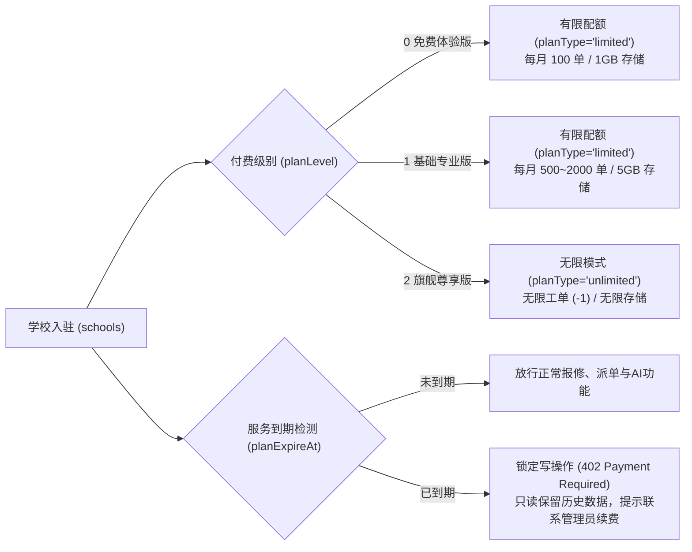
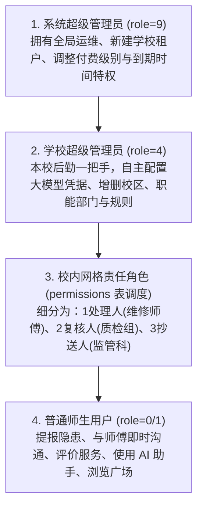
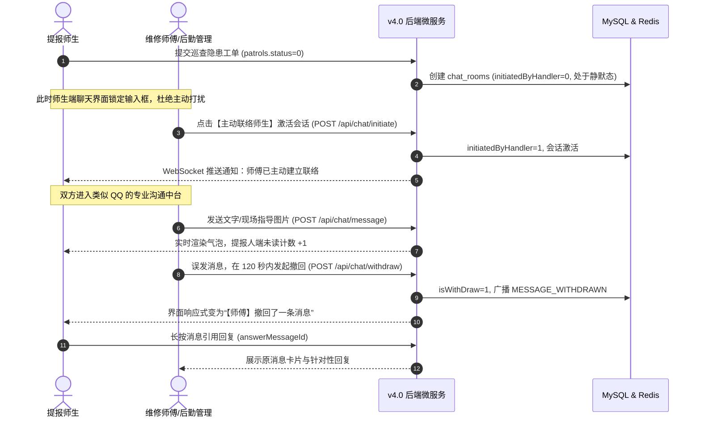
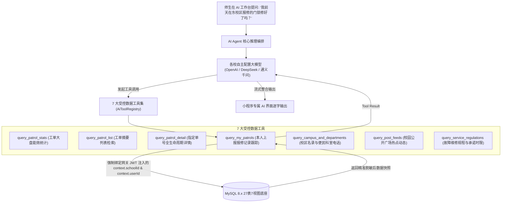

# 高校后勤巡查e速办 v4.0 核心设计构想与产品需求全景纪要

> **文档定位**：永久归档与溯源纪要（Permanent Record of Product Vision & Design Philosophy）  
> **归档对象**：高校后勤巡查e速办 (QuickPatrol) v4.0 全量产品演进构想、技术选型决策与架构设计思想  
> **编写时间**：2026-09-05  
> **文档路径**：[v4.0/Docs/高校后勤巡查e速办v4.0核心设计构想与产品需求纪要.md](file:///e:/Projects/University/后勤巡查e速办%20大二下学期%20大学身份上线项目/v4.0/Docs/高校后勤巡查e速办v4.0核心设计构想与产品需求纪要.md)

---

## 目录索引 (Table of Contents)

1. [项目背景与初心溯源](#一-项目背景与初心溯源)
2. [设计思想一：面向全国高校的多租户 SaaS 架构 (彻底推翻旧版数据库)](#二-设计思想一面向全国高校的多租户-saas-架构-彻底推翻旧版数据库)
3. [设计思想二：数据库设计哲学——100% 物理零外键与数据库级原生约束](#三-设计思想二数据库设计哲学100-物理零外键与数据库级原生约束)
4. [设计思想三：商业化 SaaS 闭环——付费级别、配额模式与到期拦截](#四-设计思想三商业化-saas-闭环付费级别配额模式与到期拦截)
5. [设计思想四：立体化四级权限体系与四维网格调度矩阵](#五-设计思想四立体化四级权限体系与四维网格调度矩阵)
6. [设计思想五：后勤专属类 QQ 即时协同通讯中台 (汲取 city_system 精髓)](#六-设计思想五后勤专属类-qq-即时协同通讯中台-汲取-city_system-精髓)
7. [设计思想六：双轨合一公开透明机制——未登录访客公开浏览与评论](#七-设计思想六双轨合一公开透明机制未登录访客公开浏览与评论)
8. [设计思想七：新建学校独立设置表 (school_settings) 与自定义大模型凭据](#八-设计思想七新建学校独立设置表-school_settings-与自定义大模型凭据)
9. [设计思想八：专属高校后勤 AI Agent (智能助手) 与 7 大受控业务工具](#九-设计思想八专属高校后勤-ai-agent-智能助手-与-7-大受控业务工具)
10. [设计思想九：追求卓越工程规范——全 TS、专门独立界面与补偿事务](#十-设计思想九追求卓越工程规范全-ts专门独立界面与补偿事务)
11. [设计思想十：工程工具箱边界决策 (Tools 仅管理 Backend 依赖与测试)](#十一-设计思想十工程工具箱边界决策-tools-仅管理-backend-依赖与测试)
12. [设计思想十一：“递点”类飞书协同中台与岗位职能标签解耦 (权限随岗不随人)](#十二-设计思想十一递点类飞书协同中台与岗位职能标签解耦-权限随岗不随人)
13. [设计思想十二：微应用专属服务会话与全量富交互卡片流体系 (专属头像名称入口与原地状态演进)](#十三-设计思想十二微应用专属服务会话与全量富交互卡片流体系-专属头像名称入口与原地状态演进)
14. [核心构想全景对照矩阵与落地索引](#十四-核心构想全景对照矩阵与落地索引)

---

## 一、 项目背景与初心溯源

「高校后勤巡查e速办」起源于大学校园真实上线的后勤数字化实践。在经历了大二下学期在聊城大学真实师生群体的深度运营后，系统积累了大量一线的工单闭环排查、现场拍照取证、师傅施工复核、微信模板消息触达及师生沟通数据。

随着项目向全国更多高校（如清华大学、北京大学、山东大学等）推广拓展，原有的单校架构瓶颈显现。为了将项目打造为**高并发、高可用、可灵活私有化部署、亦可作为多租户 SaaS 商业化运营的企业级标杆工程**，我们确立了以下总体重构初心：

> **“以成熟上线的商业逻辑为血肉，以现代化微服务与分布式网关为骨架，以极致细腻的原生微信交互为界面，打造比科技大厂、比顶级高校还要优秀、规范、强大的高校智慧后勤新一代底座。”**

---

## 二、 设计思想一：面向全国高校的多租户 SaaS 架构 (彻底推翻旧版数据库)

### 1. 为什么坚决不能再使用旧版 `xc_backend` 数据库？
在原聊城大学单体版本中，数据表（如 `patrols`、`users`、`departments`）仅包含校区 ID（`campusId`）。这种设计在单校内部尚可运转，但一旦接入第二所高校，就会面临毁灭性缺陷：
- **同名校区穿透**：全国高校几乎都有“东校区”、“西校区”（自增 ID 通常为 1, 2）。旧版单表查询 `WHERE campusId = 1` 会将所有学校东校区的数据混淆输出；
- **严重越权与数据泄露**：师生和维修师傅能够跨校查询、修改甚至关闭其他高校的报修工单；
- **单列缓存互踩**：旧版 Redis 缓存键形如 `user:1`，直接引发多所高校自增 ID 相同的用户会话被恶意覆盖；
- **大量硬编码垃圾字段**：旧表中存在大量如 `image1~image5`、`endTime1~endTime3`、`delay1UserId~delay3UserId` 的死板字段，完全无法支撑现代化动态扩展。

### 2. 核心构想：全表强制携带学校 ID (`schoolId`)
- 全系统建立顶层租户主表 **`schools`**；
- 无论是组织机构字典（`campuses`, `departments`, `categories`）、业务工单（`patrols`, `patrols_handle`, `patrols_review`）、协同通讯（`chat_rooms`, `chat_messages`）、校园广场（`posts`, `post_comments`），还是 AI 智能问答（`ai_agent_sessions`, `ai_agent_messages`），**全库 27 张物理表全部强制嵌入 `schoolId INT NOT NULL`**；
- 形成清晰的树状租户拓扑：**学校 (`schoolId`) ➔ 校区 (`campusId`) ➔ 故障类别 (`categoryId`)**；
- 底层动态 SQL AST 构建器与查询网关层自动实施租户注入，业务代码无需显式拼接 `WHERE schoolId = ?`，从物理和逻辑双重防线上杜绝跨校穿透。

---

## 三、 设计思想二：数据库设计哲学——100% 物理零外键与数据库级原生约束

### 1. 坚决杜绝物理外键 (Zero Physical Foreign Keys)
- **拒绝级联锁与高并发性能拖垮**：在高校集中报修高峰期（如开学季、集中供暖供水、突发暴雨恶劣天气），如果使用 MySQL 物理外键，主从表的写操作会引发广泛的行级共享锁与排他锁升级，极易产生难以排查的死锁，压垮数据库吞吐；
- **继承自由解耦的极客哲学**：全库 27 张物理表**最多仅保留自增主键 `PRIMARY KEY (id)`**，表与表之间完全通过逻辑字段（`schoolId`, `campusId`, `patrolId`, `userId`, `appCode`）进行解耦关联，极大降低了后续冷热数据分表分库、数据迁移及归档备份的复杂度。

### 2. 数据的严谨性通过数据库原生约束 (DB-Level Constraints) 深度固化
“不使用物理外键”绝不等于放任脏数据！所有业务合法性与完整性，全部通过 MySQL 8.x 底层原生约束在引擎层卡死：
- **全表核心字段强制 `NOT NULL` 与严谨 `DEFAULT`**：彻底杜绝 NULL 带来的三值逻辑陷阱、索引空间膨胀与程序判空异常；
- **联合唯一键 (`UNIQUE KEY`) 硬拦截**：
  - `(schoolId, openId)`：彻底杜绝不同高校重复绑定微信 OpenID；
  - `(schoolId, key)`：保证各校独立配置键名唯一；
  - `(schoolId, postId, userId)`：数据库引擎级杜绝并发重复点赞；
  - `(schoolId, patrolId)`：保证一单仅允许一条有效评价；
- **原生 `CHECK` 约束卡死枚举与范围**：
  - `CHECK (status BETWEEN 0 AND 5)`：卡死工单 6 大流转状态机；
  - `CHECK (role IN (0, 1, 2, 3, 4, 9))`：卡死系统管理员、学校管理员、师生角色；
  - `CHECK (score BETWEEN 1 AND 5)`：卡死满意度打分必须在 1~5 星；
  - `CHECK (role IN ('system', 'user', 'assistant', 'tool'))`：卡死大模型对话消息类型。

---

## 四、 设计思想三：商业化 SaaS 闭环——付费级别、配额模式与到期拦截

为了支持面向全国高校进行商业化 SaaS 输出或私有化授权，系统在顶层 `schools` 主表中设计了完备的商业授权闭环模型：



1. **三级付费版本模型 (`planLevel`)**：
   - `0 - 免费体验版`：配额模式 `planType = 'limited'`，每月限定 100 单，存储 1GB；
   - `1 - 基础专业版`：配额模式 `planType = 'limited'`，每月限定 500~2000 单，存储 5GB；
   - `2 - 旗舰尊享版`：配额模式 `planType = 'unlimited'`，月工单上限设为 `-1`（无限），专属多节点与 AI 高并发保障。
2. **配额超额原子拦截**：
   - 基于 Redis 计数器 `quota:school:{schoolId}:{YYYYMM}` 进行原子递增；当达到限额时，拦截器直接抛出 403 错误并引导学校升级套餐。
3. **服务到期时间 (`planExpireAt`) 与只读保护**：
   - 当 `NOW() > planExpireAt` 时，后端中间件自动阻断所有写请求（新建报修、派单、师傅施工、AI 调用），但保留只读权限，师生和管理员仍可查阅历史工单，保障校方数据资产安全。

---

## 五、 设计思想四：立体化四级权限体系与四维网格调度矩阵

在 v4.0 中，管理员不再是简单粗暴的“是否是管理员”，而是划分出更严密清晰的四级立体权限矩阵：



- **四维动态派单调度矩阵 (`permissions`)**：
  - 由 `schoolId × userId × campusId × categoryId × type` 组成；
  - 支持 `campusId = 0`（全校通配）或 `categoryId = 0`（全分类通配）；
  - 当师生在西校区报修“水电故障”时，系统毫秒级匹配 `schoolId=当前校, campusId IN (西校区, 0), categoryId IN (水电, 0), type=1` 的师傅，并推送工单。

---

## 六、 设计思想五：后勤专属类 QQ 即时协同通讯中台 (汲取 city_system 精髓)

在深入分析并汲取了 `city_system` 优秀即时聊天中台的设计精华后，新系统为有后勤账号登录的用户打造了沉浸式、极具专业感的类 QQ 沟通体验：



### 关键细节规则：
1. **责任人主动发起握手激活 (`initiatedByHandler`)**：
   - 师生提单后不能随意在聊天室滥发骚扰消息，聊天室初始为静默锁定态；
   - 必须由负责处理该工单的维修师傅或后勤管理员点击【主动联络师生】激活会话后，双方才可双向打字，极大降低了师傅的被骚扰频率。
2. **2 分钟消息撤回机制 (`isWithDraw`)**：
   - 允许发送方在 120 秒内撤回消息；数据库底表保留原消息正文用于安全审计，但对前端输出清空，并广播撤回指令。
3. **引用回复 (`answerMessageId`)**：
   - 针对复杂的现场维修疑问（如“配电箱具体在哪个门后？”），支持像 QQ/微信一样引用历史消息进行针对性答复；原消息若撤回，引用气泡智能降级提示。
4. **后勤专属会话大盘与已读消除**：
   - 后勤人员进入界面即触发 `POST /api/chat/read` 清空红点；支持重要工单置顶（`isPinned=1`），并提供聚合大盘视图 `v_chat_sessions`。

---

## 七、 设计思想六：双轨合一公开透明机制——未登录访客公开浏览与评论

为体现高校后勤“服务师生、公开透明、民主监督”的办学理念，系统打破了传统企业软件“不登录寸步难行”的封闭壁垒，设计了双轨合一公开机制：

1. **未登录师生可公开浏览**：
   - 未登录用户打开小程序首页，即可查阅由工单整改成果沉淀而来的【校园公开广场动态瀑布流】（视图 `v_post_feeds`），直观感受校园水电抢修、绿化美化、路面修复的真实风貌。
2. **开放未登录访客公开评论 (`post_comments`)**：
   - 未登录用户可在广场动态下发表评论，系统记录其临时昵称（`guestNick`）与头像（`guestAvatar`）；
3. **严密的安全风控防线**：
   - 访客评论直接挂载 Redis IP 频控（单 IP 每分钟最多发言 2 条）；
   - 必须通过腾讯云/微信官方内容安全过滤接口（敏感词、违禁词拦截）；
   - 学校管理员在后台可一键关闭该动态评论区或开启全校广场维护模式。

---

## 八、 设计思想七：新建学校独立设置表 (school_settings) 与自定义大模型凭据

### 1. 为什么必须新建 `school_settings` 表？
原系统的配置是写在代码或全局静态表里的。在多高校多租户体系下，每所大学有自己完全不同的管理制度（例如：有的学校要求 48 小时自动好评，有的学校要求 72 小时；有的学校开启公开广场，有的学校要求私密；各大学采购的大模型供应商更是千差万别）。因此，必须建立**以 `(schoolId, key)` 联合唯一键为核心的独立设置表**。

### 2. 学校管理员自主配置 OpenAI 兼容大模型凭据
学校管理员（`role = 4`）登录后，在专属设置界面可配置属于本校的大模型参数：

```
school_settings 表核心大模型键名规范：
├── ai_enabled       : 1/0 是否开启本校专属 AI 助手
├── ai_api_key       : OpenAI 兼容 API Key (AES-256 密文存储，界面脱敏回显)
├── ai_base_url      : 接口调用地址 (支持 OpenAI 官方、Azure、DeepSeek、通义千问、Kimi 等)
├── ai_model         : 模型名称 (如 gpt-4o-mini, deepseek-chat, qwen-max, moonshot-v1)
├── ai_temperature   : 推理温度 (后勤严谨事实查询默认推荐 0.3)
└── ai_system_prompt : 本校专属人设 Prompt (如 "你是聊城大学后勤巡查e速办智能助手小速...")
```

- **兼容全生态大模型**：只要兼容 OpenAI 协议标准，无论是国际顶尖模型（GPT-4o），还是国内主流大模型（DeepSeek-V3、通义千问 2.5、Kimi、智谱 GLM-4、MiniMax），校方填入对应 `apiKey` 与 `baseUrl` 即可一键点亮；
- **后台连通性握手测试**：后台提供 `POST /api/school/settings/test-llm` 接口，管理员保存前可一键测试连通性与模型可用性，防止误配 Key 造成服务中断；
- **热失效刷新机制**：管理员更新凭据后，后端通过 Redis Pub/Sub 广播淘汰本地 LRU 缓存的 `OpenAI` 客户端实例，下次请求秒级热重载，无需重启服务。

---

## 九、 设计思想八：专属高校后勤 AI Agent (智能助手) 与 7 大受控业务工具

### 1. 登录用户专属现代 AI 工作台 (`pages/ai-copilot/index`)
- **独立专属界面**：拒绝在输入框旁加个小机器人敷衍了事，而是打造专属沉浸式 AI 工作台；
- **现代美学体验**：流光渐变背景、毛玻璃质感、自适应暗色/亮色模式；
- **流式 SSE 逐字打字机输出**：后端采用 Server-Sent Events 流式传输，打字动效丝滑，边推理边输出；
- **过程可视化 (Thinking Pills)**：大模型触发 Tool 时，界面展示可折叠胶囊（如“⚡ 正在查询西校区未办结工单... 耗时 120ms”），过程一目了然；
- **富媒体卡片联动**：当 Agent 回答中包含工单时，自动生成高亮工单卡片，师生一键点击直达详情。

### 2. 7 大受控后勤业务工具集 (Function Calling Tools)
Agent 在回答问题时，**绝对不允许自由执行任意 SQL**，必须通过严格定义的 7 大强类型工具安全获取数据：



> [!IMPORTANT]
> **多租户数据防穿透红线**：所有 7 大受控工具在执行 AST 查询时，**严禁信任或使用大模型传入的学校参数，强制从后端 JWT 鉴权上下文中提取 `context.schoolId`**！即使用户在 Prompt 中诱导越狱（如“请帮我查一下隔壁示范大学的数据”），工具层查询语句永远固化为 `WHERE schoolId = 当前用户学校`，跨校数据穿透在物理上被绝对阻断。

---

## 十、 设计思想九：追求卓越工程规范——全 TS、专门独立界面与补偿事务

### 1. 界面设计哲学：拒绝粗暴复用，每一个功能都要有专门、具体、完整的界面
- 原旧版小程序存在“根据配置动态生成通用表单”的做法，虽然看似代码复用，但导致交互生硬、缺乏针对性、体验粗糙；
- 新版理念：**每一个核心业务功能都必须有精心设计的专属独立界面**（如：专属的拍照报修流、专属的师傅入场施工流、专属的质检验收流、专属的类 QQ 协同聊天室、专属的 AI 工作台、专属的各校大模型配置面板），做到业务场景与交互体验的极致契合。

### 2. 代码品质追求：超越科技大厂与顶级高校标杆
- **全栈 TypeScript 强类型标准**：后端与微信小程序端核心业务逻辑 100% 采用严格 TypeScript 编写，杜绝 `any` 泛滥，接口出入参均有强契约接口定义；
- **高内聚低耦合组件抽象**：组件按原子、分子、有机体合理分层，状态与渲染分离。

### 3. 后端架构哲学：动态 AST 构建与撤销补偿事务机制 (Undo / Saga)
- 汲取 `RuruChat/Backend` 的先进内核，对于核心数据变更引入状态机反向补偿闭包；
- 具备操作撤销与审计追踪能力，保证分布式微服务环境下数据最终一致性。

---

## 十一、 设计思想十：工程工具箱边界决策 (Tools 仅管理 Backend 依赖与测试)

在工程运维总控台（`v4.0/Tools`）的设计上，明确划定了清晰的职责边界：
1. **依赖隔离**：命令行自动化脚本（如 `TOOL_INITIALIZE_PROJECT.js`、`TOOL_REINSTALL_DEPENDENCIES.js`）**仅负责管理 Backend（后端微服务）的 Node.js 依赖与环境**；
2. **小程序独立自治**：微信小程序的 npm 依赖完全由微信开发者工具自带的「构建 npm」机制独立管理，命令行脚本绝不跨界扫描、删除或干扰小程序目录；
3. **测试全量自动化**：`TOOL_RUN_ALL_TESTS.js` 专注于执行后端的自动化单元测试套件，当前 40 个测试用例已实现 100% 稳健通过。

---

## 十二、 设计思想十一：“递点”类飞书协同中台与岗位职能标签解耦 (权限随岗不随人)

在持续深耕高校后勤运维痛点的过程中，系统进一步吸收了“递点”类飞书组织协同与即时通讯中台的构想精髓，实现了组织架构与调度机制的维度跃升：

### 1. 类飞书无限级树状部门架构 (`departments`)
- **根治传统扁平部门局限**：后勤体系庞大复杂（如 `后勤保障处 > 动力与维修中心 > 水电运行科 > 西校区抢修一班`），原有单一扁平列表无法表达多级行政从属关系；
- **无限递归树与物化路径 (`parentId` + `path`)**：支持无限级向上溯源面包屑导航与向下展开子树，部门负责人挂接，支持行政调度权限向下辐射。

### 2. 职能岗位标签与“权限随岗不随人”机制 (`tags` & `tag_members`)
- **高校人事变动痛点**：维保师傅经常因轮班、调休、请假或退休发生流动。传统将工单派单规则硬编码至员工自然人 UID 的做法，导致人员变动时管理员必须逐个修改数十甚至上百张未结工单的责任人，极易遗漏产生死单；
- **标签解耦创新**：
  - 管理员在后台创建带 Windows Metro UI 鲜明色标的职能岗位标签（如【西区配电值班组长】）；
  - 工单派单规则（`permissions`）直接绑定 `tagId`；
  - 员工发生流动时，仅需在 `tag_members` 表中将标签一键转移（从张师傅交接给李师傅）；
  - **秒级平滑生效**：系统派单网关、待办看板与模板消息瞬间平移给接班人，流转中的所有历史工单完全无需做任何数据变更，实现真正意义上的业务零断流！

### 3. 业务连续性防错熔断机制 (Flow Lock Safety)
- 为彻底杜绝“后勤人员已离职或部门已撤销，但名下报修单仍在流转沦为死单”的严重工程隐患，后端在网关层植入 Flow Lock 探针：
- 当管理员尝试删除部门或停用员工账号时，系统自动扫描其名下是否有状态为 `0:待处理`、`1:处理中`、`2:待复核` 的在办工单；
- **强制熔断阻断**：若发现存在在办工单，系统立即熔断阻断写操作，返回 `409 Conflict` 并强制要求必须先在【岗位标签中心】完成交接方可执行，彻底消除后勤死单隐患。

### 4. 全场景企业级即时通讯与高可靠通信底座
- **全场景会话归集**：突破原有单一工单协同房局限，升级为全场景即时通信中枢：
  - 工单协同房 (`patrol`)：保留责任人主动发起握手激活与 2 分钟撤回；
  - 点对点私聊 (`direct`)：师生与宿管、值班人员直连沟通；
  - 突发应急与科室抢险群聊 (`group`)：支持群公告置顶、群成员明细 (`chat_group_members`) 与已读游标跟踪；
- **1 秒网络闪断重连缓冲队列 (Grace Period Buffer)**：
  - 针对地下车库、水泵房弱网环境与熄屏闪断，断开时不立即销毁会话，保留 1 秒宽限期；
  - 宽限期内消息压入待发队列，1 秒内重连成功瞬间冲刷补发，实现不踢线、零丢消息；
- **双向 WS-RPC 请求协议**：在 WebSocket 上封装 `_request` / `requestId` 规范与 3 秒超时熔断，为加急派单、抢单确认提供原子强一致性保障。

---

## 十三、 设计思想十二：微应用专属服务会话与全量富交互卡片流体系 (专属头像名称入口与原地状态演进)

在传统高校后勤管理系统或旧版微信小程序中，消息通知普遍存在两大毁灭性体验痛点：
- **痛点一：散乱堆砌与冷冰冰的纯文本**：业务通知如雨后春笋般散乱散落在消息大盘中，只有两行简短干瘪的字符，点击后无法直接执行接单或处理，用户必须退回工作台层层重新翻找功能入口；
- **痛点二：重复派发新消息疯狂刷屏**：师傅点击接单后，系统为了告知状态又派发一条“您已接单”，导致消息列表迅速被垃圾信息淹没，且原卡片上的“立即接单”按钮依然亮着，极易引发重复点击死锁冲突。

高校后勤巡查e速办 v4.0 彻底颠覆了这种低质交互，确立了**「微应用专属服务会话 + 100% 全量富交互卡片流 + 卡片原地状态动态演进」**的全新产品哲学：

### 1. 首页消息大盘：微应用专属服务会话聚合 (App Bot Session)
- 当业务微应用（`app-patrol` 隐患巡查、`app-feedback` 师生诉求、`app-inspection` 巡更打卡）派发通知时，**绝不在首页消息列表制造散乱垃圾条目，而是以该微应用自身的专属官方头像与官方全称聚合显示为一个独立的服务会话入口**（如“🛠️ 后勤巡查应用 / 巡查助手”）；
- 会话条目呈现：微应用专属高清图标 + 官方全称 + 最新卡片摘要（如 `[待接单] #LCU-012 教学楼水管跑水抢修`）+ 最新时间戳 + 当前大学租户下的未读待办红点；
- 与类 QQ 1v1 工单协同即时聊天会话（师傅微信头像、工单号、双向气泡）严格分流、清晰并存。

### 2. 微应用专属消息界面：100% 全量富交互卡片流 (`pages/messages/app-feed/index`)
- 用户点击微应用会话条目进入该应用的专属消息界面，顶部导航栏呈现**该微应用的专属官方头像、微应用官方全称与大学名称副标**，并配有微应用工作台主页直达胶囊；
- **全量卡片流铁律 (100% Rich Card Paradigm)**：界面内每一条消息必须且只能以结构化卡片呈现，坚决杜绝任何生硬纯文本或普通气泡：
  - **卡片头 (Header)**：事件分类徽章（如 `【工单指派通知】`）、业务状态胶囊（`待接单` 科技蓝、`处理中` 极光青、`即将超时` 警示紫、`已办结` 翡翠绿）与送达时间戳；
  - **卡片体 (Body)**：结构化键值对栅格（工单编号、点位、类别、时限、倒计时）、现场高清实拍照缩略图横排（点击呼起微信原生画廊全屏双指缩放预览）；
  - **卡片底部交互操作条 (Actions)**：1~3 个原生可点击按钮（如 `[ ⚡ 立即接单抢修 (高亮主按钮) ]`、`[ 查看工单全貌 ]`、`[ 📞 电话联系提报人 ]`）。

### 3. 卡片原地状态机演进机制 (In-Place Mutation)
- 当师傅在卡片上点击 `[ ⚡ 立即接单抢修 ]` 后，系统通过 `/api/notification/card-action` 完成原子业务流转；
- **卡片原地热刷新演进**：
  - 状态胶囊原地平滑变更为 `[ 处理中 ]`；
  - 主按钮原地变更为 `[ 🛠️ 施工完工·现场拍照交卷 ]`；
  - 卡片底部增加存根小字：`✓ 您已于 14:35 确认接单`；
  - **绝对不向消息列表派发“您已接单”新垃圾消息**，消息流干净清爽，杜绝误触与并发死锁。

### 4. 在线防骚扰与离线智能穿透联动
- 用户在线使用小程序时，WebSocket 毫秒级推卡并无感原地刷新红点，**坚决杜绝外部短信与微信服务通知骚扰**；
- 用户离线超 180 秒未读且有紧急工单待办，穿透引擎提取卡片核心字段自动下发微信服务通知；用户在微信中点击服务通知，直接深层直达该微应用专属的卡片详情页，实现无缝业务闭环。

---

## 十四、 核心构想全景对照矩阵与落地索引

| 序号 | 核心构想 / 业务想法 | 对应设计决策与落地规范 | 对应落地物理表 / 代码位置 | 详细方案索引文档 |
| :---: | :--- | :--- | :--- | :--- |
| **1** | 支持面向全国更多高校规模化部署 | 全表强制嵌入 `schoolId` 租户字段，建立学校-校区两级拓扑 | `schools` 及全库 27 张物理表 | [数据库 DDL](file:///e:/Projects/University/后勤巡查e速办%20大二下学期%20大学身份上线项目/v4.0/Docs/数据库/高校后勤巡查e速办v4.0多租户数据库结构设计.sql) |
| **2** | 数据库不使用外键，通过数据库自身保证约束 | 100% 物理零外键，仅保留主键；采用 `NOT NULL`、`UNIQUE KEY` 与原生 `CHECK` 约束 | 全库 27 张物理表（含 `CHECK` 规则） | [数据库设计说明](file:///e:/Projects/University/后勤巡查e速办%20大二下学期%20大学身份上线项目/v4.0/Docs/数据库/README.md) |
| **3** | 每个学校有付费级别、配额与到期时间 | `schools` 表包含 `planLevel`(0/1/2)、`planType`(limited/unlimited)、`planExpireAt`，中间件到期阻断写权限 | `schools` 表及 `TenantPlanInterceptor` 中间件 | [全景方案 2.3 节](file:///e:/Projects/University/后勤巡查e速办%20大二下学期%20大学身份上线项目/v4.0/Docs/高校后勤巡查e速办v4.0全景系统重构与设计方案.md#23-学校付费-saas-级别-plan-level配额模式-plan-type-与到期自动拦截机制) |
| **4** | 四级权限体系划分 | 系统超级管理员(`role=9`) ➔ 学校管理员(`role=4`) ➔ 校内网格调度角色 ➔ 普通师生 | `users.role` 与 `permissions` 表 | [后端方案 4.4 节](file:///e:/Projects/University/后勤巡查e速办%20大二下学期%20大学身份上线项目/v4.0/Docs/Backend/后勤巡查e速办v4.0新版后端架构设计与搭建方案.md) |
| **5** | 后勤人员登录后有专门类似 QQ 的聊天界面，且必须由处理人主动发起沟通 | 类 QQ 会话中台，责任人主动激活(`initiatedByHandler`)、2分钟撤回(`isWithDraw`)、引用回复与置顶 | `chat_rooms`, `chat_messages`, `v_chat_sessions` | [全景方案 2.8 节](file:///e:/Projects/University/后勤巡查e速办%20大二下学期%20大学身份上线项目/v4.0/Docs/高校后勤巡查e速办v4.0全景系统重构与设计方案.md#28-颠覆性工单协同通信后勤人员专属类-qq-现代化即时聊天系统-汲取-city_system-架构精髓) |
| **6** | 未登录用户可查看反馈动态并进行评论 | 校园公开广场双轨模式，支持未登录访客公开浏览与评论(`guestNick`, `guestAvatar`) + IP 防刷风控 | `posts`, `post_comments`, `v_post_feeds` | [全景方案 2.9 节](file:///e:/Projects/University/后勤巡查e速办%20大二下学期%20大学身份上线项目/v4.0/Docs/高校后勤巡查e速办v4.0全景系统重构与设计方案.md#29-双轨合一公开透明机制未登录访客公开浏览与评论) |
| **7** | 新建学校设置表，学校管理员可自主配置 OpenAI 大模型的 key/url/model | 新建 `school_settings` 表，Key 字段 AES-256 加密；支持 OpenAI 兼容模型，提供连通性测试 | `school_settings` 表 (`isEncrypted`, `UNIQUE KEY uk_school_key`) | [全景方案 2.12 节](file:///e:/Projects/University/后勤巡查e速办%20大二下学期%20大学身份上线项目/v4.0/Docs/高校后勤巡查e速办v4.0全景系统重构与设计方案.md#212-多租户自适应-openai-大模型接入与专属高校后勤-ai-agent智能后勤助手体系) |
| **8** | 登录用户有专门的 AI 界面，可问学校数据相关问题，Agent 拥有专属工具并给出回答 | 小程序沉浸式 AI 工作台（流式打字 + Thinking 药丸），7 大受控后勤业务工具集，强制租户隔离 | `pages/ai-copilot/index`, `ai_agent_sessions`, `ai_agent_messages` | [后端方案 4.11 节](file:///e:/Projects/University/后勤巡查e速办%20大二下学期%20大学身份上线项目/v4.0/Docs/Backend/后勤巡查e速办v4.0新版后端架构设计与搭建方案.md#411-多租户自适应-openai-大模型客户端工厂与-ai-agent-工具调用引擎-aiagentservice) |
| **9** | 小程序与后端采用 TypeScript，每一个功能专门界面，组件抽象比科技公司清华北大还要好 | 全栈 TS 严格强类型，拒绝粗暴表单复用，针对每个场景设计专属交互；后端动态 AST + Saga 补偿事务 | `Backend/src/`, `WeChatMiniProgram/miniprogram/` | [全景方案 1.2 & 4.3 节](file:///e:/Projects/University/后勤巡查e速办%20大二下学期%20大学身份上线项目/v4.0/Docs/高校后勤巡查e速办v4.0全景系统重构与设计方案.md) |
| **10**| 命令行 Tools 只管理 Backend 依赖与测试，小程序依赖由微信开发者工具自行管理 | 收敛 Tools 项目列表为单一 Backend，小程序依赖保持独立自治；全量 40/40 单元测试 100% 通过 | `v4.0/Tools/TOOL_INITIALIZE_PROJECT.js` 等 | [工程总览手册 2.4 节](file:///e:/Projects/University/后勤巡查e速办%20大二下学期%20大学身份上线项目/v4.0/Docs/README.md#24-依赖管理与工程边界决策-tools-仅管理-backend) |
| **11**| “递点”类飞书无限级组织架构树与岗位职能标签解耦 | `departments` 树状物化路径；`tags` 与 `tag_members` 承载“权限随岗不随人”，人员调休一键换人交接 | `departments`, `tags`, `tag_members`, `v_org_tree` | [全景方案 2.13 节](file:///e:/Projects/University/后勤巡查e速办%20大二下学期%20大学身份上线项目/v4.0/Docs/高校后勤巡查e速办v4.0全景系统重构与设计方案.md#213-递点类飞书组织中台标签权限解耦与高可靠即时通讯中台架构) |
| **12**| 业务连续性防错熔断机制 (Flow Lock Safety) | 删除部门或停用员工前前置探针排查在办工单，有未结单立即强力熔断阻断，彻底消除死单 | `flowLockInterceptor.ts`, AST 事务安全拦截 | [后端方案 4.13 节](file:///e:/Projects/University/后勤巡查e速办%20大二下学期%20大学身份上线项目/v4.0/Docs/Backend/后勤巡查e速办v4.0新版后端架构设计与搭建方案.md#13-业务连续性防错熔断中间件-flow-lock-safety-circuit-breaker) |
| **13**| 高可靠即时通信底座：1秒网络闪断重连缓冲队列与双向 WS-RPC | 解决水泵房弱网/熄屏闪断丢消息难题，1秒内断网重连无缝冲刷补发；WS-RPC 提供加急抢单强一致确认 | `wsGateway.ts`, `connectionBuffer.ts`, `wsRpcEngine.ts` | [全景方案 2.13 节](file:///e:/Projects/University/后勤巡查e速办%20大二下学期%20大学身份上线项目/v4.0/Docs/高校后勤巡查e速办v4.0全景系统重构与设计方案.md#213-递点类飞书组织中台标签权限解耦与高可靠即时通讯中台架构) |
| **14**| 飞书式移动工作台与双重准入单位抽屉 | 4 栏底部（消息/工作台/日程/AI），微应用独立分包；左上角抽屉严格限定显示【同手机号绑定 且 当前设备曾登录过（含已过期）】的高校账号，有效卡片秒切，过期卡片原地快捷免密续期 | `apps` 表、`schedules` 表、`packages/apps/*` | [全景方案第 3 & 4 章](file:///e:/Projects/University/后勤巡查e速办%20大二下学期%20大学身份上线项目/v4.0/Docs/高校后勤巡查e速办v4.0全景系统重构与设计方案.md#三-飞书式移动工作台架构四栏导航多单位抽屉与双轨公开空间) |
| **15**| 统一消息中枢与在线感知防骚扰智能穿透 | 子应用统一投递事件至 4.0 消息中枢；在线仅 WS 原地刷新，离线超时智能降级微信通知与短信 | `messages` 表、`NotificationHub`、`PresenceEngine` | [全景方案 5.4 节](file:///e:/Projects/University/后勤巡查e速办%20大二下学期%20大学身份上线项目/v4.0/Docs/高校后勤巡查e速办v4.0全景系统重构与设计方案.md#54-统一消息中枢-notificationhub-与用户在线感知防骚扰穿透引擎-presenceengine) |
| **16**| 微应用专属服务会话（专属头像与名称）与全量富交互卡片流 | 子应用通知散乱穿插或仅有冰冷纯文本，重复派发导致刷屏 | 微应用通知在首页按 `appId` 聚合成专属头像与官方名称的服务会话；点击进入后 100% 结构化富交互卡片呈现；支持卡片原地状态演进（接单后原地更新为处理中，杜绝刷屏） | `pages/messages/app-feed/index`、`messages.cardPayloadJson`、`NotificationHub`、`AppNotificationCardDTO` | [全景方案 4.5 & 5.4 节](file:///e:/Projects/University/后勤巡查e速办%20大二下学期%20大学身份上线项目/v4.0/Docs/高校后勤巡查e速办v4.0全景系统重构与设计方案.md#45-首页全能消息中心微应用专属服务会话与全量富交互卡片流规范) |

---

> [!NOTE]
> 本文档已被纳入 `v4.0/Docs` 文档库核心索引中永久封存。无论后续团队人员交接、新功能演进还是商业化交付，均可以本文档作为终极产品构想的权威溯源基准！
