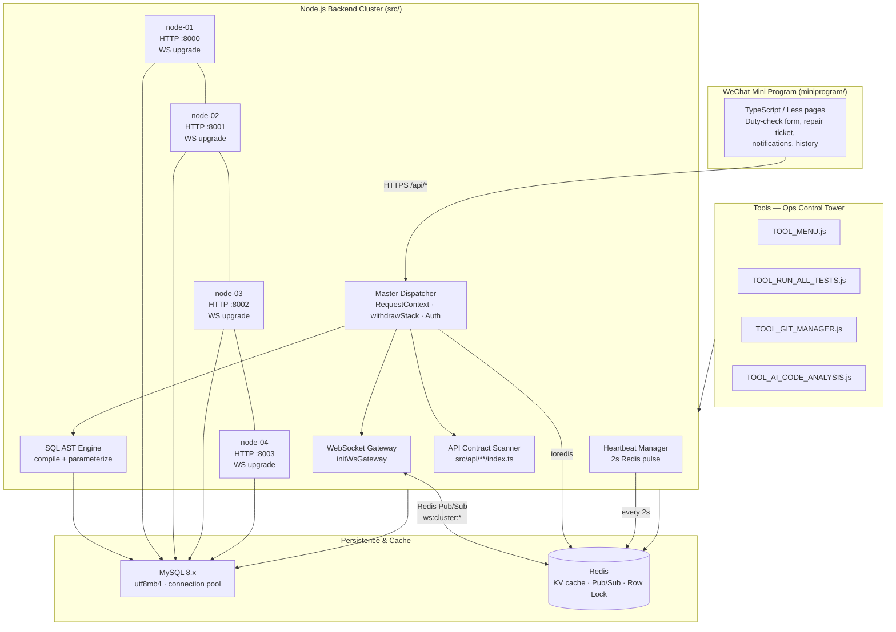

# QuickPatrol (高校后勤巡查e速办) — v4.0

> **Enterprise-grade Smart Campus Logistics Inspection & Work-Order Platform**  
> WeChat Mini Program · Node.js Backend Cluster · MySQL 8.x · Redis 6 · WebSocket Realtime Gateway · DevOps Toolchain

---

## 🎯 Project Positioning

QuickPatrol v4.0 is a **full-stack smart campus logistics inspection & repair work-order system** that connects campus residents, patrol staff, and repair personnel in one seamless mobile experience. It is built as a **multi-node backend cluster** with a **TypeScript-native, Express-free HTTP dispatcher**, **contract-first API auto-wiring**, **distributed row locking**, and **Redis-Pub/Sub enabled cross-process WebSocket broadcast**.

The project is deliberately architected for:

- **Zero-framework performance** — using Node.js native `http` server and a custom route-scanner instead of relying on Express middleware.
- **High-availability backend nodes** — 4 independently configured processes (`backend-node-01` ~ `backend-node-04`) share the same API contract, MySQL pool, and Redis state.
- **Immediate notification delivery** to WeChat Mini Program users through a cluster-aware WebSocket gateway.
- **Self-healing data consistency** with a built-in, statement-level automatic compensation rollback engine.
- **Extreme maintainability** — every backend endpoint is a folder-based contract module; SQL is declared as AST and compiled before execution.

---

## 🧰 Core Technology Stack

| Layer | Technology | Role |
|---|---|---|
| **Frontend Client** | WeChat Mini Program (TypeScript + Less) | Student/Staff duty & repair request interface |
| **Backend API** | Node.js ≥ 20 · TypeScript 5 · `tsx` runtime | HTTP API & WebSocket services |
| **Web Server Engine** | Native Node.js `http` + custom Dispatcher | Express-free request handling |
| **Database** | MySQL 8.x (`mysql2/promise` connection pool) | Business data persistence |
| **Cache / Message Bus** | Redis (`ioredis`) | KV cache, distributed row locks, Pub/Sub |
| **Realtime Gateway** | `ws` WebSocketServer | Duty status push & instant alerts |
| **Testing** | Vitest 1.6 · TypeScript typecheck | Unit / cluster / flow tests |
| **Tooling** | Custom Node CLI automation scripts (`Tools/`) | Dev-ops, code management & report generation |

> **Version note:** Unlike many traditional Node projects, QuickPatrol v4.0 **intentionally does not depend on Express**. HTTP routing, auth middleware, body parsing, JWT verification, and compensation rollback are implemented as a lightweight, fully typed, self-contained **Master Dispatcher**.

---

## 🏗️ System Architecture



### ASCII View

```
┌──────────────────────────────────────────────────────────────────────┐
│                      WeChat Mini Program                             │
│                 TypeScript · Less · project.config.json              │
└────────────────────────────────┬─────────────────────────────────────┘
                                 │  HTTPS POST/GET /api/* 
                                 ▼
┌──────────────────────────────────────────────────────────────────────┐
│                 Backend Cluster — native http server                 │
│                                                                      │
│  ┌────────────┐   ┌────────────┐  ┌────────────┐   ┌────────────┐   │
│  │  node-01   │   │  node-02   │  │  node-03   │   │  node-04   │   │
│  │ HTTP:8000  │   │ HTTP:8001  │  │ HTTP:8002  │   │ HTTP:8003  │   │
│  │ WS:same    │   │ WS:same    │  │ WS:same    │   │ WS:same    │   │
│  └─────┬──────┘   └─────┬──────┘  └─────┬──────┘   └─────┬──────┘   │
│        │                │               │                │          │
│        ▼                ▼               ▼                ▼          │
│  ┌────────────────────────────────────────────────────────────┐     │
│  │            Master Dispatcher + API Scanner                 │     │
│  │   RequestContext · withdrawStack · Route registry           │     │
│  └────────────────────────────────────────────────────────────┘     │
│                                                                      │
│  ┌──────────────┐   ┌─────────────┐   ┌──────────────────────┐     │
│  │ WS Gateway    │   │ AST Engine  │   │ Heartbeat Manager    │     │
│  │ ws://:PORT/ws │   │ SQL compile │   │ Redis pulse (2s)     │     │
│  └──────┬───────┘   └──────┬──────┘   └──────────┬───────────┘     │
└─────────┼───────────────────┼─────────────────────┼─────────────────┘
          │ Pub/Sub           │                     │
          ▼                   ▼                     ▼
    ┌────────────────────────────────────────────────────────────┐
    │  Redis                   │       MySQL 8.x                 │
    │  cache · lock            │       pool · utf8mb4            │
    │  ws:cluster:message      │       connectionLimit 20        │
    │  ws:cluster:broadcast    │                                  │
    └────────────────────────────────────────────────────────────┘
```

---

## 📂 Repository Directory Landscape

```
QuickPatrol/
├── Backend/                      # Core backend cluster
│   ├── src/
│   │   ├── api/                  # Contract API modules, auto-scanned
│   │   │   └── system/
│   │   │       ├── health/       # GET /api/system/health
│   │   │       └── ping/         # GET /api/system/ping
│   │   ├── dispatcher/           # Master dispatcher & route scanner
│   │   │   ├── apiScanner.ts
│   │   │   └── masterDispatcher.ts
│   │   ├── heartbeat/            # Node liveness heartbeat via Redis
│   │   │   └── heartbeatManager.ts
│   │   ├── shared/
│   │   │   ├── cache/            # Redis client, KV helpers
│   │   │   ├── config/           # Env loader & validation
│   │   │   ├── crypto/           # JWT / password / UUID
│   │   │   ├── db/               # MySQL pool & query executor
│   │   │   ├── flow/             # StandardResult flow type
│   │   │   ├── lock/             # Redis distributed row lock
│   │   │   ├── log/              # terminal logger
│   │   │   └── sql/              # SQL AST, builders, runner
│   │   ├── utils/httpHelper.ts
│   │   ├── ws/wsGateway.ts       # WebSocket realtime gateway
│   │   └── index.ts              # Bootstrap
│   ├── __tests__/                # Vitest suites
│   ├── 1.env ~ 4.env             # 4-node cluster environment files
│   ├── generate_envs.js          # Re-generate env files with port mapping
│   ├── start_all_backends.js     # Launch 4 nodes in one terminal
│   ├── package.json
│   └── tsconfig.json
├── WeChatMiniProgram/            # Miniapp front-end project
│   ├── miniprogram/              # WeChat miniprogram root (TS + Less)
│   ├── typings/                  # wx API typings
│   ├── package.json
│   ├── project.config.json       # Appid: wxc818fff9cc711a5e
│   └── tsconfig.json
├── Docs/                         # Full design & subsystem docs
│   ├── Backend/
│   ├── WeChat/
│   └── 数据库/
├── Tools/                        # Ops control tower / automation scripts
│   ├── TOOL_MENU.js
│   ├── TOOL_RUN_ALL_TESTS.js
│   ├── TOOL_INITIALIZE_PROJECT.js
│   ├── TOOL_GIT_MANAGER.js
│   ├── TOOL_AUTO_COMMIT_WITH_AI.js
│   ├── TOOL_AI_CODE_ANALYSIS.js
│   ├── TOOL_GENERATE_WORK_REPORT.js
│   ├── code_agent_engine.js
│   └── ...
├── tools_windows.bat             # Windows CLI entry
├── tools_linux_macos.sh          # Linux/macOS CLI entry
├── chat_sys_config.json
├── .gitignore
└── LICENSE
```

---

## ⚡ Signature Subsystem Deep-Dives

### 1. WeChat Mini Program — TypeScript-based Dual-Role Closed-Loop Workflow

The mobile client is a native WeChat Mini Program with:

- TypeScript source in `miniprogram/`, compiled with `miniprogram-api-typings`.
- Less as the styling preprocessor (`useCompilerPlugins: ["typescript", "less"]`).
- Central `project.config.json` pointing to `miniprogramRoot: "miniprogram/"`.
- The design closely follows the **dual identity** workflow:
  - **Patrol / inspection staff** submit campus status findings.
  - **Repair / logistics staff** receive work-orders and update lifecycle states.
- JWT is authenticated by `openId`; the backend returns uniform JSON `{ status, content, data }` envelopes, compatible with WeChat Mini Program’s request semantics (HTTP 200 is always returned even for business errors).

### 2. Express-free TypeScript HTTP Core vs. “Traditional” Frameworks

Backend v4.0 **removes the overhead and versioning risk of Express** in favor of a compact, fully typed Node native layer:

- `http.createServer` receives every request.
- `Master Dispatcher` normalizes the URL, matches an API contract route, extracts `Authorization: Bearer <JWT>`, parses JSON body, and creates a per-request `RequestContext`.
- Route matching supports both exact paths and trailing wildcard `/api/.../*`.

The type safety is enforced through TypeScript 5, with `tsx` as the development runtime and `tsc` for production build.

### 3. Contract-First API Auto-Scanner & Route Precompilation

Instead of manually registering routes:

- The file system is recursively scanned under `Backend/src/api/`.
- Every directory containing an `index.ts` that exports `api` or `default` is loaded as an API endpoint.
- The endpoint’s relative path is automatically converted to a REST path:

```
Backend/src/api/system/ping/index.ts  →  GET/POST /api/system/ping
Backend/src/api/system/health/index.ts →  GET/POST /api/system/health
```

- If an endpoint exports `astConfig`, the AST config is **precompiled at startup** into an executable `run()` function, giving near-zero SQL compile overhead in request time.

Example of an endpoint module shape:

```ts
export const api = {
  routePath: "/api/system/ping",
  authRequired: false,
  handler: async (_req: any, ctx: any) => {
    return returnSuccess({
      message: "pong",
      nodeId: process.env.NODE_ID,
      httpPort: process.env.HTTP_PORT,
    });
  },
};
export default api;
```

### 4. Automatic Compensation Rollback Engine

Every request passes through the `Master Dispatcher` with:

- `withdrawStack: Array<() => Promise<void>>`
- `lockedRows: Array<{ table, targetId, requestId }>`

When a route handler returns a business failure, the dispatcher automatically executes the undo stack in **LIFO order** — restoring any previously inserted/updated MySQL rows or evicting stale Redis data. This is “**single-statement auto-commit + in-code compensation**”, avoiding long-lived DB transactions while still achieving consistency.

On successful completion, the dispatcher releases every registered distributed row lock with status `COMMITTED_UPDATE` or `COMMITTED_DELETE`.

### 5. SQL AST Dynamic Query Engine

Under `src/shared/sql`:

- **AST type declarations** (`ast/declare.ts`) describe CRUD operations declaratively.
- A **validator** and **parameterizer** sanitise and bind values, effectively preventing SQL injection.
- **Builders** exist for `SELECT`, `INSERT`, `UPDATE`, `DELETE`.
- `astRunner.ts` compiles an AST config into a reusable async `run` function that is later injected into endpoint handlers.

This design enables:

- Dynamic branch conditions without string concatenation.
- Automatic SQL parameterization.
- Clear permission scoping and tenant filtering.

### 6. WebSocket Cross-Process Realtime Gateway

QuickPatrol v4.0 packs a production-level, stateless-forwarding realtime layer:

- HTTP and WebSocket share the same port (`noServer: true` upgrade).
- The client first sends handshake `{ key: "openId", value: "<openid>" }`; the server then maps it to all live sockets under that `openId`.
- `sendWsMessage(openId, key, value)` first checks local sockets, then publishes to Redis channel `ws:cluster:message`.
- The signal will be filtered by source node and delivered to the target user on any of the four processes.
- `broadcastWsMessage(key, value)` similarly sends to every user in the whole cluster through `ws:cluster:broadcast`.

This enables instant duty-order alerts, work-order status change propagation and user online-status awareness through a heartbeat monitor.

### 7. Heartbeat & Cluster Health Manager

`HeartbeatManager` publishes every 2 seconds:

```json
{
  "nodeId": "backend-node-01",
  "httpPort": 8000,
  "activeWsConnections": 18,
  "memoryUsageBytes": 123456,
  "timestamp": 1700000000000
}
```

to Redis key: `backend:heartbeat:${nodeId}` (TTL 6s)  
and registers itself in the Set: `backend:active_nodes`.

---

## 🚀 Quick Start Guide

### Prerequisites

| Dependency | Version / Note |
|---|---|
| Node.js | 20+ */
| MySQL | 8.x (utf8mb4) |
| Redis | 6.x with password supported |
| WeChat DevTools | latest stable |
| TypeScript | 5.x (used as dependency) |

---

### 1. Backend Cluster Setup

#### 1.1 Install dependencies

```bash
cd Backend
npm install
```

#### 1.2 Generate environment files

```bash
npm run gen:envs
```

This creates four environment profiles:

| File | Node ID | HTTP Port |
|---|---|---|
| `1.env` | `backend-node-01` | `8000` |
| `2.env` | `backend-node-02` | `8001` |
| `3.env` | `backend-node-03` | `8002` |
| `4.env` | `backend-node-04` | `8003` |

Each file sets MySQL, Redis, JWT secret, WeChat AppId/Secret, and Aliyun OSS credentials.

> ⚠️ **Important** — Before starting, update `Backend/*.env` to your own MySQL host/credentials, Redis password, and WeChat credentials.

#### 1.3 Launch full cluster (4 nodes)

```bash
cd Backend
npm run start:all
```

You should see four colored log prefixes (`[Node-01] [Node-02]` etc.) — one for each process.

---

#### 1.4 Launch a single node

```bash
cd Backend
npx tsx src/index.ts --env_file=1.env
```

---

### 2. Verify Backend Health

```bash
curl http://localhost:8000/api/system/ping
curl http://localhost:8001/api/system/health
```

Example responses:

```json
// /api/system/ping
{ "status": 1, "content": { "message": "pong", "nodeId": "backend-node-01", "httpPort": 8000, "timestamp": 1700000000000 } }
```

```json
// /api/system/health
{
  "status": 1,
  "content": {
    "status": "UP",
    "nodeId": "backend-node-01",
    "httpPort": 8000,
    "checks": { "mysql": "UP", "redis": "UP" },
    "timestamp": "2026-01-01T00:00:00.000Z"
  }
}
```

---

### 3. WeChat Mini Program Setup

1. Open **WeChat Developer Tools**.
2. Choose **“Import Project”** and select the `WeChatMiniProgram` folder.
3. The tool reads `project.config.json` and uses:
   - `appid: wxc818fff9cc711a5e`
   - `miniprogramRoot: miniprogram/`
   - TypeScript + Less plugin enabled
4. If your own appid is needed, replace it inside `project.config.json`.

Inside the Mini Program, point the HTTP base URL to one of the backend nodes, e.g.:

```ts
const BASE_URL = "http://localhost:8000";
```

For real-device testing, use the LAN IP of the backend host and add it to the WeChat DevTools “secure domain” bypass in development mode.

---

## 🛠 Running Tests & Toolbox

### Vitest Unit & Integration Tests

Backend contains a Vitest suite covering:

- SQL AST compilation and parameterization
- Redis KV & row-lock builders (with mocked or real Redis)
- Dispatcher routing and contract scanner logic
- Flow/crypto primitives
- WebSocket / cluster helper scenarios

Run all backend tests:

```bash
cd Backend
npm test
```

Output summary:

```text
Test Files  4 passed
Tests       40 passed           # representative overview of suite coverage
```

Also run typecheck:

```bash
npm run typecheck
```

### Tools Automation Console

QuickPatrol ships with a complete shell-bootstrapped console for both Windows and Unix:

```bash
# Linux / macOS
./tools_linux_macos.sh

# Windows
tools_windows.bat
```

The console exposes dozens of Node based utilities, including:

| Command / Script | Purpose |
|---|---|
| `TOOL_MENU.js` | Central interactive menu |
| `TOOL_INITIALIZE_PROJECT.js` | Resolve dependencies & regenerating envs |
| `TOOL_RUN_ALL_TESTS.js` | Aggregate run of Vitest + npm scripts |
| `TOOL_GIT_MANAGER.js` | Repository hygiene / Git operations |
| `TOOL_AUTO_COMMIT_WITH_AI.js` | AI-assisted commit verification |
| `TOOL_AI_CODE_ANALYSIS.js` | AI code-architecture analysis |
| `TOOL_COUNT_CODE_LINES.js` | Lines-of-code metrics |
| `TOOL_FIX_GIT_HISTORY.js` | Author & history normalization |
| `TOOL_GENERATE_WORK_REPORT.js` | Automated work-report generation |

---

## 🔌 Service & Port Reference

| Service | Host / Protocol | Port | Notes |
|---|---|---|---|
| Backend Node 1 | HTTP / WebSocket | `8000` | `NODE_ID=backend-node-01` |
| Backend Node 2 | HTTP / WebSocket | `8001` | `NODE_ID=backend-node-02` |
| Backend Node 3 | HTTP / WebSocket | `8002` | `NODE_ID=backend-node-03` |
| Backend Node 4 | HTTP / WebSocket | `8003` | `NODE_ID=backend-node-04` |
| MySQL | TCP | `3306` | pool size `MYSQL_CONNECTION_LIMIT=20`, charset `utf8mb4` |
| Redis | TCP | `6379` | KV cache · Pub/Sub · distributed locks |
| WeChat Mini Program | HTTPS (wx.request) | built-in | No local server port required |

Backend bootstrap flow (see `src/index.ts`):

1. CLI requires `--env_file=<file>`.
2. Load & validate env vars.
3. Initialize MySQL pool and probe with `SELECT 1`.
4. Initialize Redis client and probe with `PING`.
5. Scan & precompile API routes from `src/api`.
6. Create HTTP server + attach WebSocket gateway.
7. Start Redis heartbeat reporter.
8. Graceful shutdown on `SIGINT` / `SIGTERM`.

---

## 📐 API Response Convention

Every HTTP endpoint returns a *uniform* envelope to keep Mini Program handling stable:

```json
{
  "status": 1,
  "content": "OK or success message",
  "data": {}
}
```

Or `"status": 0` with `"content": "error description"` for business error.

Even 404s are returned with HTTP `200` and `status:0` — this prevents WeChat Mini Program from treating dropped HTTP requests as network failures and gives predictable error renderings.

---

## 🧬 Environment Variable Reference

| Variable | Description | Typical value |
|---|---|---|
| `NODE_ID` | Unique node ID for current process | `backend-node-01` |
| `HTTP_PORT` | HTTP / WebSocket port | `8000` ~ `8003` |
| `LOG_LEVEL` | Log verbosity | `INFO` |
| `MYSQL_HOST` | MySQL address | `120.26.139.197` |
| `MYSQL_PORT` | MySQL port | `3306` |
| `MYSQL_USER` | MySQL user | `root` |
| `MYSQL_PASSWORD` | MySQL password | `********` |
| `MYSQL_DATABASE` | MySQL schema | `xc` |
| `MYSQL_CONNECTION_LIMIT` | Pool connection limit | `20` |
| `REDIS_HOST` | Redis address | `192.168.1.8` |
| `REDIS_PORT` | Redis port | `6379` |
| `REDIS_PASSWORD` | Redis auth password | `root` |
| `JWT_SECRET` | Token signing secret | 32+ chars |
| `JWT_EXPIRES_IN` | Token expiration | `7d` |
| `WX_APP_ID` | WeChat Mini Program appid | `wxc818fff9cc711a5e` |
| `WX_APP_SECRET` | WeChat secret | `********` |
| `ENABLE_OSS` | Enable Aliyun OSS | `true` |
| `OSS_REGION` | OSS region | `oss-cn-beijing` |
| `OSS_ACCESS_KEY_ID` | OSS access key | `********` |
| `OSS_ACCESS_KEY_SECRET` | OSS secret key | `********` |
| `OSS_BUCKET` | OSS bucket | `ldhq-xcesb-wx-miniprogram` |

---

## 📚 Documentation & Learning Path

| Directory | Content |
|---|---|
| `Docs/README.md` | Up-to-date index of design docs |
| `Docs/高校后勤巡查e速办v4.0全景系统重构与设计方案.md` | v4.0 full system redesign proposal / architecture overview |
| `Docs/Backend/` | Backend internals documentation |
| `Docs/WeChat/` | Mini Program development guide |
| `Docs/数据库/` | Database schemas & migration plans |

---

## 📄 License

QuickPatrol is open-sourced under the license declared in the root `LICENSE` file.

---

*This README was generated from actual source evidence of the QuickPatrol v4.0 repository. For any discrepancy, refer to the `Docs/` design documents and actual code as source of truth.*